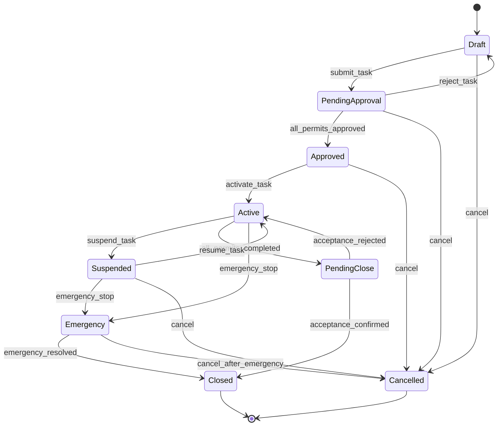
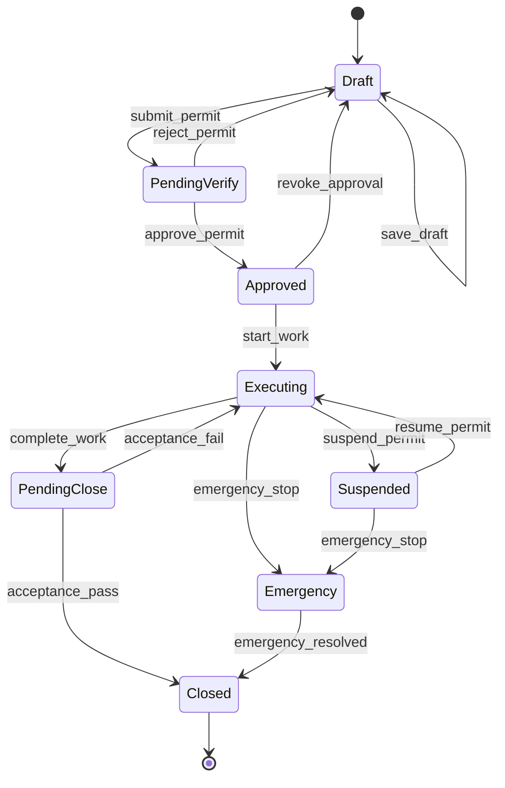
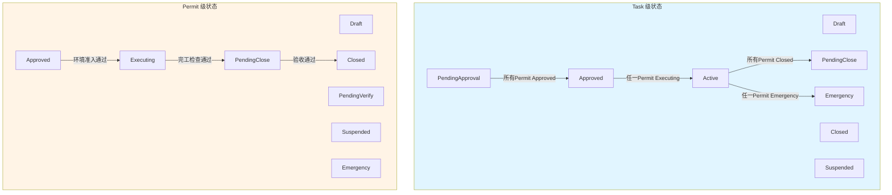
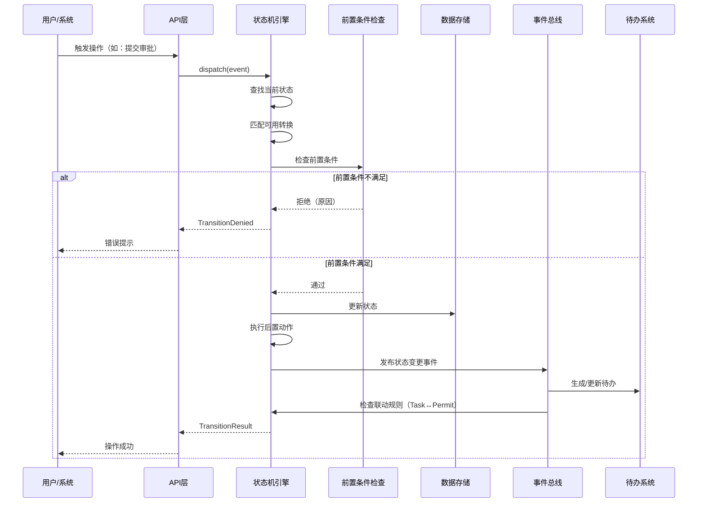

# 03 - 统一状态机设计

> **本章导读**: 本章统一三套状态模型为权威定义，建立 Task 级和 Permit 级双层状态机，定义 Task-Permit 状态联动规则，以及事件驱动的状态转换模型。
> **对称章节**: [配置端 07-状态机设计](../配置端设计方案/07-状态机设计.md)
> **用户要点C**: 后端使用状态机模型，节点执行后触发 Event，状态机决定 Next State

---

## 3.1 状态模型统一

### 3.1.1 现有状态模型对比

项目中存在三套状态定义，本章将其统一为权威定义：

| 来源 | Task 状态 | Permit 状态 | 问题 |
|------|----------|------------|------|
| 配置端07章 | 未定义 | 9态（含 emergency） | 最完整，但缺少 Task 级 |
| 新建任务05章 | 5态（draft→completed） | 5态（pending→completed） | 过于简化，缺少暂停/紧急 |
| Demo PRD | 未区分层级 | 6态（含 emergency） | 未区分 Task/Permit |

### 3.1.2 统一原则

1. **双层分离**：Task 和 Permit 各自独立状态机，通过联动规则协调
2. **配置端优先**：以配置端07章的9态定义为基础，补充 Task 级状态
3. **事件驱动**：所有状态转换由 Event 触发，状态机决定 Next State
4. **异常态独立**：Emergency 和 Cancelled 作为可从多个状态进入的异常态

---

## 3.2 Task 级状态机（7态 + 2异常态）

### 3.2.1 状态定义

```typescript
enum TaskStatus {
  DRAFT = 'draft',                     // 草稿：创建中，可编辑
  PENDING_APPROVAL = 'pending_approval', // 待审批：已提交，等待审批
  APPROVED = 'approved',               // 已审批：所有Permit审批通过
  ACTIVE = 'active',                   // 执行中：至少一个Permit在执行
  PENDING_CLOSE = 'pending_close',     // 待关闭：所有Permit完成，待验收
  CLOSED = 'closed',                   // 已关闭：验收完成，归档
  SUSPENDED = 'suspended',             // 已暂停：因安全原因整体暂停
  // 异常态
  CANCELLED = 'cancelled',             // 已取消：任务取消（终态）
  EMERGENCY = 'emergency',             // 紧急终止：紧急情况（可恢复或关闭）
}
```

### 3.2.2 状态转换图



### 3.2.3 状态转换矩阵

| 当前状态 | 事件 | 目标状态 | 前置条件 | 操作角色 | 后置动作 |
|---------|------|---------|---------|---------|---------|
| Draft | `submit_task` | PendingApproval | 至少包含1个Permit；所有必填字段已填 | 作业负责人 | 通知审批链 |
| Draft | `cancel` | Cancelled | — | 作业负责人 | 级联取消所有Permit |
| PendingApproval | `reject_task` | Draft | 填写驳回原因 | 审批人 | 通知申请人 |
| PendingApproval | `all_permits_approved` | Approved | 所有Permit.status = Approved | 系统自动 | 通知作业负责人 |
| PendingApproval | `cancel` | Cancelled | — | 作业负责人/审批人 | 级联取消所有Permit |
| Approved | `activate_task` | Active | 至少一个Permit通过环境准入 | 监护人 | 设置actualStartTime |
| Approved | `cancel` | Cancelled | 填写取消原因 | 作业负责人 | 级联取消所有Permit |
| Active | `suspend_task` | Suspended | 填写暂停原因 | 监护人/安全员 | 暂停所有执行中Permit |
| Active | `all_permits_completed` | PendingClose | 所有Permit.status = Completed | 系统自动 | 通知验收人员 |
| Active | `emergency_stop` | Emergency | 无（紧急通道） | 任何人 | 全员通知+启动应急 |
| Suspended | `resume_task` | Active | 安全条件重新确认 | 监护人/安全员 | 恢复暂停的Permit |
| Suspended | `emergency_stop` | Emergency | 无 | 任何人 | 全员通知 |
| Suspended | `cancel` | Cancelled | — | 管理员 | 级联取消 |
| PendingClose | `acceptance_confirmed` | Closed | 验收检查通过 | 验收人 | 设置actualEndTime；归档 |
| PendingClose | `acceptance_rejected` | Active | 填写驳回原因 | 验收人 | 通知作业负责人 |
| Emergency | `emergency_resolved` | Closed | 事故调查完成 | 管理员 | 归档+事故报告 |
| Emergency | `cancel_after_emergency` | Cancelled | 事故处理完成 | 管理员 | 归档 |

---

## 3.3 Permit 级状态机（7态 + 1异常态）

### 3.3.1 状态定义

```typescript
enum PermitStatus {
  DRAFT = 'draft',                     // 草稿：填写中
  PENDING_VERIFY = 'pending_verify',   // 待审核：已提交，等待审批链
  APPROVED = 'approved',               // 已批准：审批通过，待执行
  EXECUTING = 'executing',             // 作业中：现场执行
  SUSPENDED = 'suspended',             // 已暂停：因安全原因暂停
  PENDING_CLOSE = 'pending_close',     // 待关闭：完工待验收
  CLOSED = 'closed',                   // 已关闭：验收完成（终态）
  // 异常态
  EMERGENCY = 'emergency',             // 紧急终止（可恢复或关闭）
}
```

### 3.3.2 状态转换图



### 3.3.3 状态转换矩阵

| 当前状态 | 事件 | 目标状态 | 前置条件 | 操作角色 | 后置动作 |
|---------|------|---------|---------|---------|---------|
| Draft | `submit_permit` | PendingVerify | 所有必填字段已填写 | 作业负责人 | 生成审批待办 |
| Draft | `save_draft` | Draft | — | 作业负责人 | 自动保存 |
| PendingVerify | `reject_permit` | Draft | 填写驳回原因 | 审批人 | 通知申请人+清除审批记录 |
| PendingVerify | `approve_permit` | Approved | 所有审批节点通过 | 最终审批人 | 通知申请人+监护人 |
| Approved | `start_work` | Executing | 环境准入闸门通过（四步串行） | 监护人 | 启动监控+设置validFrom |
| Approved | `revoke_approval` | Draft | 管理员操作+填写原因 | 管理员 | 通知相关人员 |
| Executing | `suspend_permit` | Suspended | 填写暂停原因 | 监护人/安全员 | 通知作业人员停止 |
| Executing | `complete_work` | PendingClose | 完工检查清单全部勾选 | 作业负责人 | 通知验收人员 |
| Executing | `emergency_stop` | Emergency | 无（紧急通道） | 任何人 | 全员通知+现场锁定 |
| Suspended | `resume_permit` | Executing | 安全条件重新确认 | 监护人/安全员 | 通知恢复作业 |
| Suspended | `emergency_stop` | Emergency | 无 | 任何人 | 全员通知 |
| PendingClose | `acceptance_pass` | Closed | 现场验收通过 | 验收人 | 设置validUntil+归档 |
| PendingClose | `acceptance_fail` | Executing | 填写驳回原因 | 验收人 | 通知作业负责人 |
| Emergency | `emergency_resolved` | Closed | 事故调查完成 | 管理员 | 归档+事故报告 |

### 3.3.4 超时与自动化规则

| 状态 | 预警时间 | 超时时间 | 升级时间 | 超时动作 |
|------|---------|---------|---------|---------|
| PendingVerify | 24h | 48h | 72h | 自动提醒 → 升级上级 → 强制处理 |
| Approved | 60h | 72h | 96h | 自动过期警告 → 需重新审批 |
| Executing | 动态(到期前1h) | 动态(到期时间) | 到期后30min | 自动告警 → 强制暂停 |
| Suspended | 12h | 24h | 48h | 要求决策（恢复/取消） |

```typescript
interface TimeoutRule {
  state: PermitStatus;
  warningBefore: Duration;    // 预警提前量
  timeoutDuration: Duration;  // 超时时长（或动态计算）
  escalationAfter: Duration;  // 升级延迟
  actions: {
    onWarning: 'notify_assignee';
    onTimeout: 'auto_remind' | 'auto_expire' | 'auto_alert' | 'require_decision';
    onEscalation: 'notify_superior' | 'force_suspend';
  };
}
```

---

## 3.4 Task-Permit 状态联动规则

### 3.4.1 联动关系图



### 3.4.2 向上聚合规则（Permit → Task）

Permit 状态变更时，系统自动检查是否触发 Task 状态转换：

```typescript
interface TaskPermitLinkageRules {
  // 规则1：所有Permit审批通过 → Task自动进入Approved
  allPermitsApproved: {
    condition: 'ALL permits.status === Approved';
    taskEvent: 'all_permits_approved';
    taskTransition: 'PendingApproval → Approved';
  };

  // 规则2：任一Permit开始执行 → Task自动进入Active
  anyPermitExecuting: {
    condition: 'ANY permit.status === Executing';
    taskEvent: 'activate_task';
    taskTransition: 'Approved → Active';
  };

  // 规则3：所有Permit完成 → Task自动进入PendingClose
  allPermitsCompleted: {
    condition: 'ALL permits.status === Closed';
    taskEvent: 'all_permits_completed';
    taskTransition: 'Active → PendingClose';
  };

  // 规则4：任一Permit紧急终止 → Task进入Emergency
  anyPermitEmergency: {
    condition: 'ANY permit.status === Emergency';
    taskEvent: 'emergency_stop';
    taskTransition: 'Active|Suspended → Emergency';
  };
}
```

### 3.4.3 向下级联规则（Task → Permit）

Task 状态变更时，级联影响所有关联 Permit：

| Task 事件 | 级联行为 | 影响范围 |
|----------|---------|---------|
| `cancel` | 所有非终态 Permit → Cancelled | 全部 Permit |
| `suspend_task` | 所有 Executing 的 Permit → Suspended | 仅执行中的 |
| `resume_task` | 所有因 Task 暂停的 Permit → Executing | 仅被级联暂停的 |
| `emergency_stop` | 所有非终态 Permit → Emergency | 全部 Permit |

### 3.4.4 部分锁定机制（用户要点A）

Task 处于 Active 状态时，各 Permit 可处于不同状态，支持部分锁定：

```typescript
// 同一Task下，不同Permit可处于不同阶段
interface PartialLockExample {
  task: { status: 'active' };
  permits: [
    { type: 'hotWork', status: 'executing', locked: true },      // 动火票执行中（锁定）
    { type: 'confinedSpace', status: 'approved', locked: false }, // 受限空间待执行（可编辑）
    { type: 'workAtHeight', status: 'pending_verify', locked: false }, // 高处票审批中
  ];
}
```

---

## 3.5 事件驱动模型

### 3.5.1 事件定义

```typescript
interface StateEvent {
  eventId: string;              // 事件唯一ID
  eventType: string;            // 事件类型
  source: EventSource;          // 事件来源
  targetType: 'task' | 'permit'; // 目标类型
  targetId: string;             // 目标ID
  payload: Record<string, any>; // 事件载荷
  triggeredBy: string;          // 触发人
  triggeredAt: Date;            // 触发时间
  metadata?: {
    deviceType: string;
    gpsLocation?: GeoLocation;
    ipAddress?: string;
  };
}

enum EventSource {
  USER_ACTION = 'user_action',       // 用户操作
  SYSTEM_AUTO = 'system_auto',       // 系统自动（超时、联动）
  IOT_DEVICE = 'iot_device',         // IoT设备告警
  EXTERNAL_API = 'external_api',     // 外部系统调用
}
```

### 3.5.2 事件处理流程



### 3.5.3 事件类型清单

| 事件类型 | 触发来源 | 目标 | 说明 |
|---------|---------|------|------|
| `submit_task` | 用户 | Task | 提交任务进入审批 |
| `submit_permit` | 用户 | Permit | 提交作业表进入审核 |
| `approve_permit` | 用户 | Permit | 审批通过单个作业表 |
| `reject_permit` | 用户 | Permit | 驳回作业表 |
| `all_permits_approved` | 系统联动 | Task | 所有Permit审批通过 |
| `start_work` | 用户 | Permit | 开始作业（需环境准入） |
| `activate_task` | 系统联动 | Task | 任一Permit开始执行 |
| `suspend_permit` | 用户 | Permit | 暂停单个作业表 |
| `suspend_task` | 用户 | Task | 暂停整个任务 |
| `resume_permit` | 用户 | Permit | 恢复单个作业表 |
| `resume_task` | 用户 | Task | 恢复整个任务 |
| `complete_work` | 用户 | Permit | 完工提交 |
| `all_permits_completed` | 系统联动 | Task | 所有Permit完成 |
| `acceptance_pass` | 用户 | Permit/Task | 验收通过 |
| `acceptance_fail` | 用户 | Permit/Task | 验收驳回 |
| `emergency_stop` | 用户/IoT | Permit/Task | 紧急终止 |
| `emergency_resolved` | 用户 | Permit/Task | 紧急事件处理完成 |
| `timeout_warning` | 系统定时 | Permit | 超时预警 |
| `timeout_escalation` | 系统定时 | Permit | 超时升级 |
| `gas_alarm` | IoT设备 | Permit | 气体检测告警 |
| `cancel` | 用户 | Task/Permit | 取消 |

---

## 3.6 状态机引擎接口

### 3.6.1 核心接口

```typescript
interface StateMachineEngine {
  // 触发状态转换
  dispatch(event: StateEvent): Promise<TransitionResult>;

  // 查询当前状态
  getCurrentState(targetType: 'task' | 'permit', targetId: string): Promise<string>;

  // 查询可用转换
  getAvailableTransitions(
    targetType: 'task' | 'permit',
    targetId: string,
    userId: string
  ): Promise<AvailableTransition[]>;

  // 查询转换历史
  getTransitionHistory(
    targetType: 'task' | 'permit',
    targetId: string
  ): Promise<TransitionRecord[]>;
}

interface TransitionResult {
  success: boolean;
  fromState: string;
  toState: string;
  event: StateEvent;
  timestamp: Date;
  sideEffects: SideEffect[];   // 后置动作执行结果
  linkedTransitions?: TransitionResult[]; // 联动触发的转换
  error?: {
    code: string;
    message: string;
    failedGuards: string[];    // 未通过的前置条件
  };
}

interface AvailableTransition {
  eventType: string;
  targetState: string;
  label: string;               // 按钮文案
  requiredRole: string[];      // 所需角色
  guardsSatisfied: boolean;    // 前置条件是否满足
  unsatisfiedGuards?: string[]; // 未满足的条件说明
}
```

### 3.6.2 转换历史记录

```typescript
interface TransitionRecord {
  recordId: string;
  targetType: 'task' | 'permit';
  targetId: string;
  fromState: string;
  toState: string;
  event: StateEvent;
  timestamp: Date;
  duration: number;            // 在前一状态停留时长(ms)
  operator: string;
  operatorRole: string;
  metadata: {
    deviceType: string;
    gpsLocation?: GeoLocation;
    ipAddress: string;
  };
}
```

---

## 3.7 与配置端的关联

| 配置端定义 | 流转端实现 | 关系 |
|-----------|-----------|------|
| 状态模板（9态JSON） | 状态机引擎实例 | 配置端定义模板 → 流转端实例化运行 |
| 状态转换规则 | dispatch + guard | 配置端定义规则 → 流转端执行检查 |
| 字段权限矩阵 | 权限计算引擎 | 配置端定义矩阵 → 流转端运行时计算 |
| 超时规则配置 | 定时任务引擎 | 配置端定义阈值 → 流转端定时检测 |
| 节点→状态映射 | 事件驱动联动 | 配置端定义映射 → 流转端节点完成触发Event |

---

**上一章**: [02 - 核心概念与领域模型](./02-核心概念与领域模型.md)

**下一章**: [04 - 动态权限矩阵](./04-动态权限矩阵.md)
