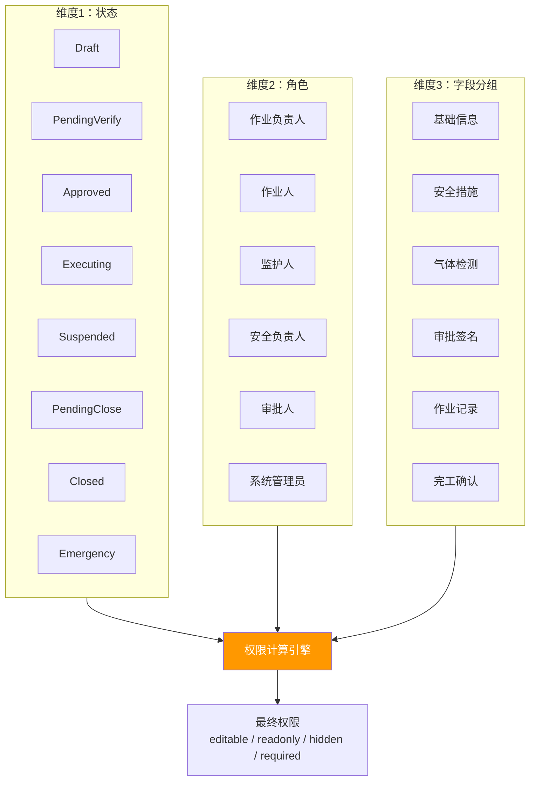
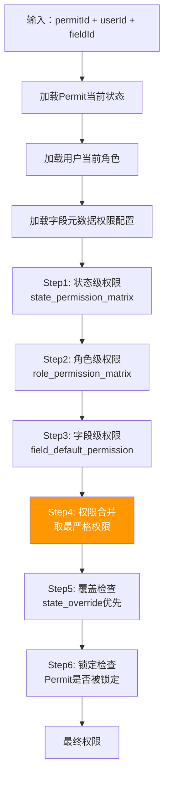
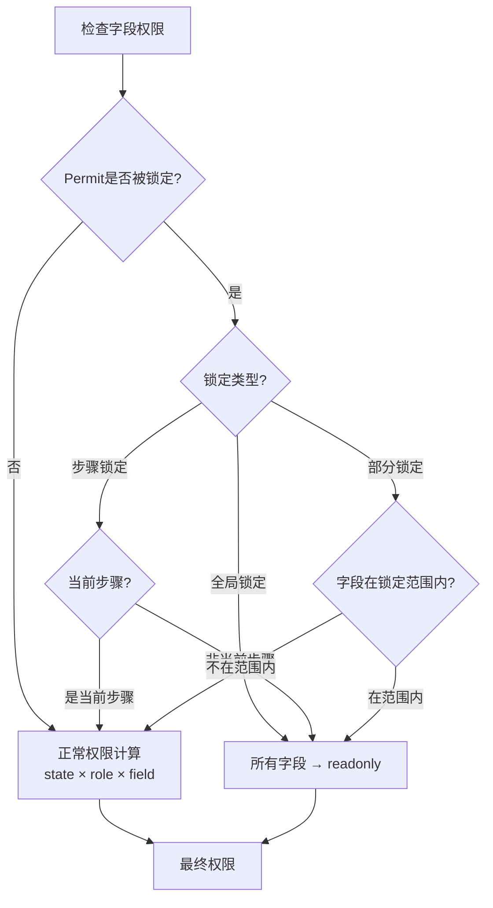
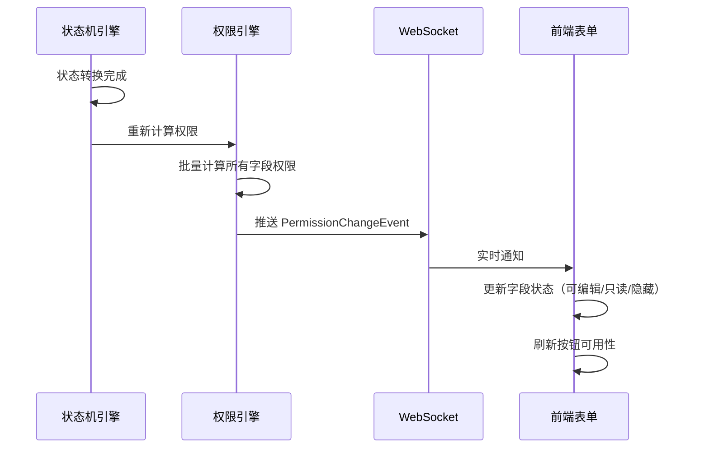

# 04 - 动态权限矩阵

> **本章导读**: 本章定义三维权限模型（状态 × 角色 × 字段），描述权限计算引擎的运行时实现，以及主表+子表权限锁定机制。
> **对称章节**: [配置端 07-状态机设计](../配置端设计方案/07-状态机设计.md)（字段权限部分）
> **用户要点A**: 主表+子表模式，流转时可只针对部分作业表进行权限锁定

---

## 4.1 三维权限模型

### 4.1.1 权限维度

流转端权限由三个维度交叉计算：



### 4.1.2 权限值定义

```typescript
enum FieldPermission {
  EDITABLE = 'editable',     // 可编辑
  READONLY = 'readonly',     // 只读
  HIDDEN = 'hidden',         // 隐藏
  REQUIRED = 'required',     // 必填（可编辑+必填校验）
}

interface PermissionResult {
  fieldId: string;
  permission: FieldPermission;
  reason: string;             // 权限来源说明
  overrideSource?: string;    // 如被覆盖，记录覆盖来源
}
```

---

## 4.2 角色 × 状态权限矩阵

### 4.2.1 操作权限矩阵

| 角色 | Draft | PendingVerify | Approved | Executing | Suspended | PendingClose | Closed | Emergency |
|------|:-----:|:------------:|:--------:|:---------:|:---------:|:------------:|:------:|:---------:|
| **作业负责人** | 创建/编辑 | 查看/撤回 | 查看/补充 | 查看 | 查看 | 完工提交 | 查看 | 查看 |
| **作业人** | — | 查看 | 确认措施 | 签到/签退/执行 | 查看 | 查看 | 查看 | 查看 |
| **监护人** | — | 查看 | 现场核查 | 监护/暂停/叫停 | 恢复/叫停 | 验收 | 查看 | 查看 |
| **安全负责人** | — | 审核 | 数据验证 | 查看 | 查看 | 查看 | 查看 | 查看 |
| **审批人** | — | 审批 | 现场审批 | 查看 | 查看 | 查看 | 查看 | 查看 |
| **管理员** | 全部 | 全部 | 全部 | 全部 | 全部 | 全部 | 全部 | 全部 |

### 4.2.2 字段分组 × 状态权限矩阵

| 字段分组 | Draft | PendingVerify | Approved | Executing | Suspended | PendingClose | Closed | Emergency |
|---------|:-----:|:------------:|:--------:|:---------:|:---------:|:------------:|:------:|:---------:|
| **基础信息** | ✏️ 可编辑 | 🔒 只读 | 🔒 只读 | 🔒 只读 | 🔒 只读 | 🔒 只读 | 🔒 只读 | 🔒 只读 |
| **安全措施** | ✏️ 可编辑 | 🔒 只读 | 🔒 只读 | 🔒 只读 | 🔒 只读 | 🔒 只读 | 🔒 只读 | 🔒 只读 |
| **气体检测** | 👁️ 隐藏 | 👁️ 隐藏 | ✏️ 可编辑 | ✏️ 可编辑 | 🔒 只读 | 🔒 只读 | 🔒 只读 | 🔒 只读 |
| **审批签名** | 👁️ 隐藏 | ✏️ 可编辑 | 🔒 只读 | 🔒 只读 | 🔒 只读 | 🔒 只读 | 🔒 只读 | 🔒 只读 |
| **作业记录** | 👁️ 隐藏 | 👁️ 隐藏 | 👁️ 隐藏 | ✏️ 可编辑 | 🔒 只读 | 🔒 只读 | 🔒 只读 | 🔒 只读 |
| **完工确认** | 👁️ 隐藏 | 👁️ 隐藏 | 👁️ 隐藏 | ✏️ 可编辑 | 🔒 只读 | ✏️ 可编辑 | 🔒 只读 | 🔒 只读 |

### 4.2.3 角色 × 字段数据权限矩阵

| 数据类型 | 作业负责人 | 作业人 | 监护人 | 安全负责人 | 审批人 | 管理员 |
|---------|:---------:|:-----:|:-----:|:---------:|:-----:|:-----:|
| **基础信息** | 读写 | 只读 | 只读 | 只读 | 只读 | 读写 |
| **人员信息** | 读写 | 只读 | 只读 | 只读 | 只读 | 读写 |
| **安全措施** | 读写 | 确认(勾选) | 检查(勾选+拍照) | 审核(通过/驳回) | 只读 | 读写 |
| **JSA风险分析** | 读写 | 只读 | 只读 | 审核 | 只读 | 读写 |
| **气体检测记录** | 只读 | 只读 | 记录 | 审核 | 只读 | 读写 |
| **现场照片** | 上传 | 查看 | 上传 | 查看 | 查看 | 读写 |
| **审批意见** | 只读 | 只读 | 只读 | 记录 | 记录 | 读写 |
| **监护日志** | 只读 | 只读 | 自动记录 | 只读 | 只读 | 读写 |
| **电子签名** | 本人签 | 本人签 | 本人签 | 查看 | 本人签 | 查看 |

---

## 4.3 权限计算引擎

### 4.3.1 计算流程



### 4.3.2 权限合并规则

```typescript
interface PermissionEngine {
  // 计算单个字段权限
  computeFieldPermission(
    permitId: string,
    userId: string,
    fieldId: string
  ): Promise<PermissionResult>;

  // 批量计算（整个表单）
  computeFormPermissions(
    permitId: string,
    userId: string
  ): Promise<Map<string, PermissionResult>>;

  // 检查操作权限
  checkActionPermission(
    permitId: string,
    userId: string,
    action: string
  ): Promise<boolean>;
}
```

**权限优先级（从高到低）**：

```
state_override > role_permission > field_default
```

| 优先级 | 来源 | 说明 | 示例 |
|-------|------|------|------|
| P0 | 状态覆盖 | 状态转换时强制设置 | Closed 状态下所有字段强制 readonly |
| P1 | 角色权限 | 角色对字段的操作权限 | 审批人对审批签名字段可编辑 |
| P2 | 字段默认 | 字段元数据中的默认权限 | 某字段默认 editable |

**合并算法**：

```typescript
function mergePermissions(
  statePermission: FieldPermission | null,
  rolePermission: FieldPermission | null,
  fieldDefault: FieldPermission
): FieldPermission {
  // P0: 状态覆盖最优先
  if (statePermission !== null) return statePermission;

  // P1: 角色权限次之
  if (rolePermission !== null) {
    // 角色权限不能放大字段默认权限
    return stricterOf(rolePermission, fieldDefault);
  }

  // P2: 字段默认
  return fieldDefault;
}

// 取更严格的权限
function stricterOf(a: FieldPermission, b: FieldPermission): FieldPermission {
  const order = { hidden: 0, readonly: 1, editable: 2, required: 3 };
  return order[a] <= order[b] ? a : b;
}
```

---

## 4.4 主表+子表权限锁定

### 4.4.1 锁定机制

Task 下的多个 Permit 可独立锁定，实现部分流转：

```typescript
interface PermitLockManager {
  // 锁定指定Permit
  lockPermit(permitId: string, reason: string): Promise<void>;

  // 解锁指定Permit
  unlockPermit(permitId: string): Promise<void>;

  // 查询锁定状态
  getLockStatus(taskId: string): Promise<PermitLockStatus[]>;
}

interface PermitLockStatus {
  permitId: string;
  permitType: PermitType;
  isLocked: boolean;
  lockReason?: string;
  lockedAt?: Date;
  lockedBy?: string;
}
```

### 4.4.2 锁定场景

| 场景 | 触发条件 | 锁定行为 | 解锁条件 |
|------|---------|---------|---------|
| 审批通过锁定 | Permit 进入 Approved | 该 Permit 基础信息+安全措施锁定 | 管理员撤销审批 |
| 执行中锁定 | Permit 进入 Executing | 仅当前步骤可填，其余锁定 | 步骤完成后解锁下一步 |
| 紧急暂停锁定 | Permit 进入 Suspended | 全部字段锁定 | 恢复执行时解锁 |
| 部分审批锁定 | 同一Task下部分Permit已审批 | 已审批的锁定，未审批的可编辑 | — |
| 验收锁定 | Permit 进入 PendingClose | 全部字段锁定，仅验收字段可填 | 验收驳回时解锁 |

### 4.4.3 锁定与权限的交互



---

## 4.5 权限变更实时推送

### 4.5.1 推送机制

状态转换导致权限变更时，实时通知前端刷新：

```typescript
interface PermissionChangeEvent {
  eventType: 'permission_changed';
  permitId: string;
  taskId: string;
  changedFields: {
    fieldId: string;
    oldPermission: FieldPermission;
    newPermission: FieldPermission;
  }[];
  reason: string;              // 变更原因（状态转换/角色切换/锁定）
  timestamp: Date;
}
```

### 4.5.2 前端响应



---

## 4.6 与配置端的关联

| 配置端定义 | 流转端实现 | 关系 |
|-----------|-----------|------|
| 字段权限模板（状态×字段） | 三维权限计算引擎 | 配置端定义基础矩阵 → 流转端叠加角色维度 |
| 角色定义 | 角色上下文加载 | 配置端定义角色枚举 → 流转端运行时匹配 |
| 状态×字段权限JSON | 权限矩阵缓存 | 配置端输出JSON → 流转端加载并缓存 |

---

**上一章**: [03 - 统一状态机设计](./03-统一状态机设计.md)

**下一章**: [05 - 待办与任务分发系统](./05-待办与任务分发系统.md)
