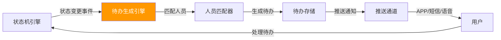
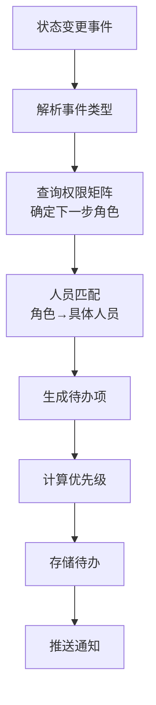
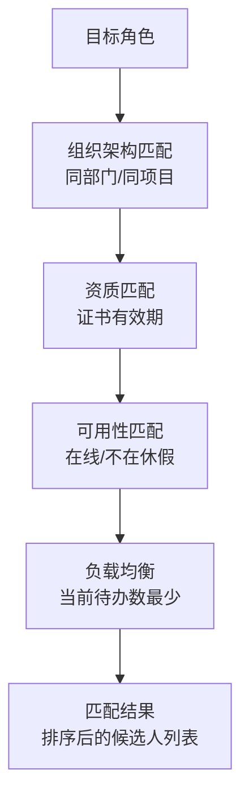
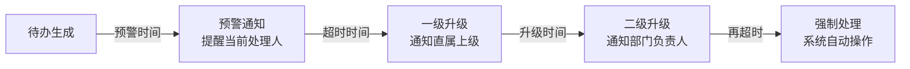

# 05 - 待办与任务分发系统

> **本章导读**: 本章设计流转端的待办生成引擎、人员匹配算法、推送通道集成和超时升级机制。这是全新设计章节，填补现有文档中待办系统的空白。
> **整合来源**: PRD 05章审批引擎超时升级机制

---

## 5.1 待办系统概览

### 5.1.1 系统定位

待办系统是连接"状态机引擎"与"用户操作"的桥梁：状态转换产生待办，用户处理待办触发下一次状态转换。



### 5.1.2 待办数据模型

```typescript
interface TodoItem {
  todoId: string;
  // 关联信息
  taskId: string;
  permitId?: string;           // 可能是Task级待办
  taskName: string;
  permitType?: PermitType;

  // 待办内容
  todoType: TodoType;
  title: string;
  description: string;
  actionRequired: string;      // 需要执行的操作

  // 分配信息
  targetUserId: string;
  targetRole: string;
  assignedAt: Date;

  // 优先级与时效
  priority: TodoPriority;
  deadline?: Date;
  warningAt?: Date;

  // 状态
  status: TodoStatus;
  completedAt?: Date;
  completedBy?: string;

  // 来源
  sourceEvent: string;         // 触发事件类型
  sourceState: string;         // 触发时的状态
}

enum TodoType {
  APPROVAL = 'approval',           // 审批待办
  REVIEW = 'review',               // 审核待办
  EXECUTION = 'execution',         // 执行待办
  INSPECTION = 'inspection',       // 检查待办
  ACCEPTANCE = 'acceptance',       // 验收待办
  SUPPLEMENT = 'supplement',       // 补充材料
  EMERGENCY = 'emergency',         // 紧急处理
}

enum TodoPriority {
  CRITICAL = 'critical',   // 紧急（Emergency相关）
  HIGH = 'high',           // 高（超时预警）
  NORMAL = 'normal',       // 正常
  LOW = 'low',             // 低（信息通知）
}

enum TodoStatus {
  PENDING = 'pending',     // 待处理
  IN_PROGRESS = 'in_progress', // 处理中
  COMPLETED = 'completed', // 已完成
  EXPIRED = 'expired',     // 已过期
  CANCELLED = 'cancelled', // 已取消
  ESCALATED = 'escalated', // 已升级
}
```

---

## 5.2 待办生成规则

### 5.2.1 生成流程



### 5.2.2 状态→待办映射表

| 状态转换 | 待办类型 | 目标角色 | 待办标题模板 | 优先级 |
|---------|---------|---------|------------|-------|
| Draft → PendingVerify | APPROVAL | 安全负责人 | "{permitName} 待审核" | NORMAL |
| PendingVerify → Approved | INSPECTION | 监护人 | "{permitName} 已批准，待现场核查" | NORMAL |
| Approved → Executing | EXECUTION | 作业人 | "{permitName} 可开始作业" | NORMAL |
| Executing → PendingClose | ACCEPTANCE | 监护人 | "{permitName} 完工待验收" | NORMAL |
| PendingVerify 超时 | APPROVAL | 上级审批人 | "⚠️ {permitName} 审批超时，请处理" | HIGH |
| * → Emergency | EMERGENCY | 全部相关人员 | "🚨 {permitName} 紧急终止" | CRITICAL |
| * → Suspended | SUPPLEMENT | 监护人 | "{permitName} 已暂停，待恢复决策" | HIGH |
| PendingVerify → Draft (驳回) | SUPPLEMENT | 作业负责人 | "{permitName} 被驳回，请修改" | NORMAL |

### 5.2.3 待办生成引擎接口

```typescript
interface TodoGenerator {
  // 根据状态变更事件生成待办
  generateFromTransition(
    transition: TransitionResult
  ): Promise<TodoItem[]>;

  // 根据超时事件生成升级待办
  generateFromTimeout(
    timeoutEvent: TimeoutEvent
  ): Promise<TodoItem[]>;

  // 批量取消待办（状态变更导致旧待办失效）
  cancelObsoleteTodos(
    permitId: string,
    reason: string
  ): Promise<void>;
}
```

---

## 5.3 人员匹配算法

### 5.3.1 匹配流程



### 5.3.2 匹配规则

```typescript
interface PersonMatcher {
  // 匹配目标角色的具体人员
  matchPerson(
    role: string,
    context: MatchContext
  ): Promise<MatchResult>;
}

interface MatchContext {
  taskId: string;
  permitId: string;
  permitType: PermitType;
  location: GeoLocation;
  orgId: string;               // 所属组织
  projectId: string;           // 所属项目
  urgency: TodoPriority;
}

interface MatchResult {
  primaryAssignee: string;     // 主要负责人
  backupAssignees: string[];   // 备选人员
  matchScore: number;          // 匹配得分
  matchReason: string;         // 匹配原因
}
```

**匹配优先级**：
1. Permit 中已指定的人员（applicant/approver/guardian）
2. 同项目同角色、负载最低的人员
3. 同部门同角色的人员
4. 上级组织的同角色人员

---

## 5.4 待办优先级与排序

### 5.4.1 优先级计算

```typescript
function calculatePriority(todo: TodoItem): TodoPriority {
  // Emergency 相关 → CRITICAL
  if (todo.sourceEvent.includes('emergency')) return 'critical';

  // 超时预警 → HIGH
  if (todo.deadline && isNearDeadline(todo.deadline)) return 'high';

  // 超时升级 → HIGH
  if (todo.todoType === 'approval' && isEscalated(todo)) return 'high';

  // 默认 → NORMAL
  return 'normal';
}
```

### 5.4.2 排序规则

```
排序优先级（从高到低）：
1. priority: CRITICAL > HIGH > NORMAL > LOW
2. deadline: 截止时间越近越靠前
3. createdAt: 同优先级按创建时间排序
```

### 5.4.3 待办聚合

同一 Task 下的多个 Permit 待办聚合展示：

```typescript
interface TodoGroup {
  taskId: string;
  taskName: string;
  todoCount: number;
  highestPriority: TodoPriority;
  items: TodoItem[];
}
```

---

## 5.5 推送通道

### 5.5.1 通道矩阵

| 优先级 | APP推送 | 短信 | 语音电话 | 大屏 |
|-------|:------:|:---:|:------:|:---:|
| CRITICAL | ✅ | ✅ | ✅ | ✅ |
| HIGH | ✅ | ✅ | — | ✅ |
| NORMAL | ✅ | — | — | — |
| LOW | ✅ | — | — | — |

### 5.5.2 推送接口

```typescript
interface NotificationService {
  // 发送通知
  send(notification: Notification): Promise<void>;

  // 批量发送
  sendBatch(notifications: Notification[]): Promise<void>;
}

interface Notification {
  channel: 'app_push' | 'sms' | 'voice' | 'dashboard';
  targetUserId: string;
  title: string;
  body: string;
  data: {
    todoId: string;
    taskId: string;
    permitId?: string;
    action: string;            // 深链接动作
  };
  priority: TodoPriority;
}
```

---

## 5.6 超时升级机制

### 5.6.1 升级链



### 5.6.2 升级规则

```typescript
interface EscalationRule {
  state: PermitStatus;
  levels: EscalationLevel[];
}

interface EscalationLevel {
  level: number;
  triggerAfter: Duration;      // 触发延迟
  action: 'notify' | 'reassign' | 'force_action';
  targetRole: string;          // 升级目标角色
  notificationChannels: string[];
}

// 示例：PendingVerify 超时升级
const pendingVerifyEscalation: EscalationRule = {
  state: 'pending_verify',
  levels: [
    { level: 0, triggerAfter: '24h', action: 'notify', targetRole: 'current_assignee', notificationChannels: ['app_push'] },
    { level: 1, triggerAfter: '48h', action: 'notify', targetRole: 'superior', notificationChannels: ['app_push', 'sms'] },
    { level: 2, triggerAfter: '72h', action: 'reassign', targetRole: 'department_head', notificationChannels: ['app_push', 'sms', 'voice'] },
  ]
};
```

---

## 5.7 待办中心页面设计

### 5.7.1 页面结构

```
┌─────────────────────────────────────────────┐
│  待办中心                                      │
├─────────────────────────────────────────────┤
│  ┌──────┐ ┌──────┐ ┌──────┐ ┌──────┐       │
│  │待处理 │ │ 紧急  │ │今日到期│ │ 已完成 │       │
│  │  12   │ │  2   │ │  3   │ │  45  │       │
│  └──────┘ └──────┘ └──────┘ └──────┘       │
├─────────────────────────────────────────────┤
│  [全部] [审批] [执行] [验收] [紧急]            │
├─────────────────────────────────────────────┤
│  ┌─────────────────────────────────────┐    │
│  │ 🚨 动火作业票 #HW-2026-001          │    │
│  │    紧急终止 - 需要立即处理             │    │
│  │    来源：3号装置区 | 10分钟前           │    │
│  │    [立即处理]                         │    │
│  ├─────────────────────────────────────┤    │
│  │ ⚠️ 受限空间作业票 #CS-2026-015       │    │
│  │    待审批 - 超时预警（剩余2小时）        │    │
│  │    来源：储罐区 | 22小时前              │    │
│  │    [审批] [驳回]                      │    │
│  ├─────────────────────────────────────┤    │
│  │ 📋 高处作业票 #WH-2026-008           │    │
│  │    待验收 - 完工检查                   │    │
│  │    来源：管廊区 | 1小时前               │    │
│  │    [验收通过] [驳回]                   │    │
│  └─────────────────────────────────────┘    │
└─────────────────────────────────────────────┘
```

### 5.7.2 待办中心接口

```typescript
interface TodoCenter {
  // 获取待办统计
  getStatistics(userId: string): Promise<TodoStatistics>;

  // 获取待办列表（分页+筛选）
  getTodoList(
    userId: string,
    filters: TodoFilters,
    pagination: Pagination
  ): Promise<PagedResult<TodoItem>>;

  // 快捷操作（直接在待办中心处理）
  quickAction(
    todoId: string,
    action: string,
    payload?: Record<string, any>
  ): Promise<void>;
}

interface TodoStatistics {
  pending: number;
  critical: number;
  dueToday: number;
  completed: number;
  overdue: number;
}

interface TodoFilters {
  type?: TodoType[];
  priority?: TodoPriority[];
  status?: TodoStatus[];
  dateRange?: { from: Date; to: Date };
}
```

---

## 5.8 与配置端的关联

| 配置端定义 | 流转端实现 | 关系 |
|-----------|-----------|------|
| 角色定义 | 人员匹配算法 | 配置端定义角色 → 流转端匹配具体人员 |
| 状态转换规则 | 待办生成规则 | 状态转换 → 自动生成对应待办 |
| 超时配置 | 超时升级引擎 | 配置端定义阈值 → 流转端定时检测+升级 |

---

**上一章**: [04 - 动态权限矩阵](./04-动态权限矩阵.md)

**下一章**: [06 - 任务创建与智能编排](./06-任务创建与智能编排.md)
