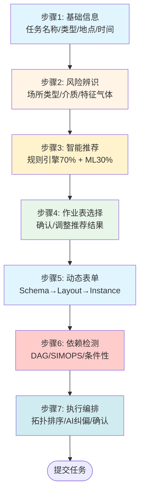

# 06 - 任务创建与智能编排

> **本章导读**: 本章设计流转端的完整任务创建流程（7步）、智能推荐引擎运行时行为、依赖检测与DAG执行编排，以及AI生成流程的纠偏机制。本章整合了[新建任务设计方案](../新建任务设计方案/00-总览.md)的核心设计，将其从独立方案融入流转端统一架构。
> **对称章节**: [配置端 06-用户工作流](../配置端设计方案/06-用户工作流.md) — 配置端定义"设计-部署-执行"三阶段工作流，本章定义流转端"创建-推荐-编排"任务工作流。

---

## 6.1 任务创建流程概览

### 6.1.1 七步创建流程

任务创建采用渐进式填写模式（DOB NOW），将复杂的创建过程分解为7个有序步骤，每步聚焦一个关注点，降低用户认知负担。



### 6.1.2 步骤与层级映射

每个创建步骤对应流转端三层架构中的不同组件（参见[01-总体架构](./01-总体架构.md)）：

| 步骤 | 名称 | 所属层级 | 核心组件 | 耗时预算(P95) |
|------|------|---------|---------|-------------|
| S1 | 基础信息 | 表单渲染层 | 元数据解析器 | < 500ms |
| S2 | 风险辨识 | 表单渲染层 | 表达式引擎 | < 500ms |
| S3 | 智能推荐 | 任务编排层 | 智能推荐引擎 | < 1s |
| S4 | 作业表选择 | 任务编排层 | 任务容器管理 | < 300ms |
| S5 | 动态表单 | 表单渲染层 | 元数据解析器 + 组件注册表 | < 1.5s |
| S6 | 依赖检测 | 任务编排层 | 依赖检测引擎 | < 1.5s |
| S7 | 执行编排 | 任务编排层 | 执行编排器 + AI纠偏引擎 | < 2s |

---

## 6.2 步骤详细设计

### 6.2.1 步骤1：基础信息

采集任务的核心元信息，为后续风险辨识和推荐提供上下文。

```typescript
interface CreateTaskBasicInfo {
  taskName: string;                          // 任务名称
  taskType: 'maintenance' | 'construction' | 'emergency';  // 任务类型
  location: {
    areaId: string;                          // 装置/区域ID
    areaName: string;                        // 装置/区域名称
    geo: GeoLocation;                        // 经纬度坐标
    altitude?: number;                       // 海拔高度（高处作业需要）
  };
  plannedStartTime: Date;                    // 计划开始时间
  plannedEndTime: Date;                      // 计划结束时间
  applicant: {
    userId: string;
    userName: string;
    department: string;
    contactPhone: string;
  };
  description?: string;                      // 作业内容描述
}
```
