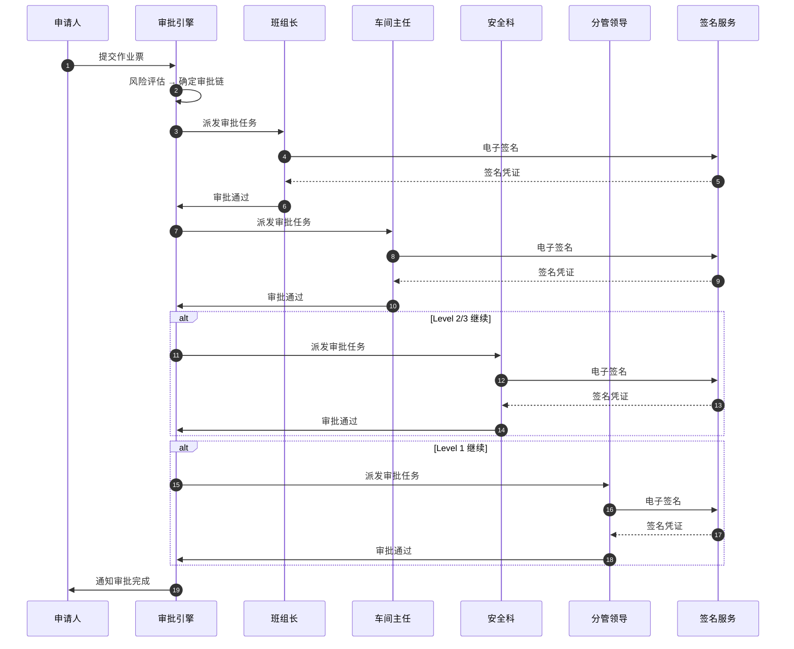
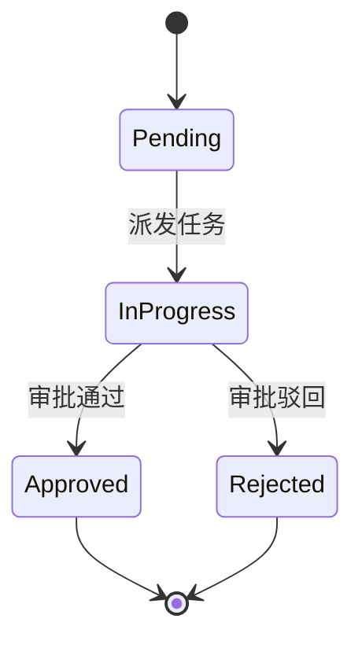
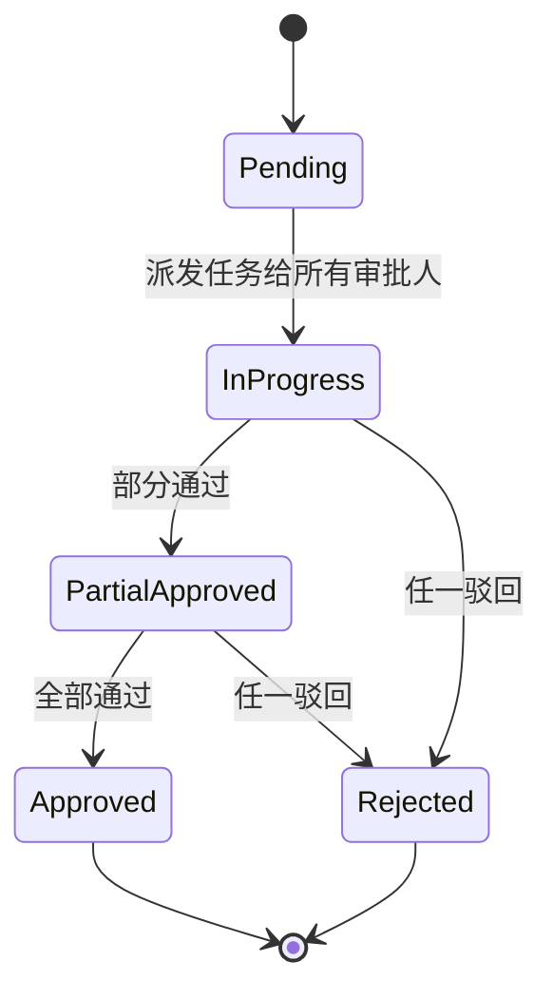
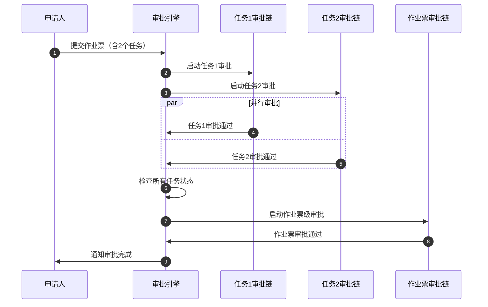
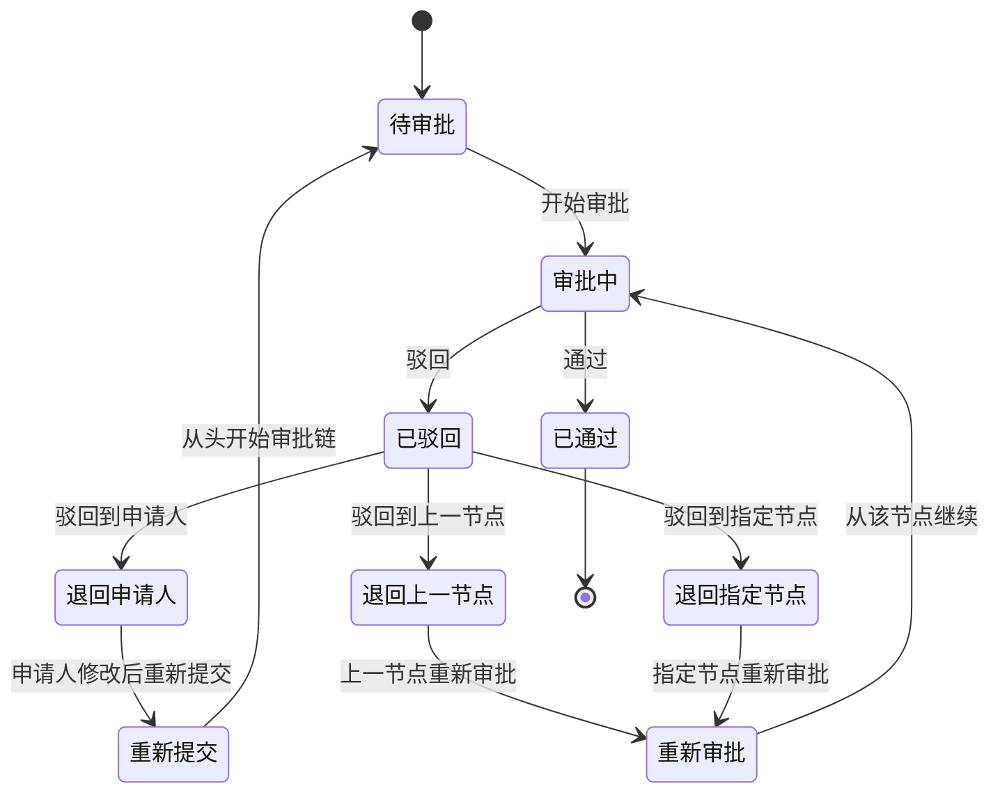
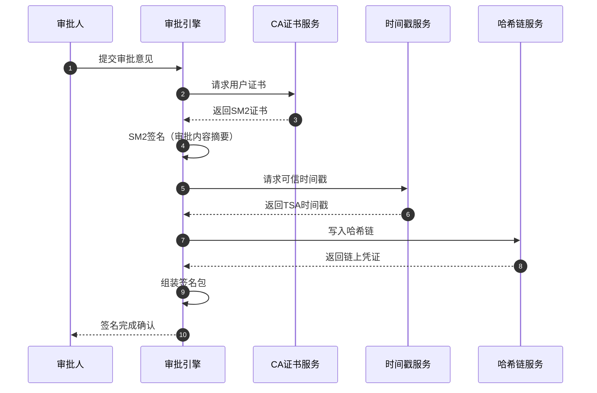
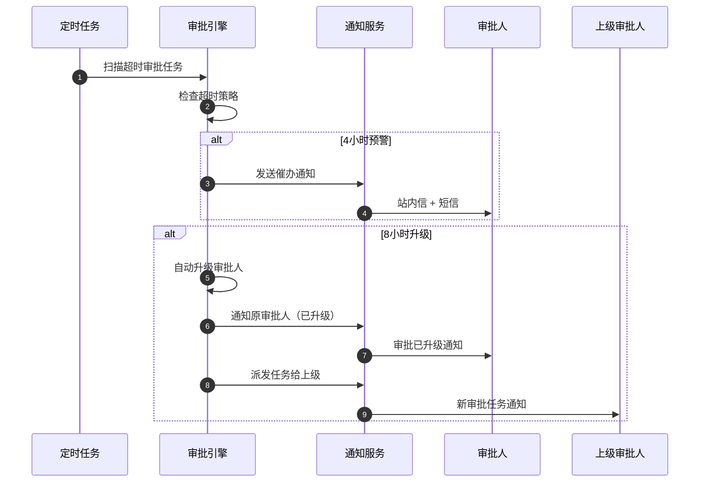

# 第七章 审批流程引擎

## 导读

审批流程引擎是作业票流转端的核心决策枢纽，负责驱动作业票从"已提交"到"已批准"的全生命周期流转。本章围绕**多级审批链运行时执行**、**多种审批方式**（会签/或签/依次审批）、**驳回与回退策略**、**电子签名集成**以及**审批委托与转办**五大主题展开，构建一套风险分级、流程可配、签名合规、容错健壮的审批引擎体系。

### 对称章节

| 配置端章节 | 流转端章节 | 关系 |
|-----------|-----------|------|
| 05-约束组件系统 | **07-审批流程引擎**（本章） | 约束规则驱动审批链路由 |
| 07-状态机设计 | **07-审批流程引擎**（本章） | 状态机定义审批状态迁移 |
| 06-用户工作流 | 06-任务创建与智能编排 | 编排结果进入审批队列 |

---

## 7.1 审批链总体架构

### 7.1.1 风险分级审批链

系统根据作业风险等级自动匹配审批链深度：

| 风险等级 | 审批链路 | 典型场景 |
|---------|---------|---------|
| Level 1（高风险） | 班组长 → 车间主任 → 安全科 → 分管领导 | 动火作业、受限空间、高处作业 |
| Level 2（中风险） | 班组长 → 车间主任 → 安全科 | 临时用电、吊装作业 |
| Level 3（低风险） | 班组长 → 车间主任 | 一般检修、设备巡检 |

### 7.1.2 审批流程时序图



### 7.1.3 审批链数据模型

```typescript
/**
 * 审批链配置
 */
interface ApprovalChain {
  id: string;
  name: string;
  riskLevel: 1 | 2 | 3;
  nodes: ApprovalNode[];
  createdAt: Date;
  updatedAt: Date;
}

/**
 * 审批节点
 */
interface ApprovalNode {
  id: string;
  order: number; // 节点顺序
  name: string; // 节点名称（如"班组长审批"）
  roleIds: string[]; // 审批角色ID列表
  approvalMethod: 'sequential' | 'co-sign' | 'or-sign';
  minApprovers?: number; // 或签时最少通过人数
  timeout?: number; // 超时时间（小时）
  autoEscalate?: boolean; // 超时是否自动升级
  escalateToRoleId?: string; // 升级目标角色
}

/**
 * 审批实例（运行时）
 */
interface ApprovalInstance {
  id: string;
  permitId: string;
  chainId: string;
  currentNodeIndex: number;
  status: 'pending' | 'in-progress' | 'approved' | 'rejected' | 'cancelled';
  nodes: ApprovalNodeInstance[];
  startedAt: Date;
  completedAt?: Date;
}

/**
 * 审批节点实例
 */
interface ApprovalNodeInstance {
  nodeId: string;
  status: 'pending' | 'in-progress' | 'approved' | 'rejected' | 'skipped';
  approvers: ApproverRecord[];
  startedAt?: Date;
  completedAt?: Date;
}

/**
 * 审批人记录
 */
interface ApproverRecord {
  userId: string;
  userName: string;
  roleId: string;
  action: 'approve' | 'reject' | 'delegate' | 'transfer';
  comment?: string;
  signature?: ElectronicSignature;
  timestamp: Date;
  ipAddress?: string;
  deviceInfo?: string;
}
```

---

## 7.2 审批方式实现

### 7.2.1 依次审批（Sequential Approval）

**定义**：审批人按顺序逐个审批，前一人通过后才能进入下一人。

**适用场景**：层级明确的审批链（如班组长 → 车间主任）。

**状态机**：



**实现逻辑**：

```typescript
class SequentialApprovalHandler {
  async processApproval(
    instance: ApprovalInstance,
    nodeIndex: number,
    approverId: string,
    action: 'approve' | 'reject',
    comment?: string
  ): Promise<ApprovalResult> {
    const node = instance.nodes[nodeIndex];

    // 1. 记录审批动作
    const record: ApproverRecord = {
      userId: approverId,
      userName: await this.getUserName(approverId),
      roleId: node.nodeId,
      action,
      comment,
      timestamp: new Date(),
      signature: await this.signatureService.sign(approverId, instance.permitId)
    };

    node.approvers.push(record);

    // 2. 更新节点状态
    if (action === 'approve') {
      node.status = 'approved';
      node.completedAt = new Date();

      // 3. 进入下一节点
      if (nodeIndex < instance.nodes.length - 1) {
        instance.currentNodeIndex = nodeIndex + 1;
        instance.nodes[nodeIndex + 1].status = 'in-progress';
        instance.nodes[nodeIndex + 1].startedAt = new Date();

        // 派发任务给下一节点审批人
        await this.taskService.assignApprovalTask(
          instance.permitId,
          instance.nodes[nodeIndex + 1].nodeId
        );
      } else {
        // 审批链完成
        instance.status = 'approved';
        instance.completedAt = new Date();
        await this.permitService.updateStatus(instance.permitId, 'approved');
      }
    } else {
      // 驳回处理
      node.status = 'rejected';
      node.completedAt = new Date();
      instance.status = 'rejected';
      instance.completedAt = new Date();

      await this.handleRejection(instance, nodeIndex, comment);
    }

    return { success: true, instance };
  }
}
```

### 7.2.2 会签（Co-sign）

**定义**：多个审批人必须全部通过，任一人驳回则整体驳回。

**适用场景**：需要多部门联合审批（如安全科 + 设备科 + 生产科）。

**状态机**：



**实现逻辑**：

```typescript
class CoSignApprovalHandler {
  async processApproval(
    instance: ApprovalInstance,
    nodeIndex: number,
    approverId: string,
    action: 'approve' | 'reject',
    comment?: string
  ): Promise<ApprovalResult> {
    const node = instance.nodes[nodeIndex];

    // 1. 记录审批动作
    const record: ApproverRecord = {
      userId: approverId,
      userName: await this.getUserName(approverId),
      roleId: node.nodeId,
      action,
      comment,
      timestamp: new Date(),
      signature: await this.signatureService.sign(approverId, instance.permitId)
    };

    node.approvers.push(record);

    // 2. 检查是否所有人都已审批
    const requiredApprovers = await this.getRoleUsers(node.roleIds);
    const approvedCount = node.approvers.filter(a => a.action === 'approve').length;
    const rejectedCount = node.approvers.filter(a => a.action === 'reject').length;

    if (action === 'reject') {
      // 任一驳回，整体驳回
      node.status = 'rejected';
      node.completedAt = new Date();
      instance.status = 'rejected';
      instance.completedAt = new Date();

      await this.handleRejection(instance, nodeIndex, comment);
    } else if (approvedCount === requiredApprovers.length) {
      // 全部通过
      node.status = 'approved';
      node.completedAt = new Date();

      // 进入下一节点
      if (nodeIndex < instance.nodes.length - 1) {
        instance.currentNodeIndex = nodeIndex + 1;
        instance.nodes[nodeIndex + 1].status = 'in-progress';
        instance.nodes[nodeIndex + 1].startedAt = new Date();

        await this.taskService.assignApprovalTask(
          instance.permitId,
          instance.nodes[nodeIndex + 1].nodeId
        );
      } else {
        instance.status = 'approved';
        instance.completedAt = new Date();
        await this.permitService.updateStatus(instance.permitId, 'approved');
      }
    }
    // 否则继续等待其他审批人

    return { success: true, instance };
  }
}
```

### 7.2.3 或签（Or-sign）

**定义**：多个审批人中任意N人通过即可，灵活度最高。

**适用场景**：多个同级审批人（如3个车间主任，任意2人通过即可）。

**配置参数**：`minApprovers`（最少通过人数）。

**实现逻辑**：

```typescript
class OrSignApprovalHandler {
  async processApproval(
    instance: ApprovalInstance,
    nodeIndex: number,
    approverId: string,
    action: 'approve' | 'reject',
    comment?: string
  ): Promise<ApprovalResult> {
    const node = instance.nodes[nodeIndex];
    const config = await this.getNodeConfig(node.nodeId);

    // 1. 记录审批动作
    const record: ApproverRecord = {
      userId: approverId,
      userName: await this.getUserName(approverId),
      roleId: node.nodeId,
      action,
      comment,
      timestamp: new Date(),
      signature: await this.signatureService.sign(approverId, instance.permitId)
    };

    node.approvers.push(record);

    // 2. 检查通过人数
    const approvedCount = node.approvers.filter(a => a.action === 'approve').length;
    const rejectedCount = node.approvers.filter(a => a.action === 'reject').length;
    const requiredApprovers = await this.getRoleUsers(node.roleIds);

    if (approvedCount >= config.minApprovers) {
      // 达到最少通过人数
      node.status = 'approved';
      node.completedAt = new Date();

      // 进入下一节点
      if (nodeIndex < instance.nodes.length - 1) {
        instance.currentNodeIndex = nodeIndex + 1;
        instance.nodes[nodeIndex + 1].status = 'in-progress';
        instance.nodes[nodeIndex + 1].startedAt = new Date();

        await this.taskService.assignApprovalTask(
          instance.permitId,
          instance.nodes[nodeIndex + 1].nodeId
        );
      } else {
        instance.status = 'approved';
        instance.completedAt = new Date();
        await this.permitService.updateStatus(instance.permitId, 'approved');
      }
    } else if (rejectedCount > requiredApprovers.length - config.minApprovers) {
      // 驳回人数过多，无法达到最少通过人数
      node.status = 'rejected';
      node.completedAt = new Date();
      instance.status = 'rejected';
      instance.completedAt = new Date();

      await this.handleRejection(instance, nodeIndex, comment);
    }
    // 否则继续等待其他审批人

    return { success: true, instance };
  }
}
```

---

## 7.3 任务级与作业票级审批协调

### 7.3.1 双层审批模型

作业票系统存在两层审批：

1. **任务级审批**：单个任务的审批（如"动火任务"审批）
2. **作业票级审批**：整张作业票的审批（所有任务通过后）

**协调规则**：

- 任务级审批：每个任务独立审批，互不阻塞
- 作业票级审批：所有任务审批通过后，才能进入作业票级审批
- 任一任务驳回：作业票整体驳回

### 7.3.2 协调时序图



### 7.3.3 协调实现

```typescript
class ApprovalCoordinator {
  /**
   * 检查作业票是否可进入票级审批
   */
  async checkPermitApprovalReady(permitId: string): Promise<boolean> {
    const permit = await this.permitService.getPermit(permitId);
    const tasks = await this.taskService.getTasksByPermitId(permitId);

    // 检查所有任务审批状态
    const allTasksApproved = tasks.every(task =>
      task.approvalStatus === 'approved'
    );

    if (!allTasksApproved) {
      return false;
    }

    // 启动作业票级审批
    await this.startPermitApproval(permitId);
    return true;
  }

  /**
   * 处理任务审批完成事件
   */
  async onTaskApprovalCompleted(taskId: string, status: 'approved' | 'rejected'): Promise<void> {
    const task = await this.taskService.getTask(taskId);
    const permitId = task.permitId;

    if (status === 'rejected') {
      // 任务驳回，作业票整体驳回
      await this.permitService.updateStatus(permitId, 'rejected');
      await this.notificationService.notifyApplicant(permitId, 'rejected');
    } else {
      // 检查是否所有任务都已通过
      const ready = await this.checkPermitApprovalReady(permitId);
      if (ready) {
        await this.notificationService.notifyApplicant(permitId, 'permit-approval-started');
      }
    }
  }
}
```

---

## 7.4 驳回与回退策略

### 7.4.1 驳回模式总览

系统支持三种驳回策略，审批人可在驳回时选择：

| 驳回模式 | 说明 | 适用场景 |
| -------- | ---- | -------- |
| 驳回到申请人 | 直接退回申请人重新填写 | 信息严重不全、方案需重做 |
| 驳回到上一节点 | 退回前一审批人重新审核 | 前一环节遗漏检查项 |
| 驳回到指定节点 | 退回任意已完成节点 | 特定环节需要补充材料 |

### 7.4.2 驳回状态机



### 7.4.3 驳回数据模型

```typescript
/**
 * 驳回策略枚举
 */
type RejectionStrategy = 'to-applicant' | 'to-previous' | 'to-specified';

/**
 * 驳回记录
 */
interface RejectionRecord {
  id: string;
  instanceId: string;
  rejectNodeIndex: number;       // 驳回发生的节点
  strategy: RejectionStrategy;
  targetNodeIndex?: number;      // 驳回到指定节点时的目标
  reason: string;                // 驳回原因（必填）
  rejectedBy: string;            // 驳回人ID
  rejectedAt: Date;
  requiredActions?: string[];    // 要求申请人补充的事项
}

/**
 * 驳回处理器
 */
class RejectionHandler {
  /**
   * 驳回到申请人
   */
  async rejectToApplicant(
    instance: ApprovalInstance,
    nodeIndex: number,
    reason: string,
    requiredActions?: string[]
  ): Promise<void> {
    // 1. 重置所有节点状态
    instance.nodes.forEach(node => {
      node.status = 'pending';
      node.approvers = [];
      node.startedAt = undefined;
      node.completedAt = undefined;
    });

    instance.currentNodeIndex = 0;
    instance.status = 'rejected';

    // 2. 通知申请人
    await this.notificationService.notifyApplicant(instance.permitId, {
      type: 'rejection',
      reason,
      requiredActions,
      resubmitRequired: true
    });

    // 3. 记录驳回日志
    await this.auditService.logRejection({
      instanceId: instance.id,
      strategy: 'to-applicant',
      reason,
      timestamp: new Date()
    });
  }

  /**
   * 驳回到上一节点
   */
  async rejectToPrevious(
    instance: ApprovalInstance,
    nodeIndex: number,
    reason: string
  ): Promise<void> {
    if (nodeIndex === 0) {
      // 第一个节点无法驳回到上一节点，降级为驳回到申请人
      return this.rejectToApplicant(instance, nodeIndex, reason);
    }

    const targetIndex = nodeIndex - 1;

    // 1. 重置当前节点及之后的节点
    for (let i = targetIndex; i < instance.nodes.length; i++) {
      instance.nodes[i].status = i === targetIndex ? 'in-progress' : 'pending';
      instance.nodes[i].approvers = [];
      instance.nodes[i].completedAt = undefined;
      if (i === targetIndex) {
        instance.nodes[i].startedAt = new Date();
      }
    }

    instance.currentNodeIndex = targetIndex;
    instance.status = 'in-progress';

    // 2. 重新派发任务
    await this.taskService.assignApprovalTask(
      instance.permitId,
      instance.nodes[targetIndex].nodeId
    );

    // 3. 通知上一节点审批人
    await this.notificationService.notifyApprovers(
      instance.nodes[targetIndex].nodeId,
      { type: 'reapproval', reason }
    );
  }

  /**
   * 驳回到指定节点
   */
  async rejectToSpecified(
    instance: ApprovalInstance,
    nodeIndex: number,
    targetNodeIndex: number,
    reason: string
  ): Promise<void> {
    // 校验目标节点有效性
    if (targetNodeIndex >= nodeIndex || targetNodeIndex < 0) {
      throw new Error('目标节点无效：只能驳回到当前节点之前的节点');
    }

    // 1. 重置目标节点及之后的所有节点
    for (let i = targetNodeIndex; i < instance.nodes.length; i++) {
      instance.nodes[i].status = i === targetNodeIndex ? 'in-progress' : 'pending';
      instance.nodes[i].approvers = [];
      instance.nodes[i].completedAt = undefined;
      if (i === targetNodeIndex) {
        instance.nodes[i].startedAt = new Date();
      }
    }

    instance.currentNodeIndex = targetNodeIndex;
    instance.status = 'in-progress';

    // 2. 重新派发任务
    await this.taskService.assignApprovalTask(
      instance.permitId,
      instance.nodes[targetNodeIndex].nodeId
    );

    // 3. 通知目标节点审批人
    await this.notificationService.notifyApprovers(
      instance.nodes[targetNodeIndex].nodeId,
      { type: 'reapproval', reason, fromNode: nodeIndex }
    );
  }
}
```

### 7.4.4 驳回次数限制与熔断

为防止审批链无限循环驳回，系统设置熔断机制：

```typescript
interface RejectionCircuitBreaker {
  maxRejectionsPerNode: number;   // 单节点最大驳回次数，默认 3
  maxTotalRejections: number;     // 整条链最大驳回次数，默认 5
  cooldownMinutes: number;        // 熔断冷却时间，默认 30 分钟
  escalateOnBreak: boolean;       // 熔断后是否升级处理
  escalateToRoleId?: string;      // 升级目标角色
}
```

**熔断规则**：
- 单节点驳回超过 3 次 → 自动升级到上级审批人
- 整条链驳回超过 5 次 → 冻结审批流程，通知安全管理员介入
- 熔断后进入冷却期，冷却期内不可重新提交

---

## 7.5 电子签名集成

### 7.5.1 签名体系架构

系统采用国密 SM2 算法为核心的电子签名体系，满足《电子签名法》合规要求。



### 7.5.2 签名数据模型

```typescript
/**
 * 电子签名
 */
interface ElectronicSignature {
  id: string;
  signerId: string;
  signerName: string;
  certificateId: string;          // CA证书ID
  algorithm: 'SM2' | 'RSA2048';   // 签名算法（优先SM2国密）
  signedData: string;             // 签名值（Base64）
  originalHash: string;           // 原文摘要（SM3）
  timestamp: TrustedTimestamp;    // 可信时间戳
  hashChainRef?: HashChainEntry;  // 哈希链引用
  signedAt: Date;
  verificationStatus: 'valid' | 'invalid' | 'expired' | 'revoked';
}

/**
 * 可信时间戳
 */
interface TrustedTimestamp {
  tsaUrl: string;                 // 时间戳服务地址
  tsaResponse: string;            // TSA响应（Base64）
  timestamp: Date;                // 时间戳时间
  serialNumber: string;           // 时间戳序列号
}

/**
 * 哈希链条目
 */
interface HashChainEntry {
  index: number;                  // 链上序号
  currentHash: string;            // 当前哈希（SM3）
  previousHash: string;           // 前一哈希
  payload: string;                // 签名摘要
  createdAt: Date;
}

/**
 * CA证书信息
 */
interface CACertificate {
  id: string;
  userId: string;
  subjectDN: string;              // 证书主题
  issuerDN: string;               // 颁发者
  serialNumber: string;           // 证书序列号
  publicKey: string;              // 公钥（SM2）
  notBefore: Date;                // 有效期起始
  notAfter: Date;                 // 有效期截止
  status: 'active' | 'revoked' | 'expired';
  revokedAt?: Date;
}
```

### 7.5.3 签名服务实现

```typescript
class ElectronicSignatureService {
  constructor(
    private caService: CAService,
    private tsaService: TimestampService,
    private hashChainService: HashChainService
  ) {}

  /**
   * 对审批动作进行电子签名
   */
  async sign(
    userId: string,
    permitId: string,
    approvalContent: ApprovalContent
  ): Promise<ElectronicSignature> {
    // 1. 获取用户CA证书
    const cert = await this.caService.getUserCertificate(userId);
    if (!cert || cert.status !== 'active') {
      throw new SignatureError('用户证书无效或已过期');
    }

    // 2. 计算原文摘要（SM3）
    const contentStr = JSON.stringify({
      permitId,
      action: approvalContent.action,
      comment: approvalContent.comment,
      timestamp: new Date().toISOString()
    });
    const originalHash = sm3Hash(contentStr);

    // 3. SM2签名
    const privateKey = await this.caService.getUserPrivateKey(userId);
    const signedData = sm2Sign(originalHash, privateKey);

    // 4. 获取可信时间戳
    const timestamp = await this.tsaService.getTimestamp(originalHash);

    // 5. 写入哈希链
    const chainEntry = await this.hashChainService.append({
      payload: originalHash,
      metadata: { permitId, userId, action: approvalContent.action }
    });

    // 6. 组装签名包
    const signature: ElectronicSignature = {
      id: generateId(),
      signerId: userId,
      signerName: await this.getUserName(userId),
      certificateId: cert.id,
      algorithm: 'SM2',
      signedData: toBase64(signedData),
      originalHash,
      timestamp,
      hashChainRef: chainEntry,
      signedAt: new Date(),
      verificationStatus: 'valid'
    };

    return signature;
  }

  /**
   * 验证电子签名
   */
  async verify(signature: ElectronicSignature): Promise<VerificationResult> {
    // 1. 验证证书有效性
    const cert = await this.caService.getCertificate(signature.certificateId);
    if (!cert || cert.status !== 'active') {
      return { valid: false, reason: '证书无效或已吊销' };
    }

    // 2. 验证签名值
    const isSignValid = sm2Verify(
      signature.originalHash,
      fromBase64(signature.signedData),
      cert.publicKey
    );
    if (!isSignValid) {
      return { valid: false, reason: '签名验证失败' };
    }

    // 3. 验证时间戳
    const isTsValid = await this.tsaService.verifyTimestamp(
      signature.timestamp
    );
    if (!isTsValid) {
      return { valid: false, reason: '时间戳验证失败' };
    }

    // 4. 验证哈希链完整性
    if (signature.hashChainRef) {
      const isChainValid = await this.hashChainService.verify(
        signature.hashChainRef
      );
      if (!isChainValid) {
        return { valid: false, reason: '哈希链完整性校验失败' };
      }
    }

    return { valid: true, verifiedAt: new Date() };
  }
}
```

### 7.5.4 哈希链防篡改机制

哈希链确保审批记录不可篡改，每条记录包含前一条的哈希值，形成链式结构：

```text
┌──────────────┐    ┌──────────────┐    ┌──────────────┐
│  Entry #1    │    │  Entry #2    │    │  Entry #3    │
│  Hash: H1    │◄───│  Prev: H1    │◄───│  Prev: H2    │
│  Payload: P1 │    │  Hash: H2    │    │  Hash: H3    │
│  Time: T1    │    │  Payload: P2 │    │  Payload: P3 │
└──────────────┘    │  Time: T2    │    │  Time: T3    │
                    └──────────────┘    └──────────────┘
```

**校验规则**：
- 任意条目被篡改 → 后续所有哈希值不匹配 → 立即告警
- 定期全链校验（每日凌晨）
- 关键审批节点实时校验

---

## 7.6 审批委托与转办

### 7.6.1 委托与转办的区别

| 维度 | 委托（Delegation） | 转办（Transfer） |
| ---- | ------------------- | ----------------- |
| 触发方式 | 提前设置，自动生效 | 审批中手动操作 |
| 时效性 | 有明确起止时间 | 即时生效，一次性 |
| 权限范围 | 可限定作业类型/风险等级 | 继承原审批人全部权限 |
| 签名主体 | 被委托人以自己身份签名 | 被转办人以自己身份签名 |
| 典型场景 | 请假、出差期间 | 审批人发现不在职责范围 |

### 7.6.2 委托数据模型

```typescript
/**
 * 审批委托
 */
interface ApprovalDelegation {
  id: string;
  delegatorId: string;            // 委托人
  delegatorName: string;
  delegateeId: string;            // 被委托人
  delegateeName: string;
  reason: DelegationReason;       // 委托原因
  startDate: Date;                // 生效时间
  endDate: Date;                  // 失效时间
  scope: DelegationScope;         // 委托范围
  status: 'active' | 'expired' | 'revoked';
  createdAt: Date;
  revokedAt?: Date;
}

/**
 * 委托原因
 */
type DelegationReason = 'leave' | 'business-trip' | 'resignation' | 'other';

/**
 * 委托范围
 */
interface DelegationScope {
  permitTypes?: string[];         // 限定作业票类型
  riskLevels?: (1 | 2 | 3)[];    // 限定风险等级
  departments?: string[];         // 限定部门
  allPermits: boolean;            // 是否所有作业票
}

/**
 * 审批转办记录
 */
interface ApprovalTransfer {
  id: string;
  instanceId: string;
  nodeIndex: number;
  fromUserId: string;
  fromUserName: string;
  toUserId: string;
  toUserName: string;
  reason: string;
  transferredAt: Date;
}
```

### 7.6.3 委托服务实现

```typescript
class DelegationService {
  /**
   * 创建审批委托
   */
  async createDelegation(
    delegatorId: string,
    delegateeId: string,
    params: CreateDelegationParams
  ): Promise<ApprovalDelegation> {
    // 1. 校验被委托人资质
    const delegatee = await this.userService.getUser(delegateeId);
    if (!delegatee.hasApprovalPermission) {
      throw new DelegationError('被委托人无审批权限');
    }

    // 2. 检查循环委托
    const existingDelegation = await this.findActiveDelegation(delegateeId);
    if (existingDelegation?.delegateeId === delegatorId) {
      throw new DelegationError('检测到循环委托，不允许A委托B且B委托A');
    }

    // 3. 检查时间冲突
    const conflicts = await this.findConflicts(delegatorId, params.startDate, params.endDate);
    if (conflicts.length > 0) {
      throw new DelegationError('委托时间段与已有委托冲突');
    }

    // 4. 创建委托记录
    const delegation: ApprovalDelegation = {
      id: generateId(),
      delegatorId,
      delegatorName: await this.getUserName(delegatorId),
      delegateeId,
      delegateeName: delegatee.name,
      reason: params.reason,
      startDate: params.startDate,
      endDate: params.endDate,
      scope: params.scope,
      status: 'active',
      createdAt: new Date()
    };

    await this.delegationRepo.save(delegation);

    // 5. 通知被委托人
    await this.notificationService.notify(delegateeId, {
      type: 'delegation-assigned',
      message: `${delegation.delegatorName} 已将审批权限委托给您`,
      delegation
    });

    return delegation;
  }

  /**
   * 查找当前有效的委托人
   * 审批引擎在派发任务时调用此方法
   */
  async resolveApprover(
    originalApproverId: string,
    permitType: string,
    riskLevel: 1 | 2 | 3
  ): Promise<string> {
    const delegation = await this.findActiveDelegation(originalApproverId);

    if (!delegation) {
      return originalApproverId;
    }

    // 检查委托范围
    if (!delegation.scope.allPermits) {
      const typeMatch = !delegation.scope.permitTypes ||
        delegation.scope.permitTypes.includes(permitType);
      const riskMatch = !delegation.scope.riskLevels ||
        delegation.scope.riskLevels.includes(riskLevel);

      if (!typeMatch || !riskMatch) {
        return originalApproverId;
      }
    }

    return delegation.delegateeId;
  }
}
```

### 7.6.4 离职/请假自动转办

系统与 HR 系统集成，实现审批人状态变更时的自动处理：

```typescript
class AutoTransferService {
  /**
   * 监听HR系统人员状态变更事件
   */
  async onPersonnelStatusChange(event: PersonnelEvent): Promise<void> {
    switch (event.type) {
      case 'resignation':
        await this.handleResignation(event.userId);
        break;
      case 'leave-start':
        await this.handleLeaveStart(event.userId, event.endDate);
        break;
      case 'leave-end':
        await this.handleLeaveEnd(event.userId);
        break;
    }
  }

  /**
   * 处理离职：将所有待办审批转给上级
   */
  private async handleResignation(userId: string): Promise<void> {
    // 1. 查找所有待办审批
    const pendingApprovals = await this.approvalRepo.findPendingByApprover(userId);

    // 2. 查找上级审批人
    const supervisor = await this.orgService.getSupervisor(userId);
    if (!supervisor) {
      // 无上级，升级到安全管理员
      const admin = await this.orgService.getSafetyAdmin();
      await this.transferAll(pendingApprovals, userId, admin.id, '离职自动转办');
      return;
    }

    await this.transferAll(pendingApprovals, userId, supervisor.id, '离职自动转办');

    // 3. 撤销所有委托
    await this.delegationService.revokeAllByUser(userId);

    // 4. 通知相关人员
    await this.notificationService.notifyBatch([
      { userId: supervisor.id, message: `${userId} 已离职，其待办审批已转至您处理` },
    ]);
  }

  /**
   * 处理请假开始：自动创建委托
   */
  private async handleLeaveStart(userId: string, endDate: Date): Promise<void> {
    // 查找预设的委托人
    const backupApprover = await this.orgService.getBackupApprover(userId);
    if (!backupApprover) {
      const supervisor = await this.orgService.getSupervisor(userId);
      if (supervisor) {
        await this.delegationService.createDelegation(userId, supervisor.id, {
          reason: 'leave',
          startDate: new Date(),
          endDate,
          scope: { allPermits: true }
        });
      }
      return;
    }

    await this.delegationService.createDelegation(userId, backupApprover.id, {
      reason: 'leave',
      startDate: new Date(),
      endDate,
      scope: { allPermits: true }
    });
  }

  /**
   * 处理请假结束：自动撤销委托
   */
  private async handleLeaveEnd(userId: string): Promise<void> {
    await this.delegationService.revokeByReason(userId, 'leave');
  }
}
```

---

## 7.7 审批超时与催办机制

### 7.7.1 超时策略

```typescript
interface TimeoutPolicy {
  warningThresholdHours: number;  // 预警阈值（默认4小时）
  escalationThresholdHours: number; // 升级阈值（默认8小时）
  autoApproveThresholdHours?: number; // 自动通过阈值（仅低风险）
  reminderIntervalHours: number;  // 催办间隔（默认2小时）
  maxReminders: number;           // 最大催办次数（默认3次）
}
```

**超时处理流程**：

1. **4小时**：发送首次催办通知（站内信 + 短信）
2. **6小时**：发送第二次催办通知
3. **8小时**：自动升级到上级审批人
4. **仅低风险 Level 3**：超过 24 小时可配置自动通过

### 7.7.2 催办时序



---

## 7.8 审批审计与合规

### 7.8.1 审计日志结构

所有审批动作均记录不可篡改的审计日志：

```typescript
interface ApprovalAuditLog {
  id: string;
  instanceId: string;
  permitId: string;
  action: 'submit' | 'approve' | 'reject' | 'delegate' | 'transfer'
    | 'escalate' | 'timeout' | 'cancel';
  actorId: string;
  actorName: string;
  actorRole: string;
  nodeIndex: number;
  nodeName: string;
  comment?: string;
  signature?: ElectronicSignature;
  metadata: Record<string, unknown>;
  ipAddress: string;
  deviceInfo: string;
  timestamp: Date;
  hashChainRef: string;           // 哈希链引用，确保不可篡改
}
```

### 7.8.2 合规检查清单

| 检查项 | 要求 | 验证方式 |
| ------ | ---- | -------- |
| 签名完整性 | 每个审批节点必须有有效电子签名 | SM2 签名验证 |
| 时间戳可信 | 签名时间戳来自可信 TSA | TSA 响应验证 |
| 审批链完整 | 不可跳过任何审批节点 | 哈希链连续性校验 |
| 委托合规 | 委托记录完整，范围明确 | 委托记录审查 |
| 驳回可追溯 | 驳回原因必填，回退路径可追溯 | 审计日志查询 |
| 防篡改 | 审批记录不可事后修改 | 哈希链全链校验 |

---

## 7.9 本章小结

审批流程引擎通过以下核心能力支撑作业票的安全审批：

- **风险分级审批链**：根据作业风险等级自动匹配 3 级审批深度
- **灵活审批方式**：支持依次审批、会签、或签三种模式
- **双层审批协调**：任务级与作业票级审批有序衔接
- **健壮驳回策略**：支持驳回到申请人/上一节点/指定节点，含熔断保护
- **国密电子签名**：SM2 签名 + SM3 摘要 + 可信时间戳 + 哈希链防篡改
- **智能委托转办**：与 HR 系统联动，请假/离职自动处理

---

| 导航 | 链接 |
| ---- | ---- |
| 上一章 | [06-任务创建与智能编排](./06-任务创建与智能编排.md) |
| 下一章 | [08-环境准入与现场执行](./08-环境准入与现场执行.md) |
