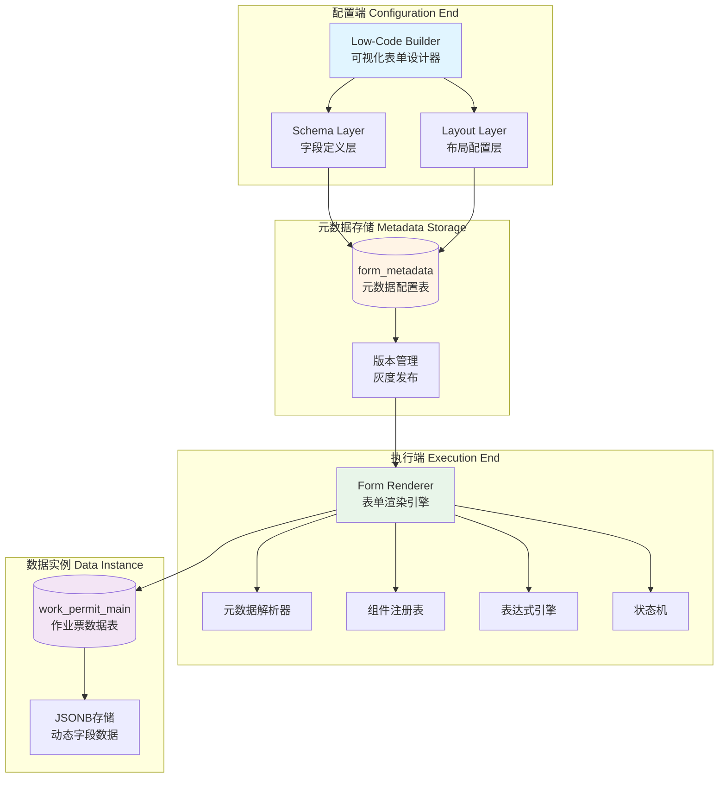
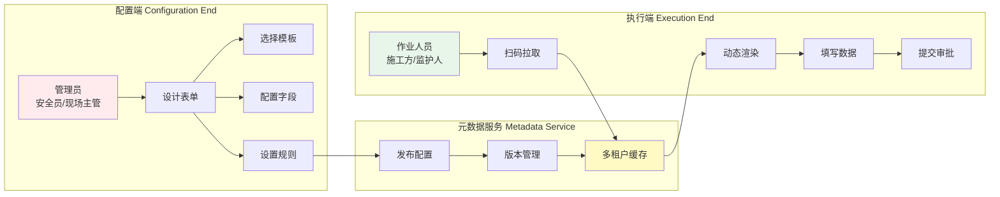
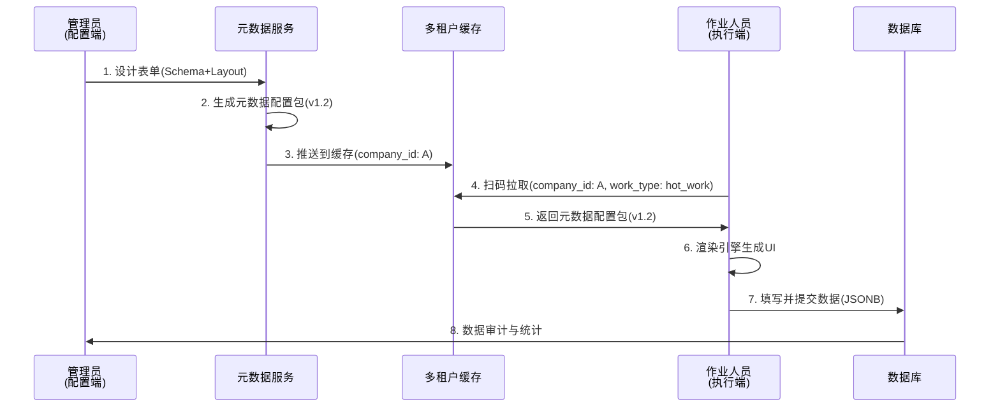
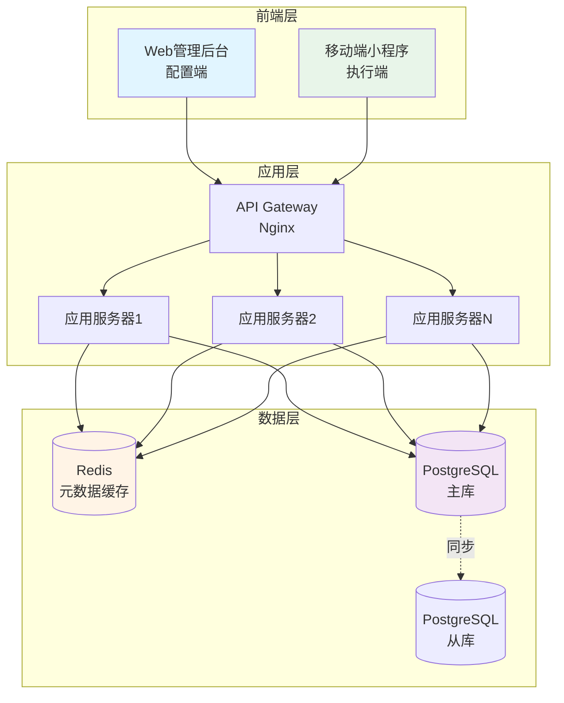

# 01 - 总体架构

> **本章导读**: 本章介绍配置端的总体架构设计,包括三层分离架构、配置端与执行端的关系、数据流转机制等核心内容。

---

## 1.1 架构设计理念

### 1.1.1 设计目标

配置端的设计遵循以下核心目标:

| 目标 | 说明 | 价值 |
|------|------|------|
| **低学习成本** | 可视化操作,无需编写代码 | 安全员、现场主管可快速上手 |
| **高定制化** | 元数据驱动,灵活扩展 | 适应不同企业的差异化流程 |
| **强合规性** | 硬约束机制,不可绕过 | 确保符合GB 30871等国家标准 |
| **易维护性** | 三层分离,版本管理 | 降低长期维护成本 |

### 1.1.2 核心设计原则

**原则1: 关注点分离(Separation of Concerns)**
- **Schema层**:定义"有什么数据"(字段属性、数据类型、校验规则)
- **Layout层**:定义"长什么样"(UI排列、分组、可见性)
- **Instance层**:存储"实际数据"(JSONB格式)

**原则2: 配置即逻辑(Configuration as Logic)**
- 用户通过配置实现业务逻辑,而非编写代码
- 示例:设置"如果氧气浓度<19%,则显示红色警告"只需在属性面板勾选,无需写if/else

**原则3: 所见即所得(WYSIWYG)**
- 左侧配置,右侧实时预览
- 消除"保存后才能看效果"的黑盒感

---

## 1.2 三层分离架构

### 1.2.1 架构全景图



### 1.2.2 Schema Layer(字段定义层)

**职责**: 定义字段的属性,与UI无关。

**核心内容**:
- **字段ID**(key): 唯一标识,如`work_zone`、`gas_level`
- **数据类型**(type): text、number、date、select、image_upload等
- **校验规则**(validation): 必填、取值范围、正则表达式
- **引用关系**(reference): 关联人员表、设备表、区域表

**示例**:
```json
{
  "fields": [
    {
      "key": "work_zone",
      "type": "text",
      "label": "作业区域",
      "required": true,
      "placeholder": "请输入作业区域名称"
    },
    {
      "key": "gas_level",
      "type": "number",
      "label": "氧气浓度 (%)",
      "required": true,
      "min": 18,
      "max": 23.5,
      "unit": "%",
      "errorMessage": "氧气浓度必须在18-23.5%之间"
    },
    {
      "key": "hazard_photos",
      "type": "image_upload",
      "label": "现场环境照片",
      "required": true,
      "props": {
        "maxCount": 3,
        "minCount": 1,
        "source": "camera_only",
        "watermark": true
      }
    }
  ]
}
```

### 1.2.3 Layout Layer(布局配置层)

**职责**: 定义字段在UI上的排列方式,与数据无关。

**核心内容**:
- **栅格布局**(grid): 决定字段是并排还是单行
- **分组卡片**(card/group): 将相关字段分块展示
- **可见性规则**(visibleIf): 条件显示/隐藏
- **只读条件**(readonlyIf): 根据状态控制可编辑性

**示例**:
```json
{
  "layout": [
    {
      "type": "card",
      "title": "基础信息",
      "children": ["work_zone", "work_time"],
      "grid": {
        "cols": 2,
        "gap": 16
      }
    },
    {
      "type": "card",
      "title": "安全检测",
      "children": ["gas_level", "hazard_photos"],
      "visibleIf": "data.state !== 'Draft'",
      "grid": {
        "cols": 1
      }
    }
  ]
}
```

### 1.2.4 Instance Layer(数据实例层)

**职责**: 存储实际的业务数据。

**核心内容**:
- **JSONB存储**: 灵活存储动态字段
- **版本控制**: 记录数据变更历史
- **审计日志**: 记录谁、何时、修改了什么

**示例**:
```json
{
  "ticketId": "HW-2026-03-12-001",
  "formMetadataId": "hot_work_v1.2",
  "state": "Verify",
  "formData": {
    "work_zone": "储罐区A-01",
    "work_time": "2026-03-12 14:00",
    "gas_level": 20.8,
    "hazard_photos": [
      "https://oss.example.com/photos/001.jpg",
      "https://oss.example.com/photos/002.jpg"
    ]
  },
  "evidenceData": {
    "photos": [
      {
        "url": "https://oss.example.com/photos/001.jpg",
        "timestamp": "2026-03-12 13:55:32",
        "location": [121.47, 31.23],
        "userId": "user_001"
      }
    ]
  }
}
```

---

## 1.3 配置端与执行端的关系

### 1.3.1 角色划分



### 1.3.2 数据流转机制

**阶段1: 配置阶段(Configuration Phase)**
1. 管理员在配置端选择"动火作业票"模板
2. 拖拽组件,配置字段属性(必填、取值范围)
3. 设置联动逻辑(如:氧气浓度<19%时显示警告)
4. 预览手机端/PC端效果
5. 点击"发布",生成元数据配置包

**阶段2: 发布阶段(Deployment Phase)**
1. 系统为配置包生成版本号(如:v1.2)
2. 配置包推送到多租户缓存(基于company_id)
3. 支持灰度发布(先给部分分公司试用)

**阶段3: 执行阶段(Execution Phase)**
1. 作业人员扫描现场设备码
2. 系统识别租户身份(company_id + work_type)
3. 从缓存加载对应的元数据配置包
4. 表单渲染引擎动态生成UI
5. 用户填写数据,触发校验逻辑
6. 提交后,数据以JSONB格式存入数据库

**数据流转图**:


---

## 1.4 系统边界与职责划分

### 1.4.1 配置端职责

| 职责 | 说明 | 输出 |
|------|------|------|
| **模板管理** | 提供8种标准模板,支持导入导出 | 模板库 |
| **字段配置** | 拖拽式添加字段,配置属性 | Schema JSON |
| **布局编排** | 设置字段排列、分组、栅格 | Layout JSON |
| **规则配置** | 设置联动逻辑、校验规则、约束 | Constraint JSON |
| **版本管理** | 记录配置变更历史,支持回滚 | 版本号 |
| **灰度发布** | 先给部分租户发布,验证后全量 | 发布策略 |

### 1.4.2 执行端职责

| 职责 | 说明 | 输入 |
|------|------|------|
| **元数据加载** | 根据租户ID和作业类型加载配置 | company_id + work_type |
| **动态渲染** | 解析元数据,生成UI组件树 | Schema + Layout JSON |
| **校验拦截** | 实时校验用户输入,阻断不合规操作 | Constraint JSON |
| **状态控制** | 根据状态机控制字段权限 | State Machine |
| **数据提交** | 将填写数据存入JSONB字段 | form_data |

### 1.4.3 边界清晰化

**配置端不负责**:
- ❌ 数据填写(由执行端负责)
- ❌ 审批流程(由审批引擎负责)
- ❌ IoT设备接入(由IoT接口层负责)

**执行端不负责**:
- ❌ 元数据设计(由配置端负责)
- ❌ 模板管理(由配置端负责)
- ❌ 版本发布(由配置端负责)

---

## 1.5 架构优势

### 1.5.1 对比传统方案

| 维度 | 传统方案 | 元数据驱动方案(本设计) |
|------|---------|---------------------|
| **字段增减** | 修改数据库Schema + 后端实体 + 前端页面 | 修改元数据配置,即时生效 |
| **UI变动** | 前端硬编码多个Vue/React页面 | 渲染引擎读取Layout JSON动态生成 |
| **版本控制** | 难以追踪配置变更 | 元数据记录版本号,支持回滚和灰度发布 |
| **多租户隔离** | 数据库物理隔离或繁琐过滤 | 基于tenant_id加载对应的元数据配置包 |
| **开发成本** | 每个新需求都要改代码、跑CI/CD | 只需维护一套渲染引擎,配置即可上线 |
| **实施周期** | 2-3个月 | 1-2周(基于模板微调) |

### 1.5.2 可扩展性

**水平扩展**:
- 新增作业类型(如"吊装作业票")无需改动底座代码
- 只需在配置端创建新模板,定义字段和布局

**垂直扩展**:
- 新增组件类型(如"扫码识别"组件)
- 在组件注册表中注册新组件,配置端即可使用

**多租户扩展**:
- 不同公司可以有完全不同的表单配置
- 基于company_id隔离,互不影响

---

## 1.6 技术架构概览

### 1.6.1 技术栈选型

**配置端(Web管理后台)**:
- **前端框架**: Vue 3 + TypeScript
- **UI组件库**: Element Plus
- **拖拽库**: Vue.Draggable / VueUse
- **状态管理**: Pinia
- **表单渲染**: 自研Form Renderer Engine

**执行端(移动端小程序)**:
- **跨平台框架**: uni-app
- **UI组件库**: uView UI
- **状态管理**: Vuex
- **表单渲染**: 共享Form Renderer Engine

**后端服务**:
- **开发框架**: Spring Boot 3.2
- **数据库**: PostgreSQL 14 (JSONB支持)
- **缓存**: Redis 7.0
- **消息队列**: RabbitMQ 3.12

### 1.6.2 部署架构



---

## 1.7 本章小结

本章介绍了配置端的总体架构设计,核心要点包括:

1. **三层分离架构**: Schema(字段定义) - Layout(布局配置) - Instance(数据实例)
2. **配置端与执行端的关系**: 配置端负责设计,执行端负责渲染和数据采集
3. **数据流转机制**: 配置 → 发布 → 缓存 → 拉取 → 渲染 → 提交
4. **架构优势**: 相比传统方案,开发成本降低70%,实施周期缩短80%

**下一章**: [02 - 核心概念](./02-核心概念.md) - 详细介绍元数据、组件、约束、状态机等核心概念。

---

**相关文档**:
- [04-系统架构设计](../PRD章节/04-系统架构设计.md) - 参考4.9节
- [05-通用底座功能需求](../PRD章节/05-通用底座功能需求.md) - 参考5.9节
