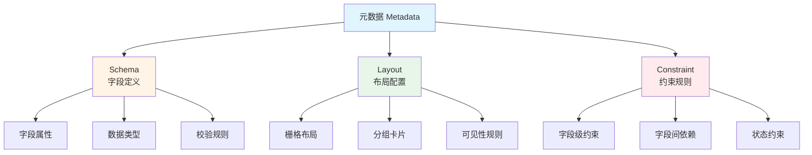
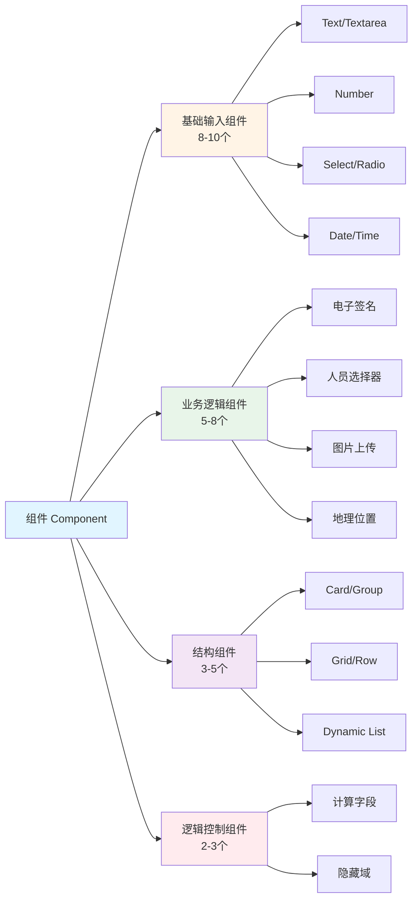
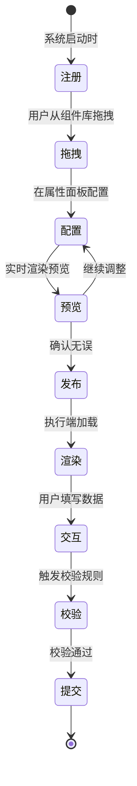
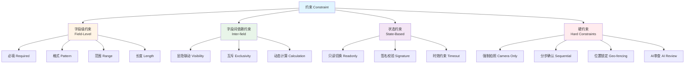
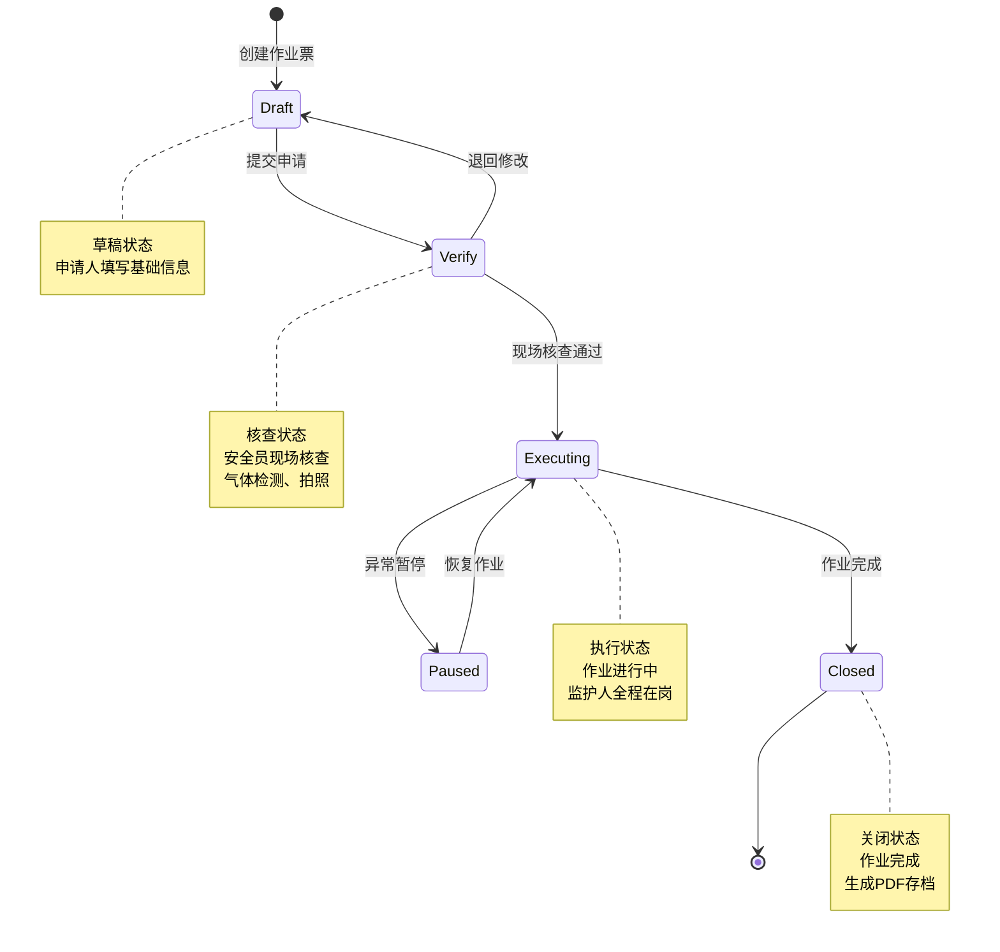
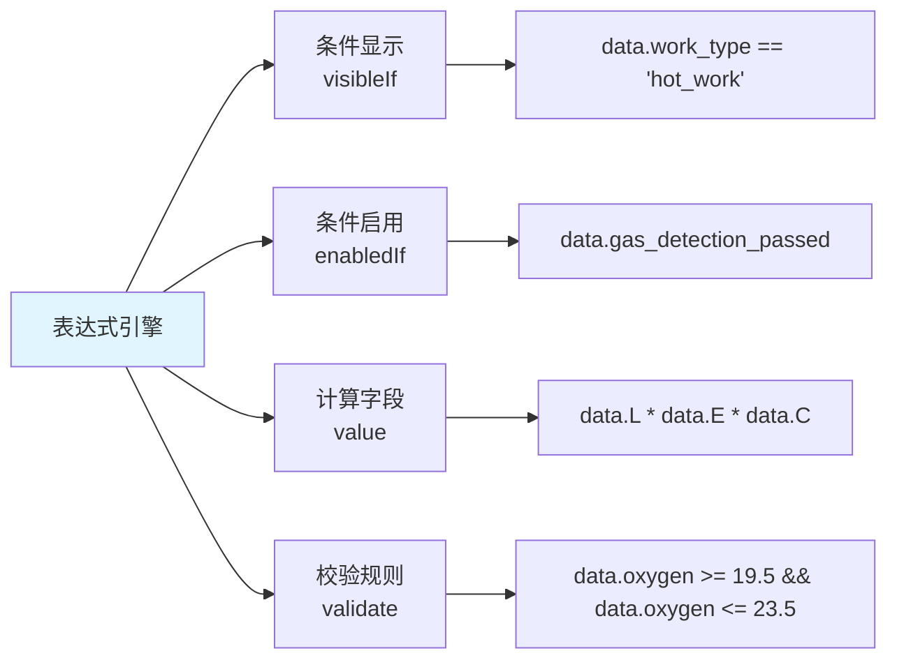
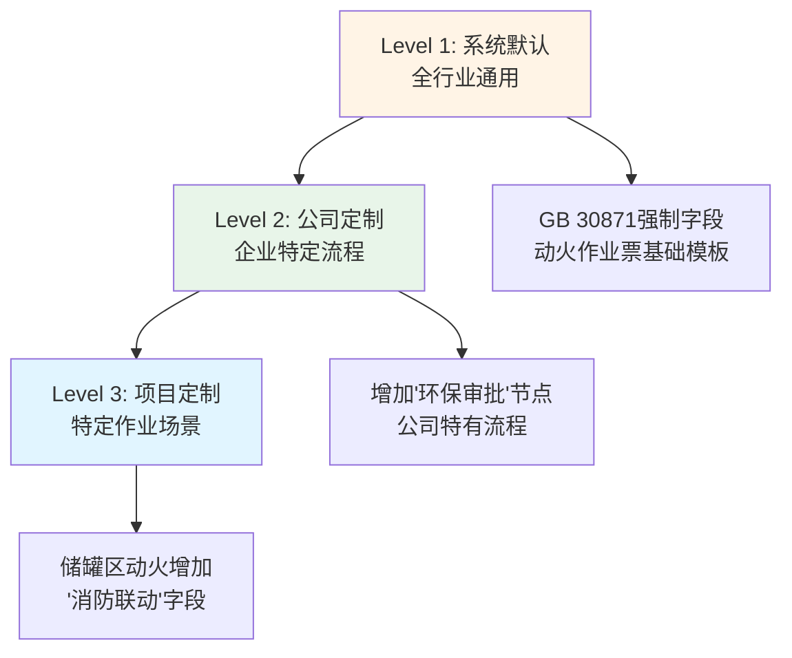
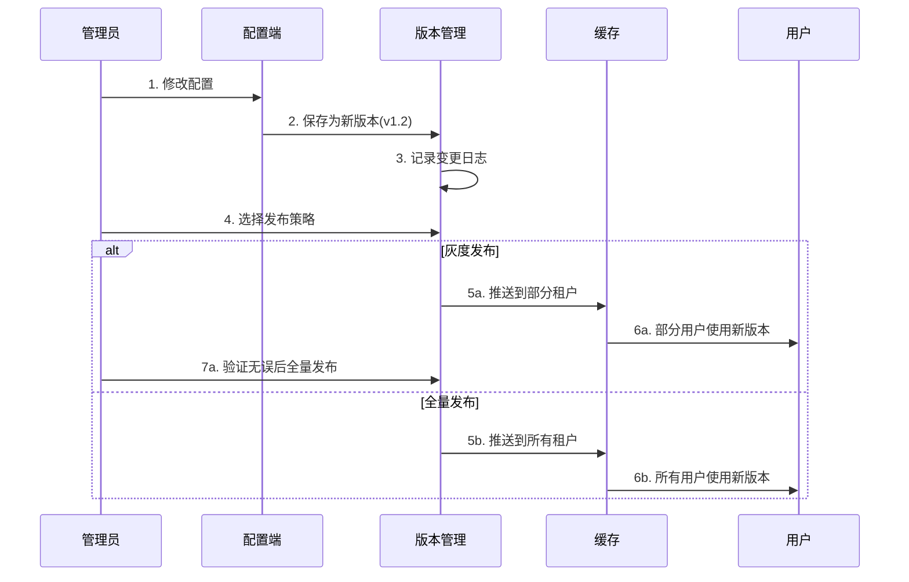

# 02 - 核心概念

> **本章导读**: 本章详细介绍配置端涉及的核心概念,包括元数据、组件、约束、状态机、表达式引擎等,为后续章节奠定理论基础。

---

## 2.1 元数据(Metadata)

### 2.1.1 什么是元数据

**定义**: 元数据是"描述数据的数据",在本系统中特指**描述表单结构和行为的配置信息**。

**类比理解**:
- 如果说"作业票数据"是一本书的内容
- 那么"元数据"就是这本书的目录、章节结构、排版规则

### 2.1.2 元数据的组成

元数据由三部分组成,对应三层分离架构:



### 2.1.3 元数据示例

**完整的元数据配置包**:
```json
{
  "metadataId": "hot_work_v1.2",
  "companyId": "company_001",
  "workType": "hot_work",
  "version": "1.2",
  "status": "published",

  "schema": {
    "fields": [
      {
        "key": "work_zone",
        "type": "text",
        "label": "作业区域",
        "required": true
      },
      {
        "key": "gas_level",
        "type": "number",
        "label": "氧气浓度 (%)",
        "min": 18,
        "max": 23.5
      }
    ]
  },

  "layout": {
    "sections": [
      {
        "type": "card",
        "title": "基础信息",
        "children": ["work_zone"]
      }
    ]
  },

  "constraints": {
    "rules": [
      {
        "field": "gas_level",
        "type": "range",
        "condition": "value >= 18 && value <= 23.5",
        "errorMessage": "氧气浓度必须在18-23.5%之间"
      }
    ]
  }
}
```

---

## 2.2 组件(Component)

### 2.2.1 什么是组件

**定义**: 组件是表单的基本构建单元,每个组件负责采集一种类型的数据。

**类比理解**:
- 组件就像"乐高积木"
- 不同的积木可以拼出不同的作品
- 用户通过拖拽组件来搭建表单

### 2.2.2 组件分类



### 2.2.3 组件属性

每个组件都有一组标准属性:

| 属性类别 | 属性名 | 说明 | 示例 |
|---------|--------|------|------|
| **基础属性** | key | 唯一标识 | `work_zone` |
| | type | 组件类型 | `text`, `number`, `select` |
| | label | 显示标签 | "作业区域" |
| | placeholder | 占位提示 | "请输入作业区域名称" |
| **校验属性** | required | 是否必填 | `true` / `false` |
| | min/max | 取值范围 | `min: 18, max: 23.5` |
| | pattern | 正则表达式 | `^[0-9]{11}$` |
| **联动属性** | visibleIf | 显示条件 | `data.risk_level > 3` |
| | readonlyIf | 只读条件 | `state === 'Closed'` |
| | enabledIf | 启用条件 | `data.photo_uploaded` |
| **业务属性** | props | 组件特有属性 | `{ maxCount: 3, source: "camera_only" }` |

### 2.2.4 组件生命周期



---

## 2.3 约束(Constraint)

### 2.3.1 什么是约束

**定义**: 约束是对数据和行为的限制规则,确保表单数据的准确性和合规性。

**核心价值**:
- 对于公司:确保符合国家安全标准,规避法律风险
- 对于现场工人:像导航一样引导操作,防止漏填、错填
- 对于系统:结构化、清洗过的数据,降低后续分析难度

### 2.3.2 约束分类



### 2.3.3 约束示例

**字段级约束**:
```json
{
  "key": "oxygen_level",
  "type": "number",
  "label": "氧气浓度 (%)",
  "constraints": {
    "required": true,
    "min": 19.5,
    "max": 23.5,
    "errorMessage": "氧气浓度必须在19.5-23.5%之间"
  }
}
```

**字段间依赖约束**:
```json
{
  "key": "safety_belt_type",
  "type": "select",
  "label": "安全带类型",
  "visibleIf": "data.height > 2",
  "options": ["全身式", "半身式"]
}
```

**硬约束(不可绕过)**:
```json
{
  "key": "site_photo",
  "type": "image_upload",
  "label": "现场照片",
  "constraints": {
    "required": true,
    "hardConstraints": {
      "source": "camera_only",
      "minCount": 3,
      "watermark": true,
      "aiReview": {
        "enabled": true,
        "detectObjects": ["safety_helmet", "fire_extinguisher"]
      }
    }
  }
}
```

---

## 2.4 状态机(State Machine)

### 2.4.1 什么是状态机

**定义**: 状态机定义了作业票的生命周期,以及在不同状态下字段的权限控制。

**核心价值**:
- 确保作业票按照规定流程流转
- 防止越权操作(如:申请人不能审批自己的票)
- 实现"谁在什么时候能干什么"的精细化控制

### 2.4.2 状态定义



### 2.4.3 状态与字段权限

| 状态 | 可写字段 | 只读字段 | 必填字段 |
|------|---------|---------|---------|
| **Draft** | 基础信息、人员信息 | - | work_zone, work_time, workers |
| **Verify** | 气体检测、现场照片、签名 | 基础信息、人员信息 | gas_detection, site_photos, supervisor_signature |
| **Executing** | 监护记录、巡检照片 | 基础信息、气体检测 | patrol_records |
| **Closed** | - | 全部字段 | - |

### 2.4.4 状态转换规则

**转换条件**:
```json
{
  "transitions": [
    {
      "from": "Draft",
      "to": "Verify",
      "condition": "allRequiredFieldsFilled && approvalPassed",
      "action": "notifySupervisor"
    },
    {
      "from": "Verify",
      "to": "Executing",
      "condition": "gasDetectionPassed && photosUploaded && supervisorSigned",
      "action": "startTimer"
    },
    {
      "from": "Executing",
      "to": "Closed",
      "condition": "workCompleted && allPartiesSigned",
      "action": "generatePDF"
    }
  ]
}
```

---

## 2.5 表达式引擎(Expression Engine)

### 2.5.1 什么是表达式引擎

**定义**: 表达式引擎是一个轻量级的逻辑计算工具,允许用户通过简单的表达式实现复杂的业务逻辑。

**核心价值**:
- 用户无需编写代码,只需配置表达式
- 支持条件显示、动态计算、联动逻辑
- 降低学习成本,提高配置效率

### 2.5.2 支持的表达式类型



### 2.5.3 表达式语法

**基础语法**:
- **逻辑运算**: `&&`(与)、`||`(或)、`!`(非)
- **比较运算**: `==`、`!=`、`>`、`<`、`>=`、`<=`
- **算术运算**: `+`、`-`、`*`、`/`
- **数据引用**: `data.字段名`、`state`、`user.role`

**示例**:
```javascript
// 条件显示:高度超过2米时显示安全带选项
visibleIf: "data.height > 2"

// 条件启用:上传照片后才能提交
enabledIf: "data.photos.length >= 3"

// 计算字段:风险评分 = L × E × C
value: "data.L * data.E * data.C"

// 校验规则:氧气浓度必须在19.5-23.5%之间
validate: "data.oxygen >= 19.5 && data.oxygen <= 23.5"

// 复杂条件:特级作业且氧气浓度低于20%
visibleIf: "data.work_level === 'special' && data.oxygen < 20"
```

### 2.5.4 表达式引擎实现

**技术选型**:
- **jexl**: 轻量级表达式语言,支持复杂逻辑
- **json-logic**: JSON格式的逻辑表达式,易于存储和传输

**示例(jexl)**:
```javascript
import jexl from 'jexl'

// 定义上下文
const context = {
  data: {
    height: 5,
    oxygen: 20.8,
    work_level: 'special'
  },
  state: 'Verify',
  user: {
    role: 'supervisor'
  }
}

// 计算表达式
const result = await jexl.eval('data.height > 2 && data.oxygen >= 19.5', context)
console.log(result) // true
```

---

## 2.6 多级覆盖机制(Multi-Level Override)

### 2.6.1 什么是多级覆盖

**定义**: 多级覆盖机制允许在不同层级定义配置,下级配置可以覆盖上级配置。

**核心价值**:
- 系统提供通用模板,企业可以定制
- 企业定制后,项目可以进一步微调
- 实现"标准化"与"个性化"的平衡

### 2.6.2 覆盖层级



### 2.6.3 覆盖规则

| 级别 | 配置范围 | 优先级 | 示例 | 可覆盖内容 |
|------|---------|--------|------|-----------|
| **Level 1** | 全行业通用 | 最低 | GB 30871强制字段 | 不可覆盖(强制字段) |
| **Level 2** | 企业特定流程 | 中 | 增加"环保审批"节点 | 可增加字段、修改布局、调整流程 |
| **Level 3** | 特定作业场景 | 最高 | 储罐区动火增加"消防联动" | 可覆盖Level 2的所有配置 |

### 2.6.4 覆盖示例

**Level 1(系统默认)**:
```json
{
  "fields": [
    { "key": "work_zone", "required": true },
    { "key": "work_time", "required": true },
    { "key": "workers", "required": true }
  ]
}
```

**Level 2(公司定制)**:
```json
{
  "extends": "system_default",
  "fields": [
    { "key": "work_zone", "required": true },
    { "key": "work_time", "required": true },
    { "key": "workers", "required": true },
    { "key": "environmental_approval", "required": true }
  ]
}
```

**Level 3(项目定制)**:
```json
{
  "extends": "company_custom",
  "fields": [
    { "key": "work_zone", "required": true },
    { "key": "work_time", "required": true },
    { "key": "workers", "required": true },
    { "key": "environmental_approval", "required": true },
    { "key": "fire_linkage", "required": true, "visibleIf": "data.work_zone.includes('储罐区')" }
  ]
}
```

---

## 2.7 版本管理(Version Control)

### 2.7.1 为什么需要版本管理

**核心价值**:
- 追踪配置变更历史
- 支持回滚到历史版本
- 实现灰度发布(先给部分租户试用)
- 确保历史数据的可追溯性

### 2.7.2 版本号规则

**语义化版本号(SemVer)**:
- **格式**: `主版本号.次版本号.修订号` (如:`1.2.3`)
- **主版本号**: 不兼容的API修改(如:删除字段)
- **次版本号**: 向下兼容的功能性新增(如:新增字段)
- **修订号**: 向下兼容的问题修正(如:修改标签文字)

**示例**:
- `1.0.0`: 初始版本
- `1.1.0`: 新增"环保审批"字段
- `1.1.1`: 修改"作业区域"标签为"作业地点"
- `2.0.0`: 删除"临时字段",不兼容旧版本

### 2.7.3 版本管理流程



---

## 2.8 本章小结

本章介绍了配置端的核心概念,要点包括:

1. **元数据**: 描述表单结构和行为的配置信息,由Schema、Layout、Constraint三部分组成
2. **组件**: 表单的基本构建单元,分为基础输入、业务逻辑、结构、逻辑控制四大类
3. **约束**: 对数据和行为的限制规则,分为字段级、字段间、状态、硬约束四种类型
4. **状态机**: 定义作业票的生命周期和字段权限控制
5. **表达式引擎**: 通过简单表达式实现复杂业务逻辑
6. **多级覆盖**: 系统默认 → 公司定制 → 项目定制,实现标准化与个性化的平衡
7. **版本管理**: 追踪变更历史,支持回滚和灰度发布

**下一章**: [03 - 界面设计 - Low-Code Builder](./03-界面设计-Low-Code-Builder.md) - 详细介绍可视化表单设计器的界面布局和交互设计。

---

**相关文档**:
- [01-总体架构](./01-总体架构.md)
- [05-约束组件系统](./05-约束组件系统.md)
- [07-状态机设计](./07-状态机设计.md)
