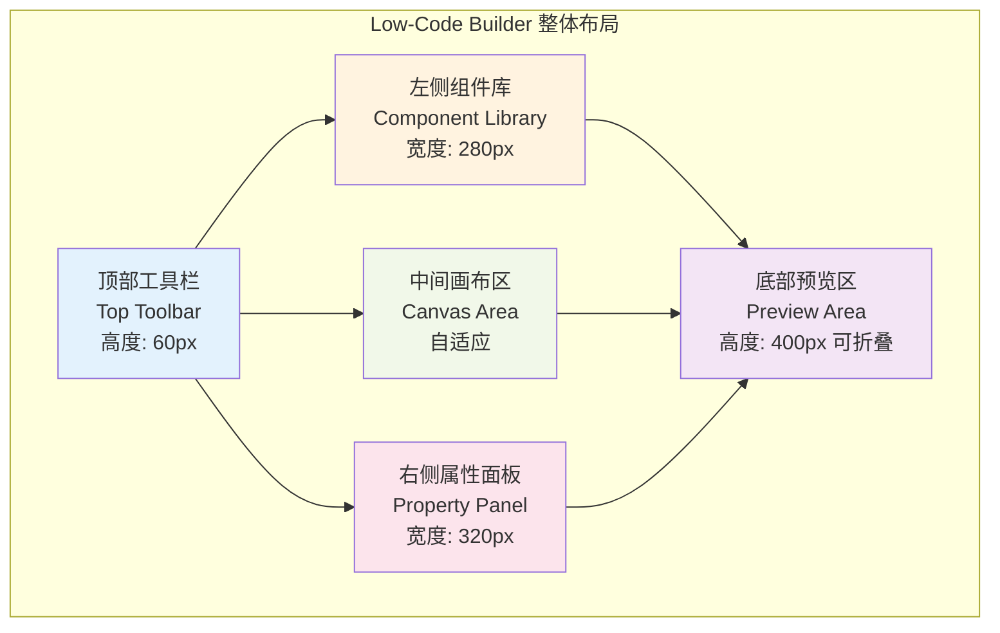
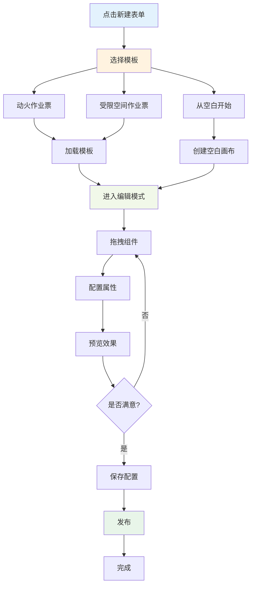
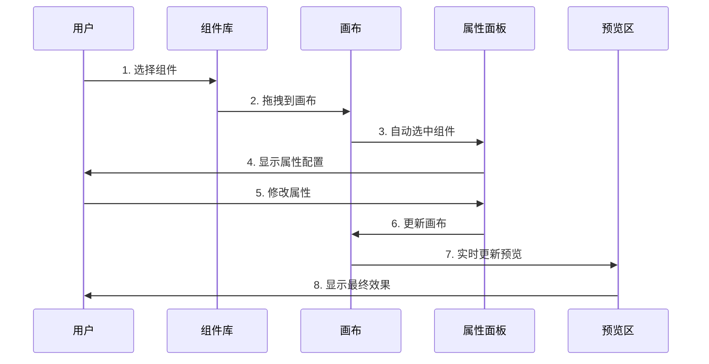
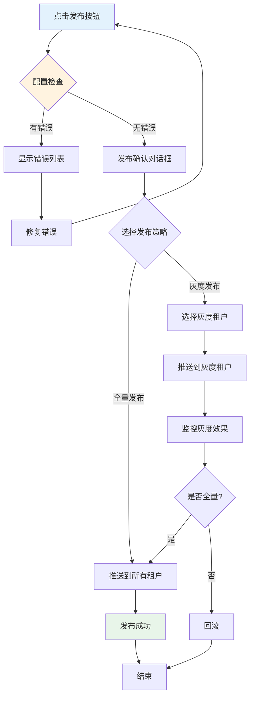

# 03 - 界面设计 - Low-Code Builder

> **本章导读**: 本章详细介绍可视化表单设计器(Low-Code Builder)的界面布局、交互设计和用户体验,这是配置端的核心界面。

---

## 3.1 整体布局设计

### 3.1.1 四区域布局

Low-Code Builder采用经典的四区域布局,类似于主流的设计工具(如Figma、Sketch):



### 3.1.2 布局说明

| 区域 | 宽度/高度 | 功能 | 可折叠 |
|------|----------|------|--------|
| **顶部工具栏** | 高度60px | 保存、预览、发布、版本管理 | ❌ |
| **左侧组件库** | 宽度280px | 展示可拖拽的组件列表 | ✅ |
| **中间画布区** | 自适应 | 拖拽组件、编排布局 | ❌ |
| **右侧属性面板** | 宽度320px | 配置选中组件的属性 | ✅ |
| **底部预览区** | 高度400px | 实时预览手机端/PC端效果 | ✅ |

---

## 3.2 顶部工具栏设计

### 3.2.1 工具栏布局

```
┌─────────────────────────────────────────────────────────────────┐
│ [Logo] 动火作业票 v1.2 ▼  │  [保存] [预览] [发布]  │  [帮助] [用户] │
└─────────────────────────────────────────────────────────────────┘
```

### 3.2.2 功能按钮

**左侧区域**:
- **Logo**: 系统标识
- **模板名称**: 当前编辑的模板名称(可点击切换)
- **版本号**: 当前版本号(点击查看历史版本)

**中间区域**:
- **保存按钮**: 保存当前配置(快捷键: Ctrl+S)
- **预览按钮**: 打开预览窗口(快捷键: Ctrl+P)
- **发布按钮**: 发布配置到生产环境

**右侧区域**:
- **帮助按钮**: 打开帮助文档
- **用户头像**: 显示当前用户,点击查看个人设置

### 3.2.3 交互细节

**保存按钮**:
- 未保存时显示红点提示
- 保存成功后显示"✓ 已保存"提示(3秒后消失)
- 保存失败时显示错误信息

**发布按钮**:
- 点击后弹出发布确认对话框
- 支持选择发布策略(全量发布/灰度发布)
- 显示发布影响范围(多少个租户会受影响)

---

## 3.3 左侧组件库设计

### 3.3.1 组件库布局

```
┌─────────────────────────┐
│ 🔍 搜索组件...          │
├─────────────────────────┤
│ 📦 基础输入组件         │
│   ├─ 📝 单行文本        │
│   ├─ 📄 多行文本        │
│   ├─ 🔢 数字输入        │
│   ├─ 📅 日期选择        │
│   └─ ⏰ 时间选择        │
├─────────────────────────┤
│ 🎯 业务逻辑组件         │
│   ├─ ✍️ 电子签名        │
│   ├─ 👤 人员选择器      │
│   ├─ 📷 图片上传        │
│   └─ 📍 地理位置        │
├─────────────────────────┤
│ 🏗️ 结构组件            │
│   ├─ 📋 卡片分组        │
│   ├─ 📊 栅格布局        │
│   └─ 📑 动态明细表      │
├─────────────────────────┤
│ ⚙️ 逻辑控制组件        │
│   ├─ 🧮 计算字段        │
│   └─ 🔒 隐藏域          │
└─────────────────────────┘
```

### 3.3.2 组件卡片设计

每个组件以卡片形式展示:

```
┌─────────────────────────┐
│ 📝 单行文本             │
│ ─────────────────────   │
│ 用于填写简短的文本信息  │
│ 如:作业区域、设备编号   │
└─────────────────────────┘
```

**卡片内容**:
- **图标**: 组件类型的视觉标识
- **名称**: 组件的业务名称(非技术名称)
- **描述**: 简短说明组件的用途

### 3.3.3 拖拽交互

**拖拽开始**:
1. 鼠标按下组件卡片
2. 卡片变为半透明,跟随鼠标移动
3. 画布区显示可放置区域的高亮提示

**拖拽中**:
1. 鼠标移动到画布区
2. 显示插入位置的蓝色虚线
3. 实时计算插入位置

**拖拽结束**:
1. 鼠标松开
2. 组件插入到目标位置
3. 自动选中新插入的组件
4. 右侧属性面板显示组件属性

**拖拽取消**:
- 按ESC键取消拖拽
- 拖拽到画布外取消拖拽

---

## 3.4 中间画布区设计

### 3.4.1 画布布局

```
┌─────────────────────────────────────────────────────────┐
│ 📱 手机预览 | 💻 电脑预览                    [缩放: 100%] │
├─────────────────────────────────────────────────────────┤
│                                                           │
│   ┌─────────────────────────────────────────────┐       │
│   │ 📋 基础信息                                 │       │
│   │ ┌─────────────────┐ ┌─────────────────┐   │       │
│   │ │ 作业区域        │ │ 作业时间        │   │       │
│   │ │ [输入框]        │ │ [日期选择]      │   │       │
│   │ └─────────────────┘ └─────────────────┘   │       │
│   └─────────────────────────────────────────────┘       │
│                                                           │
│   ┌─────────────────────────────────────────────┐       │
│   │ 🔬 安全检测                                 │       │
│   │ ┌─────────────────────────────────────────┐ │       │
│   │ │ 氧气浓度 (%)                            │ │       │
│   │ │ [数字输入]                              │ │       │
│   │ └─────────────────────────────────────────┘ │       │
│   └─────────────────────────────────────────────┘       │
│                                                           │
│   [+ 添加卡片]                                           │
│                                                           │
└─────────────────────────────────────────────────────────┘
```

### 3.4.2 组件选中状态

**未选中**:
- 组件显示正常样式
- 鼠标悬停时显示浅蓝色边框

**选中**:
- 组件显示蓝色边框(2px)
- 四角显示调整大小的控制点
- 顶部显示操作工具栏

**操作工具栏**:
```
┌─────────────────────────────────────────────┐
│ [↑ 上移] [↓ 下移] [📋 复制] [🗑️ 删除]      │
└─────────────────────────────────────────────┘
```

### 3.4.3 画布交互

**点击空白区域**:
- 取消所有组件的选中状态
- 右侧属性面板显示画布属性(背景色、间距等)

**点击组件**:
- 选中该组件
- 右侧属性面板显示组件属性

**双击组件**:
- 进入组件编辑模式(如:编辑文本内容)

**右键菜单**:
- 复制组件
- 粘贴组件
- 删除组件
- 上移/下移

**快捷键**:
- `Ctrl+C`: 复制选中组件
- `Ctrl+V`: 粘贴组件
- `Delete`: 删除选中组件
- `Ctrl+Z`: 撤销
- `Ctrl+Y`: 重做

---

## 3.5 右侧属性面板设计

### 3.5.1 属性面板布局

```
┌─────────────────────────┐
│ 📝 单行文本             │
├─────────────────────────┤
│ 基础属性                │
│ ┌─────────────────────┐ │
│ │ 字段ID              │ │
│ │ work_zone           │ │
│ └─────────────────────┘ │
│ ┌─────────────────────┐ │
│ │ 显示标签            │ │
│ │ 作业区域            │ │
│ └─────────────────────┘ │
│ ┌─────────────────────┐ │
│ │ 占位提示            │ │
│ │ 请输入作业区域名称  │ │
│ └─────────────────────┘ │
├─────────────────────────┤
│ 校验规则                │
│ ☑️ 必填                 │
│ ☐ 只读                  │
│ ┌─────────────────────┐ │
│ │ 最小长度            │ │
│ │ 2                   │ │
│ └─────────────────────┘ │
│ ┌─────────────────────┐ │
│ │ 最大长度            │ │
│ │ 50                  │ │
│ └─────────────────────┘ │
├─────────────────────────┤
│ 联动规则                │
│ ┌─────────────────────┐ │
│ │ 显示条件            │ │
│ │ [配置表达式]        │ │
│ └─────────────────────┘ │
│ ┌─────────────────────┐ │
│ │ 只读条件            │ │
│ │ [配置表达式]        │ │
│ └─────────────────────┘ │
└─────────────────────────┘
```

### 3.5.2 属性分组

属性面板按功能分为多个折叠面板:

**基础属性**:
- 字段ID(key)
- 显示标签(label)
- 占位提示(placeholder)
- 默认值(defaultValue)

**校验规则**:
- 必填(required)
- 只读(readonly)
- 最小/最大长度(minLength/maxLength)
- 正则表达式(pattern)

**联动规则**:
- 显示条件(visibleIf)
- 只读条件(readonlyIf)
- 启用条件(enabledIf)

**样式设置**:
- 宽度(width)
- 对齐方式(align)
- 标签位置(labelPosition)

**高级设置**:
- 组件特有属性(props)
- 自定义校验函数(customValidator)

### 3.5.3 表达式编辑器

**简单模式**:
```
┌─────────────────────────────────────┐
│ 显示条件                            │
│ ┌─────────────────────────────────┐ │
│ │ 当 [作业高度] [大于] [2] 时显示 │ │
│ └─────────────────────────────────┘ │
│ [+ 添加条件]                        │
└─────────────────────────────────────┘
```

**高级模式**:
```
┌─────────────────────────────────────┐
│ 显示条件 (表达式模式)               │
│ ┌─────────────────────────────────┐ │
│ │ data.height > 2                 │ │
│ │                                 │ │
│ └─────────────────────────────────┘ │
│ [切换到简单模式]                    │
└─────────────────────────────────────┘
```

---

## 3.6 底部预览区设计

### 3.6.1 预览区布局

```
┌─────────────────────────────────────────────────────────┐
│ 📱 手机预览 | 💻 电脑预览              [刷新] [全屏预览] │
├─────────────────────────────────────────────────────────┤
│                                                           │
│  ┌─────────────┐        ┌─────────────────────────────┐ │
│  │             │        │                             │ │
│  │   手机端    │        │         电脑端              │ │
│  │   实时预览  │        │         实时预览            │ │
│  │             │        │                             │ │
│  └─────────────┘        └─────────────────────────────┘ │
│                                                           │
└─────────────────────────────────────────────────────────┘
```

### 3.6.2 预览模式

**手机预览**:
- 显示iPhone/Android手机外框
- 宽度375px(iPhone标准宽度)
- 支持滚动查看完整表单

**电脑预览**:
- 显示浏览器外框
- 宽度1200px(PC标准宽度)
- 支持响应式布局预览

**全屏预览**:
- 打开新窗口
- 显示完整的表单效果
- 支持填写数据测试

### 3.6.3 实时预览

**触发时机**:
- 拖拽组件到画布 → 立即更新预览
- 修改组件属性 → 实时更新预览(防抖300ms)
- 调整布局 → 立即更新预览

**预览内容**:
- 显示实际的UI效果
- 显示校验规则提示
- 显示联动逻辑效果

---

## 3.7 交互流程设计

### 3.7.1 新建表单流程



### 3.7.2 编辑表单流程



### 3.7.3 发布流程



---

## 3.8 用户体验优化

### 3.8.1 响应式设计

**自适应布局**:
- 画布区自动适应窗口大小
- 左右面板可折叠,释放更多空间
- 支持全屏模式(F11)

**最小分辨率**:
- 最小宽度:1280px
- 最小高度:720px
- 低于最小分辨率时显示提示

### 3.8.2 性能优化

**虚拟滚动**:
- 组件库使用虚拟滚动
- 只渲染可见区域的组件
- 提升大量组件时的性能

**防抖与节流**:
- 属性修改防抖300ms
- 画布滚动节流100ms
- 预览更新防抖500ms

**懒加载**:
- 预览区默认折叠
- 展开时才加载预览内容
- 减少初始加载时间

### 3.8.3 快捷操作

**快捷键**:
| 快捷键 | 功能 |
|--------|------|
| `Ctrl+S` | 保存 |
| `Ctrl+P` | 预览 |
| `Ctrl+Z` | 撤销 |
| `Ctrl+Y` | 重做 |
| `Ctrl+C` | 复制 |
| `Ctrl+V` | 粘贴 |
| `Delete` | 删除 |
| `F11` | 全屏 |

**右键菜单**:
- 复制组件
- 粘贴组件
- 删除组件
- 上移/下移
- 复制配置
- 粘贴配置

---

## 3.9 AI Copilot 集成

### 3.9.1 AI助手入口

**位置**: 右下角悬浮按钮

```
                                    ┌─────────┐
                                    │ 🤖 AI   │
                                    │ 助手    │
                                    └─────────┘
```

### 3.9.2 AI功能

**自然语言生成字段**:
```
用户输入: "帮我增加一个施工人员签名字段,并在危险系数大于3时显示"

AI输出:
✓ 已添加"施工人员签名"字段
✓ 已设置显示条件: data.risk_level > 3
✓ 已配置为必填项
```

**纸质表单识别**:
```
用户上传: 纸质作业票图片

AI输出:
✓ 识别到15个字段
✓ 已自动生成表单结构
✓ 请确认字段配置
```

**智能推荐**:
```
AI提示:
💡 检测到您正在编辑"动火作业票"
   建议添加以下字段:
   - 气体检测记录
   - 现场照片(强制拍照)
   - 监护人签名
```

---

## 3.10 本章小结

本章详细介绍了Low-Code Builder的界面设计,要点包括:

1. **四区域布局**: 顶部工具栏、左侧组件库、中间画布区、右侧属性面板、底部预览区
2. **拖拽交互**: 从组件库拖拽组件到画布,实时显示插入位置
3. **属性配置**: 右侧属性面板提供丰富的配置选项,支持简单模式和高级模式
4. **实时预览**: 底部预览区实时显示手机端和PC端效果
5. **用户体验**: 响应式设计、性能优化、快捷操作、AI助手集成

**下一章**: [04 - 组件库设计](./04-组件库设计.md) - 详细介绍4大类组件的设计和使用。

---

**相关文档**:
- [02-核心概念](./02-核心概念.md)
- [04-组件库设计](./04-组件库设计.md)
- [06-用户工作流](./06-用户工作流.md)
