# 04 - 组件库设计

> **本章导读**: 本章详细介绍配置端组件库的设计,包括4大类组件的详细规格、属性配置规范和扩展机制。

---

## 4.1 组件库概览

### 4.1.1 组件分类

组件库按功能划分为4大类,共计22-30个组件:

```mermaid
flowchart TD
    ComponentLibrary[组件库<br/>Component Library] --> Basic[基础输入组件<br/>8-10个]
    ComponentLibrary --> Business[业务逻辑组件<br/>5-8个]
    ComponentLibrary --> Structure[结构组件<br/>3-5个]
    ComponentLibrary --> Logic[逻辑控制组件<br/>2-3个]

    Basic --> B1[单行文本 Text]
    Basic --> B2[多行文本 Textarea]
    Basic --> B3[数字输入 Number]
    Basic --> B4[日期选择 Date]
    Basic --> B5[时间选择 Time]
    Basic --> B6[下拉选择 Select]
    Basic --> B7[单选框 Radio]
    Basic --> B8[复选框 Checkbox]

    Business --> BU1[电子签名 Signature]
    Business --> BU2[人员选择器 PersonPicker]
    Business --> BU3[图片上传 ImageUpload]
    Business --> BU4[地理位置 Location]
    Business --> BU5[附件上传 FileUpload]

    Structure --> S1[卡片分组 Card]
    Structure --> S2[栅格布局 Grid]
    Structure --> S3[动态明细表 DynamicList]

    Logic --> L1[计算字段 Calculated]
    Logic --> L2[隐藏域 Hidden]

    style ComponentLibrary fill:#e1f5ff
    style Basic fill:#fff4e6
    style Business fill:#e8f5e9
    style Structure fill:#f3e5f5
    style Logic fill:#ffebee
```



### 4.1.2 组件数量统计

| 类别 | 数量 | 占比 | 说明 |
|------|------|------|------|
| **基础输入组件** | 8-10个 | 44% | 覆盖常见数据类型输入 |
| **业务逻辑组件** | 5-8个+4个环境准入 | 30% | 作业票特有业务场景 |
| **结构组件** | 3-5个 | 17% | 布局与分组 |
| **逻辑控制组件** | 2-3个 | 9% | 计算与隐藏逻辑 |
| **合计** | 22-30个 | 100% | - |

---

## 4.2 基础输入组件

基础输入组件负责采集常见数据类型,是表单的基础构建单元。

### 4.2.1 单行文本(Text)

**组件标识**: `text`

**适用场景**:
- 作业区域名称
- 设备编号
- 作业负责人姓名
- 简短描述信息

**属性配置**:

| 属性名 | 类型 | 必填 | 默认值 | 说明 |
|--------|------|------|--------|------|
| key | string | ✅ | - | 字段唯一标识 |
| label | string | ✅ | - | 显示标签 |
| placeholder | string | ❌ | - | 占位提示文字 |
| defaultValue | string | ❌ | "" | 默认值 |
| required | boolean | ❌ | false | 是否必填 |
| readonly | boolean | ❌ | false | 是否只读 |
| maxLength | number | ❌ | - | 最大字符长度 |
| minLength | number | ❌ | - | 最小字符长度 |
| pattern | string | ❌ | - | 正则表达式校验 |
| errorMessage | string | ❌ | - | 自定义错误提示 |

**配置示例**:
```json
{
  "key": "work_zone",
  "type": "text",
  "label": "作业区域",
  "placeholder": "请输入作业区域名称",
  "required": true,
  "maxLength": 50,
  "errorMessage": "作业区域名称不能超过50个字符"
}
```

### 4.2.2 多行文本(Textarea)

**组件标识**: `textarea`

**适用场景**:
- 作业内容描述
- 安全措施说明
- 备注信息
- 风险分析

**属性配置**:

| 属性名 | 类型 | 必填 | 默认值 | 说明 |
|--------|------|------|--------|------|
| key | string | ✅ | - | 字段唯一标识 |
| label | string | ✅ | - | 显示标签 |
| placeholder | string | ❌ | - | 占位提示文字 |
| defaultValue | string | ❌ | "" | 默认值 |
| required | boolean | ❌ | false | 是否必填 |
| readonly | boolean | ❌ | false | 是否只读 |
| rows | number | ❌ | 3 | 显示行数 |
| maxLength | number | ❌ | - | 最大字符长度 |
| minLength | number | ❌ | - | 最小字符长度 |

**配置示例**:
```json
{
  "key": "work_content",
  "type": "textarea",
  "label": "作业内容",
  "placeholder": "请详细描述作业内容、范围和步骤",
  "required": true,
  "rows": 5,
  "maxLength": 500,
  "errorMessage": "作业内容描述不能超过500个字符"
}
```

### 4.2.3 数字输入(Number)

**组件标识**: `number`

**适用场景**:
- 氧气浓度
- 作业高度
- 作业人数
- 温度、压力等数值

**属性配置**:

| 属性名 | 类型 | 必填 | 默认值 | 说明 |
|--------|------|------|--------|------|
| key | string | ✅ | - | 字段唯一标识 |
| label | string | ✅ | - | 显示标签 |
| placeholder | string | ❌ | - | 占位提示文字 |
| defaultValue | number | ❌ | - | 默认值 |
| required | boolean | ❌ | false | 是否必填 |
| readonly | boolean | ❌ | false | 是否只读 |
| min | number | ❌ | - | 最小值 |
| max | number | ❌ | - | 最大值 |
| step | number | ❌ | 1 | 步长 |
| precision | number | ❌ | 0 | 小数位数 |
| unit | string | ❌ | - | 单位(显示用) |

**配置示例**:
```json
{
  "key": "oxygen_level",
  "type": "number",
  "label": "氧气浓度",
  "placeholder": "请输入氧气浓度",
  "required": true,
  "min": 18,
  "max": 23.5,
  "step": 0.1,
  "precision": 1,
  "unit": "%",
  "errorMessage": "氧气浓度必须在18-23.5%之间"
}
```

### 4.2.4 日期选择(Date)

**组件标识**: `date`

**适用场景**:
- 作业开始日期
- 作业结束日期
- 证书有效期
- 培训日期

**属性配置**:

| 属性名 | 类型 | 必填 | 默认值 | 说明 |
|--------|------|------|--------|------|
| key | string | ✅ | - | 字段唯一标识 |
| label | string | ✅ | - | 显示标签 |
| placeholder | string | ❌ | - | 占位提示文字 |
| defaultValue | string | ❌ | - | 默认值(YYYY-MM-DD) |
| required | boolean | ❌ | false | 是否必填 |
| readonly | boolean | ❌ | false | 是否只读 |
| minDate | string | ❌ | - | 最小日期(YYYY-MM-DD) |
| maxDate | string | ❌ | - | 最大日期(YYYY-MM-DD) |
| format | string | ❌ | "YYYY-MM-DD" | 日期格式 |
| disabledDates | array | ❌ | [] | 禁用日期列表 |

**配置示例**:
```json
{
  "key": "work_start_date",
  "type": "date",
  "label": "作业开始日期",
  "placeholder": "请选择作业开始日期",
  "required": true,
  "minDate": "2026-01-01",
  "maxDate": "2026-12-31",
  "format": "YYYY-MM-DD",
  "errorMessage": "请选择有效的作业日期"
}
```

### 4.2.5 时间选择(Time)

**组件标识**: `time`

**适用场景**:
- 作业开始时间
- 作业结束时间
- 气体检测时间
- 签名时间

**属性配置**:

| 属性名 | 类型 | 必填 | 默认值 | 说明 |
|--------|------|------|--------|------|
| key | string | ✅ | - | 字段唯一标识 |
| label | string | ✅ | - | 显示标签 |
| placeholder | string | ❌ | - | 占位提示文字 |
| defaultValue | string | ❌ | - | 默认值(HH:mm) |
| required | boolean | ❌ | false | 是否必填 |
| readonly | boolean | ❌ | false | 是否只读 |
| minTime | string | ❌ | - | 最小时间(HH:mm) |
| maxTime | string | ❌ | - | 最大时间(HH:mm) |
| format | string | ❌ | "HH:mm" | 时间格式 |
| step | number | ❌ | 1 | 分钟步长 |

**配置示例**:
```json
{
  "key": "work_start_time",
  "type": "time",
  "label": "作业开始时间",
  "placeholder": "请选择作业开始时间",
  "required": true,
  "minTime": "08:00",
  "maxTime": "18:00",
  "format": "HH:mm",
  "step": 15,
  "errorMessage": "作业时间必须在08:00-18:00之间"
}
```

### 4.2.6 下拉选择(Select)

**组件标识**: `select`

**适用场景**:
- 作业类型选择
- 风险等级选择
- 部门选择
- 设备类型选择

**属性配置**:

| 属性名 | 类型 | 必填 | 默认值 | 说明 |
|--------|------|------|--------|------|
| key | string | ✅ | - | 字段唯一标识 |
| label | string | ✅ | - | 显示标签 |
| placeholder | string | ❌ | - | 占位提示文字 |
| defaultValue | string/array | ❌ | - | 默认值 |
| required | boolean | ❌ | false | 是否必填 |
| readonly | boolean | ❌ | false | 是否只读 |
| options | array | ✅ | - | 选项列表 |
| multiple | boolean | ❌ | false | 是否多选 |
| searchable | boolean | ❌ | false | 是否可搜索 |
| clearable | boolean | ❌ | true | 是否可清空 |

**配置示例**:
```json
{
  "key": "work_type",
  "type": "select",
  "label": "作业类型",
  "placeholder": "请选择作业类型",
  "required": true,
  "options": [
    { "label": "动火作业", "value": "hot_work" },
    { "label": "受限空间作业", "value": "confined_space" },
    { "label": "高处作业", "value": "work_at_height" },
    { "label": "临时用电作业", "value": "electrical_work" }
  ],
  "searchable": true,
  "errorMessage": "请选择作业类型"
}
```

### 4.2.7 单选框(Radio)

**组件标识**: `radio`

**适用场景**:
- 是否需要监护人
- 作业级别(一级/二级/特级)
- 气体检测结果(合格/不合格)
- 审批意见(同意/不同意)

**属性配置**:

| 属性名 | 类型 | 必填 | 默认值 | 说明 |
|--------|------|------|--------|------|
| key | string | ✅ | - | 字段唯一标识 |
| label | string | ✅ | - | 显示标签 |
| defaultValue | string | ❌ | - | 默认值 |
| required | boolean | ❌ | false | 是否必填 |
| readonly | boolean | ❌ | false | 是否只读 |
| options | array | ✅ | - | 选项列表 |
| layout | string | ❌ | "horizontal" | 布局方式(horizontal/vertical) |

**配置示例**:
```json
{
  "key": "need_supervisor",
  "type": "radio",
  "label": "是否需要监护人",
  "required": true,
  "options": [
    { "label": "需要", "value": "yes" },
    { "label": "不需要", "value": "no" }
  ],
  "layout": "horizontal",
  "defaultValue": "yes",
  "errorMessage": "请选择是否需要监护人"
}
```

### 4.2.8 复选框(Checkbox)

**组件标识**: `checkbox`

**适用场景**:
- 安全措施确认
- 防护用品选择
- 风险因素识别
- 作业前检查项

**属性配置**:

| 属性名 | 类型 | 必填 | 默认值 | 说明 |
|--------|------|------|--------|------|
| key | string | ✅ | - | 字段唯一标识 |
| label | string | ✅ | - | 显示标签 |
| defaultValue | array | ❌ | [] | 默认值(数组) |
| required | boolean | ❌ | false | 是否必填 |
| readonly | boolean | ❌ | false | 是否只读 |
| options | array | ✅ | - | 选项列表 |
| minSelect | number | ❌ | - | 最少选择数量 |
| maxSelect | number | ❌ | - | 最多选择数量 |
| layout | string | ❌ | "vertical" | 布局方式(horizontal/vertical) |

**配置示例**:
```json
{
  "key": "safety_measures",
  "type": "checkbox",
  "label": "安全措施",
  "required": true,
  "options": [
    { "label": "设置警戒线", "value": "warning_line" },
    { "label": "配备灭火器", "value": "fire_extinguisher" },
    { "label": "安排监护人", "value": "supervisor" },
    { "label": "佩戴防护用品", "value": "ppe" },
    { "label": "气体检测", "value": "gas_detection" }
  ],
  "minSelect": 2,
  "layout": "vertical",
  "errorMessage": "请至少选择2项安全措施"
}
```

---

## 4.3 业务逻辑组件

业务逻辑组件是作业票系统特有的组件,用于处理特定业务场景。

### 4.3.1 电子签名(Signature)

**组件标识**: `signature`

**适用场景**:
- 申请人签名
- 审批人签名
- 监护人签名
- 作业负责人签名

**属性配置**:

| 属性名 | 类型 | 必填 | 默认值 | 说明 |
|--------|------|------|--------|------|
| key | string | ✅ | - | 字段唯一标识 |
| label | string | ✅ | - | 显示标签 |
| required | boolean | ❌ | false | 是否必填 |
| readonly | boolean | ❌ | false | 是否只读 |
| signatureType | string | ❌ | "handwritten" | 签名类型(handwritten/typed) |
| penColor | string | ❌ | "#000000" | 笔迹颜色 |
| penWidth | number | ❌ | 2 | 笔迹宽度 |
| backgroundColor | string | ❌ | "#FFFFFF" | 背景颜色 |
| timestampRequired | boolean | ❌ | true | 是否记录签名时间 |
| locationRequired | boolean | ❌ | false | 是否记录签名位置 |

**配置示例**:
```json
{
  "key": "applicant_signature",
  "type": "signature",
  "label": "申请人签名",
  "required": true,
  "signatureType": "handwritten",
  "penColor": "#000000",
  "penWidth": 2,
  "backgroundColor": "#FFFFFF",
  "timestampRequired": true,
  "locationRequired": true,
  "errorMessage": "请完成签名"
}
```

### 4.3.2 人员选择器(PersonPicker)

**组件标识**: `person_picker`

**适用场景**:
- 选择作业人员
- 选择监护人
- 选择审批人
- 选择相关负责人

**属性配置**:

| 属性名 | 类型 | 必填 | 默认值 | 说明 |
|--------|------|------|--------|------|
| key | string | ✅ | - | 字段唯一标识 |
| label | string | ✅ | - | 显示标签 |
| required | boolean | ❌ | false | 是否必填 |
| readonly | boolean | ❌ | false | 是否只读 |
| multiple | boolean | ❌ | false | 是否多选 |
| maxSelect | number | ❌ | - | 最多选择人数 |
| roleFilter | array | ❌ | [] | 角色过滤(如:["安全员","监护人"]) |
| departmentFilter | array | ❌ | [] | 部门过滤 |

**配置示例**:
```json
{
  "key": "workers",
  "type": "person_picker",
  "label": "作业人员",
  "required": true,
  "multiple": true,
  "maxSelect": 10,
  "roleFilter": ["施工人员", "技术人员"],
  "departmentFilter": ["工程部", "维修部"],
  "errorMessage": "请至少选择1名作业人员"
}
```

### 4.3.3 图片上传(ImageUpload)

**组件标识**: `image_upload`

**适用场景**:
- 现场环境照片
- 作业过程照片
- 隐患照片
- 完工照片

**属性配置**:

| 属性名 | 类型 | 必填 | 默认值 | 说明 |
|--------|------|------|--------|------|
| key | string | ✅ | - | 字段唯一标识 |
| label | string | ✅ | - | 显示标签 |
| required | boolean | ❌ | false | 是否必填 |
| readonly | boolean | ❌ | false | 是否只读 |
| maxCount | number | ❌ | 9 | 最多上传数量 |
| minCount | number | ❌ | 0 | 最少上传数量 |
| maxSize | number | ❌ | 10 | 单张图片最大大小(MB) |
| source | string | ❌ | "both" | 图片来源(camera_only/album_only/both) |
| watermark | boolean | ❌ | false | 是否添加水印 |
| compress | boolean | ❌ | true | 是否压缩 |
| quality | number | ❌ | 80 | 压缩质量(0-100) |

**配置示例**:
```json
{
  "key": "site_photos",
  "type": "image_upload",
  "label": "现场照片",
  "required": true,
  "maxCount": 5,
  "minCount": 3,
  "maxSize": 10,
  "source": "camera_only",
  "watermark": true,
  "compress": true,
  "quality": 80,
  "errorMessage": "请至少上传3张现场照片"
}
```

### 4.3.4 地理位置(Location)

**组件标识**: `location`

**适用场景**:
- 作业地点定位
- 签名地点记录
- 巡检路线记录
- 现场位置验证

**属性配置**:

| 属性名 | 类型 | 必填 | 默认值 | 说明 |
|--------|------|------|--------|------|
| key | string | ✅ | - | 字段唯一标识 |
| label | string | ✅ | - | 显示标签 |
| required | boolean | ❌ | false | 是否必填 |
| readonly | boolean | ❌ | false | 是否只读 |
| autoCapture | boolean | ❌ | false | 是否自动获取位置 |
| showMap | boolean | ❌ | true | 是否显示地图 |
| allowManualInput | boolean | ❌ | false | 是否允许手动输入 |
| accuracy | string | ❌ | "high" | 定位精度(high/medium/low) |
| geoFencing | object | ❌ | null | 地理围栏配置 |

**配置示例**:
```json
{
  "key": "work_location",
  "type": "location",
  "label": "作业地点",
  "required": true,
  "autoCapture": true,
  "showMap": true,
  "allowManualInput": false,
  "accuracy": "high",
  "geoFencing": {
    "enabled": true,
    "center": [121.47, 31.23],
    "radius": 500,
    "errorMessage": "作业地点超出允许范围"
  },
  "errorMessage": "请获取作业地点位置"
}
```

### 4.3.5 附件上传(FileUpload)

**组件标识**: `file_upload`

**适用场景**:
- 作业方案文件
- 安全技术交底
- 资质证书
- 检测报告

**属性配置**:

| 属性名 | 类型 | 必填 | 默认值 | 说明 |
|--------|------|------|--------|------|
| key | string | ✅ | - | 字段唯一标识 |
| label | string | ✅ | - | 显示标签 |
| required | boolean | ❌ | false | 是否必填 |
| readonly | boolean | ❌ | false | 是否只读 |
| maxCount | number | ❌ | 5 | 最多上传数量 |
| minCount | number | ❌ | 0 | 最少上传数量 |
| maxSize | number | ❌ | 50 | 单个文件最大大小(MB) |
| accept | array | ❌ | ["*"] | 允许的文件类型 |
| showPreview | boolean | ❌ | true | 是否显示预览 |

**配置示例**:
```json
{
  "key": "work_plan",
  "type": "file_upload",
  "label": "作业方案",
  "required": true,
  "maxCount": 3,
  "minCount": 1,
  "maxSize": 50,
  "accept": ["pdf", "doc", "docx", "xls", "xlsx"],
  "showPreview": true,
  "errorMessage": "请上传作业方案文件"
}
```

### 4.3.6 环境准入闸门(EnvironmentGate)

**组件标识**: `environment_gate` | **层级**: Layer 3 EHS行业特定 | **类型**: 容器级组件

> 详细设计见 [13 - 环境准入闸门设计](./13-环境准入闸门设计.md)

**适用场景**: 审批通过后、正式开工前的环境准入检查（气体检测→人员核验→安全措施确认→准入决策）

**核心特性**:
- 四步串行流程,不可跳过或拆分
- 闸门状态机: locked → checking → cleared/blocked
- 集成30分钟气体检测时效控制
- 监护人拥有最终准入决策权

### 4.3.7 人员资质核验(PersonnelVerification)

**组件标识**: `personnel_verification` | **层级**: Layer 3 EHS行业特定 | **类型**: 业务组件

> 详细设计见 [13 - 环境准入闸门设计](./13-环境准入闸门设计.md#组件二personnelverification人员资质核验)

**适用场景**: 现场人员身份核对、特种作业证书校验、地理围栏在场确认

### 4.3.8 气体检测时效计时器(GasDetectionTimer)

**组件标识**: `gas_detection_timer` | **层级**: Layer 3 EHS行业特定 | **类型**: 逻辑控制组件

> 详细设计见 [13 - 环境准入闸门设计](./13-环境准入闸门设计.md#组件三gasdetectiontimer气体检测时效计时器)

**适用场景**: 气体检测结果30分钟有效期倒计时,超时自动锁定闸门并要求重测

### 4.3.9 准入控制面板(AdmissionControl)

**组件标识**: `admission_control` | **层级**: Layer 3 EHS行业特定 | **类型**: 业务组件

> 详细设计见 [13 - 环境准入闸门设计](./13-环境准入闸门设计.md#组件四admissioncontrol准入控制面板)

**适用场景**: 汇总所有前置条件状态,监护人做出允许/拒绝准入决策

---

## 4.4 结构组件

结构组件负责组织和布局其他组件,是表单的容器单元。

### 4.4.1 卡片分组(Card)

**组件标识**: `card`

**适用场景**:
- 基础信息分组
- 安全措施分组
- 审批信息分组
- 相关文档分组

**属性配置**:

| 属性名 | 类型 | 必填 | 默认值 | 说明 |
|--------|------|------|--------|------|
| key | string | ✅ | - | 卡片唯一标识 |
| title | string | ✅ | - | 卡片标题 |
| children | array | ✅ | [] | 子组件key列表 |
| collapsible | boolean | ❌ | false | 是否可折叠 |
| defaultCollapsed | boolean | ❌ | false | 默认是否折叠 |
| bordered | boolean | ❌ | true | 是否显示边框 |
| visibleIf | string | ❌ | - | 显示条件表达式 |
| description | string | ❌ | - | 卡片描述文字 |

**配置示例**:
```json
{
  "key": "basic_info_card",
  "type": "card",
  "title": "基础信息",
  "description": "请填写作业的基本信息",
  "children": ["work_zone", "work_time", "work_content"],
  "collapsible": true,
  "defaultCollapsed": false,
  "bordered": true
}
```

### 4.4.2 栅格布局(Grid)

**组件标识**: `grid`

**适用场景**:
- 多列字段排列
- 响应式布局
- 紧凑型表单
- 对齐字段显示

**属性配置**:

| 属性名 | 类型 | 必填 | 默认值 | 说明 |
|--------|------|------|--------|------|
| key | string | ✅ | - | 栅格唯一标识 |
| columns | number | ❌ | 2 | 列数(1-4) |
| gutter | number | ❌ | 16 | 列间距(px) |
| children | array | ✅ | [] | 子组件配置列表 |
| responsive | boolean | ❌ | true | 是否响应式 |

**子组件配置**:

| 属性名 | 类型 | 必填 | 默认值 | 说明 |
|--------|------|------|--------|------|
| key | string | ✅ | - | 子组件key |
| span | number | ❌ | 1 | 占据列数 |

**配置示例**:
```json
{
  "key": "time_grid",
  "type": "grid",
  "columns": 2,
  "gutter": 16,
  "responsive": true,
  "children": [
    {
      "key": "start_time",
      "span": 1
    },
    {
      "key": "end_time",
      "span": 1
    }
  ]
}
```

### 4.4.3 动态明细表(DynamicList)

**组件标识**: `dynamic_list`

**适用场景**:
- 作业人员列表
- 气体检测记录
- 安全措施清单
- 设备清单

**属性配置**:

| 属性名 | 类型 | 必填 | 默认值 | 说明 |
|--------|------|------|--------|------|
| key | string | ✅ | - | 列表唯一标识 |
| label | string | ✅ | - | 列表标题 |
| children | array | ✅ | [] | 子字段配置列表 |
| required | boolean | ❌ | false | 是否必填 |
| minItems | number | ❌ | 0 | 最少条目数 |
| maxItems | number | ❌ | - | 最多条目数 |
| addButtonText | string | ❌ | "添加" | 添加按钮文字 |
| removeButtonText | string | ❌ | "删除" | 删除按钮文字 |
| defaultValue | array | ❌ | [] | 默认数据 |

**配置示例**:
```json
{
  "key": "workers_list",
  "type": "dynamic_list",
  "label": "作业人员清单",
  "required": true,
  "minItems": 1,
  "maxItems": 20,
  "addButtonText": "添加人员",
  "removeButtonText": "移除",
  "children": [
    {
      "key": "worker_name",
      "type": "text",
      "label": "姓名",
      "required": true
    },
    {
      "key": "worker_role",
      "type": "select",
      "label": "角色",
      "required": true,
      "options": [
        {"label": "作业负责人", "value": "leader"},
        {"label": "作业人员", "value": "worker"},
        {"label": "监护人", "value": "guardian"}
      ]
    },
    {
      "key": "worker_cert",
      "type": "text",
      "label": "证书编号",
      "required": false
    }
  ],
  "errorMessage": "请至少添加1名作业人员"
}
```

---

## 4.5 逻辑控制组件

逻辑控制组件用于实现计算、隐藏等特殊逻辑,不直接显示在表单中。

### 4.5.1 计算字段(Calculated)

**组件标识**: `calculated`

**适用场景**:
- 风险评分计算(L×E×C)
- 作业时长计算
- 费用自动计算
- 数据汇总统计

**属性配置**:

| 属性名 | 类型 | 必填 | 默认值 | 说明 |
|--------|------|------|--------|------|
| key | string | ✅ | - | 字段唯一标识 |
| label | string | ✅ | - | 显示标签 |
| formula | string | ✅ | - | 计算公式表达式 |
| readonly | boolean | ❌ | true | 是否只读(通常为true) |
| precision | number | ❌ | 2 | 小数位数 |
| unit | string | ❌ | - | 单位(显示用) |
| displayFormat | string | ❌ | - | 显示格式 |

**配置示例**:
```json
{
  "key": "risk_score",
  "type": "calculated",
  "label": "风险评分",
  "formula": "data.L * data.E * data.C",
  "readonly": true,
  "precision": 0,
  "unit": "分",
  "displayFormat": "{value}分"
}
```

**复杂计算示例**:
```json
{
  "key": "work_duration",
  "type": "calculated",
  "label": "作业时长",
  "formula": "(new Date(data.end_time) - new Date(data.start_time)) / (1000 * 60 * 60)",
  "readonly": true,
  "precision": 1,
  "unit": "小时",
  "displayFormat": "{value}小时"
}
```

### 4.5.2 隐藏域(Hidden)

**组件标识**: `hidden`

**适用场景**:
- 存储中间计算结果
- 保存系统生成数据
- 记录元数据信息
- 传递隐藏参数

**属性配置**:

| 属性名 | 类型 | 必填 | 默认值 | 说明 |
|--------|------|------|--------|------|
| key | string | ✅ | - | 字段唯一标识 |
| defaultValue | any | ❌ | - | 默认值 |
| value | string | ❌ | - | 值表达式 |

**配置示例**:
```json
{
  "key": "form_version",
  "type": "hidden",
  "defaultValue": "v1.2"
}
```

**动态值示例**:
```json
{
  "key": "submit_timestamp",
  "type": "hidden",
  "value": "new Date().toISOString()"
}
```

---

## 4.6 组件属性配置规范

### 4.6.1 通用属性

所有组件都支持以下通用属性:

| 属性名 | 类型 | 必填 | 说明 |
|--------|------|------|------|
| key | string | ✅ | 字段唯一标识,全局唯一 |
| type | string | ✅ | 组件类型标识 |
| label | string | ✅ | 显示标签 |
| required | boolean | ❌ | 是否必填 |
| readonly | boolean | ❌ | 是否只读 |
| visibleIf | string | ❌ | 显示条件表达式 |
| readonlyIf | string | ❌ | 只读条件表达式 |
| enabledIf | string | ❌ | 启用条件表达式 |

### 4.6.2 命名规范

**字段key命名规范**:
- 使用小写字母和下划线
- 语义化命名,见名知意
- 避免使用缩写(除非是通用缩写)
- 示例:`work_zone`、`oxygen_level`、`applicant_signature`

**组件type命名规范**:
- 使用小写字母和下划线
- 与组件功能对应
- 示例:`text`、`number`、`image_upload`、`person_picker`

### 4.6.3 校验规则配置

**基础校验**:
```json
{
  "required": true,
  "errorMessage": "此字段为必填项"
}
```

**范围校验**:
```json
{
  "min": 18,
  "max": 23.5,
  "errorMessage": "数值必须在18-23.5之间"
}
```

**格式校验**:
```json
{
  "pattern": "^[0-9]{11}$",
  "errorMessage": "请输入11位手机号码"
}
```

**自定义校验**:
```json
{
  "customValidator": "value => value.length >= 3 && value.length <= 50",
  "errorMessage": "长度必须在3-50个字符之间"
}
```

---

## 4.7 组件扩展机制

### 4.7.1 自定义组件开发

**开发步骤**:
1. 在组件注册表中注册新组件类型
2. 实现组件的渲染逻辑
3. 定义组件的属性配置Schema
4. 编写组件的使用文档

**组件注册示例**:
```javascript
// 注册自定义组件
ComponentRegistry.register('qr_code_scanner', {
  component: QRCodeScannerComponent,
  schema: QRCodeScannerSchema,
  defaultProps: {
    scanMode: 'auto',
    beep: true
  }
})
```

### 4.7.2 组件属性扩展

**扩展现有组件属性**:
```json
{
  "key": "custom_text",
  "type": "text",
  "label": "自定义文本",
  "props": {
    "customAttribute": "customValue",
    "onCustomEvent": "handleCustomEvent"
  }
}
```

### 4.7.3 组件库版本管理

**版本号规则**:
- 遵循语义化版本号(SemVer)
- 格式:`主版本号.次版本号.修订号`:`1.2.3`

**版本兼容性**:
- 主版本号变更:不兼容的API修改
- 次版本号变更:向下兼容的功能新增
- 修订号变更:向下兼容的问题修正

---

## 4.8 本章小结

本章详细介绍了配置端组件库的设计,要点包括:

1. **组件分类**: 4大类组件(基础输入、业务逻辑、结构、逻辑控制),共计22-30个组件
2. **基础输入组件**: 8个常用组件(Text、Textarea、Number、Date、Time、Select、Radio、Checkbox)
3. **业务逻辑组件**: 9个作业票特有组件(Signature、PersonPicker、ImageUpload、Location、FileUpload、EnvironmentGate、PersonnelVerification、GasDetectionTimer、AdmissionControl)
4. **结构组件**: 3个布局组件(Card、Grid、DynamicList)
5. **逻辑控制组件**: 2个逻辑组件(Calculated、Hidden)
6. **配置规范**: 统一的属性配置规范、命名规范和校验规则
7. **扩展机制**: 支持自定义组件开发和组件属性扩展

**下一章**: [05 - 约束组件系统](./05-约束组件系统.md) - 详细介绍字段级约束、字段间依赖约束、状态约束和硬约束的设计。

---

**相关文档**:
- [02-核心概念](./02-核心概念.md)
- [03-界面设计-Low-Code-Builder](./03-界面设计-Low-Code-Builder.md)
- [05-约束组件系统](./05-约束组件系统.md)
- [13-环境准入闸门设计](./13-环境准入闸门设计.md)
