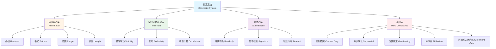
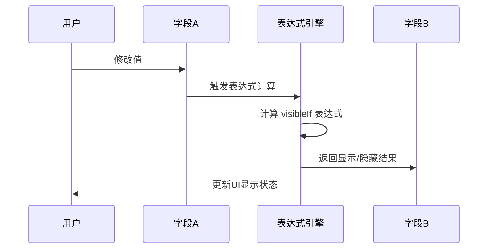
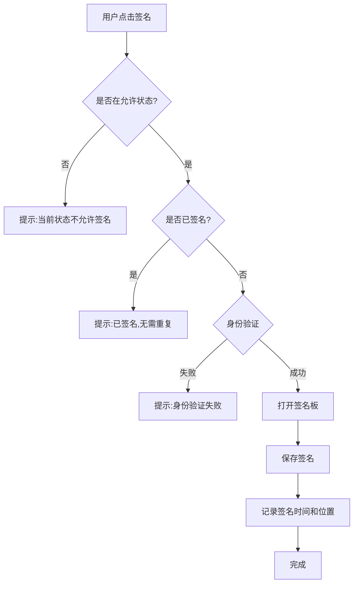
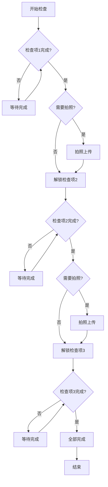
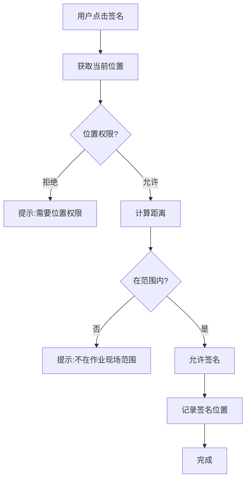
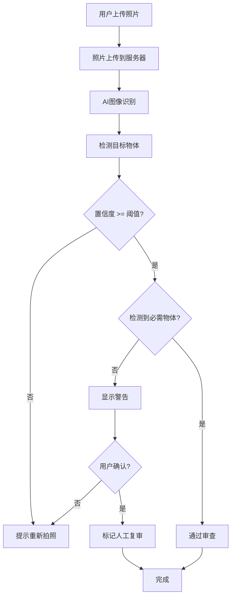

# 05 - 约束组件系统

> **本章导读**: 本章详细介绍配置端的约束组件系统,包括字段级约束、字段间依赖约束、状态约束和硬约束的设计与实现。

---

## 5.1 约束系统概览

### 5.1.1 约束的核心价值

约束系统是配置端的"安全防线",确保表单数据的准确性和合规性。

**对于企业**:
- 确保符合GB 30871等国家安全标准
- 规避法律风险和安全事故
- 提供可追溯的合规证据

**对于现场工人**:
- 像导航一样引导操作流程
- 防止漏填、错填关键信息
- 降低操作失误风险

**对于系统**:
- 获得结构化、清洗过的数据
- 降低后续数据分析难度
- 提高数据质量和可信度

### 5.1.2 约束分类体系



### 5.1.3 约束优先级

| 优先级 | 约束类型 | 可绕过 | 示例 |
|--------|---------|--------|------|
| **P0** | 硬约束 | ❌ | 强制拍照、位置锁定 |
| **P1** | 状态约束 | ❌ | 状态机控制的只读规则 |
| **P2** | 字段间依赖约束 | ❌ | 显隐联动、互斥规则 |
| **P3** | 字段级约束 | ⚠️ | 必填、格式、范围 |

---

## 5.2 字段级约束

字段级约束是最基础的约束类型,作用于单个字段。

### 5.2.1 必填约束(Required)

**约束标识**: `required`

**适用场景**:
- 作业票的核心信息(作业区域、作业时间)
- 安全关键字段(氧气浓度、气体检测结果)
- 审批流程必需字段(申请人签名、审批人签名)

**配置示例**:
```json
{
  "key": "work_zone",
  "type": "text",
  "label": "作业区域",
  "required": true,
  "errorMessage": "作业区域为必填项"
}
```

**校验时机**:
- 实时校验:用户离开字段时
- 提交校验:点击提交按钮时
- 状态转换校验:作业票状态变更时

### 5.2.2 格式约束(Pattern)

**约束标识**: `pattern`

**适用场景**:
- 手机号码格式
- 身份证号格式
- 设备编号格式
- 邮箱地址格式

**配置示例**:
```json
{
  "key": "phone",
  "type": "text",
  "label": "联系电话",
  "required": true,
  "pattern": "^1[3-9]\\d{9}$",
  "errorMessage": "请输入正确的手机号码"
}
```

**常用正则表达式**:
```json
{
  "手机号": "^1[3-9]\\d{9}$",
  "身份证": "^[1-9]\\d{5}(18|19|20)\\d{2}(0[1-9]|1[0-2])(0[1-9]|[12]\\d|3[01])\\d{3}[\\dXx]$",
  "邮箱": "^[a-zA-Z0-9._%+-]+@[a-zA-Z0-9.-]+\\.[a-zA-Z]{2,}$",
  "设备编号": "^[A-Z]{2}\\d{6}$"
}
```

### 5.2.3 范围约束(Range)

**约束标识**: `min` / `max`

**适用场景**:
- 氧气浓度范围(18%-23.5%)
- 作业高度范围(0-100米)
- 作业人数范围(1-50人)
- 温度、压力等物理量范围

**配置示例**:
```json
{
  "key": "oxygen_level",
  "type": "number",
  "label": "氧气浓度 (%)",
  "required": true,
  "min": 19.5,
  "max": 23.5,
  "errorMessage": "氧气浓度必须在19.5-23.5%之间"
}
```

**范围校验逻辑**:
```javascript
function validateRange(value, min, max) {
  if (min !== undefined && value < min) {
    return `值不能小于${min}`
  }
  if (max !== undefined && value > max) {
    return `值不能大于${max}`
  }
  return null // 校验通过
}
```

### 5.2.4 长度约束(Length)

**约束标识**: `minLength` / `maxLength`

**适用场景**:
- 作业内容描述(最少10字,最多500字)
- 风险分析说明(最少20字)
- 备注信息(最多200字)
- 设备名称(最多50字)

**配置示例**:
```json
{
  "key": "work_content",
  "type": "textarea",
  "label": "作业内容",
  "required": true,
  "minLength": 10,
  "maxLength": 500,
  "errorMessage": "作业内容长度必须在10-500个字符之间"
}
```

---

## 5.3 字段间依赖约束

字段间依赖约束定义了多个字段之间的关联关系。

### 5.3.1 显隐联动(Visibility)

**约束标识**: `visibleIf`

**适用场景**:
- 高度超过2米时显示安全带类型选择
- 受限空间作业时显示气体检测记录
- 动火作业时显示动火等级选择
- 特殊作业时显示额外审批字段

**配置示例**:
```json
{
  "key": "safety_belt_type",
  "type": "select",
  "label": "安全带类型",
  "visibleIf": "data.height > 2",
  "options": [
    {"label": "全身式安全带", "value": "full_body"},
    {"label": "半身式安全带", "value": "half_body"}
  ],
  "errorMessage": "请选择安全带类型"
}
```

**复杂显隐条件**:
```json
{
  "key": "special_approval",
  "type": "text",
  "label": "特殊审批",
  "visibleIf": "data.work_level === 'special' && data.risk_score > 70",
  "required": true
}
```

**显隐联动流程**:


### 5.3.2 互斥约束(Exclusivity)

**约束标识**: `exclusiveWith`

**适用场景**:
- "无需动火"与"动火等级"互斥
- "无需进入受限空间"与"受限空间类型"互斥
- "无需高处作业"与"作业高度"互斥

**配置示例**:
```json
{
  "key": "no_hot_work",
  "type": "checkbox",
  "label": "无需动火",
  "exclusiveWith": ["hot_work_level"],
  "onCheck": {
    "action": "clear",
    "targets": ["hot_work_level"]
  }
}
```

**互斥逻辑实现**:
```javascript
function handleExclusivity(field, exclusiveFields, formData) {
  if (formData[field.key]) {
    // 当前字段被选中,清空互斥字段
    exclusiveFields.forEach(targetKey => {
      formData[targetKey] = null
    })
  }
}
```

### 5.3.3 动态计算(Calculation)

**约束标识**: `formula`

**适用场景**:
- 风险评分 = L × E × C
- 作业时长 = 结束时间 - 开始时间
- 总费用 = 单价 × 数量
- 人员总数 = 作业人员 + 监护人员

**配置示例**:
```json
{
  "key": "risk_score",
  "type": "calculated",
  "label": "风险评分",
  "formula": "data.L * data.E * data.C",
  "readonly": true,
  "precision": 0
}
```

**复杂计算示例**:
```json
{
  "key": "work_duration",
  "type": "calculated",
  "label": "作业时长(小时)",
  "formula": "(new Date(data.end_time) - new Date(data.start_time)) / (1000 * 60 * 60)",
  "readonly": true,
  "precision": 1
}
```

---

## 5.4 状态约束

状态约束基于作业票的状态机,控制字段在不同状态下的行为。

### 5.4.1 只读切换(Readonly)

**约束标识**: `readonlyIf`

**适用场景**:
- 草稿状态:所有字段可编辑
- 核查状态:基础信息只读,检测数据可编辑
- 执行状态:基础信息和检测数据只读,监护记录可编辑
- 关闭状态:所有字段只读

**配置示例**:
```json
{
  "key": "work_zone",
  "type": "text",
  "label": "作业区域",
  "required": true,
  "readonlyIf": "state !== 'Draft'"
}
```

**状态与字段权限矩阵**:
```json
{
  "fieldPermissions": {
    "Draft": {
      "work_zone": "editable",
      "work_time": "editable",
      "gas_detection": "hidden"
    },
    "Verify": {
      "work_zone": "readonly",
      "work_time": "readonly",
      "gas_detection": "editable"
    },
    "Executing": {
      "work_zone": "readonly",
      "work_time": "readonly",
      "gas_detection": "readonly",
      "patrol_records": "editable"
    },
    "Closed": {
      "*": "readonly"
    }
  }
}
```

### 5.4.2 签名校验(Signature)

**约束标识**: `signatureRequired`

**适用场景**:
- 申请人签名(Draft → Verify)
- 安全员签名(Verify → Executing)
- 监护人签名(Executing → Closed)
- 审批人签名(各审批节点)

**配置示例**:
```json
{
  "key": "applicant_signature",
  "type": "signature",
  "label": "申请人签名",
  "required": true,
  "constraints": {
    "signatureRequired": true,
    "verifyIdentity": true,
    "allowedStates": ["Draft"],
    "errorMessage": "请完成申请人签名"
  }
}
```

**签名校验流程**:


### 5.4.3 时效约束(Timeout)

**约束标识**: `timeout`

**适用场景**:
- 作业票有效期(24小时)
- 气体检测有效期(4小时)
- 审批超时提醒(2小时)
- 作业超时预警(按计划时长)

**配置示例**:
```json
{
  "key": "gas_detection_time",
  "type": "datetime",
  "label": "气体检测时间",
  "required": true,
  "constraints": {
    "timeout": {
      "duration": 4,
      "unit": "hours",
      "action": "warn",
      "message": "气体检测已超过4小时,请重新检测"
    }
  }
}
```

**时效校验逻辑**:
```javascript
function checkTimeout(field, formData) {
  const detectionTime = new Date(formData[field.key])
  const now = new Date()
  const diffHours = (now - detectionTime) / (1000 * 60 * 60)

  if (diffHours > field.constraints.timeout.duration) {
    return {
      valid: false,
      message: field.constraints.timeout.message
    }
  }
  return { valid: true }
}
```

---

## 5.5 硬约束(不可绕过)

硬约束是最高优先级的约束,无法通过任何方式绕过。

### 5.5.1 强制拍照(Camera Only)

**约束标识**: `source: "camera_only"`

**适用场景**:
- 现场环境照片
- 作业过程照片
- 安全措施照片
- 完工验收照片

**配置示例**:
```json
{
  "key": "site_photos",
  "type": "image_upload",
  "label": "现场照片",
  "required": true,
  "constraints": {
    "hardConstraints": {
      "source": "camera_only",
      "minCount": 3,
      "watermark": true,
      "geoTag": true,
      "errorMessage": "必须现场拍照,不允许从相册选择"
    }
  }
}
```

**强制拍照实现**:
```javascript
function enforceCameraOnly(field, file) {
  // 检查文件来源
  if (file.source !== 'camera') {
    return {
      valid: false,
      message: field.constraints.hardConstraints.errorMessage
    }
  }

  // 检查水印
  if (field.constraints.hardConstraints.watermark && !file.hasWatermark) {
    return {
      valid: false,
      message: '照片必须包含时间和位置水印'
    }
  }

  // 检查地理标签
  if (field.constraints.hardConstraints.geoTag && !file.geoTag) {
    return {
      valid: false,
      message: '照片必须包含地理位置信息'
    }
  }

  return { valid: true }
}
```

**水印生成**:
```javascript
function generateWatermark(photo, location, timestamp) {
  return {
    text: `${timestamp} | ${location.latitude}, ${location.longitude}`,
    position: 'bottom-right',
    fontSize: 12,
    color: '#FFFFFF',
    backgroundColor: 'rgba(0, 0, 0, 0.6)'
  }
}
```

### 5.5.2 分步确认(Sequential Checklist)

**约束标识**: `sequential: true`

**适用场景**:
- 安全措施逐项确认
- 设备检查清单
- 作业前准备事项
- 关键步骤验证

**配置示例**:
```json
{
  "key": "safety_checklist",
  "type": "checklist",
  "label": "安全措施确认",
  "required": true,
  "constraints": {
    "hardConstraints": {
      "sequential": true,
      "requirePhoto": true,
      "items": [
        {
          "id": "check_1",
          "label": "确认作业区域已隔离",
          "required": true,
          "photoRequired": true
        },
        {
          "id": "check_2",
          "label": "确认消防器材已到位",
          "required": true,
          "photoRequired": true,
          "dependsOn": "check_1"
        },
        {
          "id": "check_3",
          "label": "确认监护人已到岗",
          "required": true,
          "photoRequired": false,
          "dependsOn": "check_2"
        }
      ],
      "errorMessage": "必须按顺序完成所有安全措施确认"
    }
  }
}
```

**分步确认流程**:


**分步确认逻辑**:
```javascript
function validateSequentialChecklist(field, formData) {
  const items = field.constraints.hardConstraints.items
  const completedItems = formData[field.key] || []

  for (let i = 0; i < items.length; i++) {
    const item = items[i]
    const completed = completedItems.find(c => c.id === item.id)

    // 检查依赖项
    if (item.dependsOn) {
      const dependency = completedItems.find(c => c.id === item.dependsOn)
      if (!dependency) {
        return {
          valid: false,
          message: `请先完成: ${items.find(it => it.id === item.dependsOn).label}`
        }
      }
    }

    // 检查必填项
    if (item.required && !completed) {
      return {
        valid: false,
        message: `请完成: ${item.label}`
      }
    }

    // 检查照片要求
    if (item.photoRequired && completed && !completed.photo) {
      return {
        valid: false,
        message: `${item.label} 需要上传照片`
      }
    }
  }

  return { valid: true }
}
```

### 5.5.3 位置锁定(Geo-fencing)

**约束标识**: `geoFencing`

**适用场景**:
- 限制作业票只能在指定区域填写
- 现场签名位置验证
- 作业区域范围控制
- 防止远程代签

**配置示例**:
```json
{
  "key": "on_site_signature",
  "type": "signature",
  "label": "现场签名",
  "required": true,
  "constraints": {
    "hardConstraints": {
      "geoFencing": {
        "enabled": true,
        "center": [121.47, 31.23],
        "radius": 100,
        "unit": "meters",
        "errorMessage": "必须在作业现场100米范围内签名"
      }
    }
  }
}
```

**位置锁定流程**:


**位置验证逻辑**:
```javascript
function validateGeoFencing(field, userLocation) {
  const geoFencing = field.constraints.hardConstraints.geoFencing

  if (!geoFencing.enabled) {
    return { valid: true }
  }

  // 计算距离(使用Haversine公式)
  const distance = calculateDistance(
    userLocation.latitude,
    userLocation.longitude,
    geoFencing.center[1],
    geoFencing.center[0]
  )

  if (distance > geoFencing.radius) {
    return {
      valid: false,
      message: geoFencing.errorMessage,
      distance: Math.round(distance)
    }
  }

  return { valid: true }
}

function calculateDistance(lat1, lon1, lat2, lon2) {
  const R = 6371e3 // 地球半径(米)
  const φ1 = lat1 * Math.PI / 180
  const φ2 = lat2 * Math.PI / 180
  const Δφ = (lat2 - lat1) * Math.PI / 180
  const Δλ = (lon2 - lon1) * Math.PI / 180

  const a = Math.sin(Δφ/2) * Math.sin(Δφ/2) +
            Math.cos(φ1) * Math.cos(φ2) *
            Math.sin(Δλ/2) * Math.sin(Δλ/2)
  const c = 2 * Math.atan2(Math.sqrt(a), Math.sqrt(1-a))

  return R * c // 返回距离(米)
}
```

### 5.5.4 AI审查(AI Review)

**约束标识**: `aiReview`

**适用场景**:
- 现场照片智能识别(安全帽、灭火器)
- 作业内容合规性检查
- 风险描述完整性分析
- 异常情况自动预警

**配置示例**:
```json
{
  "key": "site_safety_photos",
  "type": "image_upload",
  "label": "现场安全照片",
  "required": true,
  "constraints": {
    "hardConstraints": {
      "source": "camera_only",
      "minCount": 3,
      "aiReview": {
        "enabled": true,
        "detectObjects": ["safety_helmet", "fire_extinguisher", "warning_sign"],
        "minConfidence": 0.8,
        "requireAll": false,
        "errorMessage": "照片中未检测到必要的安全设施"
      }
    }
  }
}
```

**AI审查流程**:


**AI审查逻辑**:
```javascript
async function performAIReview(field, photo) {
  const aiReview = field.constraints.hardConstraints.aiReview

  if (!aiReview.enabled) {
    return { valid: true }
  }

  // 调用AI识别服务
  const detectionResult = await detectObjects(photo, aiReview.detectObjects)

  // 过滤低置信度结果
  const validDetections = detectionResult.filter(
    d => d.confidence >= aiReview.minConfidence
  )

  // 检查是否检测到所有必需物体
  if (aiReview.requireAll) {
    const missingObjects = aiReview.detectObjects.filter(
      obj => !validDetections.some(d => d.label === obj)
    )

    if (missingObjects.length > 0) {
      return {
        valid: false,
        message: aiReview.errorMessage,
        missingObjects: missingObjects,
        detectedObjects: validDetections
      }
    }
  }

  return {
    valid: true,
    detectedObjects: validDetections
  }
}
```

**AI识别结果示例**:
```json
{
  "photoId": "photo_001",
  "detections": [
    {
      "label": "safety_helmet",
      "confidence": 0.95,
      "boundingBox": [120, 80, 200, 180]
    },
    {
      "label": "fire_extinguisher",
      "confidence": 0.88,
      "boundingBox": [350, 200, 420, 350]
    },
    {
      "label": "warning_sign",
      "confidence": 0.92,
      "boundingBox": [50, 50, 150, 120]
    }
  ],
  "reviewStatus": "passed",
  "timestamp": "2026-03-12 14:30:00"
}
```

---

### 5.5.5 环境准入闸门(Environment Gate)

**约束标识**: `environmentGate`

> 详细设计见 [13 - 环境准入闸门设计](./13-环境准入闸门设计.md)

**适用场景**:
- 审批通过后、正式开工前的环境准入检查
- 气体检测 → 人员核验 → 安全措施确认 → 准入决策的四步原子化流程
- `Approved → Executing` 状态转换的强制闸门

**约束特性**:
- 四步串行不可跳过（复合 `sequential` + `geoFencing` + `camera_only`）
- 气体检测30分钟时效（前端倒计时 + 后端 `DATE_DIFF` 双重校验）
- 角色绑定签名（检测人员需持检测资质,准入决策需指定监护人）
- 自动阻断（气体超标/时效过期/资质不符时自动锁定闸门）

**配置示例**:
```json
{
  "key": "environment_gate",
  "type": "environment_gate",
  "constraints": {
    "hardConstraints": {
      "environmentGate": {
        "enabled": true,
        "steps": ["gas_detection", "personnel_verification", "safety_checklist", "admission_control"],
        "sequential": true,
        "gasValidityMinutes": 30,
        "geoFenceRequired": true,
        "geoFenceRadius": 100,
        "autoBlockConditions": [
          { "field": "gas_oxygen", "condition": "< 19.5 || > 23.5" },
          { "field": "gas_combustible", "condition": "> 0.5" }
        ],
        "roleBinding": {
          "gas_detection": ["detector"],
          "admission_control": ["supervisor"]
        }
      }
    }
  }
}
```

**校验逻辑**:
```typescript
// 环境准入闸门校验（状态转换前置条件）
function validateEnvironmentGate(data: FormData): ValidationResult {
  // 1. 气体检测合格
  if (data.gas_detection_status !== 'passed') {
    return { valid: false, message: '气体检测未通过' }
  }
  // 2. 检测时效校验（30分钟）
  if (!GAS_VALID(data.gas_detected_at, 30)) {
    return { valid: false, message: '气体检测已超过30分钟有效期，请重新检测' }
  }
  // 3. 人员核验通过
  if (!data.personnel_verified) {
    return { valid: false, message: '人员资质核验未完成' }
  }
  // 4. 安全措施确认
  if (!data.safety_checklist_complete) {
    return { valid: false, message: '安全措施确认未完成' }
  }
  // 5. 监护人准入决策
  if (data.admission_decision !== 'allowed') {
    return { valid: false, message: '监护人未允许准入' }
  }
  return { valid: true }
}
```

---

## 5.6 约束配置界面设计

### 5.6.1 约束配置面板

**位置**: 右侧属性面板的"约束规则"折叠区

**界面布局**:
```
┌─────────────────────────┐
│ 约束规则                │
├─────────────────────────┤
│ 字段级约束              │
│ ☑️ 必填                 │
│ ☐ 只读                  │
│ ┌─────────────────────┐ │
│ │ 最小值              │ │
│ │ 18                  │ │
│ └─────────────────────┘ │
│ ┌─────────────────────┐ │
│ │ 最大值              │ │
│ │ 23.5                │ │
│ └─────────────────────┘ │
├─────────────────────────┤
│ 字段间依赖约束          │
│ ┌─────────────────────┐ │
│ │ 显示条件            │ │
│ │ [配置表达式]        │ │
│ └─────────────────────┘ │
│ ┌─────────────────────┐ │
│ │ 互斥字段            │ │
│ │ [选择字段]          │ │
│ └─────────────────────┘ │
├─────────────────────────┤
│ 硬约束(不可绕过)        │
│ ☑️ 强制拍照             │
│ ☑️ 位置锁定             │
│ ☐ AI审查                │
└─────────────────────────┘
```

### 5.6.2 表达式编辑器

**简单模式**:
- 可视化条件构建器
- 下拉选择字段、运算符、值
- 支持AND/OR逻辑组合

**高级模式**:
- 代码编辑器
- 语法高亮
- 实时语法检查
- 智能提示

### 5.6.3 约束测试工具

**功能**:
- 模拟数据输入
- 实时约束验证
- 错误信息预览
- 边界条件测试

---

## 5.7 本章小结

本章详细介绍了配置端的约束组件系统,要点包括:

1. **约束分类**: 4种约束类型(字段级、字段间依赖、状态、硬约束),优先级从P3到P0
2. **字段级约束**: 必填、格式、范围、长度等基础约束
3. **字段间依赖约束**: 显隐联动、互斥、动态计算等关联逻辑
4. **状态约束**: 只读切换、签名校验、时效约束等状态相关规则
5. **硬约束**: 强制拍照、分步确认、位置锁定、AI审查、环境准入闸门等不可绕过的约束
6. **配置界面**: 约束配置面板、表达式编辑器、约束测试工具

**下一章**: [06 - 用户工作流](./06-用户工作流.md) - 详细介绍Design/Deployment/Execution三阶段的用户工作流程。

---

**相关文档**:
- [02-核心概念](./02-核心概念.md)
- [04-组件库设计](./04-组件库设计.md)
- [07-状态机设计](./07-状态机设计.md)
- [13-环境准入闸门设计](./13-环境准入闸门设计.md)