# 06 - 用户工作流

> **本章导读**: 本章详细介绍配置端的完整用户工作流，涵盖设计阶段(Design Phase)、部署阶段(Deployment Phase)和执行阶段(Execution Phase)三个核心阶段。

---

## 6.1 工作流全景图

### 6.1.1 三阶段工作流模型

配置端采用"设计-部署-执行"三阶段工作流模型，实现从表单配置到现场使用的完整闭环。

```mermaid
flowchart LR
    subgraph "Phase 1: Design 设计阶段"
        D1[选择模板] --> D2[配置字段]
        D2 --> D3[编排布局]
        D3 --> D4[设置规则]
        D4 --> D5[预览测试]
    end

    subgraph "Phase 2: Deployment 部署阶段"
        P1[版本管理] --> P2[灰度发布]
        P2 --> P3[权限分配]
        P3 --> P4[上线生效]
    end

    subgraph "Phase 3: Execution 执行阶段"
        E1[扫码拉取] --> E2[动态渲染]
        E2 --> E3[填写提交]
        E3 --> E4[校验拦截]
        E4 --> E5[数据沉淀]
    end

    D5 -->|保存配置| P1
    P4 -->|发布上线| E1

    style D1 fill:#e1f5ff
    style P1 fill:#fff4e6
    style E1 fill:#e8f5e9
```

### 6.1.2 角色与职责

| 角色 | 主要职责 | 使用阶段 | 典型用户 |
|------|---------|---------|---------|
| **配置管理员** | 设计表单、配置规则、发布版本 | Design + Deployment | 安全主管、系统管理员 |
| **审批人员** | 审核配置变更、批准上线 | Deployment | 部门经理、安全总监 |
| **现场操作员** | 填写作业票、执行作业 | Execution | 作业人员、班组长 |
| **监护人员** | 监督作业、确认安全措施 | Execution | 安全员、监护人 |

---

## 6.2 Design Phase（设计阶段）

设计阶段是配置管理员在Low-Code Builder中完成表单设计的过程。

### 6.2.1 模板选择流程

**步骤1: 进入模板库**

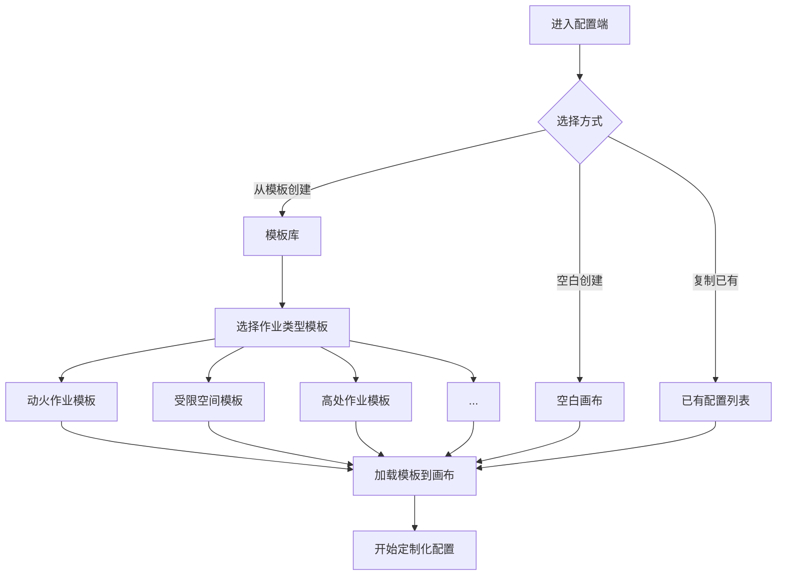

**8种标准模板**:

| 模板名称 | 预置字段数 | 预置规则数 | 适用场景 |
|---------|-----------|-----------|---------|
| 动火作业模板 | 45 | 12 | 焊接、切割、明火作业 |
| 受限空间作业模板 | 52 | 18 | 罐体、管道、密闭空间 |
| 盲板抽堵作业模板 | 38 | 10 | 管道隔离、盲板操作 |
| 高处作业模板 | 35 | 8 | 2米以上高空作业 |
| 吊装作业模板 | 42 | 11 | 起重机、吊车作业 |
| 临时用电作业模板 | 30 | 9 | 临时电源接入 |
| 动土作业模板 | 28 | 7 | 挖掘、破土作业 |
| 断路作业模板 | 25 | 6 | 道路封闭、交通管制 |

### 6.2.2 字段配置流程

**步骤2: 添加和配置字段**

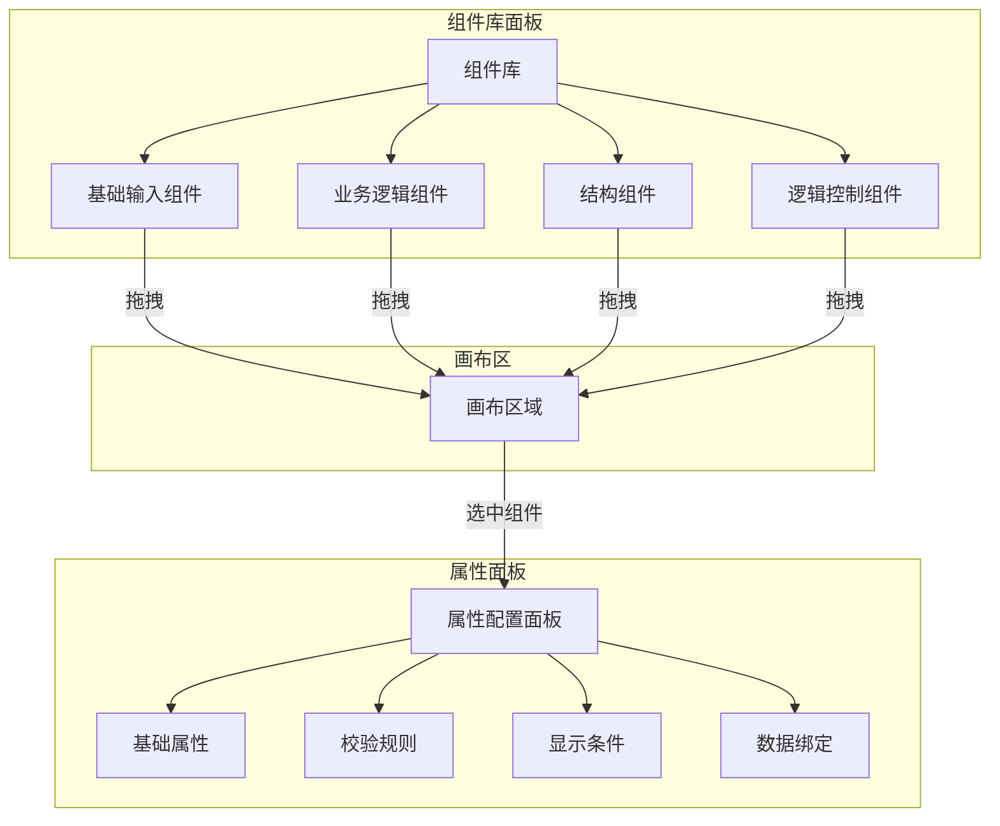

**字段配置要素**:

| 配置项 | 说明 | 示例 |
|-------|------|------|
| **字段标识** | 唯一key，用于数据存储 | `gas_oxygen_level` |
| **显示名称** | 用户看到的标签 | "氧气浓度 (%)" |
| **字段类型** | 输入控件类型 | number、text、select |
| **默认值** | 初始填充值 | `21.0` |
| **占位提示** | 输入框内提示文字 | "请输入18-23.5之间的数值" |
| **帮助文本** | 字段下方说明 | "正常大气氧气浓度约为21%" |

### 6.2.3 布局编排流程

**步骤3: 组织字段布局**

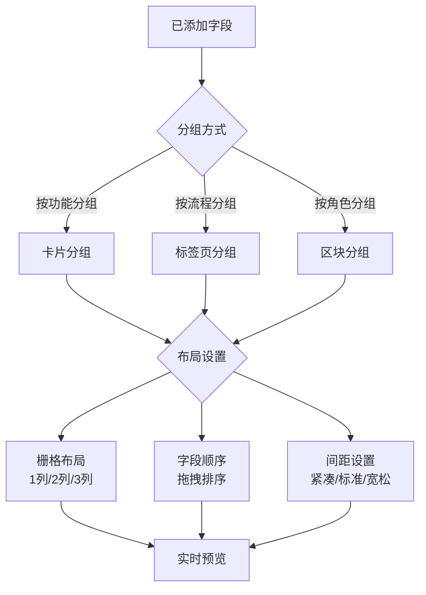

**布局配置示例**:

```json
{
  "layout": [
    {
      "type": "card",
      "title": "基础信息",
      "icon": "info-circle",
      "collapsible": false,
      "children": ["permit_no", "work_zone", "work_time_start", "work_time_end"],
      "grid": { "cols": 2, "gap": 16 }
    },
    {
      "type": "card",
      "title": "安全检测",
      "icon": "safety",
      "collapsible": true,
      "defaultCollapsed": false,
      "children": ["gas_oxygen", "gas_combustible", "gas_toxic"],
      "grid": { "cols": 3, "gap": 12 }
    },
    {
      "type": "card",
      "title": "审批签名",
      "icon": "edit",
      "children": ["applicant_sign", "supervisor_sign", "safety_sign"],
      "grid": { "cols": 1, "gap": 24 }
    }
  ]
}
```

### 6.2.4 规则配置流程

**步骤4: 设置业务规则**

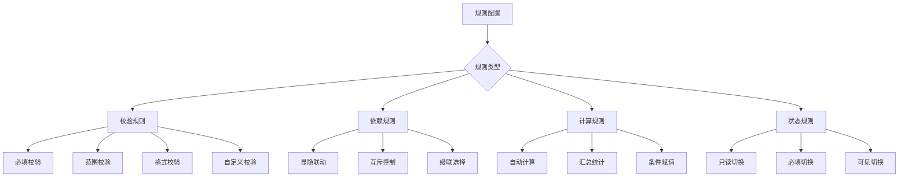

**规则配置界面设计**:

| 规则类型 | 配置方式 | 用户体验 |
|---------|---------|---------|
| **简单规则** | 下拉选择 + 输入框 | 选择"必填"，输入错误提示 |
| **条件规则** | 可视化条件构建器 | 拖拽字段，选择运算符，输入值 |
| **复杂规则** | 表达式编辑器 | 支持语法高亮、自动补全 |
| **高级规则** | 代码模式(可选) | 面向开发人员的扩展能力 |

**条件构建器示例**:

```
当 [作业类型] 等于 [动火作业]
  且 [动火等级] 等于 [特级动火]
则 显示 [特级动火审批区块]
  且 设置 [安全总监签名] 为必填
```

### 6.2.5 预览测试流程

**步骤5: 验证配置效果**

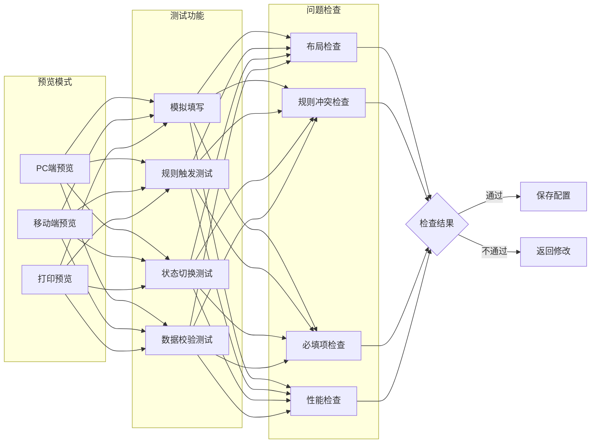

**预览检查清单**:

- [ ] 所有字段正确显示
- [ ] 必填标记清晰可见
- [ ] 条件显隐正常工作
- [ ] 校验规则正确触发
- [ ] 移动端布局适配良好
- [ ] 打印格式符合要求

---

## 6.3 Deployment Phase（部署阶段）

部署阶段负责将设计好的表单配置安全地发布到生产环境。

### 6.3.1 版本管理

**版本控制机制**:

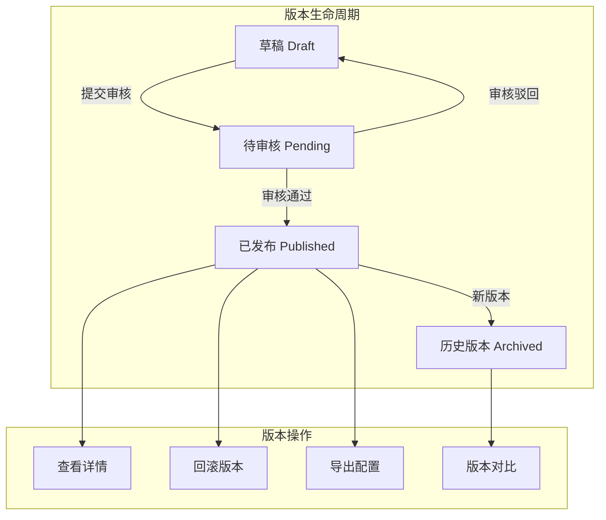

**版本信息结构**:

| 字段 | 说明 | 示例 |
|------|------|------|
| **版本号** | 语义化版本 | v2.1.0 |
| **版本标题** | 变更摘要 | "新增特级动火审批流程" |
| **变更说明** | 详细变更内容 | 新增字段3个，修改规则2条 |
| **创建人** | 配置管理员 | 张三 |
| **创建时间** | 版本创建时间 | 2026-03-12 14:30 |
| **审核人** | 审批人员 | 李四 |
| **审核时间** | 审批通过时间 | 2026-03-12 16:00 |
| **生效范围** | 适用组织/项目 | 全公司 / 华东项目部 |

### 6.3.2 灰度发布

**灰度发布策略**:

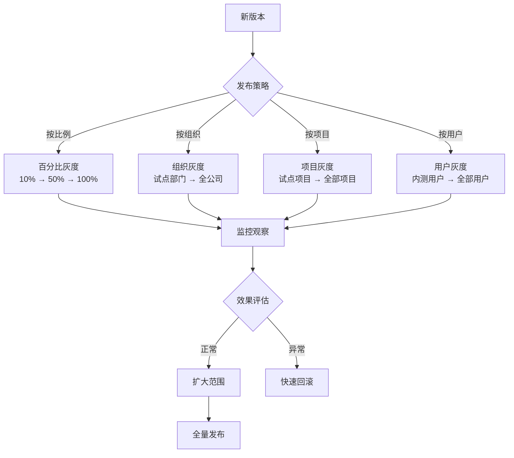

**灰度发布配置**:

```json
{
  "grayRelease": {
    "enabled": true,
    "strategy": "organization",
    "rules": [
      {
        "phase": 1,
        "name": "试点阶段",
        "scope": ["org_001", "org_002"],
        "startTime": "2026-03-15 00:00",
        "duration": "7d"
      },
      {
        "phase": 2,
        "name": "扩展阶段",
        "scope": ["region_east"],
        "startTime": "2026-03-22 00:00",
        "duration": "7d"
      },
      {
        "phase": 3,
        "name": "全量阶段",
        "scope": ["all"],
        "startTime": "2026-03-29 00:00"
      }
    ],
    "rollbackTrigger": {
      "errorRate": 0.05,
      "responseTime": 3000
    }
  }
}
```

### 6.3.3 权限分配

**权限模型**:

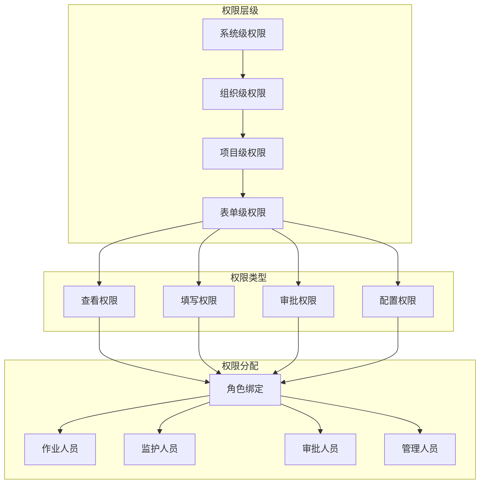

**权限配置矩阵**:

| 角色 | 查看 | 填写 | 审批 | 配置 | 发布 |
|------|:----:|:----:|:----:|:----:|:----:|
| 作业人员 | ✅ | ✅ | ❌ | ❌ | ❌ |
| 监护人员 | ✅ | ✅ | ✅ | ❌ | ❌ |
| 班组长 | ✅ | ✅ | ✅ | ❌ | ❌ |
| 安全主管 | ✅ | ✅ | ✅ | ✅ | ❌ |
| 系统管理员 | ✅ | ✅ | ✅ | ✅ | ✅ |

---

## 6.4 Execution Phase（执行阶段）

执行阶段是现场人员使用配置好的表单进行作业票填写和审批的过程。

### 6.4.1 扫码拉取

**表单获取流程**:

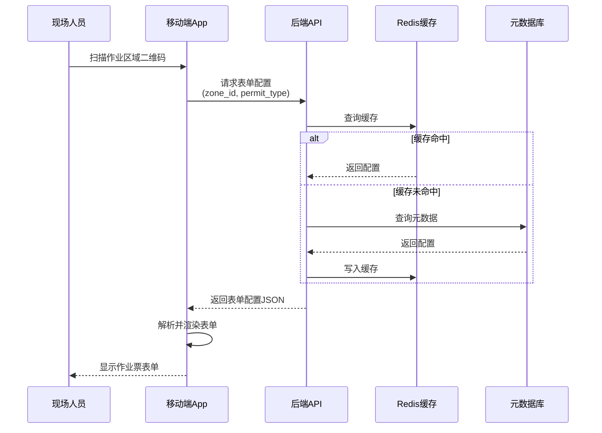

**离线模式支持**:

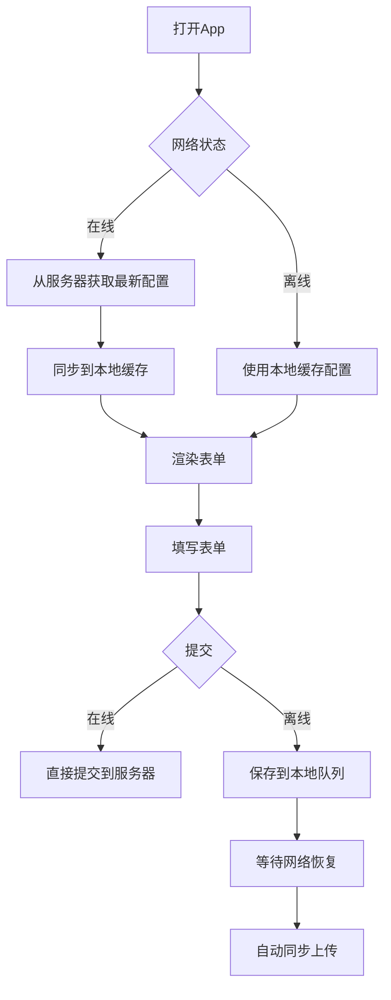

### 6.4.2 动态渲染

**渲染流程**:

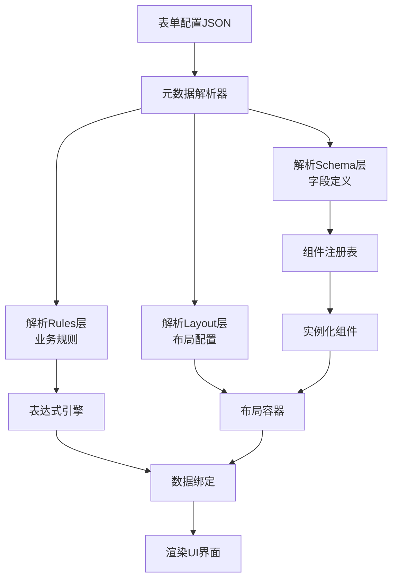

**渲染性能优化**:

| 优化策略 | 说明 | 效果 |
|---------|------|------|
| **懒加载** | 非可视区域组件延迟加载 | 首屏渲染时间减少40% |
| **虚拟滚动** | 长列表使用虚拟滚动 | 内存占用减少60% |
| **组件缓存** | 已渲染组件实例缓存 | 切换标签页无需重渲染 |
| **增量更新** | 仅更新变化的组件 | 交互响应时间<100ms |

### 6.4.3 校验拦截

**校验流程**:

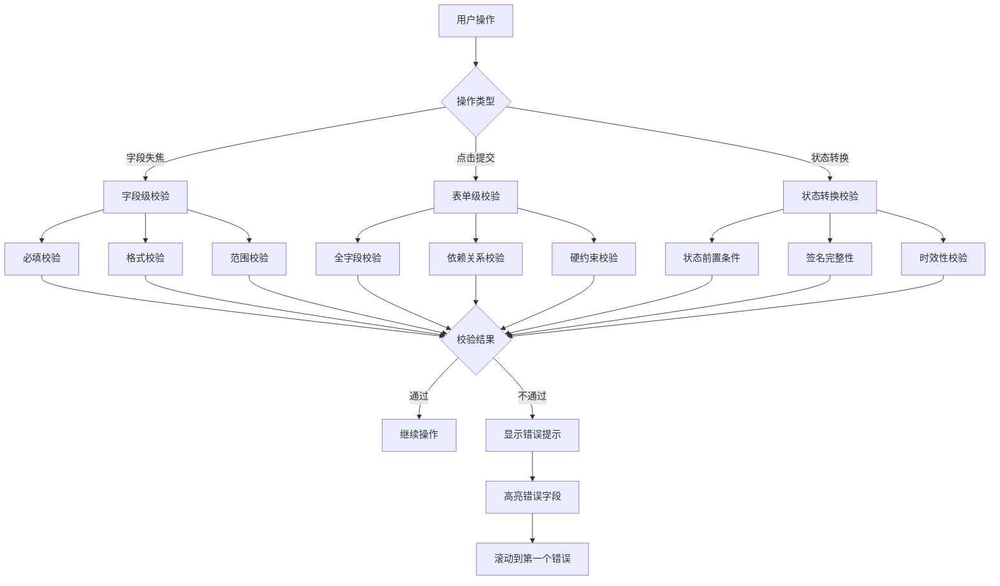

**校验错误展示**:

```json
{
  "validationErrors": [
    {
      "field": "gas_oxygen",
      "message": "氧气浓度必须在18-23.5%之间",
      "type": "range",
      "severity": "error"
    },
    {
      "field": "supervisor_sign",
      "message": "监护人签名不能为空",
      "type": "required",
      "severity": "error"
    },
    {
      "field": "work_time_end",
      "message": "建议作业时长不超过4小时",
      "type": "warning",
      "severity": "warning"
    }
  ]
}
```

### 6.4.4 数据沉淀

**数据存储流程**:

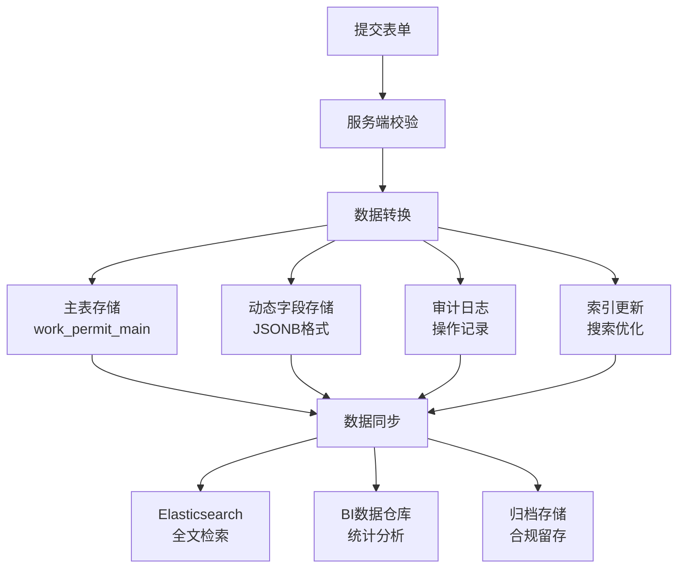

**数据沉淀结构**:

```json
{
  "permit_id": "PTW-2026-0312-001",
  "permit_type": "hot_work",
  "status": "executing",
  "created_at": "2026-03-12T08:30:00Z",
  "updated_at": "2026-03-12T14:20:00Z",
  "static_fields": {
    "work_zone": "A区储罐区",
    "work_content": "管道焊接作业"
  },
  "dynamic_fields": {
    "gas_oxygen": 20.8,
    "gas_combustible": 0.2,
    "fire_level": "special",
    "safety_measures": ["灭火器", "消防水带", "防火毯"]
  },
  "signatures": {
    "applicant": { "user_id": "U001", "time": "2026-03-12T08:30:00Z", "image": "..." },
    "supervisor": { "user_id": "U002", "time": "2026-03-12T09:00:00Z", "image": "..." }
  },
  "attachments": [
    { "type": "photo", "url": "...", "timestamp": "2026-03-12T08:35:00Z" }
  ],
  "audit_trail": [
    { "action": "create", "user": "U001", "time": "2026-03-12T08:30:00Z" },
    { "action": "submit", "user": "U001", "time": "2026-03-12T08:45:00Z" },
    { "action": "approve", "user": "U002", "time": "2026-03-12T09:00:00Z" }
  ]
}
```

---

## 6.5 工作流集成

### 6.5.1 与审批流程集成

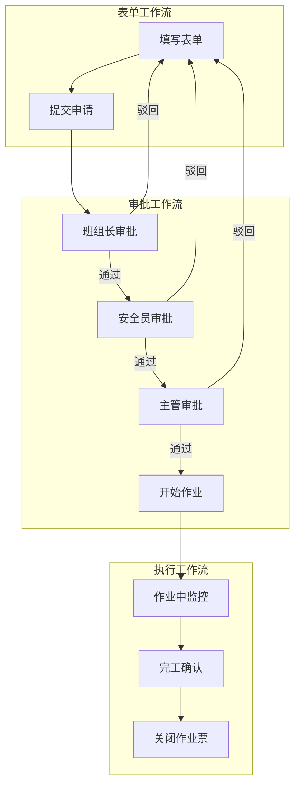

### 6.5.2 与通知系统集成

| 触发事件 | 通知对象 | 通知方式 | 通知内容 |
|---------|---------|---------|---------|
| 提交申请 | 审批人 | App推送+短信 | 新作业票待审批 |
| 审批通过 | 申请人 | App推送 | 作业票已批准 |
| 审批驳回 | 申请人 | App推送+短信 | 作业票被驳回，原因：xxx |
| 即将超时 | 作业人员 | App推送 | 作业票将在30分钟后到期 |
| 异常告警 | 监护人+安全员 | App推送+短信+语音 | 气体浓度异常，请立即处理 |

---

## 6.6 最佳实践

### 6.6.1 设计阶段最佳实践

1. **从模板开始**: 优先使用标准模板，在此基础上定制
2. **字段命名规范**: 使用有意义的英文key，如`gas_oxygen_level`
3. **分组合理**: 按业务逻辑分组，每组不超过10个字段
4. **规则简化**: 避免过于复杂的条件嵌套，保持可维护性
5. **充分测试**: 在预览模式下测试所有场景

### 6.6.2 部署阶段最佳实践

1. **版本说明清晰**: 每个版本都要有明确的变更说明
2. **灰度发布**: 重大变更必须先灰度，观察无异常再全量
3. **回滚预案**: 发布前准备好回滚方案
4. **权限最小化**: 按需分配权限，避免过度授权

### 6.6.3 执行阶段最佳实践

1. **离线准备**: 进入作业区域前预加载表单配置
2. **及时保存**: 填写过程中定期自动保存草稿
3. **错误处理**: 遇到校验错误时仔细阅读提示信息
4. **数据完整**: 确保所有必填项和签名都已完成

---

**上一章**: [05 - 约束组件系统](./05-约束组件系统.md)

**下一章**: [07 - 状态机设计](./07-状态机设计.md)
