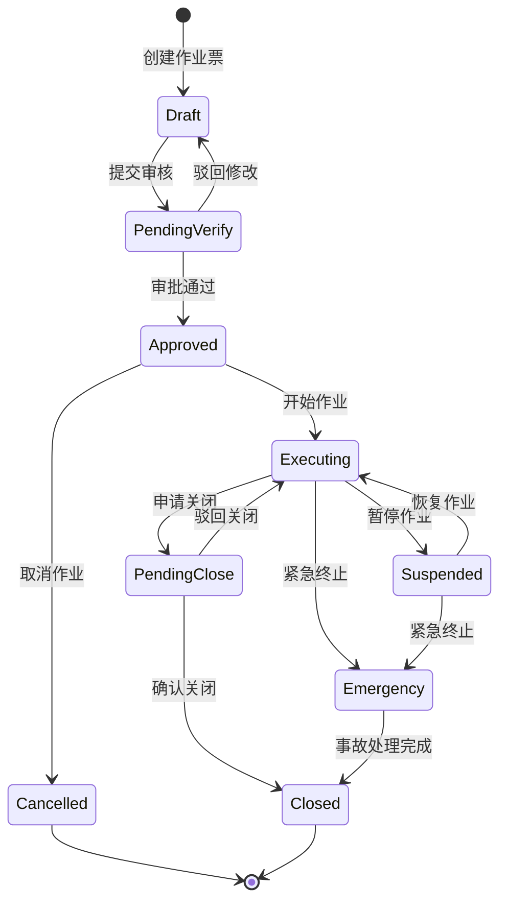
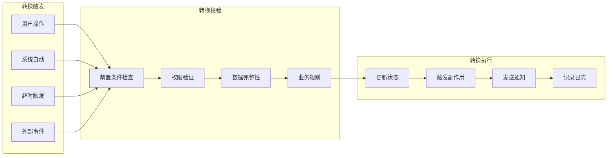
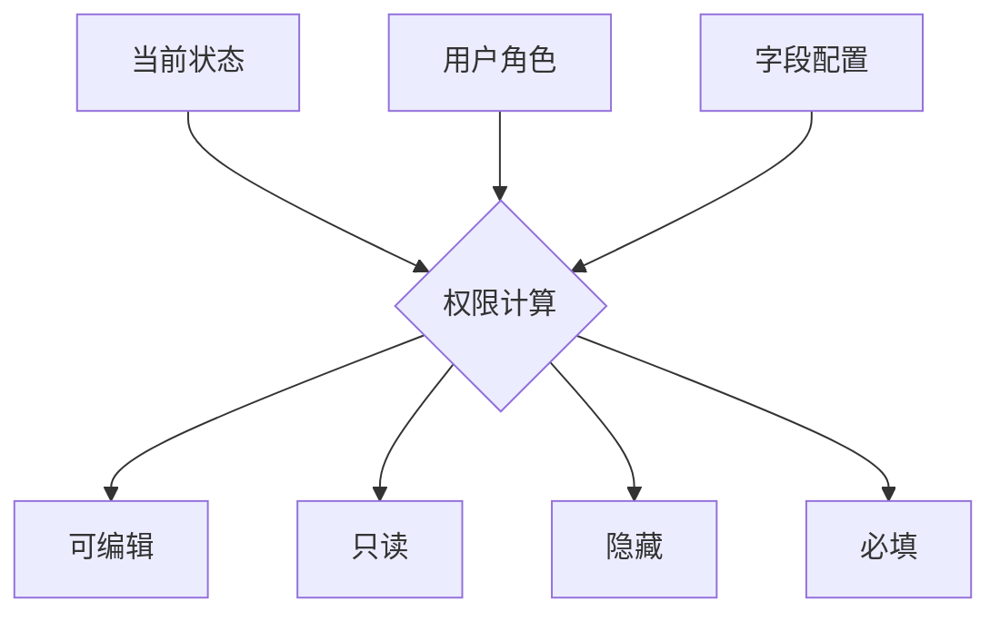
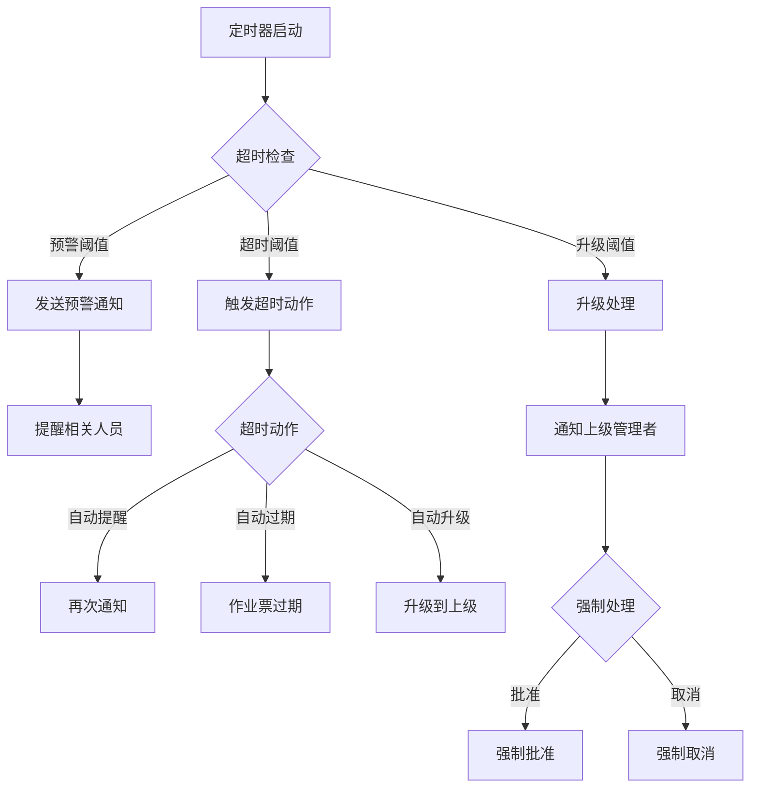
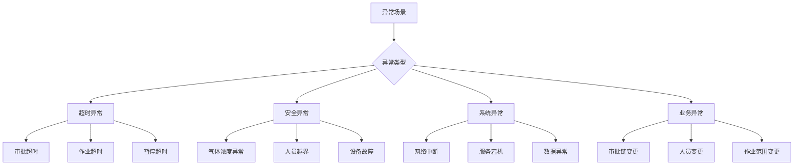
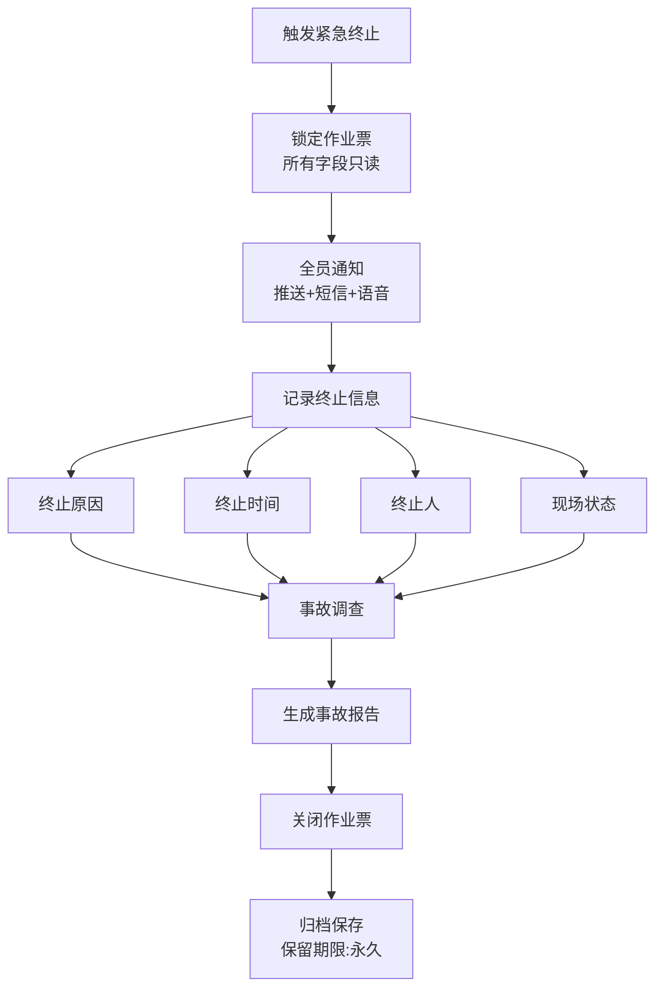

# 07 - 状态机设计

> **本章导读**: 本章详细介绍作业票的状态机设计，包括状态定义、转换规则、状态与字段权限的关联、异常状态处理等核心内容。

---

## 7.1 状态机概览

### 7.1.1 设计目标

状态机是作业票生命周期管理的核心引擎，确保：

| 目标 | 说明 | 价值 |
|------|------|------|
| **流程合规** | 严格按照审批流程推进 | 符合GB 30871安全标准 |
| **权限控制** | 不同状态下字段可编辑性不同 | 防止越权操作 |
| **数据完整** | 状态转换前强制校验 | 确保关键数据不遗漏 |
| **可追溯** | 记录每次状态变更 | 提供完整审计轨迹 |

### 7.1.2 状态全景图



---

## 7.2 状态定义

### 7.2.1 核心状态说明

| 状态 | 标识 | 中文名 | 说明 | 颜色标识 |
|------|------|--------|------|---------|
| **Draft** | `draft` | 草稿 | 作业票创建后的初始状态，可自由编辑 | 🔵 蓝色 |
| **PendingVerify** | `pending_verify` | 待审核 | 已提交，等待各级审批人审核 | 🟡 黄色 |
| **Approved** | `approved` | 已批准 | 所有审批通过，可以开始作业 | 🟢 绿色 |
| **Executing** | `executing` | 作业中 | 现场正在执行作业 | 🟠 橙色 |
| **Suspended** | `suspended` | 已暂停 | 因安全原因或其他因素暂停作业 | ⚪ 灰色 |
| **PendingClose** | `pending_close` | 待关闭 | 作业完成，等待确认关闭 | 🟡 黄色 |
| **Closed** | `closed` | 已关闭 | 作业票正常关闭，归档保存 | ⚫ 黑色 |
| **Cancelled** | `cancelled` | 已取消 | 作业票被取消，不再执行 | 🔴 红色 |
| **Emergency** | `emergency` | 紧急终止 | 因安全事故紧急终止作业 | 🔴 红色闪烁 |

### 7.2.2 状态元数据配置

```json
{
  "states": {
    "draft": {
      "label": "草稿",
      "color": "#1890ff",
      "icon": "edit",
      "editable": true,
      "deletable": true,
      "timeout": null
    },
    "pending_verify": {
      "label": "待审核",
      "color": "#faad14",
      "icon": "clock-circle",
      "editable": false,
      "deletable": false,
      "timeout": {
        "duration": "48h",
        "action": "auto_remind",
        "escalation": "24h"
      }
    },
    "approved": {
      "label": "已批准",
      "color": "#52c41a",
      "icon": "check-circle",
      "editable": false,
      "deletable": false,
      "timeout": {
        "duration": "72h",
        "action": "auto_expire",
        "warning": "12h"
      }
    },
    "executing": {
      "label": "作业中",
      "color": "#fa8c16",
      "icon": "thunderbolt",
      "editable": "partial",
      "deletable": false,
      "timeout": {
        "duration": "dynamic",
        "source": "work_time_end",
        "action": "auto_alert"
      }
    },
    "suspended": {
      "label": "已暂停",
      "color": "#8c8c8c",
      "icon": "pause-circle",
      "editable": false,
      "deletable": false,
      "timeout": {
        "duration": "24h",
        "action": "require_decision"
      }
    },
    "emergency": {
      "label": "紧急终止",
      "color": "#ff4d4f",
      "icon": "warning",
      "editable": false,
      "deletable": false,
      "priority": "critical"
    },
    "closed": {
      "label": "已关闭",
      "color": "#434343",
      "icon": "check-square",
      "editable": false,
      "deletable": false,
      "archived": true
    },
    "cancelled": {
      "label": "已取消",
      "color": "#ff4d4f",
      "icon": "close-circle",
      "editable": false,
      "deletable": false,
      "archived": true
    }
  }
}
```

---

## 7.3 状态转换规则

### 7.3.1 转换规则矩阵



### 7.3.2 转换规则详细定义

| 转换 | 触发条件 | 前置条件 | 操作角色 | 副作用 |
|------|---------|---------|---------|--------|
| Draft → PendingVerify | 用户点击"提交" | 所有必填字段已填写 | 申请人 | 通知审批人 |
| PendingVerify → Draft | 审批人点击"驳回" | 填写驳回原因 | 审批人 | 通知申请人 |
| PendingVerify → Approved | 所有审批人通过 | 各级审批签名完成 | 最终审批人 | 通知申请人+监护人 |
| Approved → Executing | 用户点击"开始作业" | 环境准入闸门通过（气体检测合格且未超时、人员核验通过、安全措施确认、监护人允许准入）详见 [13-环境准入闸门设计](./13-环境准入闸门设计.md) | 监护人 | 启动监控、通知全员 |
| Approved → Cancelled | 用户点击"取消" | 填写取消原因 | 申请人/审批人 | 通知相关人员 |
| Executing → Suspended | 用户点击"暂停" | 填写暂停原因 | 监护人/安全员 | 通知作业人员停止作业 |
| Suspended → Executing | 用户点击"恢复" | 安全条件重新确认 | 监护人/安全员 | 通知作业人员恢复作业 |
| Executing → PendingClose | 用户点击"完工" | 完工检查清单全部勾选 | 作业负责人 | 通知验收人员 |
| PendingClose → Closed | 验收人确认 | 现场验收通过 | 验收人 | 归档、统计更新 |
| Executing → Emergency | 紧急按钮/系统告警 | 无（紧急通道） | 任何人 | 全员通知、启动应急预案 |

### 7.3.3 转换规则配置

```json
{
  "transitions": [
    {
      "from": "draft",
      "to": "pending_verify",
      "trigger": "submit",
      "label": "提交审核",
      "preconditions": [
        { "type": "fields_complete", "scope": "required" },
        { "type": "expression", "expr": "data.work_time_start > NOW()" }
      ],
      "permissions": ["applicant"],
      "sideEffects": [
        { "type": "notify", "targets": ["approvers"], "template": "new_permit_review" },
        { "type": "audit_log", "action": "submit_for_review" }
      ]
    },
    {
      "from": "pending_verify",
      "to": "approved",
      "trigger": "approve",
      "label": "审批通过",
      "preconditions": [
        { "type": "all_approvers_signed", "chain": "approval_chain" },
        { "type": "expression", "expr": "data.risk_assessment_complete === true" }
      ],
      "permissions": ["final_approver"],
      "sideEffects": [
        { "type": "notify", "targets": ["applicant", "supervisor"], "template": "permit_approved" },
        { "type": "set_field", "field": "approved_at", "value": "NOW()" },
        { "type": "audit_log", "action": "approved" }
      ]
    },
    {
      "from": "executing",
      "to": "emergency",
      "trigger": "emergency_stop",
      "label": "紧急终止",
      "preconditions": [],
      "permissions": ["any"],
      "priority": "critical",
      "sideEffects": [
        { "type": "notify", "targets": ["all_related"], "template": "emergency_stop", "channel": ["push", "sms", "voice"] },
        { "type": "trigger_alarm", "level": "critical" },
        { "type": "lock_all_fields" },
        { "type": "audit_log", "action": "emergency_stop" }
      ]
    }
  ]
}
```

---

## 7.4 状态与字段权限关联

### 7.4.1 字段权限模型

状态机的核心价值之一是控制不同状态下字段的可编辑性。



### 7.4.2 字段权限矩阵

| 字段分组 | Draft | PendingVerify | Approved | Executing | Closed |
|---------|:-----:|:------------:|:--------:|:---------:|:------:|
| 基础信息 | ✏️ 可编辑 | 🔒 只读 | 🔒 只读 | 🔒 只读 | 🔒 只读 |
| 安全措施 | ✏️ 可编辑 | 🔒 只读 | 🔒 只读 | 🔒 只读 | 🔒 只读 |
| 气体检测 | 👁️ 隐藏 | 👁️ 隐藏 | ✏️ 可编辑 | ✏️ 可编辑 | 🔒 只读 |
| 审批签名 | 👁️ 隐藏 | ✏️ 可编辑 | 🔒 只读 | 🔒 只读 | 🔒 只读 |
| 作业记录 | 👁️ 隐藏 | 👁️ 隐藏 | 👁️ 隐藏 | ✏️ 可编辑 | 🔒 只读 |
| 完工确认 | 👁️ 隐藏 | 👁️ 隐藏 | 👁️ 隐藏 | ✏️ 可编辑 | 🔒 只读 |

### 7.4.3 字段权限配置

```json
{
  "fieldPermissions": {
    "work_zone": {
      "draft": { "visible": true, "editable": true, "required": true },
      "pending_verify": { "visible": true, "editable": false },
      "approved": { "visible": true, "editable": false },
      "executing": { "visible": true, "editable": false },
      "closed": { "visible": true, "editable": false }
    },
    "gas_oxygen": {
      "draft": { "visible": false },
      "pending_verify": { "visible": false },
      "approved": { "visible": true, "editable": true, "required": true },
      "executing": { "visible": true, "editable": true, "required": true },
      "closed": { "visible": true, "editable": false }
    },
    "applicant_sign": {
      "draft": { "visible": true, "editable": true, "required": true },
      "pending_verify": { "visible": true, "editable": false },
      "approved": { "visible": true, "editable": false },
      "executing": { "visible": true, "editable": false },
      "closed": { "visible": true, "editable": false }
    }
  }
}
```

---

## 7.5 超时与自动化规则

### 7.5.1 超时处理机制



### 7.5.2 超时规则配置

| 状态 | 预警时间 | 超时时间 | 升级时间 | 超时动作 |
|------|---------|---------|---------|---------|
| PendingVerify | 24h | 48h | 72h | 自动提醒 → 升级到上级 |
| Approved | 60h | 72h | 96h | 自动过期 |
| Executing | 动态(到期前1h) | 动态(到期时间) | 到期后30min | 自动告警 → 强制暂停 |
| Suspended | 12h | 24h | 48h | 要求决策(恢复/取消) |

### 7.5.3 自动化规则

```json
{
  "automationRules": [
    {
      "name": "审批超时自动提醒",
      "trigger": { "type": "timeout", "state": "pending_verify", "duration": "24h" },
      "action": { "type": "notify", "targets": ["current_approver"], "template": "approval_reminder" },
      "repeat": { "interval": "8h", "maxCount": 3 }
    },
    {
      "name": "作业到期自动告警",
      "trigger": { "type": "timeout", "state": "executing", "field": "work_time_end", "offset": "-30m" },
      "action": [
        { "type": "notify", "targets": ["operator", "supervisor"], "template": "permit_expiring", "channel": ["push", "sms"] },
        { "type": "set_field", "field": "_warning_flag", "value": true }
      ]
    },
    {
      "name": "气体浓度异常自动暂停",
      "trigger": { "type": "iot_event", "sensor": "gas_detector", "condition": "oxygen < 18 || combustible > 1" },
      "action": [
        { "type": "transition", "to": "suspended", "reason": "气体浓度异常，系统自动暂停" },
        { "type": "notify", "targets": ["all_related"], "template": "gas_alarm", "channel": ["push", "sms", "voice"] }
      ]
    }
  ]
}
```

---

## 7.6 异常状态处理

### 7.6.1 异常场景分类



### 7.6.2 异常处理策略

| 异常场景 | 处理策略 | 自动/手动 | 恢复方式 |
|---------|---------|----------|---------|
| 审批人离职/请假 | 自动转交给代理人 | 自动 | 代理人继续审批 |
| 作业超时未关闭 | 发送告警，30分钟后强制暂停 | 自动 | 现场确认后恢复或关闭 |
| 网络中断 | 本地缓存操作，恢复后同步 | 自动 | 网络恢复后自动同步 |
| 气体浓度异常 | 立即暂停，通知所有相关人员 | 自动 | 安全员确认安全后恢复 |
| 审批链变更 | 冻结当前审批，重新分配 | 手动 | 管理员重新配置审批链 |
| 并发状态冲突 | 乐观锁检测，提示用户刷新 | 自动 | 用户刷新后重试操作 |

### 7.6.3 紧急终止流程



---

## 7.7 状态机在配置端的设计

### 7.7.1 状态机配置界面

配置管理员可以在Low-Code Builder中可视化配置状态机：

**配置要素**:

| 配置项 | 说明 | 操作方式 |
|-------|------|---------|
| **状态节点** | 添加/删除/编辑状态 | 画布上拖拽创建 |
| **转换箭头** | 定义状态间的转换 | 从一个状态拖线到另一个 |
| **转换条件** | 设置转换的前置条件 | 属性面板中配置 |
| **字段权限** | 设置各状态下的字段权限 | 权限矩阵表格编辑 |
| **超时规则** | 设置各状态的超时策略 | 属性面板中配置 |
| **通知规则** | 设置状态变更的通知 | 通知模板选择 |

### 7.7.2 状态机模板

系统预置了标准的状态机模板，配置管理员可以在此基础上定制：

**标准模板（适用于大多数作业票）**:
- Draft → PendingVerify → Approved → Executing → PendingClose → Closed

**简化模板（适用于低风险作业）**:
- Draft → Approved → Executing → Closed

**增强模板（适用于高风险作业）**:
- Draft → PendingVerify → MultiLevelApproval → Approved → Executing → PendingClose → Closed
- 支持多级审批（班组长 → 安全员 → 主管 → 总监）

---

**上一章**: [06 - 用户工作流](./06-用户工作流.md)

**下一章**: [08 - 数据模型](./08-数据模型.md)
