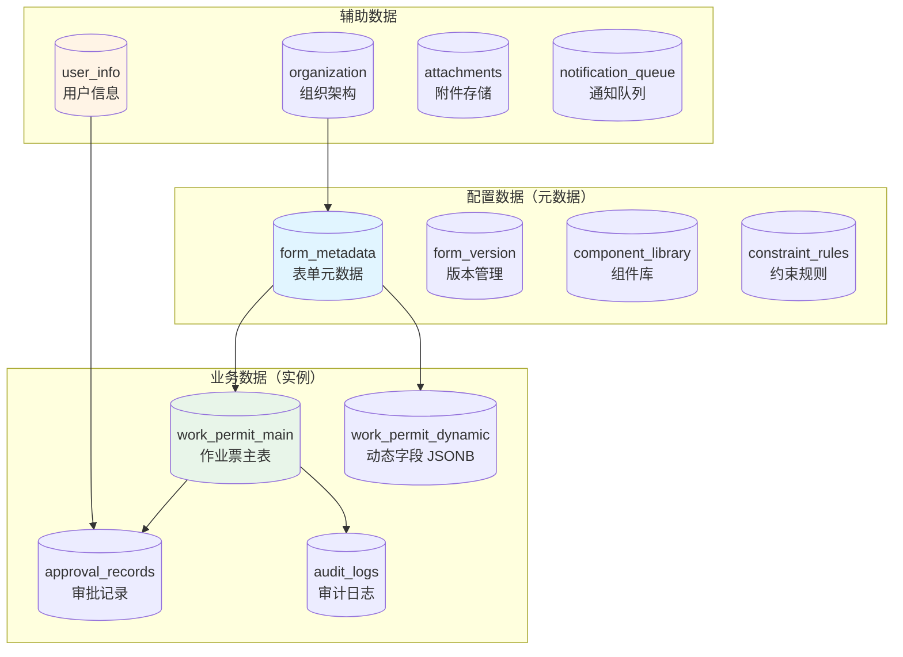
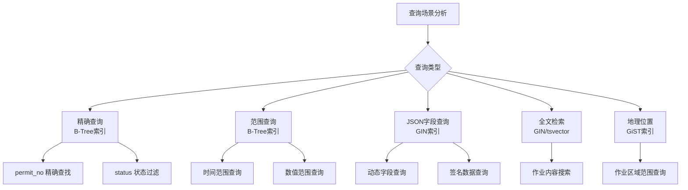
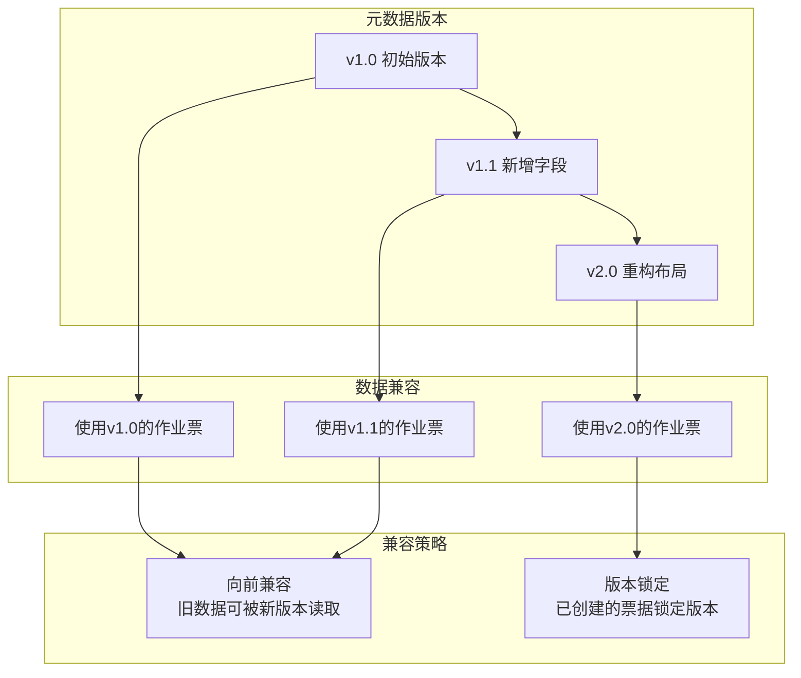

# 08 - 数据模型

> **本章导读**: 本章详细介绍配置端的数据模型设计，包括元数据配置表、作业票数据表、JSONB存储结构、索引优化策略和数据版本管理。

---

## 8.1 数据模型概览

### 8.1.1 存储架构



### 8.1.2 设计原则

| 原则 | 说明 | 实现方式 |
|------|------|---------|
| **Schema-Instance分离** | 元数据与业务数据独立存储 | 配置表 + 数据表分离 |
| **静态+动态混合** | 固定字段用列存储，动态字段用JSONB | 主表列 + JSONB字段 |
| **版本可追溯** | 每次配置变更都有版本记录 | 版本表 + 快照机制 |
| **高性能查询** | 常用查询路径有索引支持 | GIN索引 + 复合索引 |

---

## 8.2 元数据配置表

### 8.2.1 form_metadata（表单元数据主表）

```sql
CREATE TABLE form_metadata (
    id              BIGSERIAL PRIMARY KEY,
    metadata_code   VARCHAR(64) NOT NULL UNIQUE,       -- 元数据编码，如 'hot_work_v2'
    permit_type     VARCHAR(32) NOT NULL,              -- 作业票类型
    name            VARCHAR(128) NOT NULL,             -- 表单名称
    description     TEXT,                              -- 表单描述
    schema_def      JSONB NOT NULL,                    -- Schema层定义（字段）
    layout_def      JSONB NOT NULL,                    -- Layout层定义（布局）
    rules_def       JSONB,                             -- 规则定义（约束、联动）
    state_machine   JSONB,                             -- 状态机定义
    version         INTEGER NOT NULL DEFAULT 1,        -- 当前版本号
    status          VARCHAR(16) NOT NULL DEFAULT 'draft', -- draft/published/archived
    org_id          BIGINT,                            -- 所属组织（NULL=系统级）
    project_id      BIGINT,                            -- 所属项目（NULL=组织级）
    override_level  SMALLINT NOT NULL DEFAULT 1,       -- 覆盖层级 1=系统 2=公司 3=项目
    created_by      BIGINT NOT NULL,
    created_at      TIMESTAMP NOT NULL DEFAULT NOW(),
    updated_by      BIGINT,
    updated_at      TIMESTAMP NOT NULL DEFAULT NOW(),
    published_at    TIMESTAMP,
    CONSTRAINT chk_status CHECK (status IN ('draft', 'published', 'archived')),
    CONSTRAINT chk_override CHECK (override_level BETWEEN 1 AND 3)
);

-- 索引
CREATE INDEX idx_metadata_type ON form_metadata(permit_type);
CREATE INDEX idx_metadata_org ON form_metadata(org_id, project_id);
CREATE INDEX idx_metadata_status ON form_metadata(status);
CREATE INDEX idx_metadata_schema ON form_metadata USING GIN(schema_def);
```

### 8.2.2 form_version（版本管理表）

```sql
CREATE TABLE form_version (
    id              BIGSERIAL PRIMARY KEY,
    metadata_id     BIGINT NOT NULL REFERENCES form_metadata(id),
    version         INTEGER NOT NULL,                  -- 版本号
    version_label   VARCHAR(64),                       -- 版本标签，如 'v2.1.0'
    change_summary  TEXT,                              -- 变更摘要
    schema_snapshot JSONB NOT NULL,                    -- Schema快照
    layout_snapshot JSONB NOT NULL,                    -- Layout快照
    rules_snapshot  JSONB,                             -- 规则快照
    state_machine_snapshot JSONB,                      -- 状态机快照
    status          VARCHAR(16) NOT NULL DEFAULT 'draft',
    created_by      BIGINT NOT NULL,
    created_at      TIMESTAMP NOT NULL DEFAULT NOW(),
    approved_by     BIGINT,
    approved_at     TIMESTAMP,
    UNIQUE(metadata_id, version)
);

CREATE INDEX idx_version_metadata ON form_version(metadata_id, version DESC);
```

### 8.2.3 component_library（组件库表）

```sql
CREATE TABLE component_library (
    id              BIGSERIAL PRIMARY KEY,
    component_code  VARCHAR(64) NOT NULL UNIQUE,       -- 组件编码
    category        VARCHAR(32) NOT NULL,              -- 分类: basic/business/structure/logic
    name            VARCHAR(64) NOT NULL,              -- 组件名称
    description     TEXT,                              -- 组件描述
    icon            VARCHAR(64),                       -- 图标标识
    props_schema    JSONB NOT NULL,                    -- 属性定义Schema
    default_props   JSONB,                             -- 默认属性值
    is_system       BOOLEAN NOT NULL DEFAULT true,     -- 是否系统内置
    is_enabled      BOOLEAN NOT NULL DEFAULT true,     -- 是否启用
    sort_order      INTEGER NOT NULL DEFAULT 0,        -- 排序
    created_at      TIMESTAMP NOT NULL DEFAULT NOW(),
    updated_at      TIMESTAMP NOT NULL DEFAULT NOW()
);

CREATE INDEX idx_component_category ON component_library(category, is_enabled);
```

---

## 8.3 业务数据表

### 8.3.1 work_permit_main（作业票主表）

```sql
CREATE TABLE work_permit_main (
    id              BIGSERIAL PRIMARY KEY,
    permit_no       VARCHAR(32) NOT NULL UNIQUE,       -- 作业票编号 PTW-2026-0312-001
    permit_type     VARCHAR(32) NOT NULL,              -- 作业票类型
    metadata_id     BIGINT NOT NULL REFERENCES form_metadata(id),
    metadata_version INTEGER NOT NULL,                 -- 使用的元数据版本
    status          VARCHAR(20) NOT NULL DEFAULT 'draft',
    title           VARCHAR(256),                      -- 作业票标题

    -- 静态核心字段（高频查询）
    org_id          BIGINT NOT NULL,                   -- 所属组织
    project_id      BIGINT,                            -- 所属项目
    work_zone       VARCHAR(128),                      -- 作业区域
    work_zone_code  VARCHAR(32),                       -- 区域编码
    work_content    TEXT,                               -- 作业内容
    work_time_start TIMESTAMP,                         -- 计划开始时间
    work_time_end   TIMESTAMP,                         -- 计划结束时间
    actual_start    TIMESTAMP,                         -- 实际开始时间
    actual_end      TIMESTAMP,                         -- 实际结束时间
    risk_level      VARCHAR(16),                       -- 风险等级
    applicant_id    BIGINT NOT NULL,                   -- 申请人
    supervisor_id   BIGINT,                            -- 监护人

    -- 动态字段（JSONB存储）
    dynamic_fields  JSONB NOT NULL DEFAULT '{}',       -- 动态表单数据
    signatures      JSONB DEFAULT '{}',                -- 签名数据
    attachments     JSONB DEFAULT '[]',                -- 附件列表

    -- 元信息
    created_at      TIMESTAMP NOT NULL DEFAULT NOW(),
    updated_at      TIMESTAMP NOT NULL DEFAULT NOW(),
    closed_at       TIMESTAMP,
    created_by      BIGINT NOT NULL,
    updated_by      BIGINT,

    CONSTRAINT chk_permit_status CHECK (status IN (
        'draft', 'pending_verify', 'approved', 'executing',
        'suspended', 'pending_close', 'closed', 'cancelled', 'emergency'
    ))
);

-- 核心查询索引
CREATE INDEX idx_permit_no ON work_permit_main(permit_no);
CREATE INDEX idx_permit_type_status ON work_permit_main(permit_type, status);
CREATE INDEX idx_permit_org ON work_permit_main(org_id, project_id);
CREATE INDEX idx_permit_applicant ON work_permit_main(applicant_id);
CREATE INDEX idx_permit_time ON work_permit_main(work_time_start, work_time_end);
CREATE INDEX idx_permit_zone ON work_permit_main(work_zone_code);

-- JSONB索引（动态字段查询）
CREATE INDEX idx_permit_dynamic ON work_permit_main USING GIN(dynamic_fields);
CREATE INDEX idx_permit_signatures ON work_permit_main USING GIN(signatures);
```

### 8.3.2 approval_records（审批记录表）

```sql
CREATE TABLE approval_records (
    id              BIGSERIAL PRIMARY KEY,
    permit_id       BIGINT NOT NULL REFERENCES work_permit_main(id),
    approval_step   INTEGER NOT NULL,                  -- 审批步骤序号
    approver_id     BIGINT NOT NULL,                   -- 审批人
    approver_role   VARCHAR(32) NOT NULL,              -- 审批角色
    action          VARCHAR(16) NOT NULL,              -- approve/reject/delegate
    comment         TEXT,                              -- 审批意见
    signature_data  JSONB,                             -- 签名数据
    acted_at        TIMESTAMP NOT NULL DEFAULT NOW(),
    CONSTRAINT chk_action CHECK (action IN ('approve', 'reject', 'delegate'))
);

CREATE INDEX idx_approval_permit ON approval_records(permit_id, approval_step);
CREATE INDEX idx_approval_approver ON approval_records(approver_id);
```

### 8.3.3 audit_logs（审计日志表）

```sql
CREATE TABLE audit_logs (
    id              BIGSERIAL PRIMARY KEY,
    permit_id       BIGINT REFERENCES work_permit_main(id),
    action          VARCHAR(32) NOT NULL,              -- 操作类型
    from_status     VARCHAR(20),                       -- 原状态
    to_status       VARCHAR(20),                       -- 新状态
    operator_id     BIGINT NOT NULL,                   -- 操作人
    operator_role   VARCHAR(32),                       -- 操作角色
    detail          JSONB,                             -- 操作详情
    ip_address      VARCHAR(45),                       -- IP地址
    device_info     VARCHAR(256),                      -- 设备信息
    location        JSONB,                             -- GPS位置
    created_at      TIMESTAMP NOT NULL DEFAULT NOW()
);

CREATE INDEX idx_audit_permit ON audit_logs(permit_id, created_at DESC);
CREATE INDEX idx_audit_operator ON audit_logs(operator_id);
CREATE INDEX idx_audit_action ON audit_logs(action, created_at DESC);
```

---

## 8.4 JSONB存储结构设计

### 8.4.1 dynamic_fields 结构

```json
{
  "gas_detection": {
    "oxygen_level": 20.8,
    "combustible_gas": 0.2,
    "toxic_gas": 0.0,
    "detection_time": "2026-03-12T08:30:00Z",
    "detector_id": "GD-001",
    "detector_calibration_date": "2026-02-15"
  },
  "safety_measures": {
    "fire_extinguisher": true,
    "fire_blanket": true,
    "water_hose": false,
    "ventilation": true,
    "measures_list": ["灭火器×2", "防火毯×1", "通风设备×1"]
  },
  "special_requirements": {
    "fire_level": "special",
    "fire_watch_duration": 30,
    "isolation_confirmed": true,
    "energy_isolation_tag": "EIT-2026-0312"
  },
  "completion_check": {
    "site_cleaned": true,
    "equipment_removed": true,
    "fire_watch_completed": true,
    "final_gas_check": {
      "oxygen": 20.9,
      "combustible": 0.0,
      "time": "2026-03-12T16:00:00Z"
    }
  }
}
```

### 8.4.2 signatures 结构

```json
{
  "applicant": {
    "user_id": 1001,
    "user_name": "张三",
    "role": "applicant",
    "signature_image": "base64://...",
    "signed_at": "2026-03-12T08:30:00Z",
    "device_id": "MOBILE-001",
    "location": { "lat": 31.2304, "lng": 121.4737 }
  },
  "supervisor": {
    "user_id": 1002,
    "user_name": "李四",
    "role": "supervisor",
    "signature_image": "base64://...",
    "signed_at": "2026-03-12T09:00:00Z",
    "device_id": "MOBILE-002",
    "location": { "lat": 31.2305, "lng": 121.4738 }
  },
  "safety_officer": {
    "user_id": 1003,
    "user_name": "王五",
    "role": "safety_officer",
    "signature_image": "base64://...",
    "signed_at": "2026-03-12T09:15:00Z"
  }
}
```

### 8.4.3 JSONB查询示例

```sql
-- 查询氧气浓度低于19%的作业票
SELECT permit_no, dynamic_fields->'gas_detection'->>'oxygen_level' AS oxygen
FROM work_permit_main
WHERE (dynamic_fields->'gas_detection'->>'oxygen_level')::numeric < 19;

-- 查询特级动火作业
SELECT permit_no, title
FROM work_permit_main
WHERE dynamic_fields->'special_requirements'->>'fire_level' = 'special';

-- 查询未完成安全措施确认的作业票
SELECT permit_no
FROM work_permit_main
WHERE status = 'approved'
  AND dynamic_fields->'safety_measures'->>'fire_extinguisher' = 'false';

-- 统计各类型作业票数量
SELECT permit_type, status, COUNT(*)
FROM work_permit_main
GROUP BY permit_type, status
ORDER BY permit_type, status;
```

---

## 8.5 索引优化策略

### 8.5.1 索引设计原则



### 8.5.2 索引清单

| 索引名称 | 索引类型 | 目标字段 | 适用场景 |
|---------|---------|---------|---------|
| `idx_permit_no` | B-Tree UNIQUE | permit_no | 按编号精确查找 |
| `idx_permit_type_status` | B-Tree 复合 | (permit_type, status) | 按类型+状态筛选 |
| `idx_permit_org` | B-Tree 复合 | (org_id, project_id) | 按组织筛选 |
| `idx_permit_time` | B-Tree 复合 | (work_time_start, work_time_end) | 时间范围查询 |
| `idx_permit_dynamic` | GIN | dynamic_fields | 动态字段查询 |
| `idx_permit_content` | GIN(tsvector) | work_content | 全文检索 |
| `idx_audit_permit` | B-Tree 复合 | (permit_id, created_at DESC) | 审计日志查询 |

### 8.5.3 查询性能预期

| 查询场景 | 数据量 | 预期响应时间 | 索引策略 |
|---------|-------|------------|---------|
| 按编号查找 | 100万 | < 1ms | B-Tree UNIQUE |
| 按状态列表 | 100万 | < 10ms | 复合索引 |
| 按时间范围 | 100万 | < 20ms | 复合索引 |
| JSONB字段查询 | 100万 | < 50ms | GIN索引 |
| 全文检索 | 100万 | < 100ms | GIN(tsvector) |

---

## 8.6 数据版本管理

### 8.6.1 版本管理策略



### 8.6.2 版本兼容规则

| 变更类型 | 兼容性 | 处理策略 | 示例 |
|---------|--------|---------|------|
| 新增可选字段 | ✅ 向前兼容 | 旧数据缺失字段返回默认值 | 新增"风速"字段 |
| 新增必填字段 | ⚠️ 部分兼容 | 仅对新创建的票据生效 | 新增"AI审查结果" |
| 修改字段类型 | ❌ 不兼容 | 需要数据迁移脚本 | text → number |
| 删除字段 | ⚠️ 部分兼容 | 旧数据保留，新表单不显示 | 移除废弃字段 |
| 修改布局 | ✅ 向前兼容 | 仅影响显示，不影响数据 | 调整字段排列 |
| 修改规则 | ⚠️ 部分兼容 | 仅对新操作生效 | 修改校验范围 |

### 8.6.3 数据迁移机制

```json
{
  "migration": {
    "from_version": "1.0",
    "to_version": "2.0",
    "steps": [
      {
        "action": "add_field",
        "field": "wind_speed",
        "default": null,
        "description": "新增风速检测字段"
      },
      {
        "action": "rename_field",
        "from": "gas_level",
        "to": "gas_oxygen_level",
        "description": "字段重命名以提高语义清晰度"
      },
      {
        "action": "transform_field",
        "field": "risk_level",
        "transform": "CASE WHEN value='high' THEN '3' WHEN value='medium' THEN '2' ELSE '1' END",
        "description": "风险等级从文本改为数字编码"
      }
    ],
    "rollback": {
      "supported": true,
      "script": "migration_v2_to_v1_rollback.sql"
    }
  }
}
```

---

## 8.7 数据归档与清理

### 8.7.1 数据生命周期

| 数据类型 | 热数据 | 温数据 | 冷数据 | 归档 |
|---------|-------|-------|-------|------|
| 进行中的作业票 | ✅ 主库 | - | - | - |
| 近3个月已关闭 | ✅ 主库 | - | - | - |
| 3-12个月已关闭 | - | ✅ 只读副本 | - | - |
| 1-5年已关闭 | - | - | ✅ 归档库 | - |
| 5年以上 | - | - | - | ✅ 对象存储 |
| 审计日志 | 近1年主库 | 1-3年归档库 | 3年以上对象存储 | 永久保留 |

### 8.7.2 归档策略

```sql
-- 定期归档任务（每月执行）
-- 将3个月前已关闭的作业票移至归档表
INSERT INTO work_permit_archive
SELECT * FROM work_permit_main
WHERE status IN ('closed', 'cancelled')
  AND closed_at < NOW() - INTERVAL '3 months';

-- 删除已归档的主表数据
DELETE FROM work_permit_main
WHERE status IN ('closed', 'cancelled')
  AND closed_at < NOW() - INTERVAL '3 months'
  AND id IN (SELECT id FROM work_permit_archive);
```

---

**上一章**: [07 - 状态机设计](./07-状态机设计.md)

**下一章**: [09 - 表单渲染引擎](./09-表单渲染引擎.md)
