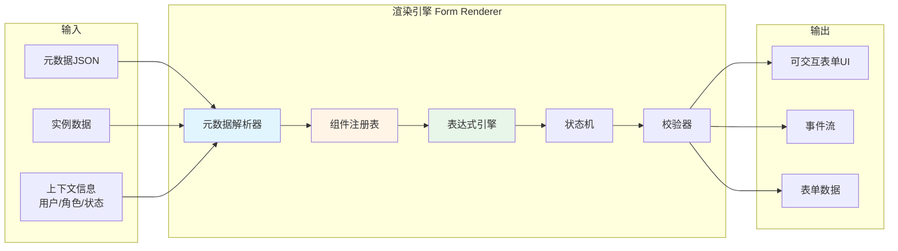
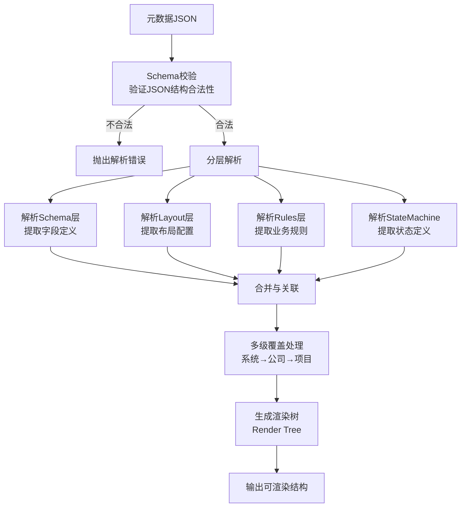
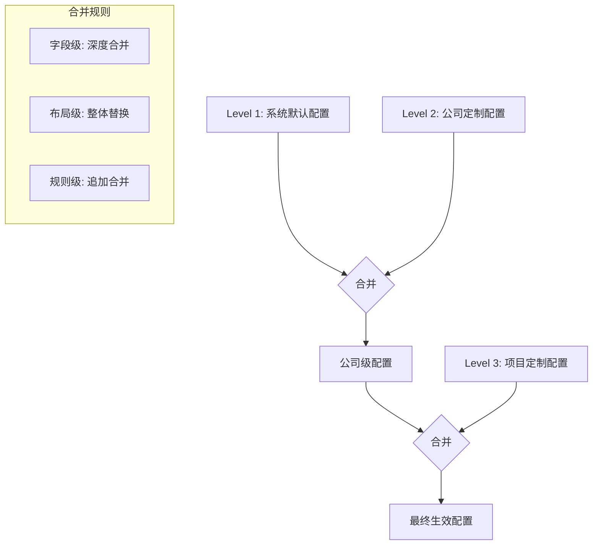
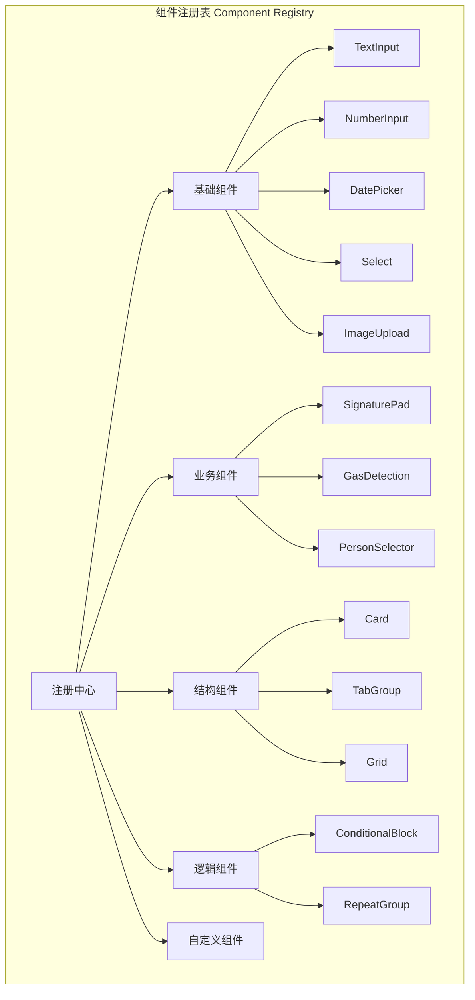
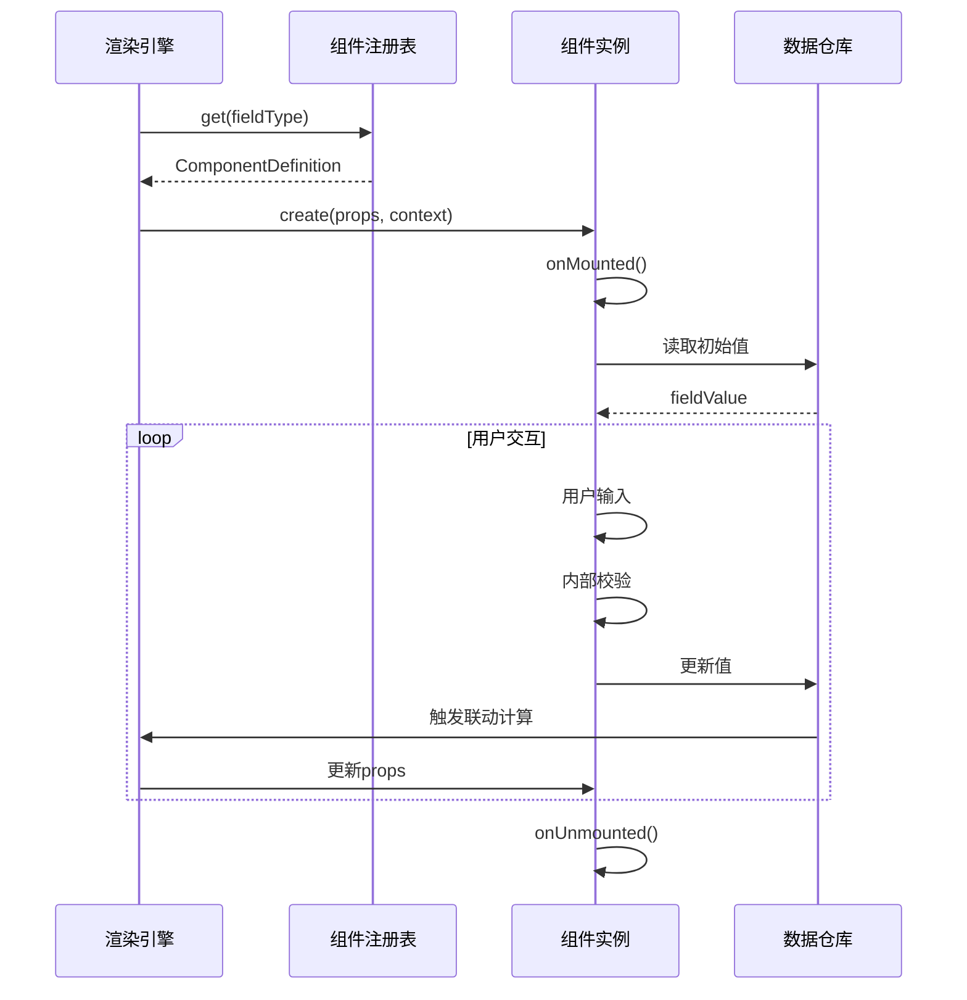
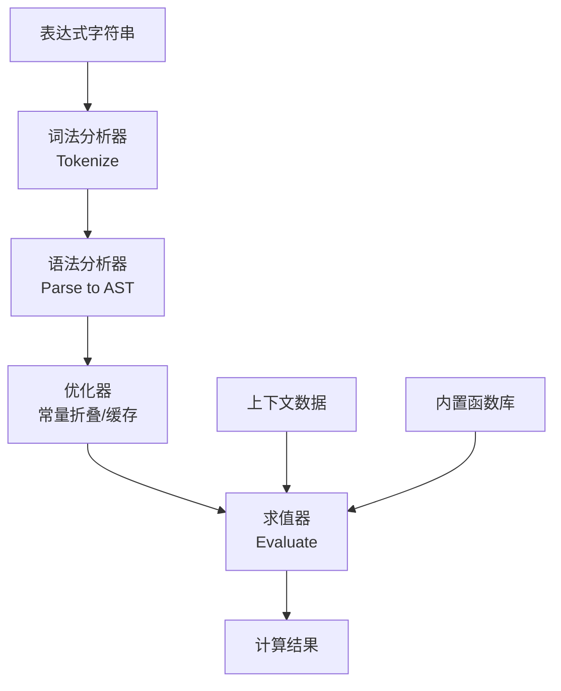
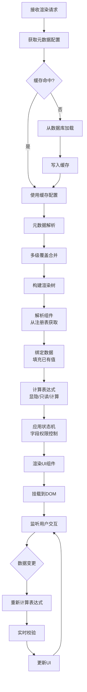
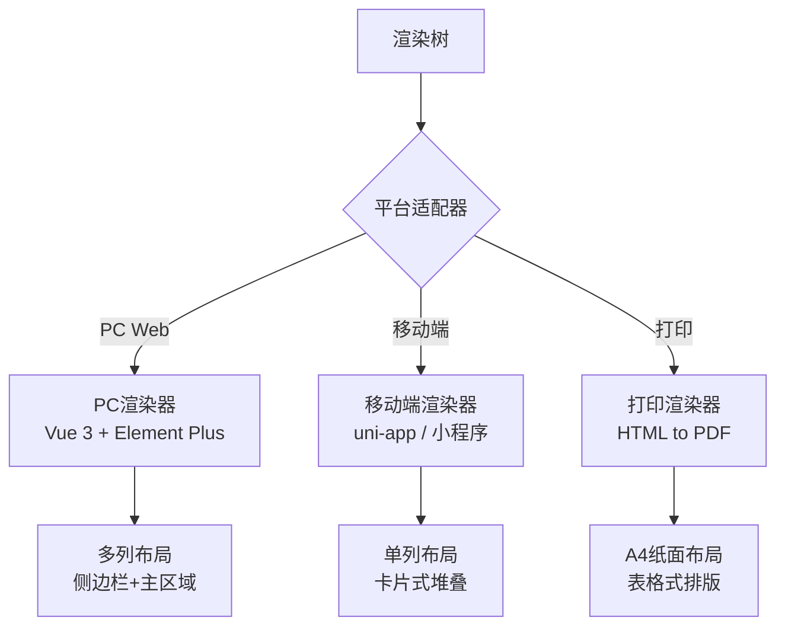

# 09 - 表单渲染引擎

> **本章导读**: 本章详细介绍表单渲染引擎的设计，包括元数据解析器、组件注册表、表达式引擎集成、状态机实现和完整渲染流程。

---

## 9.1 渲染引擎概览

### 9.1.1 引擎定位

表单渲染引擎是连接"配置端"与"执行端"的核心桥梁，负责将元数据配置JSON动态渲染为可交互的表单界面。



### 9.1.2 设计目标

| 目标 | 指标 | 说明 |
|------|------|------|
| **高性能** | 首屏渲染 < 500ms | 50个字段的表单在移动端流畅渲染 |
| **高兼容** | 支持多端 | PC Web、移动端小程序、打印 |
| **可扩展** | 插件化组件 | 支持自定义组件注册 |
| **强校验** | 实时+提交双校验 | 确保数据质量 |

---

## 9.2 元数据解析器

### 9.2.1 解析流程



### 9.2.2 解析器核心接口

```typescript
interface MetadataParser {
  // 解析完整元数据
  parse(metadata: FormMetadata, context: RenderContext): RenderTree;

  // 解析Schema层
  parseSchema(schema: SchemaDefinition): FieldNode[];

  // 解析Layout层
  parseLayout(layout: LayoutDefinition, fields: FieldNode[]): LayoutNode;

  // 解析Rules层
  parseRules(rules: RulesDefinition): RuleBinding[];

  // 多级覆盖合并
  mergeOverrides(base: FormMetadata, overrides: FormMetadata[]): FormMetadata;
}

interface RenderContext {
  currentUser: UserInfo;       // 当前用户
  currentRole: string;         // 当前角色
  currentState: string;        // 当前状态
  permitData: Record<string, any>; // 已有数据
  deviceType: 'pc' | 'mobile'; // 设备类型
}

interface RenderTree {
  root: LayoutNode;            // 布局根节点
  fields: Map<string, FieldNode>; // 字段映射
  rules: RuleBinding[];        // 规则绑定
  stateMachine: StateMachineConfig; // 状态机配置
}
```

### 9.2.3 多级覆盖解析



**合并策略**:

| 配置层 | 合并方式 | 说明 |
|-------|---------|------|
| Schema字段 | 深度合并(Deep Merge) | 下级可新增字段、修改属性，不可删除上级字段 |
| Layout布局 | 整体替换(Override) | 下级提供完整布局则替换，否则继承上级 |
| Rules规则 | 追加合并(Append) | 下级规则追加到上级规则之后，同名规则覆盖 |
| 状态机 | 不可覆盖 | 状态机定义仅系统级可配置 |

---

## 9.3 组件注册表

### 9.3.1 注册表架构



### 9.3.2 组件注册接口

```typescript
interface ComponentRegistry {
  // 注册组件
  register(type: string, component: ComponentDefinition): void;

  // 获取组件
  get(type: string): ComponentDefinition | undefined;

  // 检查组件是否已注册
  has(type: string): boolean;

  // 获取所有已注册组件
  getAll(): Map<string, ComponentDefinition>;

  // 注销组件
  unregister(type: string): void;
}

interface ComponentDefinition {
  type: string;                    // 组件类型标识
  name: string;                    // 组件显示名称
  category: ComponentCategory;     // 组件分类
  component: VueComponent;         // Vue组件实例
  propsSchema: JSONSchema;         // 属性Schema定义
  defaultProps: Record<string, any>; // 默认属性
  validator?: FieldValidator;      // 内置校验器
  formatter?: ValueFormatter;      // 值格式化器
  platforms: ('pc' | 'mobile' | 'print')[]; // 支持平台
}
```

### 9.3.3 组件生命周期



---

## 9.4 表达式引擎

### 9.4.1 表达式类型

| 表达式类型 | 用途 | 示例 |
|-----------|------|------|
| **条件表达式** | 控制显隐、只读 | `data.fire_level === 'special'` |
| **计算表达式** | 自动计算字段值 | `data.work_hours * data.worker_count` |
| **校验表达式** | 自定义校验规则 | `data.end_time > data.start_time` |
| **格式化表达式** | 显示格式转换 | `FORMAT_DATE(data.created_at, 'YYYY-MM-DD')` |

### 9.4.2 表达式引擎架构



### 9.4.3 内置函数库

```typescript
// 数学函数
SUM(field1, field2, ...)        // 求和
AVG(field1, field2, ...)        // 平均值
MAX(field1, field2, ...)        // 最大值
MIN(field1, field2, ...)        // 最小值
ROUND(value, decimals)          // 四舍五入

// 日期函数
NOW()                           // 当前时间
DATE_DIFF(date1, date2, unit)   // 日期差
DATE_ADD(date, amount, unit)    // 日期加减
FORMAT_DATE(date, pattern)      // 日期格式化

// 字符串函数
CONCAT(str1, str2, ...)         // 字符串拼接
UPPER(str)                      // 转大写
LOWER(str)                      // 转小写
TRIM(str)                       // 去空格

// 逻辑函数
IF(condition, trueVal, falseVal) // 条件判断
AND(cond1, cond2, ...)          // 逻辑与
OR(cond1, cond2, ...)           // 逻辑或
NOT(condition)                   // 逻辑非
IS_EMPTY(value)                  // 是否为空
INCLUDES(array, value)           // 数组包含

// 业务函数
GET_USER_NAME(userId)            // 获取用户姓名
GET_ORG_NAME(orgId)              // 获取组织名称
CHECK_PERMISSION(role, action)   // 检查权限
```

### 9.4.4 表达式配置示例

```json
{
  "expressions": {
    "visibility": {
      "special_fire_section": {
        "expr": "data.fire_level === 'special'",
        "description": "特级动火时显示特殊审批区块"
      },
      "gas_detection_section": {
        "expr": "INCLUDES(['approved', 'executing'], context.state)",
        "description": "已批准或作业中时显示气体检测区块"
      }
    },
    "calculation": {
      "total_work_hours": {
        "expr": "DATE_DIFF(data.work_time_end, data.work_time_start, 'hours')",
        "description": "自动计算作业时长"
      },
      "risk_score": {
        "expr": "data.height_level * 2 + data.fire_level_score * 3 + IF(data.confined_space, 5, 0)",
        "description": "自动计算风险评分"
      }
    },
    "validation": {
      "time_range_check": {
        "expr": "data.work_time_end > data.work_time_start",
        "message": "结束时间必须晚于开始时间"
      },
      "gas_safety_check": {
        "expr": "data.gas_oxygen >= 19.5 && data.gas_oxygen <= 23.5",
        "message": "氧气浓度必须在19.5%-23.5%安全范围内"
      }
    }
  }
}
```

---

## 9.5 渲染流程

### 9.5.1 完整渲染流程



### 9.5.2 增量更新机制


**依赖图示例**:

```
fire_level 变更
  ├── special_fire_section (显隐)
  ├── fire_watch_duration (计算)
  ├── safety_director_sign (必填切换)
  └── risk_score (重新计算)
```

### 9.5.3 渲染性能优化

| 优化策略 | 实现方式 | 效果 |
|---------|---------|------|
| **元数据缓存** | Redis缓存 + 本地缓存双层 | 减少数据库查询 |
| **渲染树缓存** | 相同配置复用渲染树 | 减少解析开销 |
| **懒加载组件** | 非可视区域延迟加载 | 首屏时间减少40% |
| **虚拟滚动** | 长列表虚拟化渲染 | 内存占用减少60% |
| **表达式缓存** | 缓存AST和计算结果 | 重复计算减少80% |
| **批量更新** | 合并多次数据变更 | 减少DOM操作次数 |
| **Web Worker** | 复杂计算移至Worker | 主线程不阻塞 |

---

## 9.6 多端适配

### 9.6.1 适配策略



### 9.6.2 平台差异处理

| 特性 | PC Web | 移动端 | 打印 |
|------|--------|-------|------|
| 布局 | 多列栅格 | 单列堆叠 | 表格排版 |
| 签名 | 鼠标绘制 | 手指绘制 | 显示签名图片 |
| 拍照 | 文件选择 | 调用相机 | 显示照片 |
| 定位 | 浏览器定位 | GPS定位 | 显示位置文本 |
| 交互 | 鼠标+键盘 | 触摸 | 无交互 |
| 离线 | 不支持 | 支持 | N/A |

---

**上一章**: [08 - 数据模型](./08-数据模型.md)

**下一章**: [10 - 特色功能](./10-特色功能.md)
