# 10 - 特色功能

> **本章导读**: 本章介绍配置端的三大特色功能：AI Copilot辅助配置、强制约束组件和多级覆盖机制。

---

## 10.1 AI Copilot 辅助配置

### 10.1.1 功能概览

AI Copilot 是配置端的智能助手，帮助配置管理员更高效地完成表单设计。

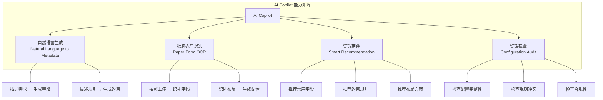

### 10.1.2 自然语言生成元数据

**使用场景**: 配置管理员用自然语言描述需求，AI自动生成对应的元数据配置。

**交互流程**:

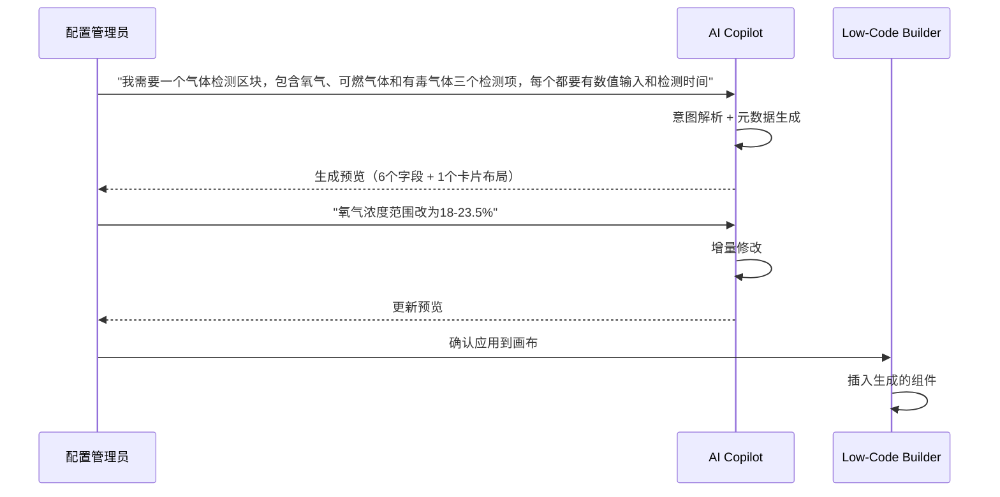

**生成示例**:

输入：
> "添加一个安全措施确认区块，包含灭火器、消防水带、防火毯三个勾选项，全部必填"

输出：
```json
{
  "type": "card",
  "title": "安全措施确认",
  "children": [
    {
      "key": "fire_extinguisher",
      "type": "checkbox",
      "label": "灭火器",
      "required": true,
      "defaultValue": false
    },
    {
      "key": "fire_hose",
      "type": "checkbox",
      "label": "消防水带",
      "required": true,
      "defaultValue": false
    },
    {
      "key": "fire_blanket",
      "type": "checkbox",
      "label": "防火毯",
      "required": true,
      "defaultValue": false
    }
  ],
  "grid": { "cols": 3, "gap": 12 }
}
```

### 10.1.3 纸质表单OCR识别

**使用场景**: 将企业现有的纸质作业票表单拍照上传，AI自动识别并转换为元数据配置。

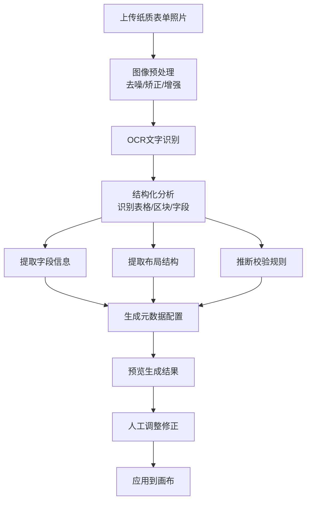

**识别能力**:

| 识别项 | 准确率 | 说明 |
|-------|--------|------|
| 字段标签 | 95%+ | 识别表格中的标签文字 |
| 字段类型 | 85%+ | 根据格式推断（日期、数字、文本） |
| 表格结构 | 90%+ | 识别行列关系和分组 |
| 勾选框 | 90%+ | 识别checkbox类型字段 |
| 签名区域 | 85%+ | 识别签名位置 |

### 10.1.4 智能推荐

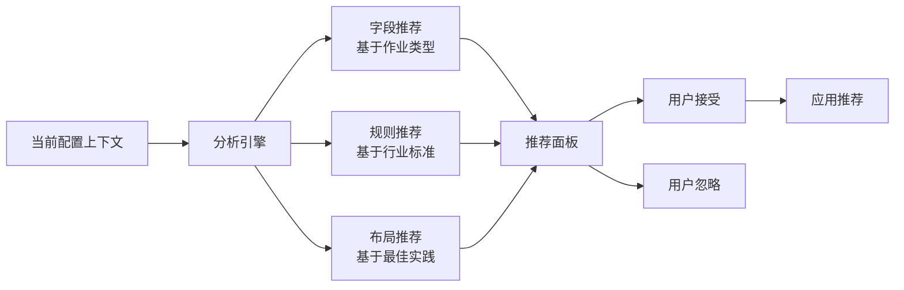

**推荐场景**:

| 场景 | 推荐内容 | 触发条件 |
|------|---------|---------|
| 新建动火作业表单 | 推荐"气体检测"字段组 | 选择动火作业模板时 |
| 添加高度字段 | 推荐"安全带检查"勾选项 | 检测到高处作业相关字段 |
| 配置审批流程 | 推荐标准审批链 | 进入状态机配置时 |
| 缺少必要字段 | 提示"根据GB 30871，建议添加..." | 保存配置时自动检查 |

---

## 10.2 强制约束组件

### 10.2.1 强制约束概览

强制约束组件是系统的安全底线，确保关键安全操作不可被绕过。

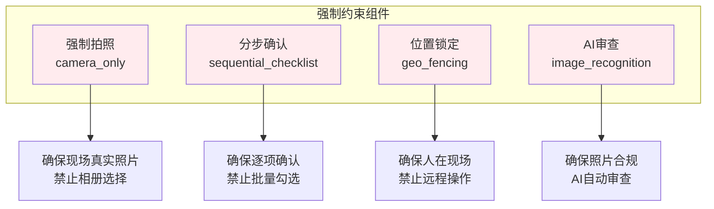

### 10.2.2 强制拍照（camera_only）

**设计目的**: 确保上传的照片是现场实时拍摄，而非从相册选择的历史照片。

**约束规则**:
- 只允许调用设备相机拍照，禁止从相册选择
- 照片自动添加水印（时间、GPS坐标、操作人）
- 照片EXIF信息校验（拍摄时间必须在当前操作时间±5分钟内）
- 照片GPS校验（拍摄位置必须在作业区域范围内）

**配置示例**:

```json
{
  "key": "site_photo",
  "type": "image_upload",
  "label": "现场环境照片",
  "required": true,
  "props": {
    "source": "camera_only",
    "minCount": 2,
    "maxCount": 5,
    "watermark": {
      "enabled": true,
      "content": ["timestamp", "gps", "operator", "permit_no"]
    },
    "validation": {
      "exif_time_tolerance": 300,
      "geo_fence_check": true,
      "min_resolution": "1280x720"
    }
  }
}
```

### 10.2.3 分步确认（sequential_checklist）

**设计目的**: 确保操作人员逐项确认安全措施，防止一次性全部勾选。

**约束规则**:
- 必须按顺序逐项确认，不可跳过
- 每项确认之间有最小间隔时间（默认3秒）
- 确认后不可取消（防止误操作需走撤销流程）
- 记录每项确认的时间戳

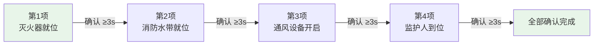

**配置示例**:

```json
{
  "key": "safety_checklist",
  "type": "sequential_checklist",
  "label": "安全措施确认清单",
  "required": true,
  "props": {
    "sequential": true,
    "minInterval": 3000,
    "irreversible": true,
    "items": [
      { "key": "fire_extinguisher", "label": "灭火器已就位", "helpText": "确认灭火器在作业点5米范围内" },
      { "key": "fire_hose", "label": "消防水带已连接", "helpText": "确认消防水带已连接到最近消火栓" },
      { "key": "ventilation", "label": "通风设备已开启", "helpText": "确认机械通风设备正常运行" },
      { "key": "supervisor_present", "label": "监护人已到位", "helpText": "确认监护人在现场且可视范围内" }
    ],
    "recordTimestamp": true
  }
}
```

### 10.2.4 位置锁定（geo_fencing）

**设计目的**: 确保关键操作只能在指定的作业区域内执行。

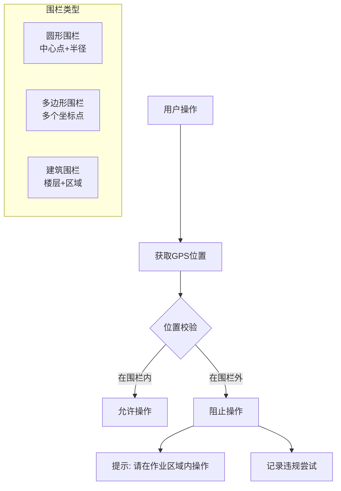

**配置示例**:

```json
{
  "geo_fencing": {
    "enabled": true,
    "fence_type": "circle",
    "center": { "lat": 31.2304, "lng": 121.4737 },
    "radius": 200,
    "unit": "meters",
    "enforced_actions": ["submit", "sign", "photo", "gas_detection"],
    "tolerance": 10,
    "offline_behavior": "warn_and_allow",
    "violation_action": {
      "block": true,
      "notify": ["supervisor", "safety_officer"],
      "log": true
    }
  }
}
```

### 10.2.5 AI审查（image_recognition）

**设计目的**: 利用AI自动审查上传的照片是否符合安全要求。

**审查能力**:

| 审查项 | 说明 | 准确率 |
|-------|------|--------|
| PPE检测 | 检测安全帽、安全带、防护服 | 92%+ |
| 环境检测 | 检测明火、烟雾、积水 | 88%+ |
| 设备检测 | 检测灭火器、警示标志 | 90%+ |
| 人员检测 | 检测人员数量和位置 | 95%+ |
| 伪造检测 | 检测截图、翻拍、PS痕迹 | 85%+ |

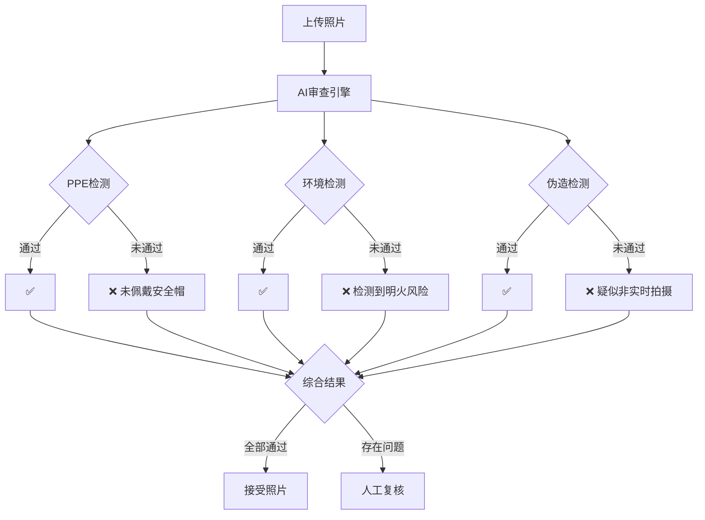

---

## 10.3 多级覆盖机制

### 10.3.1 覆盖层级模型

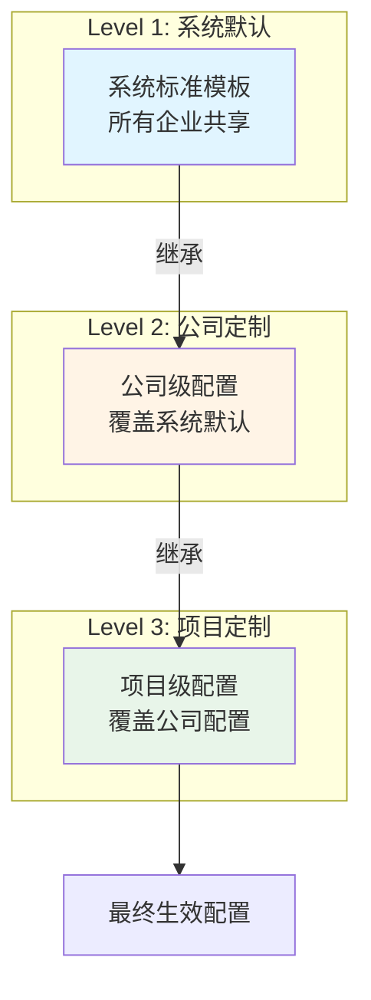

### 10.3.2 覆盖规则

| 配置项 | Level 1 系统 | Level 2 公司 | Level 3 项目 | 最终生效 |
|-------|:----------:|:----------:|:----------:|:-------:|
| 字段定义 | 基础字段集 | 可新增字段 | 可新增字段 | 合并所有 |
| 字段属性 | 默认属性 | 可修改 | 可修改 | 最低级优先 |
| 布局配置 | 标准布局 | 可替换 | 可替换 | 最低级优先 |
| 校验规则 | 基础规则 | 可追加 | 可追加 | 合并所有 |
| 硬约束 | 系统强制 | 不可修改 | 不可修改 | 系统级 |
| 状态机 | 标准流程 | 不可修改 | 不可修改 | 系统级 |

### 10.3.3 覆盖配置示例

```json
{
  "override": {
    "level": 2,
    "org_id": "ORG-001",
    "base_metadata": "hot_work_standard_v2",
    "changes": {
      "schema": {
        "add_fields": [
          {
            "key": "company_specific_check",
            "type": "checkbox",
            "label": "公司特殊安全检查项",
            "required": true,
            "after": "safety_measures"
          }
        ],
        "modify_fields": [
          {
            "key": "gas_oxygen",
            "changes": {
              "min": 19.5,
              "max": 23.0,
              "errorMessage": "本公司要求氧气浓度在19.5%-23.0%之间（严于国标）"
            }
          }
        ]
      },
      "layout": null,
      "rules": {
        "add_rules": [
          {
            "type": "validation",
            "field": "work_time_end",
            "expr": "DATE_DIFF(data.work_time_end, data.work_time_start, 'hours') <= 8",
            "message": "本公司规定单次作业时长不超过8小时"
          }
        ]
      }
    }
  }
}
```

### 10.3.4 覆盖冲突处理

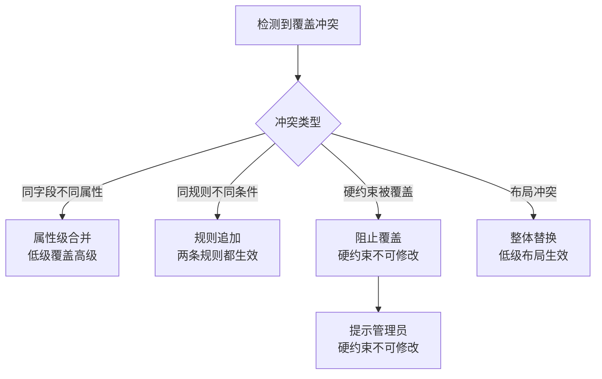

---

## 10.4 其他特色功能

### 10.4.1 配置导入导出

| 功能 | 说明 | 格式 |
|------|------|------|
| 导出配置 | 将当前表单配置导出为文件 | JSON / Excel |
| 导入配置 | 从文件导入表单配置 | JSON / Excel |
| 批量导出 | 导出多个表单配置 | ZIP包 |
| 跨环境迁移 | 从测试环境迁移到生产环境 | JSON + 版本校验 |

### 10.4.2 配置对比

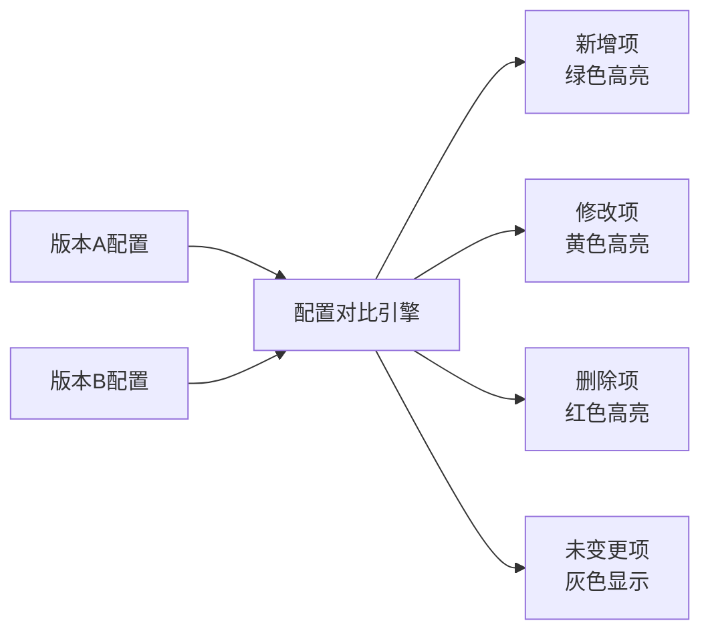

### 10.4.3 使用统计与分析

| 统计维度 | 指标 | 用途 |
|---------|------|------|
| 表单使用频率 | 各类型作业票创建数量 | 优化模板优先级 |
| 字段填写率 | 各字段的实际填写比例 | 识别冗余字段 |
| 校验失败率 | 各校验规则的触发频率 | 优化校验规则 |
| 平均填写时长 | 完成一张作业票的平均时间 | 优化表单设计 |
| 驳回率 | 审批驳回的比例和原因 | 改进表单引导 |

---

**上一章**: [09 - 表单渲染引擎](./09-表单渲染引擎.md)

**下一章**: [11 - 技术实现方案](./11-技术实现方案.md)
