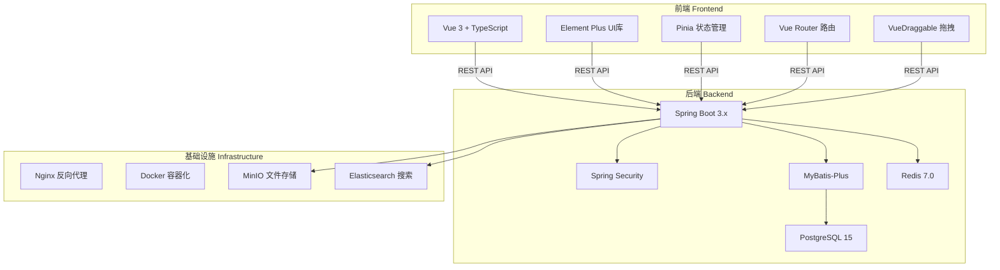
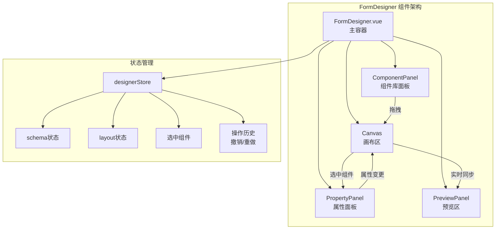
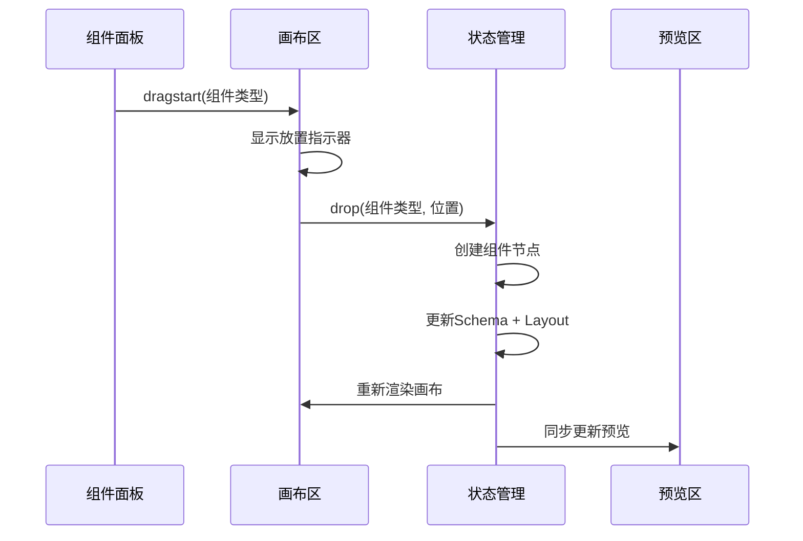
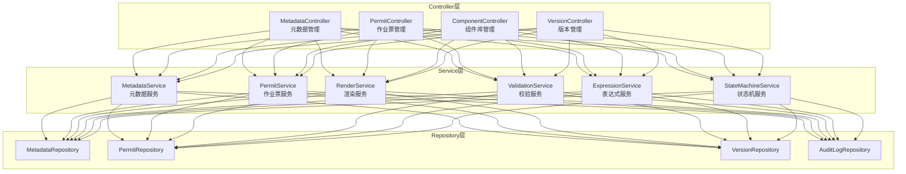
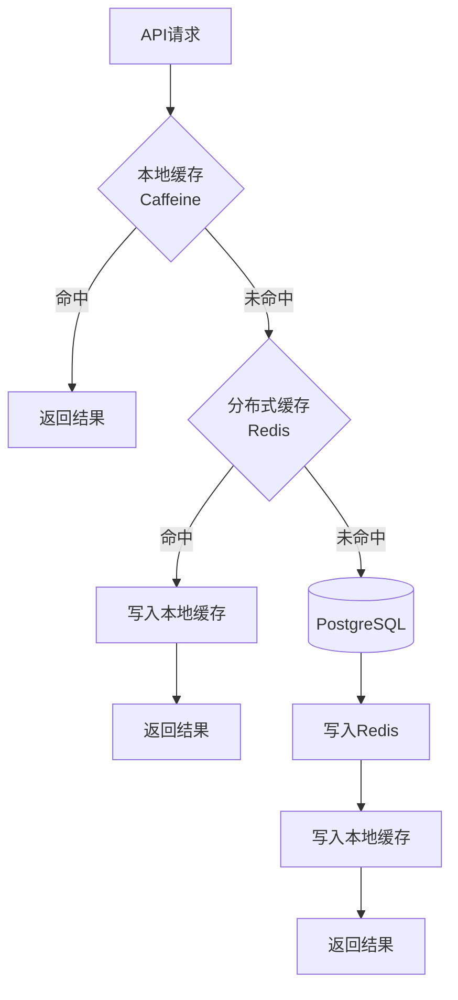
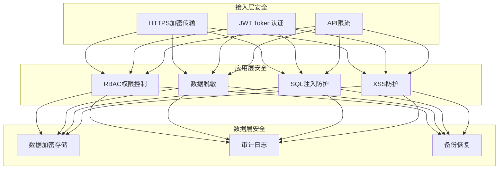

# 11 - 技术实现方案

> **本章导读**: 本章介绍配置端的技术实现方案，包括前端技术栈、后端技术栈、拖拽库选型、表单渲染引擎实现和性能优化方案。

---

## 11.1 技术架构总览

### 11.1.1 技术栈选型



### 11.1.2 选型理由

| 技术 | 选型 | 理由 |
|------|------|------|
| **前端框架** | Vue 3 | 国内生态成熟，团队熟悉度高，Composition API适合复杂表单 |
| **UI组件库** | Element Plus | 企业级组件丰富，表单组件完善，中文文档友好 |
| **拖拽库** | VueDraggable Plus | 基于SortableJS，支持嵌套拖拽，Vue 3原生支持 |
| **后端框架** | Spring Boot 3.x | Java生态标准，企业级稳定性，丰富的中间件支持 |
| **数据库** | PostgreSQL 15 | JSONB原生支持，GIN索引性能优秀，适合元数据存储 |
| **缓存** | Redis 7.0 | 高性能缓存，支持发布订阅，适合配置热加载 |

---

## 11.2 前端架构设计

### 11.2.1 项目结构

```
src/
├── api/                    # API接口层
│   ├── metadata.ts         # 元数据相关API
│   ├── permit.ts           # 作业票相关API
│   └── component.ts        # 组件库API
├── components/             # 通用组件
│   ├── FormDesigner/       # 表单设计器
│   │   ├── Canvas.vue      # 画布区
│   │   ├── ComponentPanel.vue  # 组件库面板
│   │   ├── PropertyPanel.vue   # 属性配置面板
│   │   └── PreviewPanel.vue    # 预览面板
│   ├── FormRenderer/       # 表单渲染器
│   │   ├── Renderer.vue    # 渲染入口
│   │   ├── FieldRenderer.vue   # 字段渲染
│   │   └── LayoutRenderer.vue  # 布局渲染
│   └── FormComponents/     # 表单组件库
│       ├── basic/          # 基础组件
│       ├── business/       # 业务组件
│       ├── structure/      # 结构组件
│       └── logic/          # 逻辑组件
├── composables/            # 组合式函数
│   ├── useFormDesigner.ts  # 设计器逻辑
│   ├── useFormRenderer.ts  # 渲染器逻辑
│   ├── useExpression.ts    # 表达式引擎
│   └── useStateMachine.ts  # 状态机
├── stores/                 # Pinia状态管理
│   ├── designer.ts         # 设计器状态
│   ├── metadata.ts         # 元数据状态
│   └── permit.ts           # 作业票状态
├── engine/                 # 核心引擎
│   ├── parser/             # 元数据解析器
│   ├── expression/         # 表达式引擎
│   ├── validator/          # 校验引擎
│   └── registry/           # 组件注册表
├── types/                  # TypeScript类型定义
├── utils/                  # 工具函数
└── views/                  # 页面视图
```

### 11.2.2 核心模块设计

**表单设计器（FormDesigner）**:



**表单渲染器（FormRenderer）**:

```typescript
// 渲染器核心接口
interface FormRendererProps {
  metadata: FormMetadata;      // 元数据配置
  data?: Record<string, any>;  // 初始数据
  state?: string;              // 当前状态
  mode: 'edit' | 'view' | 'print'; // 渲染模式
  context: RenderContext;      // 上下文
}

// 渲染器事件
interface FormRendererEmits {
  (e: 'change', field: string, value: any): void;
  (e: 'submit', data: Record<string, any>): void;
  (e: 'validate', errors: ValidationError[]): void;
  (e: 'stateChange', from: string, to: string): void;
}
```

### 11.2.3 拖拽实现



**拖拽配置**:

```typescript
// VueDraggable配置
const dragOptions = {
  group: {
    name: 'form-components',
    pull: 'clone',
    put: true
  },
  sort: true,
  animation: 200,
  ghostClass: 'drag-ghost',
  chosenClass: 'drag-chosen',
  handle: '.drag-handle',
  // 嵌套拖拽支持
  nested: true,
  maxDepth: 3
};
```

---

## 11.3 后端架构设计

### 11.3.1 服务分层



### 11.3.2 核心API设计

| API | 方法 | 路径 | 说明 |
|-----|------|------|------|
| 获取元数据 | GET | `/api/v1/metadata/{type}` | 获取指定类型的表单元数据 |
| 保存元数据 | POST | `/api/v1/metadata` | 保存表单元数据配置 |
| 发布版本 | POST | `/api/v1/metadata/{id}/publish` | 发布元数据版本 |
| 获取渲染配置 | GET | `/api/v1/render/{type}` | 获取渲染用的完整配置 |
| 创建作业票 | POST | `/api/v1/permits` | 创建新作业票 |
| 更新作业票 | PUT | `/api/v1/permits/{id}` | 更新作业票数据 |
| 状态转换 | POST | `/api/v1/permits/{id}/transition` | 触发状态转换 |
| 校验数据 | POST | `/api/v1/validate` | 服务端数据校验 |
| 获取组件库 | GET | `/api/v1/components` | 获取可用组件列表 |
| 版本对比 | GET | `/api/v1/metadata/{id}/diff` | 对比两个版本差异 |

### 11.3.3 元数据解析服务

```java
@Service
public class MetadataResolveService {

    /**
     * 解析并合并多级覆盖配置
     * @param permitType 作业票类型
     * @param orgId 组织ID
     * @param projectId 项目ID
     * @return 最终生效的元数据配置
     */
    public FormMetadata resolve(String permitType, Long orgId, Long projectId) {
        // 1. 获取系统级配置 (Level 1)
        FormMetadata systemMeta = getSystemMetadata(permitType);

        // 2. 获取公司级覆盖 (Level 2)
        FormMetadata orgMeta = getOrgMetadata(permitType, orgId);

        // 3. 获取项目级覆盖 (Level 3)
        FormMetadata projectMeta = getProjectMetadata(permitType, projectId);

        // 4. 按优先级合并
        return mergeMetadata(systemMeta, orgMeta, projectMeta);
    }
}
```

### 11.3.4 缓存策略



**缓存配置**:

| 缓存层 | 技术 | TTL | 容量 | 适用数据 |
|-------|------|-----|------|---------|
| L1 本地 | Caffeine | 5分钟 | 1000条 | 热点元数据、组件定义 |
| L2 分布式 | Redis | 30分钟 | 无限制 | 所有元数据、渲染配置 |
| L3 数据库 | PostgreSQL | 永久 | 无限制 | 全量数据 |

---

## 11.4 性能优化方案

### 11.4.1 前端性能优化

| 优化项 | 方案 | 预期效果 |
|-------|------|---------|
| **首屏加载** | 路由懒加载 + 组件按需导入 | 首屏JS减少60% |
| **渲染性能** | 虚拟滚动 + 组件缓存 | 大表单渲染流畅 |
| **交互响应** | 防抖/节流 + 批量更新 | 输入响应<50ms |
| **离线支持** | Service Worker + IndexedDB | 离线可用 |
| **包体积** | Tree Shaking + 代码分割 | 生产包<500KB |

### 11.4.2 后端性能优化

| 优化项 | 方案 | 预期效果 |
|-------|------|---------|
| **查询优化** | JSONB GIN索引 + 复合索引 | 查询<50ms |
| **缓存策略** | 二级缓存(Caffeine + Redis) | 缓存命中率>95% |
| **连接池** | HikariCP连接池优化 | 并发处理能力提升 |
| **异步处理** | 通知/日志异步写入 | 接口响应时间减少30% |
| **批量操作** | 批量插入/更新优化 | 批量操作性能提升5x |

### 11.4.3 性能指标要求

| 指标 | 目标值 | 测试条件 |
|------|--------|---------|
| 表单渲染时间 | < 500ms | 50个字段，移动端 |
| API响应时间(P95) | < 200ms | 并发100用户 |
| 首屏加载时间 | < 2s | 4G网络 |
| 元数据解析时间 | < 100ms | 100个字段配置 |
| 表达式计算时间 | < 10ms | 单次表达式求值 |
| 内存占用 | < 100MB | 移动端App |

---

## 11.5 安全设计

### 11.5.1 安全架构



### 11.5.2 关键安全措施

| 安全领域 | 措施 | 说明 |
|---------|------|------|
| **认证** | JWT + 刷新Token | 双Token机制，短期访问+长期刷新 |
| **授权** | RBAC + 数据权限 | 角色权限 + 组织数据隔离 |
| **传输** | TLS 1.3 | 全链路HTTPS加密 |
| **存储** | AES-256加密 | 敏感字段加密存储 |
| **审计** | 全操作日志 | 记录所有关键操作 |
| **防护** | WAF + 限流 | 防止恶意攻击和滥用 |

---

**上一章**: [10 - 特色功能](./10-特色功能.md)

**下一章**: [12 - 实施落地方案](./12-实施落地方案.md)
