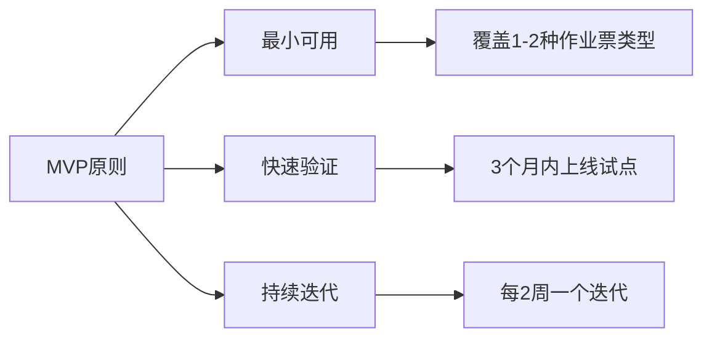
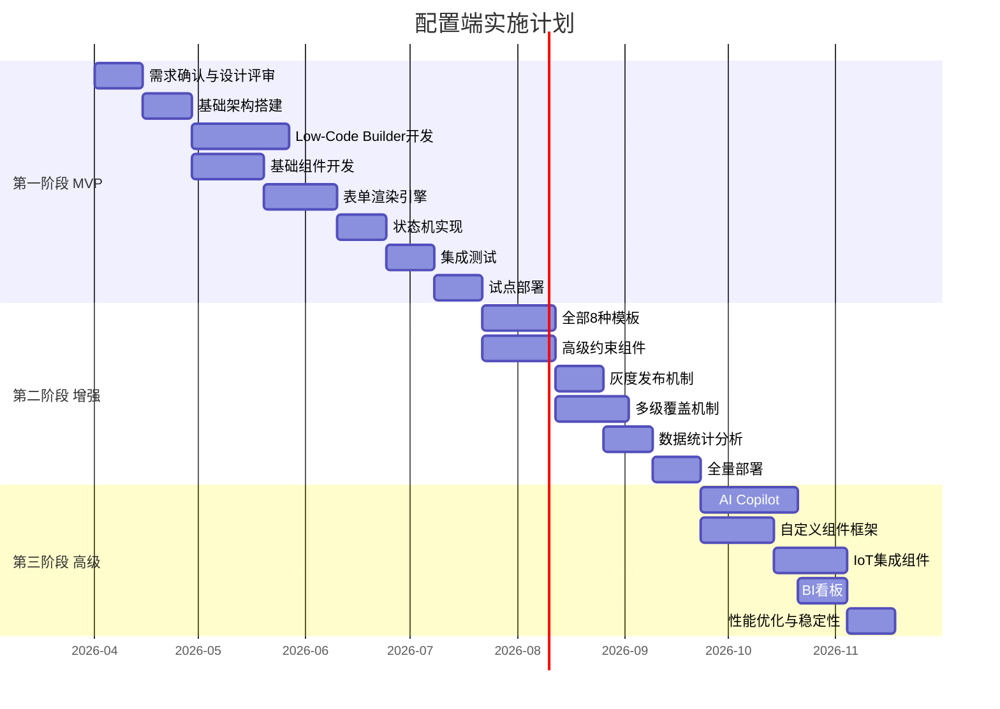
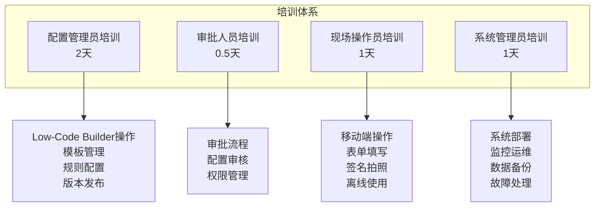
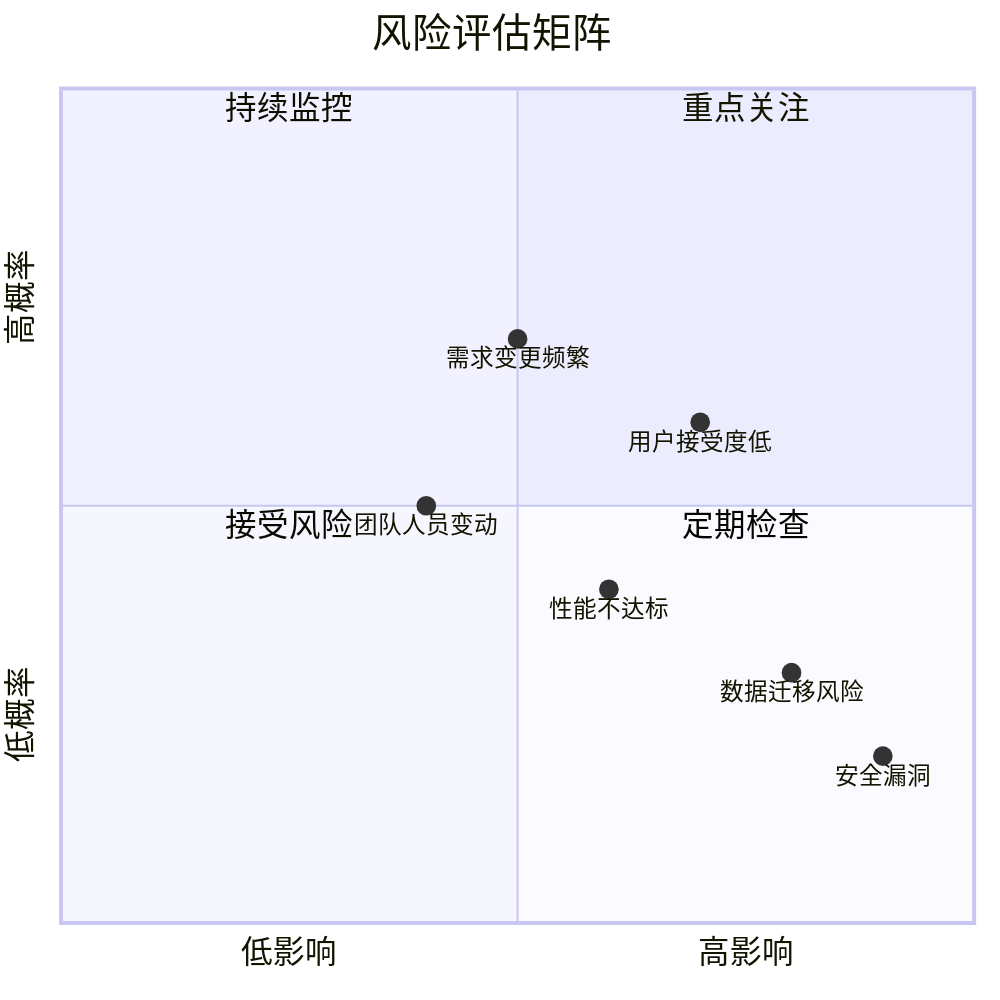
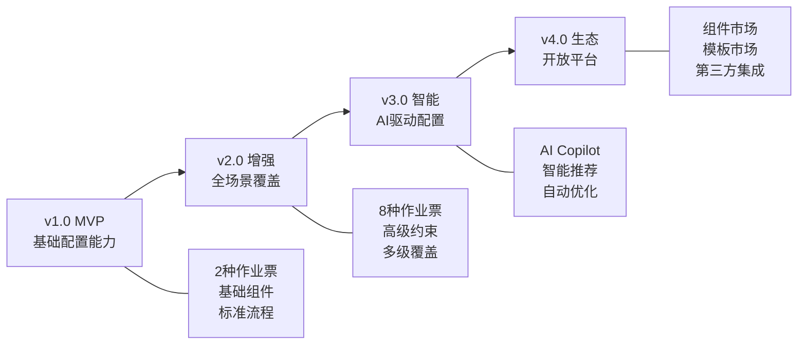

# 12 - 实施落地方案

> **本章导读**: 本章介绍配置端的实施落地方案，包括MVP功能范围定义、分阶段实施计划、用户培训方案和风险评估与应对。

---

## 12.1 MVP功能范围定义

### 12.1.1 MVP核心原则

### 12.1.2 功能优先级矩阵

| 功能模块 | MVP(第一阶段) | 增强(第二阶段) | 高级(第三阶段) |
|---------|:----------:|:----------:|:----------:|
| **Low-Code Builder** | ✅ 基础拖拽 | ✅ 高级交互 | ✅ 协同编辑 |
| **基础输入组件** | ✅ 8个核心组件 | ✅ 扩展组件 | ✅ 自定义组件 |
| **业务组件** | ✅ 签名、拍照 | ✅ 气体检测、人员选择 | ✅ IoT集成组件 |
| **字段级约束** | ✅ 必填、范围、格式 | ✅ 自定义校验 | ✅ 跨表单校验 |
| **字段间依赖** | ✅ 显隐联动 | ✅ 互斥、级联 | ✅ 复杂表达式 |
| **状态机** | ✅ 标准4状态 | ✅ 完整9状态 | ✅ 自定义状态机 |
| **硬约束** | ✅ 强制拍照 | ✅ 分步确认、位置锁定 | ✅ AI审查 |
| **模板库** | ✅ 动火+受限空间 | ✅ 全部8种模板 | ✅ 模板市场 |
| **版本管理** | ✅ 基础版本 | ✅ 灰度发布 | ✅ A/B测试 |
| **多级覆盖** | ❌ | ✅ 公司级覆盖 | ✅ 项目级覆盖 |
| **AI Copilot** | ❌ | ❌ | ✅ NLP+OCR+推荐 |
| **数据分析** | ❌ | ✅ 基础统计 | ✅ BI看板 |

### 12.1.3 MVP功能清单

**必须有(Must Have)**:
1. 可视化表单设计器（拖拽、属性配置、实时预览）
2. 8个基础输入组件（文本、数字、日期、选择、图片上传等）
3. 签名组件、强制拍照组件
4. 字段级约束（必填、范围、格式校验）
5. 基础显隐联动
6. 标准状态机（草稿→待审核→已批准→作业中→已关闭）
7. 动火作业和受限空间作业两个标准模板
8. 基础版本管理（保存、发布）
9. 移动端表单渲染
10. 离线填写支持

**应该有(Should Have)**:
1. 预览模式（PC端+移动端）
2. 配置导入导出
3. 审批流程集成
4. 基础通知功能
5. 操作审计日志

**可以有(Could Have)**:
1. 配置对比功能
2. 批量操作
3. 打印预览

---

## 12.2 分阶段实施计划

### 12.2.1 总体时间线

### 12.2.2 第一阶段：核心功能（3个月）

**目标**: 完成MVP，支持动火作业和受限空间作业两种场景的配置与使用。

| 里程碑 | 时间 | 交付物 | 验收标准 |
|-------|------|--------|---------|
| M1 架构就绪 | 第2周 | 技术架构、开发环境 | 前后端可联调 |
| M2 设计器可用 | 第6周 | Low-Code Builder | 可拖拽创建表单 |
| M3 渲染器可用 | 第9周 | 表单渲染引擎 | 移动端可渲染表单 |
| M4 流程打通 | 第11周 | 状态机+审批 | 完整作业票流程 |
| M5 试点上线 | 第13周 | 试点环境部署 | 2个试点项目使用 |

**团队配置**:

| 角色 | 人数 | 职责 |
|------|------|------|
| 前端开发 | 2人 | Low-Code Builder + 表单渲染器 |
| 后端开发 | 2人 | 元数据服务 + 作业票服务 |
| 移动端开发 | 1人 | 移动端渲染适配 |
| 测试工程师 | 1人 | 功能测试 + 性能测试 |
| 产品经理 | 1人 | 需求管理 + 验收 |

### 12.2.3 第二阶段：增强功能（2个月）

**目标**: 覆盖全部8种作业票类型，支持多级覆盖和灰度发布。

| 里程碑 | 时间 | 交付物 |
|-------|------|--------|
| M6 全模板覆盖 | 第3周 | 8种标准模板 |
| M7 高级约束 | 第3周 | 分步确认、位置锁定 |
| M8 多级覆盖 | 第6周 | 公司级+项目级覆盖 |
| M9 全量上线 | 第8周 | 全公司部署 |

### 12.2.4 第三阶段：高级功能（2个月）

**目标**: 引入AI能力，提供自定义组件框架和BI分析。

| 里程碑 | 时间 | 交付物 |
|-------|------|--------|
| M10 AI Copilot | 第4周 | NLP生成+OCR识别 |
| M11 自定义组件 | 第3周 | 组件扩展框架 |
| M12 BI看板 | 第6周 | 数据分析看板 |
| M13 稳定性优化 | 第8周 | 性能优化、稳定性加固 |

---

## 12.3 用户培训方案

### 12.3.1 培训对象与内容

### 12.3.2 培训计划

| 培训阶段 | 时间 | 对象 | 方式 | 内容 |
|---------|------|------|------|------|
| 种子用户培训 | 上线前2周 | 核心配置员(5人) | 线下集中 | 全功能深度培训 |
| 管理员培训 | 上线前1周 | 各部门管理员(20人) | 线下+线上 | 配置操作+审批流程 |
| 全员培训 | 上线当周 | 全体操作人员 | 线上视频 | 移动端操作指南 |
| 持续支持 | 上线后 | 所有用户 | 在线帮助+客服 | 问题解答+功能更新 |

### 12.3.3 培训材料

| 材料类型 | 内容 | 格式 |
|---------|------|------|
| 操作手册 | 配置端完整操作指南 | PDF/在线文档 |
| 视频教程 | 分模块录制的操作视频 | MP4(每个5-10分钟) |
| 快速参考卡 | 常用操作速查表 | A4单页 |
| FAQ文档 | 常见问题解答 | 在线文档 |
| 沙盒环境 | 练习用的测试环境 | 在线系统 |

---

## 12.4 风险评估与应对

### 12.4.1 风险矩阵

### 12.4.2 风险应对策略

| 风险 | 概率 | 影响 | 应对策略 |
|------|:----:|:----:|---------|
| **用户接受度低** | 中 | 高 | 早期试点验证、持续收集反馈、简化操作流程 |
| **需求变更频繁** | 高 | 中 | 敏捷迭代、MVP先行、预留扩展接口 |
| **性能不达标** | 中 | 中 | 性能基线测试、持续监控、预留优化空间 |
| **数据迁移风险** | 低 | 高 | 迁移脚本预演、数据校验、回滚方案 |
| **安全漏洞** | 低 | 极高 | 安全审计、渗透测试、安全编码规范 |
| **团队人员变动** | 中 | 中 | 知识文档化、交叉培训、代码评审 |
| **第三方依赖风险** | 低 | 中 | 版本锁定、替代方案评估、定期更新 |

### 12.4.3 应急预案

| 场景 | 应急措施 | 恢复时间 |
|------|---------|---------|
| 配置端不可用 | 切换到纸质表单备用流程 | 4小时内恢复 |
| 数据丢失 | 从备份恢复(每日备份) | 2小时内恢复 |
| 性能严重下降 | 降级到静态表单模式 | 1小时内切换 |
| 安全事件 | 立即下线、安全评估、修复后上线 | 视严重程度 |

---

## 12.5 成功标准

### 12.5.1 量化指标

| 指标 | 目标值 | 测量方式 |
|------|--------|---------|
| **配置效率** | 新表单配置时间 < 2小时 | 从空白到发布的时间 |
| **填写效率** | 作业票填写时间减少30% | 对比纸质表单填写时间 |
| **数据质量** | 必填字段完整率 > 99% | 系统统计 |
| **用户满意度** | NPS > 40 | 用户调查 |
| **系统可用性** | 可用率 > 99.5% | 监控系统 |
| **API响应时间** | P95 < 200ms | APM监控 |
| **试点覆盖** | 第一阶段覆盖2个项目 | 项目统计 |
| **全量覆盖** | 第二阶段覆盖全公司 | 组织统计 |

### 12.5.2 质量验收清单

- [ ] 所有MVP功能通过验收测试
- [ ] 性能指标达到目标值
- [ ] 安全审计通过
- [ ] 用户培训完成
- [ ] 运维文档齐全
- [ ] 应急预案演练通过
- [ ] 试点用户反馈正面
- [ ] 数据迁移验证通过

---

## 12.6 后续演进方向

### 12.6.1 中长期规划

### 12.6.2 技术演进

| 方向 | 当前 | 未来 | 价值 |
|------|------|------|------|
| **渲染引擎** | 服务端渲染 | 边缘渲染+WASM | 更快的渲染速度 |
| **AI能力** | 规则推荐 | 自主配置+异常预测 | 降低配置门槛 |
| **协同能力** | 单人配置 | 多人实时协同 | 提高配置效率 |
| **生态开放** | 内置组件 | 组件市场+插件体系 | 丰富功能生态 |
| **数据智能** | 基础统计 | 预测分析+决策支持 | 数据驱动优化 |

---

**上一章**: [11 - 技术实现方案](./11-技术实现方案.md)

**返回目录**: [00 - 目录](./00-目录.md)
