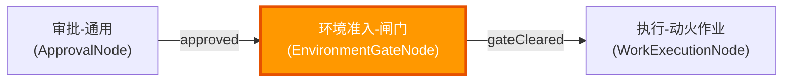
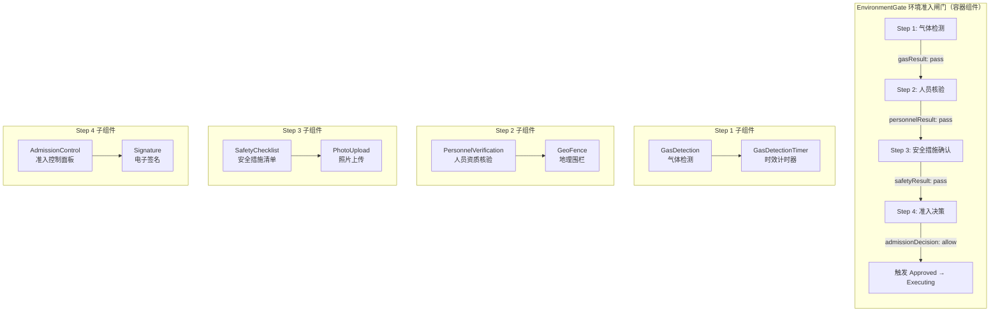
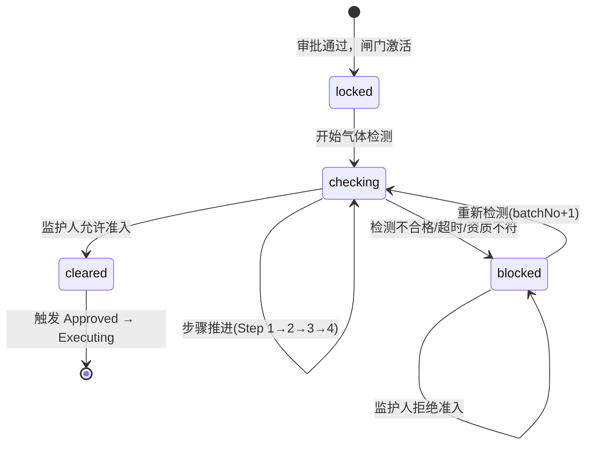
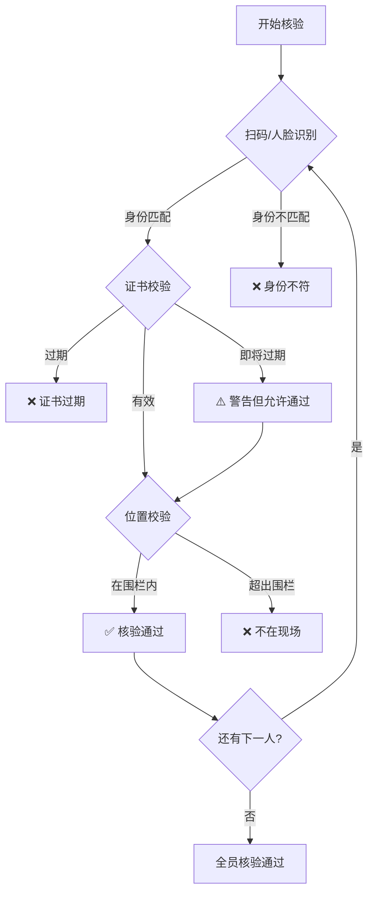
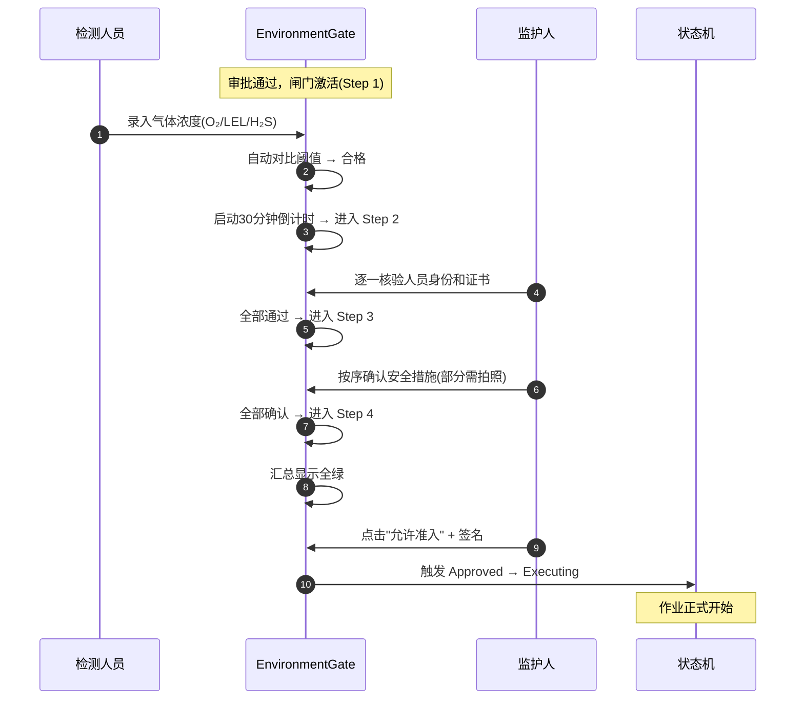
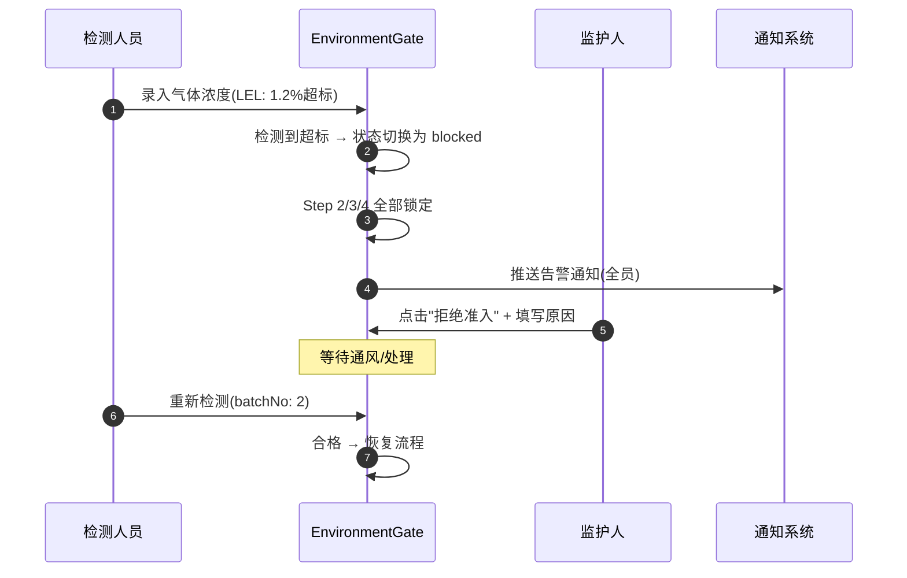
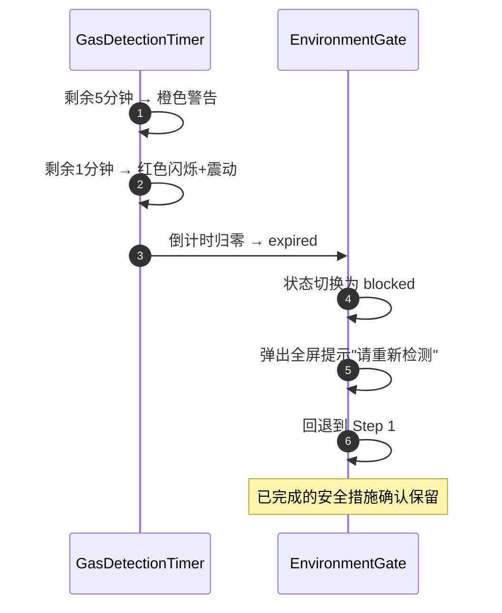

# 13 - 环境准入闸门设计

> **本章导读**: 本章详细介绍"环境触发"节点的前端组件设计方案，包括组件清单、交互流程、监管机制、时效控制和架构融合。环境准入闸门是 `Approved → Executing` 状态转换的核心关卡，串联"检测→核验→确认→放行"四步强制流程，充分体现安全监管功能。

---

## 13.1 业务背景与设计目标

### 13.1.1 业务场景

在特殊作业许可（PTW）流程中，审批通过后、正式开工前存在一个关键的"环境触发"节点：

```
审批通过 → 气体采样检测（合格后填入数据） → 监护人就位（核对人员和证件） → 正式动工
```

**核心监管逻辑**：
- 气体检测具有**30分钟时效性**，超时必须重新检测
- 检测不合格时，监护人有权**拒绝任何人进入现场**
- 所有操作必须在**现场完成**，不允许远程代签

### 13.1.2 设计目标

| 目标 | 说明 | 价值 |
|------|------|------|
| **闸门原子化** | 将气体检测 + 安全检查合并为一个不可分割的闸门节点 | 防止流程被绕过或部分跳过 |
| **时效强制** | 30分钟倒计时 + 后端双重校验 | 确保检测数据的实时有效性 |
| **准入控制** | 监护人拥有最终准入决策权 | 体现"人防+技防"双重保障 |
| **审计追溯** | 每步操作记录时间戳、操作人、GPS位置 | 满足 GB 30871 合规要求 |

### 13.1.3 在工作流中的定位

环境准入闸门对应状态机中 `Approved → Executing` 的转换闸门，在节点图中的位置：



原有的 `n6(检测-气体浓度)` + `n7(检查-安全措施)` 两个独立节点合并为一个原子化的 `EnvironmentGateNode`，确保四步流程不可拆分执行。

---

## 13.2 组件清单

### 13.2.1 组件总览



### 13.2.2 已有组件（直接复用，部分增强）

| 组件 | 环境触发中的角色 | 增强点 |
|------|----------------|--------|
| **GasDetection** | 气体采样检测的核心录入 | 增加30分钟短时效支持；增加"检测批次"概念 |
| **MonitorPanel** | 监护人操作的主界面容器 | 增加"准入闸门"控制区入口 |
| **GeoFence** | 确保所有操作在现场完成 | 直接复用，无需改动 |
| **SafetyChecklist** | 安全措施逐项确认 | 增加与气体检测结果的联动（不合格时锁定清单） |
| **Signature** | 监护人确认签名、检测人员签名 | 增加"角色绑定签名"（校验签名人资质） |
| **PhotoUpload** | 现场环境拍照存证 | 直接复用 |

### 13.2.3 新增组件详细设计

#### 组件一：EnvironmentGate（环境准入闸门）

> **组件路径**: `components/EnvironmentGate/` | **类型**: 容器级组件 | **层级**: Layer 3 EHS行业特定

**Props / Events 接口**：

```typescript
interface EnvironmentGateProps {
  permit: WorkPermit                    // 当前作业票
  currentRole: string                   // 当前用户角色
  gasValidityMinutes?: number           // 气体检测有效期（分钟，默认30）
  geoFenceRequired?: boolean            // 是否强制地理围栏（默认true）
  geoFenceRadius?: number               // 围栏半径（米，默认100）
}

interface EnvironmentGateState {
  gateStatus: 'locked' | 'checking' | 'cleared' | 'blocked'
  currentStep: 1 | 2 | 3 | 4
  gasDetection: {
    status: 'pending' | 'testing' | 'passed' | 'failed' | 'expired'
    results: { oxygen: number | null; combustible: number | null; toxic: number | null }
    detectedAt: string | null
    detectedBy: string | null
    expiresAt: string | null
    batchNo: number
  }
  personnelVerification: {
    status: 'pending' | 'verifying' | 'passed' | 'failed'
    workers: Array<{
      userId: string; name: string; role: string
      certValid: boolean; identityVerified: boolean; verifiedAt: string | null
    }>
    supervisorVerified: boolean
  }
  safetyChecklist: {
    status: 'pending' | 'checking' | 'passed' | 'failed'
    completedCount: number
    totalCount: number
  }
  admission: {
    status: 'pending' | 'allowed' | 'denied'
    decidedBy: string | null
    decidedAt: string | null
    denyReason: string | null
    signatureUrl: string | null
  }
}

interface EnvironmentGateEvents {
  'gate-cleared': () => void                              // 闸门通过，触发状态转换
  'gate-blocked': (reason: string) => void                // 闸门阻断
  'step-change': (step: number) => void                   // 步骤切换
  'admission-denied': (reason: string) => void            // 监护人拒绝准入
}
```

**闸门状态机**：



#### 组件二：PersonnelVerification（人员资质核验）

> **组件路径**: `components/PersonnelVerification/` | **类型**: 业务组件 | **层级**: Layer 3 EHS行业特定

**Props / Events 接口**：

```typescript
interface PersonnelVerificationProps {
  workers: WorkerInfo[]                 // 作业票登记的人员列表
  requiredCerts: CertRequirement[]      // 所需证书类型
  geoFenceCenter: { lat: number; lng: number }  // 围栏中心
  geoFenceRadius: number                // 围栏半径
}

interface WorkerInfo {
  userId: string
  name: string
  role: 'leader' | 'worker' | 'supervisor' | 'detector'
  certType: string                      // 证书类型
  certExpiry: string                    // 证书有效期
  photo?: string                        // 人员照片（用于人脸比对）
}

interface PersonnelVerificationEvents {
  'all-verified': () => void            // 全员核验通过
  'verification-failed': (worker: WorkerInfo, reason: string) => void
}
```

**核验流程**：



#### 组件三：GasDetectionTimer（气体检测时效计时器）

> **组件路径**: `components/GasDetectionTimer/` | **类型**: 逻辑控制组件 | **层级**: Layer 3 EHS行业特定

**Props / Events 接口**：

```typescript
interface GasDetectionTimerProps {
  detectedAt: string                    // 检测完成时间 ISO 8601
  validityMinutes?: number              // 有效期分钟数（默认30）
  warningMinutes?: number               // 进入警告的剩余分钟数（默认5）
}

interface GasDetectionTimerEvents {
  'expired': () => void                 // 超时事件
  'warning': () => void                 // 进入警告区事件
  'tick': (remainingSeconds: number) => void  // 每秒tick
}
```

**视觉规格**：

| 阶段 | 剩余时间 | 颜色 | 行为 |
|------|---------|------|------|
| 正常 | > 5分钟 | 🟢 绿色 | 环形进度条平稳递减 |
| 警告 | 1-5分钟 | 🟠 橙色 | 进度条闪烁 + 文字提示 |
| 紧急 | < 1分钟 | 🔴 红色 | 快速闪烁 + 震动提醒 |
| 超时 | 0 | ⚫ 灰色 | 全屏提示"请重新检测" |

**实现要点**：
- 使用 `requestAnimationFrame` 而非 `setInterval`，避免后台标签页计时不准
- 监听 `visibilitychange` 事件，页面重新激活时立即重新计算剩余时间
- 后端在 `Approved → Executing` 转换时二次校验检测时间，防止前端篡改

#### 组件四：AdmissionControl（准入控制面板）

> **组件路径**: `components/AdmissionControl/` | **类型**: 业务组件 | **层级**: Layer 3 EHS行业特定

**Props / Events 接口**：

```typescript
interface AdmissionControlProps {
  gasStatus: 'passed' | 'failed' | 'expired' | 'pending'
  gasRemainingSeconds: number           // 气体检测剩余有效秒数
  personnelStatus: 'passed' | 'failed' | 'pending'
  personnelCount: { verified: number; total: number }
  safetyStatus: 'passed' | 'failed' | 'pending'
  safetyCount: { completed: number; total: number }
  supervisorInRange: boolean            // 监护人是否在围栏内
  currentRole: string                   // 当前角色（仅 supervisor 可操作）
}

interface AdmissionControlEvents {
  'allow': (signature: string) => void  // 允许准入（附带签名）
  'deny': (reason: string, photo?: string) => void  // 拒绝准入
}
```

**准入条件判定逻辑**：

```typescript
// "允许准入"按钮可用条件（全部满足才可点击）
const canAllow = computed(() =>
  props.gasStatus === 'passed' &&
  props.gasRemainingSeconds > 0 &&
  props.personnelStatus === 'passed' &&
  props.safetyStatus === 'passed' &&
  props.supervisorInRange &&
  props.currentRole === 'supervisor'
)
```

---

## 13.3 页面布局设计

### 13.3.1 EnvironmentGate 整体布局

```
+------------------------------------------------------------------+
|  🛡️ 环境准入闸门                              [闸门状态: 检测中]  |
+------------------------------------------------------------------+
|                                                                    |
|  ┌──────────┐  ┌──────────┐  ┌──────────┐  ┌──────────┐          |
|  │ ① 气体   │→ │ ② 人员   │→ │ ③ 安全   │→ │ ④ 准入   │          |
|  │   检测    │  │   核验   │  │   措施   │  │   决策   │          |
|  │  🟢通过   │  │  🟡进行中 │  │  ⚪未激活 │  │  ⚪未激活 │          |
|  └──────────┘  └──────────┘  └──────────┘  └──────────┘          |
|                                                                    |
|  ┌─────────────────────────────────────────────────────────────┐  |
|  │                    当前步骤详情区                              │  |
|  │  (根据 currentStep 动态渲染对应子组件)                        │  |
|  └─────────────────────────────────────────────────────────────┘  |
|                                                                    |
|  ┌─────────────────────────────────────────────────────────────┐  |
|  │  🔴 [拒绝准入]                          🟢 [允许准入]        │  |
|  └─────────────────────────────────────────────────────────────┘  |
+------------------------------------------------------------------+
```

**视觉设计语言**（交通信号灯隐喻）：
- 🔴 红色（#ff4d4f）：阻断/不合格/超时 — 任何人不得进入
- 🟠 橙色（#faad14）：检测中/核验中 — 流程进行中
- 🟢 绿色（#52c41a）：通过/合格 — 条件满足
- ⚪ 灰色（#8c8c8c）：未激活/锁定 — 前置步骤未完成

### 13.3.2 各步骤详情区

**Step 1 气体检测**：左侧气体检测结果卡片 + 右侧30分钟环形倒计时 + 底部 AI 趋势分析提示

**Step 2 人员核验**：人员列表（姓名/角色/证书状态/身份核验状态）+ 地理围栏全员在场状态 + 时空验证徽章

**Step 3 安全措施**：复用 SafetyChecklist 组件（verify 模式，强制按序+拍照）

**Step 4 准入决策**：四项条件汇总（绿色/红色状态灯）+ 监护人签名区 + 允许/拒绝按钮

---

## 13.4 监管功能的三重保障

### 13.4.1 第一重：技术强制（硬约束 P0，不可绕过）

| 约束 | 实现方式 | 绕过防护 |
|------|---------|---------|
| 气体检测不合格 | "允许准入"按钮在代码层面 `disabled` | 非 CSS 隐藏，后端二次校验 |
| 30分钟时效 | 前端倒计时 + 后端 `DATE_DIFF` 校验 | 防止篡改客户端时间 |
| 现场操作 | GeoFence 100米围栏 + Haversine 距离计算 | GPS 欺骗检测（多点校验） |

### 13.4.2 第二重：流程强制（分步确认，不可跳过）

- 四个步骤严格串行，使用约束系统的 `sequential: true` + `dependsOn` 机制
- 每步完成后记录时间戳和操作人，形成不可篡改的审计轨迹
- 步骤间不可回退（除非系统自动回退，如时效过期）

### 13.4.3 第三重：人员强制（角色绑定，不可代签）

- 气体检测必须由持有检测资质的人员操作（CertificationNode 校验）
- 准入决策必须由指定监护人签字（Signature 组件绑定角色校验）
- 签名时强制 GeoFence 校验，防止远程代签

---

## 13.5 拒绝准入机制

### 13.5.1 自动拒绝（系统触发）

| 触发条件 | 阈值 | 系统动作 |
|---------|------|---------|
| 氧气浓度异常 | < 19.5% 或 > 23.5% | 锁定闸门 + 全员告警（推送+短信+语音） |
| 可燃气体超标 | > 0.5% LEL | 锁定闸门 + 全员告警 |
| 有毒气体超标 | 超过对应标准值 | 锁定闸门 + 全员告警 |
| 检测时效过期 | > 30分钟 | 锁定闸门 + 要求重测 |
| 人员资质不符 | 证书过期/无证 | 阻止该人员进入 |
| 位置校验失败 | 超出100米围栏 | 阻止当前操作 |

**UI 表现**：全屏红色半透明遮罩 + 阻断原因 + 所有后续步骤锁定

### 13.5.2 手动拒绝（监护人触发）

- 监护人在任意步骤均可点击"拒绝准入"
- 必填拒绝原因（textarea，minLength: 10）+ 可选上传现场照片（PhotoUpload，camera_only）
- 确认后：闸门状态切换为 blocked，记录拒绝决策（时间、人员、原因、照片），通知所有相关人员
- 作业票保持 Approved 状态，等待问题解决后重新走环境触发流程

---

## 13.6 关键交互流程

### 13.6.1 正常通过（Happy Path）



### 13.6.2 气体检测不合格



### 13.6.3 30分钟时效过期



---

## 13.7 与现有架构的融合

### 13.7.1 节点库集成

在 `nodeLibrary.json` 的 `layer3_industry` 中新增 `EnvironmentGateNode`：

```json
{
  "id": "环境准入-闸门",
  "type": "EnvironmentGateNode",
  "layer": 3,
  "reusability": "industry_specific",
  "config": {
    "steps": ["gas_detection", "personnel_verification", "safety_checklist", "admission_control"],
    "sequential": true,
    "gasValidityMinutes": 30,
    "geoFenceRequired": true,
    "geoFenceRadius": 100,
    "autoBlockConditions": [
      { "field": "gas_oxygen", "condition": "< 19.5 || > 23.5" },
      { "field": "gas_combustible", "condition": "> 0.5" }
    ]
  }
}
```

在 `hot_work_workflow` 中，用"环境准入-闸门"替代原来的 n6 + n7：

```
n5(审批-通用) --[approved]--> n6(环境准入-闸门) --[gateCleared]--> n8(执行-动火作业)
```

### 13.7.2 状态机集成

`Approved → Executing` 转换的前置条件更新：

```json
{
  "from": "approved",
  "to": "executing",
  "trigger": "start_work",
  "preconditions": [
    { "type": "environment_gate", "status": "cleared" },
    { "type": "expression", "expr": "data.gas_detection_status === 'passed'" },
    { "type": "expression", "expr": "DATE_DIFF(NOW(), data.gas_detected_at, 'minutes') <= 30" },
    { "type": "expression", "expr": "data.personnel_verified === true" },
    { "type": "expression", "expr": "data.safety_checklist_complete === true" },
    { "type": "expression", "expr": "data.admission_decision === 'allowed'" }
  ],
  "permissions": ["supervisor"],
  "sideEffects": [
    { "type": "notify", "targets": ["all_related"], "template": "work_started" },
    { "type": "set_field", "field": "work_started_at", "value": "NOW()" },
    { "type": "start_monitoring", "interval": "5m" },
    { "type": "audit_log", "action": "environment_gate_cleared" }
  ]
}
```

### 13.7.3 约束系统集成

| 约束层级 | 具体约束 | 优先级 |
|---------|---------|--------|
| P0 硬约束 | 强制拍照（camera_only）、位置锁定（geo_fencing）、分步确认（sequential） | 最高，不可绕过 |
| P1 状态约束 | 气体检测字段仅在 Approved/Executing 状态可编辑 | 高 |
| P2 字段间依赖 | 检测不合格时隐藏后续步骤；检测超时时锁定准入按钮 | 中 |
| P3 字段级约束 | 氧气浓度范围 19.5-23.5%；可燃气体 < 0.5% LEL | 基础 |

### 13.7.4 表达式引擎扩展

新增业务函数：

```typescript
// 气体检测时效校验
GAS_VALID(detectedAt: string, validityMinutes: number): boolean
// 返回 true 表示检测结果仍在有效期内

// 使用示例（约束规则中）
{
  "key": "admission_allow_button",
  "enabledIf": "GAS_VALID(data.gas_detected_at, 30) && data.personnel_verified && data.safety_checklist_complete"
}
```

### 13.7.5 元数据配置

环境准入闸门在 `layoutConfig` 中表达为独立的 Card 分组：

```json
{
  "type": "card",
  "key": "environment_gate_card",
  "title": "环境准入闸门",
  "icon": "shield-check",
  "visibleIf": "INCLUDES(['approved'], context.state)",
  "collapsible": false,
  "priority": "critical",
  "children": [
    "environment_gate_steps",
    "gas_detection_section",
    "gas_detection_timer",
    "personnel_verification_section",
    "safety_checklist_section",
    "admission_control_section"
  ]
}
```

---

**上一章**: [12 - 实施落地方案](./12-实施落地方案.md)

**返回目录**: [00 - 目录](./00-目录.md)
