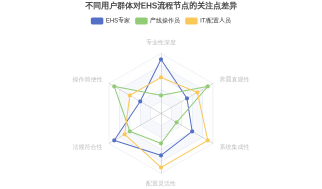
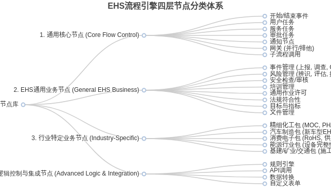
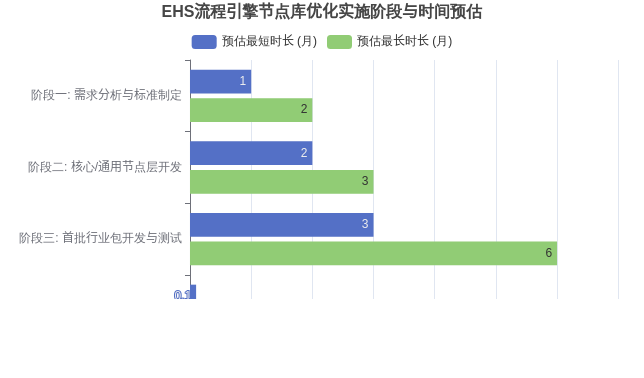
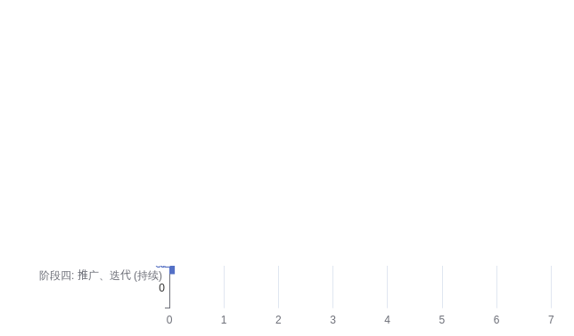

> ⽂档⽣成时间：2025-06-03

⾯向多⾏业⽤⼾的**EHS**流程引擎节点库优化 设计

引⾔：**EHS**流程引擎节点库优化的必要性与⽬标

环境、健康与安全（Environment, Health, and Safety,
EHS）管理是现代企业可持续运营的基⽯，
其重要性⽇益凸显。随着数字化浪潮的推进，EHS管理信息化已成为提升企业合规能⼒、⻛险
控制⽔平和运营效率的关键⼿段。在这⼀转型过程中，流程引擎（Process
Engine）扮演着核⼼
⻆⾊，它通过标准化、⾃动化EHS管理流程，显著提升了管理⼯作的规范性和执⾏效率[（华为](https://www.huaweicloud.com/guide/page-701)
[云⽤⼾⼿册 - 流程管理](https://www.huaweicloud.com/guide/page-701)）。

然⽽，当前的EHS流程引擎节点库在实际应⽤中普遍⾯临挑战。它们往往侧重于通⽤EHS功
能，针对专业EHS⼈员设计，导致⾮专业背景⽤⼾（如产线操作员、基层管理者）的理解和使
⽤⻔槛较⾼。此外，通⽤性强的节点库难以快速、深⼊地适应不同⼯业领域（如消费电⼦、汽
⻋制造、精细化⼯、能源、基建矿业交通等）⾼度特异化的EHS管理需求和法规遵循。这种“⼀
⼑切”的设计，既影响了⽤⼾体验，也制约了流程引擎在更⼴泛⾏业场景中的深度应⽤和价值发
挥。

本优化设计⽅案聚焦于解决⽤⼾反馈的核⼼问题：节点不易理解导致⽤⼾体验不佳，以及现有
节点库设计对⾏业特定需求的扩展⽀持不⾜。因此，优化的双重⽬标在于：第⼀，显著提升
**EHS**流程引擎节点库对各类⽤⼾（尤其是⾮**EHS**专业背景的操作⼈员）的友好性和易⽤性；第
⼆，构建⼀套灵活且可扩展的节点体系，能够有效⽀撑和适应不同⼯业领域的**EHS**管理特⾊和
**специфичные** 需求。

本⽂档旨在提供⼀套针对EHS流程引擎节点库的深度优化设计⽅案，通过系统性的分析和具体
的设计指引，为开发者、产品设计者以及EHS管理实践者提供可操作的参考，以期推动EHS流
程引擎向更易⽤、更专业、更具⾏业适应性的⽅向发展。

核⼼问题剖析：当前**EHS**流程引擎节点库为何亟待优 化？

EHS流程引擎的节点库是⽤⼾与系统交互的核⼼界⾯，其设计的优劣直接影响到系统的可⽤
性、实施效率和最终的业务价值。当前多数EHS流程引擎节点库亟待优化，主要体现在⽤⼾友

好性缺失和⾏业扩展性不⾜两⼤⽅⾯。

⽤⼾友好性缺失：理解与操作的壁垒

⽤⼾友好性是衡量软件产品成功与否的关键指标之⼀。在EHS流程引擎中，节点库的设计直接
关系到⽤⼾能否快速理解并准确配置业务流程。然⽽，当前许多节点库在此⽅⾯存在明显短
板。

节点命名与图标的迷思

节点的名称和图标是⽤⼾认知节点功能的第⼀触点。普遍存在的问题包括：

> 命名偏技术化、标准化不⾜：节点名称往往充斥着EHS专业术语或系统内部的技术词汇，对
> ⾮专业⽤⼾极不友好。例如，“⻛险矩阵关联节点”可能不如“⻛险等级评估节点”直观；
> “LDAR组件泄漏检测任务”对⾮LDAR（Leak Detection and
> Repair，泄漏检测与修复）专业⼈ 员⽽⾔难以理解。
>
> 图标抽象、缺乏直观性与⼀致性：许多图标设计过于抽象或通⽤（如统⼀使⽤⻮轮、⽅
> 框），未能有效传递节点的核⼼功能或所属业务域。图标体系缺乏⼀致性，增加了⽤⼾的记
> 忆负担和混淆概率。正如 Boardmix
> 的⽂章所指出的，流程图符号需要清晰地展⽰执⾏流程
> 和逻辑结构，为⽤⼾提供直观易懂的参考⼯具（[程序流程图是什么？基本元素、绘制⽅法及](https://boardmix.cn/article/what-is-program-flowchart/)
> [应⽤场景解析 -
> Boardmix](https://boardmix.cn/article/what-is-program-flowchart/)）。

这些问题直接导致⽤⼾，尤其是⾮EHS背景⼈员，在⾯对节点库时感到困惑，学习曲线陡峭，
严重影响流程配置的效率和准确性。

参数配置的复杂性与引导缺失

节点参数配置是将通⽤节点适配到具体业务场景的关键步骤。

> 参数繁多、逻辑层级深：部分核⼼EHS节点（如“事件上报”、“变更管理审批”）可能包含数
> ⼗个配置参数，若⽆清晰组织，⽤⼾极易迷失。参数间的逻辑关系复杂，缺乏清晰的层级展
> 现。
>
> 标签说明不清晰、引导不⾜：参数标签有时采⽤缩写或模糊表达，⽤⼾难以理解其确切含
> 义。配置过程中缺乏有效的默认值建议、输⼊格式校验和实时帮助信息，⽤⼾在遇到问题时
> 往往求助⽆⻔。

复杂的参数配置不仅增加了⽤⼾的操作难度，也提⾼了配置错误导致流程运⾏异常的⻛险。

不同⽤⼾群体的认知差异

EHS流程的参与者⻆⾊多样，其对节点库的认知和需求也存在显著差异：

||
||
||

||
||
||

||
||
||

||
||
||
||
||
||

||
||
||
||
||
||

||
||
||

||
||
||

||
||
||

||
||
||

||
||
||

||
||
||

||
||
||

||
||
||

||
||
||

||
||
||

||
||
||

||
||
||

||
||
||

||
||
||

||
||
||

EHS流程引擎节点库的优化，是提升企业EHS（环境、健康、安全）管理数字化⽔平和运营效
能的核⼼环节。它直接关系到企业能否⾼效地将复杂的EHS管理要求转化为可执⾏、可追溯、
可优化的标准化流程，能否降低⼀线⼈员的操作⻔槛，能否快速响应⽇益严格且频繁变化的法
规标准，以及能否灵活适应不同⾏业、不同发展阶段的特定需求。因此，对其进⾏系统性、前
瞻性的优化设计具有⾄关重要的战略意义。

本⽂提出的核⼼设计理念——采纳**“**分层与标准化的节点重构**”**策略，并深度融合**“**场景化封装**”**
与**“**智能辅助**”**的理念——旨在从根本上解决当前EHS流程引擎节点库普遍存在的⽤⼾友好性不
⾜和⾏业扩展性受限两⼤痛点。该⽅案强调通过结构化的节点分类、标准化的设计语⾔（命
名、图标、参数、描述）、⽤⼾导向的交互优化，以及模块化、可插拔的⾏业节点包架构，来系
统性地提升节点库的易⽤性、专业性和扩展性。

> 对用户而言，这意味着更低的认知负荷、更短的学习曲线、更流畅的操作体验，以及更贴近
> 实际⼯作场景的功能⽀持。
>
> 对企业而言，这意味着更⾼的EHS流程配置效率、更强的法规符合能⼒、更低的实施与维护
> 成本，以及更灵活地适应业务发展和⾏业特性的能⼒。

成功的节点库优化并非一蹴而就的技术升级，它更是一项需要企业在战略层面予以高度重视、
在资源配置上给予充分投入、在实施方法上讲求科学系统，并始终坚持以用户为中心、持续迭
代改进的管理变革。企业需要深刻理解，一个设计精良的EHS流程引擎节点库，不仅仅是IT系
统的组成部分，更是EHS管理体系有效落地的关键赋能⼯具，是企业安全⽂化培育和⻛险控制
能⼒提升的重要载体。

我们倡议，相关企业和EHS流程引擎的开发者、设计者，能够积极采纳本⽂提出的优化思路和
实施纲要，勇于创新，精益求精。通过共同努⼒，构建出⼀个既易于各层级⽤⼾理解和操作，
⼜能灵活适应千⾏百业特定EHS管理需求的强⼤流程引擎节点库，使其真正成为助⼒企业驾驭
EHS管理复杂性、实现安全⽣产、履⾏社会责任、达成可持续发展⽬标的得⼒引擎和坚实后
盾。最终，⼀个更友好、更智能、更⼴泛适⽤的EHS流程引擎，将为创造更安全、更健康、更
绿⾊的⼯作环境和社会做出积极贡献。
