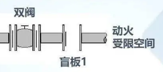

**GB30871---2022---《安全作业票（证）》样式填写模板**

**《动火安全作业票（证）》样式填写模板**

（一）动火安全作业票（证） 编号：DH2022093001

<table>
<colgroup>
<col style="width: 7%" />
<col style="width: 8%" />
<col style="width: 4%" />
<col style="width: 20%" />
<col style="width: 1%" />
<col style="width: 7%" />
<col style="width: 6%" />
<col style="width: 9%" />
<col style="width: 4%" />
<col style="width: 0%" />
<col style="width: 6%" />
<col style="width: 10%" />
<col style="width: 11%" />
</colgroup>
<thead>
<tr class="header">
<th colspan="3"><blockquote>

申请单位

</blockquote></th>
<th>设备维修班组</th>
<th colspan="2"><blockquote>

申请人

</blockquote></th>
<th>×××</th>
<th colspan="3"><blockquote>

作业申请时间

</blockquote></th>
<th colspan="3"><blockquote>

2022年9月30 日8时00分

</blockquote></th>
</tr>
</thead>
<tbody>
<tr class="odd">
<td colspan="3"><blockquote>

作业内容

</blockquote></td>
<td colspan="4">甲苯管道泄漏焊接</td>
<td colspan="3"><blockquote>

动火地点

</blockquote></td>
<td colspan="3">甲苯储罐区围堰内</td>
</tr>
<tr class="even">
<td colspan="3"><blockquote>

动火作业级别

</blockquote></td>
<td colspan="10"><blockquote>

特级√一级□ 二级□

</blockquote></td>
</tr>
<tr class="odd">
<td colspan="3"><blockquote>

动火方式

</blockquote></td>
<td colspan="10">切割、电焊</td>
</tr>
<tr class="even">
<td colspan="3"><blockquote>

动火作业实施时间

</blockquote></td>
<td colspan="10"><blockquote>

自2022年9月30日8时10分始 至2022年 9月30日11 时00分止

</blockquote></td>
</tr>
<tr class="odd">
<td colspan="3"><blockquote>

动火作业负责人

</blockquote></td>
<td colspan="2">×××</td>
<td colspan="2"><blockquote>

动火人

</blockquote></td>
<td colspan="6">×××（具备特种作业证人员）</td>
</tr>
<tr class="even">
<td colspan="3"><blockquote>

动火分析时间

</blockquote></td>
<td colspan="2"><blockquote>

9月30日 8时10分

</blockquote></td>
<td colspan="4"><blockquote>

月 日 时 分

</blockquote></td>
<td colspan="4"><blockquote>

月 日 时 分

</blockquote></td>
</tr>
<tr class="odd">
<td colspan="3"><blockquote>

分析点名称

</blockquote></td>
<td colspan="2">甲苯储罐区围堰内及焊接管道内甲苯数据</td>
<td colspan="4"></td>
<td colspan="4"></td>
</tr>
<tr class="even">
<td colspan="3"><blockquote>

分析数据（10%LEL）

</blockquote></td>
<td colspan="2">甲苯气体数据0</td>
<td colspan="4"></td>
<td colspan="4"></td>
</tr>
<tr class="odd">
<td colspan="3"><blockquote>

分析人

</blockquote></td>
<td colspan="2">×××</td>
<td colspan="4"></td>
<td colspan="4"></td>
</tr>
<tr class="even">
<td colspan="3"><blockquote>

涉及的其他特殊作业

</blockquote></td>
<td colspan="10">临时用电作业LD2022093001、盲板抽堵作业MB2022093001</td>
</tr>
<tr class="odd">
<td colspan="3"><blockquote>

风险辨识结果

</blockquote></td>
<td colspan="10"></td>
</tr>
<tr class="even">
<td><blockquote>

序号

</blockquote></td>
<td colspan="10"><blockquote>

安全措施

</blockquote></td>
<td><blockquote>

是否涉及

</blockquote></td>
<td><blockquote>

确认人

</blockquote></td>
</tr>
<tr class="odd">
<td><blockquote>

1

</blockquote></td>
<td colspan="10"><blockquote>

动火设备内部构件清理干净，蒸汽吹扫或水洗合格，达到动火条件

</blockquote></td>
<td>√</td>
<td>×××</td>
</tr>
<tr class="even">
<td><blockquote>

2

</blockquote></td>
<td colspan="10"><blockquote>

断开与动火设备相连接的所有管线，加盲板（ 2 ）块

</blockquote></td>
<td>√</td>
<td>×××</td>
</tr>
<tr class="odd">
<td><blockquote>

3

</blockquote></td>
<td colspan="10"><blockquote>

动火点周围的下水井、地漏、地沟、电缆沟等已清除易燃物，并已采取覆盖、铺沙、
水封等手段进行隔离

</blockquote></td>
<td>√</td>
<td>×××</td>
</tr>
<tr class="even">
<td><blockquote>

4

</blockquote></td>
<td colspan="10"><blockquote>

罐区内动火点同一围堰内和防火间距内的油罐无同时进行的脱水作业

</blockquote></td>
<td>×</td>
<td>×××</td>
</tr>
<tr class="odd">
<td><blockquote>

5

</blockquote></td>
<td colspan="10"><blockquote>

高处作业已采取防火花飞溅措施

</blockquote></td>
<td>√</td>
<td>×××</td>
</tr>
<tr class="even">
<td><blockquote>

6

</blockquote></td>
<td colspan="10"><blockquote>

动火点周围易燃物已清除

</blockquote></td>
<td>√</td>
<td>×××</td>
</tr>
<tr class="odd">
<td><blockquote>

7

</blockquote></td>
<td colspan="10"><blockquote>

电焊回路线已接在焊件上，把线未穿过下水井或与其他设备搭接

</blockquote></td>
<td>√</td>
<td>×××</td>
</tr>
<tr class="even">
<td><blockquote>

8

</blockquote></td>
<td colspan="10"><blockquote>

乙炔气瓶（直立放置并有防倾倒措施）、氧气瓶与火源间的距离大于 10m

</blockquote></td>
<td>√</td>
<td>×××</td>
</tr>
<tr class="odd">
<td><blockquote>

9

</blockquote></td>
<td colspan="10"><blockquote>

现场配备消防蒸汽带（ 1 ）根，灭火器（2）台，铁锹（1）把，石棉布（1
）块

</blockquote></td>
<td>√</td>
<td>×××</td>
</tr>
<tr class="even">
<td><blockquote>

10

</blockquote></td>
<td colspan="11"><blockquote>

其他安全措施：接消防水袋一根

</blockquote>

编制人 ：×××
</td>
<td></td>
</tr>
<tr class="odd">
<td colspan="2"><blockquote>

安全交底人

</blockquote></td>
<td colspan="4">×××</td>
<td colspan="2"><blockquote>

接受交底人

</blockquote></td>
<td colspan="5">×××</td>
</tr>
<tr class="even">
<td colspan="2"><blockquote>

动火措施初审人

</blockquote></td>
<td colspan="4">×××</td>
<td colspan="2"><blockquote>

监护人

</blockquote></td>
<td colspan="5">×××</td>
</tr>
<tr class="odd">
<td colspan="13"><blockquote>

作业单位负责人意见 同意作业

签字：××× 2022年9月30 日8时12分

</blockquote></td>
</tr>
<tr class="even">
<td colspan="13"><blockquote>

动火点所在车间（分厂）负责人 同意作业

签字：××× 2022年9月30 日8时13分

</blockquote></td>
</tr>
<tr class="odd">
<td colspan="13"><blockquote>

安全管理部门意见 同意作业

签字：××× 2022年9月30 日8时15分

</blockquote></td>
</tr>
<tr class="even">
<td colspan="13"><blockquote>

动火审批人意见 同意作业

签字：××× 2022年9月30 日8时16分

</blockquote></td>
</tr>
<tr class="odd">
<td colspan="13"><blockquote>

动火前，岗位顶班班长验票

</blockquote>

已验票，现场安全措施已落实到位

<blockquote>

签字：××× 2022年9月30 日8时20分

</blockquote></td>
</tr>
<tr class="even">
<td colspan="13"><blockquote>

完工验收 动火作业已完成，作业现场已清理

签字：×××2022年9月30 日10时40分

</blockquote></td>
</tr>
</tbody>
</table>

**《受限空间安全作业票（证）》样式填写模板**

> （二）受限空间安全作业票（证） 编号：SX2022093001

<table>
<colgroup>
<col style="width: 6%" />
<col style="width: 8%" />
<col style="width: 4%" />
<col style="width: 4%" />
<col style="width: 13%" />
<col style="width: 4%" />
<col style="width: 5%" />
<col style="width: 1%" />
<col style="width: 6%" />
<col style="width: 4%" />
<col style="width: 6%" />
<col style="width: 1%" />
<col style="width: 1%" />
<col style="width: 3%" />
<col style="width: 13%" />
<col style="width: 12%" />
</colgroup>
<thead>
<tr class="header">
<th colspan="3"><blockquote>

申请单位

</blockquote></th>
<th colspan="2">设备维修班组</th>
<th colspan="2"><blockquote>

申请人

</blockquote></th>
<th colspan="2">×××</th>
<th colspan="4"><blockquote>

作业申请时间

</blockquote></th>
<th colspan="3"><blockquote>

2022年9月30 日8时00分

</blockquote></th>
</tr>
</thead>
<tbody>
<tr class="odd">
<td colspan="3"><blockquote>

受限空间所属单位

</blockquote></td>
<td colspan="2">仓库</td>
<td colspan="7"><blockquote>

受限空间名称

</blockquote></td>
<td colspan="4">甲苯储罐</td>
</tr>
<tr class="even">
<td colspan="3"><blockquote>

作业内容

</blockquote></td>
<td colspan="2">甲苯储罐内焊接维修</td>
<td colspan="7"><blockquote>

受限空间内原有介质名称

</blockquote></td>
<td colspan="4">甲苯</td>
</tr>
<tr class="odd">
<td colspan="3"><blockquote>

作业实施时间

</blockquote></td>
<td colspan="13"><blockquote>

自2022年9月30日8时10分始 至2022年 9月30日11 时00分止

</blockquote></td>
</tr>
<tr class="even">
<td colspan="3"><blockquote>

作业单位负责人

</blockquote></td>
<td colspan="13">×××</td>
</tr>
<tr class="odd">
<td colspan="3"><blockquote>

监护人

</blockquote></td>
<td colspan="13">×××</td>
</tr>
<tr class="even">
<td colspan="3"><blockquote>

作业人

</blockquote></td>
<td colspan="13">×××</td>
</tr>
<tr class="odd">
<td colspan="3"><blockquote>

涉及的其他特殊作业

</blockquote></td>
<td colspan="3">动火作业、盲板抽堵作业</td>
<td colspan="6"><blockquote>

涉及的其他特殊作业安全作

业证编号

</blockquote></td>
<td colspan="4">DH2022093001、MB2022093001</td>
</tr>
<tr class="even">
<td colspan="3"><blockquote>

危害辨识结果

</blockquote></td>
<td colspan="13">中毒和窒息、火灾、爆炸、触电、灼烫、其他伤害</td>
</tr>
<tr class="odd">
<td colspan="2" rowspan="8"><blockquote>

分析

</blockquote></td>
<td colspan="2"><blockquote>

分析项目

</blockquote></td>
<td><blockquote>

有毒有害介质

</blockquote></td>
<td colspan="3"><blockquote>

可燃气

</blockquote></td>
<td colspan="2"><blockquote>

氧含量

</blockquote></td>
<td colspan="4" rowspan="2"><blockquote>

时间

</blockquote></td>
<td rowspan="2"><blockquote>

部位

</blockquote></td>
<td rowspan="2"><blockquote>

分析人

</blockquote></td>
</tr>
<tr class="even">
<td colspan="2"><blockquote>

分析标准

</blockquote></td>
<td>50mg/m³</td>
<td colspan="3">小于10%LEL</td>
<td colspan="2">19.5%～21%</td>
</tr>
<tr class="odd">
<td colspan="2" rowspan="6"><blockquote>

分析数据

</blockquote></td>
<td>0</td>
<td colspan="3">0</td>
<td colspan="2">20%</td>
<td colspan="4">8:10</td>
<td>储罐底部作业处</td>
<td>×××</td>
</tr>
<tr class="even">
<td>0</td>
<td colspan="3">0</td>
<td colspan="2">20.2%</td>
<td colspan="4">8:12</td>
<td>储罐中部</td>
<td>×××</td>
</tr>
<tr class="odd">
<td>0</td>
<td colspan="3">0</td>
<td colspan="2">20.3%</td>
<td colspan="4">8:14</td>
<td>储罐上部</td>
<td>×××</td>
</tr>
<tr class="even">
<td></td>
<td colspan="3"></td>
<td colspan="2"></td>
<td colspan="4"></td>
<td></td>
<td></td>
</tr>
<tr class="odd">
<td></td>
<td colspan="3"></td>
<td colspan="2"></td>
<td colspan="4"></td>
<td></td>
<td></td>
</tr>
<tr class="even">
<td></td>
<td colspan="3"></td>
<td colspan="2"></td>
<td colspan="4"></td>
<td></td>
<td></td>
</tr>
<tr class="odd">
<td><blockquote>

序号

</blockquote></td>
<td colspan="13"><blockquote>

安全措施

</blockquote></td>
<td><blockquote>

是否涉及

</blockquote></td>
<td><blockquote>

确认人

</blockquote></td>
</tr>
<tr class="even">
<td><blockquote>

1

</blockquote></td>
<td colspan="13"><blockquote>

对进入受限空间危险性进行分析

</blockquote></td>
<td>√</td>
<td>×××</td>
</tr>
<tr class="odd">
<td><blockquote>

2

</blockquote></td>
<td colspan="13"><blockquote>

所有与受限空间有联系的阀门、管线加盲板隔离，列出盲板清单，落实抽堵盲板

责任人

</blockquote></td>
<td>√</td>
<td>×××</td>
</tr>
<tr class="even">
<td><blockquote>

3

</blockquote></td>
<td colspan="13"><blockquote>

设备经过置换、吹扫、蒸煮

</blockquote></td>
<td>√</td>
<td>×××</td>
</tr>
<tr class="odd">
<td><blockquote>

4

</blockquote></td>
<td colspan="13"><blockquote>

设备打开通风孔进行自然通风，温度适宜人员作业；必要时采用强制通风或佩戴
隔绝式呼吸防护装备，未采用通氧气或富氧空气的方法补充氧

</blockquote></td>
<td>√</td>
<td>×××</td>
</tr>
<tr class="even">
<td><blockquote>

5

</blockquote></td>
<td colspan="13"><blockquote>

相关设备已进行处理，带搅拌机的设备已切断电源，电源开关处已加锁或挂“禁

止合闸”标志牌，设专人监护

</blockquote></td>
<td>√</td>
<td>×××</td>
</tr>
<tr class="odd">
<td><blockquote>

6

</blockquote></td>
<td colspan="13"><blockquote>

检查受限空间内部已具备作业条件，清罐时(无需用/已采用)防爆工具

</blockquote></td>
<td>√</td>
<td>×××</td>
</tr>
<tr class="even">
<td><blockquote>

7

</blockquote></td>
<td colspan="13"><blockquote>

检查受限空间进出口通道，无阻碍人员进出的障碍物

</blockquote></td>
<td>√</td>
<td>×××</td>
</tr>
<tr class="odd">
<td><blockquote>

8

</blockquote></td>
<td colspan="13"><blockquote>

分析盛装过可燃有毒液体、气体的受限空间内的可燃、有毒有害气体含量

</blockquote></td>
<td>√</td>
<td>×××</td>
</tr>
<tr class="even">
<td><blockquote>

9

</blockquote></td>
<td colspan="13"><blockquote>

作业人员清楚受限空间内存在的其他危险因素，如内部附件、集渣坑等

</blockquote></td>
<td>√</td>
<td>×××</td>
</tr>
<tr class="odd">
<td><blockquote>

10

</blockquote></td>
<td colspan="13"><blockquote>

作业监护措施：消防器材（ ）、救生绳（ ）、气防装备（ ）

</blockquote></td>
<td>√</td>
<td>×××</td>
</tr>
<tr class="even">
<td><blockquote>

11

</blockquote></td>
<td colspan="14"><blockquote>

其他安全措施：

</blockquote>

佩戴隔绝式呼吸防护装备，并拴带救生绳

编制人 ：×××
</td>
<td></td>
</tr>
<tr class="odd">
<td colspan="3"><blockquote>

安全交底人

</blockquote></td>
<td colspan="5">×××</td>
<td colspan="3"><blockquote>

接受交底人

</blockquote></td>
<td colspan="5">×××</td>
</tr>
<tr class="even">
<td colspan="16"><blockquote>

作业单位负责人意见

</blockquote>

安全措施已落实，同意作业

<blockquote>

签字：××× 2022年9月30 日8时15分

</blockquote></td>
</tr>
<tr class="odd">
<td colspan="16"><blockquote>

审批单位负责人意见

</blockquote>

同意作业

<blockquote>

签字：××× 2022年9月30 日8时20分

</blockquote></td>
</tr>
<tr class="even">
<td colspan="16"><blockquote>

完工验收

</blockquote>

受限空间作业已完成，现场已清理，已检查受限空间内未遗留工具及其他物品

<blockquote>

签字：××× 2022年9月30 日10时40分

</blockquote></td>
</tr>
</tbody>
</table>

**《盲板抽堵安全作业票（证）》样式填写**

> （三）盲板抽堵安全作业票（证） 编号：MB2022093001

<table style="width:100%;">
<colgroup>
<col style="width: 7%" />
<col style="width: 3%" />
<col style="width: 6%" />
<col style="width: 4%" />
<col style="width: 1%" />
<col style="width: 1%" />
<col style="width: 6%" />
<col style="width: 7%" />
<col style="width: 7%" />
<col style="width: 3%" />
<col style="width: 3%" />
<col style="width: 8%" />
<col style="width: 7%" />
<col style="width: 5%" />
<col style="width: 2%" />
<col style="width: 7%" />
<col style="width: 3%" />
<col style="width: 4%" />
<col style="width: 7%" />
</colgroup>
<thead>
<tr class="header">
<th colspan="2"><blockquote>

申请单位

</blockquote></th>
<th colspan="6">设备维修班组</th>
<th colspan="3"><blockquote>

申请人

</blockquote></th>
<th colspan="8">×××</th>
</tr>
</thead>
<tbody>
<tr class="odd">
<td colspan="2" rowspan="2"><blockquote>

设备管道

名称

</blockquote></td>
<td rowspan="2"><blockquote>

介质

</blockquote></td>
<td colspan="2" rowspan="2"><blockquote>

温度

</blockquote></td>
<td colspan="2" rowspan="2"><blockquote>

压力

</blockquote></td>
<td colspan="4"><blockquote>

盲板

</blockquote></td>
<td colspan="2"><blockquote>

实施时间

</blockquote></td>
<td colspan="3"><blockquote>

作业人

</blockquote></td>
<td colspan="3"><blockquote>

监护人

</blockquote></td>
</tr>
<tr class="even">
<td><blockquote>

材质

</blockquote></td>
<td><blockquote>

规格

</blockquote></td>
<td colspan="2"><blockquote>

编号

</blockquote></td>
<td><blockquote>

堵

</blockquote></td>
<td><blockquote>

抽

</blockquote></td>
<td colspan="2"><blockquote>

堵

</blockquote></td>
<td><blockquote>

抽

</blockquote></td>
<td colspan="2"><blockquote>

堵

</blockquote></td>
<td><blockquote>

抽

</blockquote></td>
</tr>
<tr class="odd">
<td colspan="2"></td>
<td>甲苯</td>
<td colspan="2">20℃</td>
<td colspan="2">常压</td>
<td>不锈钢</td>
<td>DN80</td>
<td colspan="2">01</td>
<td>×××</td>
<td>×××</td>
<td colspan="2">×××</td>
<td>×××</td>
<td colspan="2">×××</td>
<td>×××</td>
</tr>
<tr class="even">
<td colspan="19"><blockquote>

盲板位置图及编号：

</blockquote>

<blockquote>

编制人：××× 2022年9月30日8：00

</blockquote></td>
</tr>
<tr class="odd">
<td colspan="4"><blockquote>

生产单位作业指挥

</blockquote></td>
<td colspan="15">×××</td>
</tr>
<tr class="even">
<td colspan="4"><blockquote>

作业单位负责人

</blockquote></td>
<td colspan="15">×××</td>
</tr>
<tr class="odd">
<td colspan="4"><blockquote>

涉及的其他特殊作业

</blockquote></td>
<td colspan="7">动火作业、临时用电</td>
<td colspan="4"><blockquote>

涉及的其他特殊作业安全 作业证编号

</blockquote></td>
<td colspan="4">DH2022093001/LD2022093001</td>
</tr>
<tr class="even">
<td colspan="4"><blockquote>

风险辨识结果

</blockquote></td>
<td colspan="15">中毒和窒息、火灾、爆炸、触电、灼烫、其他伤害</td>
</tr>
<tr class="odd">
<td><blockquote>

序号

</blockquote></td>
<td colspan="14"><blockquote>

安全措施

</blockquote></td>
<td colspan="2"><blockquote>

是否涉及

</blockquote></td>
<td colspan="2"><blockquote>

确认人

</blockquote></td>
</tr>
<tr class="even">
<td><blockquote>

1

</blockquote></td>
<td colspan="14"><blockquote>

在有毒介质的管道、设备上作业时，尽可能降低系统压力，作业点应为常压

</blockquote></td>
<td colspan="2">√</td>
<td colspan="2">×××</td>
</tr>
<tr class="odd">
<td><blockquote>

2

</blockquote></td>
<td colspan="14"><blockquote>

在有毒介质的管道、设备上作业时，作业人员穿戴适合的防护用具

</blockquote></td>
<td colspan="2">√</td>
<td colspan="2">×××</td>
</tr>
<tr class="even">
<td><blockquote>

3

</blockquote></td>
<td colspan="14"><blockquote>

易燃易爆场所，作业人员穿防静电工作服、工作鞋；作业时使用防爆灯具和防爆

工具

</blockquote></td>
<td colspan="2">√</td>
<td colspan="2">×××</td>
</tr>
<tr class="odd">
<td><blockquote>

4

</blockquote></td>
<td colspan="14"><blockquote>

易燃易爆场所，距作业地点 30m 内无其他动火作业

</blockquote></td>
<td colspan="2">√</td>
<td colspan="2">×××</td>
</tr>
<tr class="even">
<td><blockquote>

5

</blockquote></td>
<td colspan="14"><blockquote>

在强腐蚀性介质的管道、设备上作业时，作业人员已采取防止酸碱灼伤的措施

</blockquote></td>
<td colspan="2">√</td>
<td colspan="2">×××</td>
</tr>
<tr class="odd">
<td><blockquote>

6

</blockquote></td>
<td colspan="14"><blockquote>

介质温度较高、可能造成烫伤的情况下，作业人员已采取防烫措施

</blockquote></td>
<td colspan="2">√</td>
<td colspan="2">×××</td>
</tr>
<tr class="even">
<td><blockquote>

7

</blockquote></td>
<td colspan="14"><blockquote>

同一管道上不同时进行两处及两处以上的盲板抽堵作业

</blockquote></td>
<td colspan="2">√</td>
<td colspan="2">×××</td>
</tr>
<tr class="odd">
<td><blockquote>

8

</blockquote></td>
<td colspan="16"><blockquote>

其他安全措施

作业人员佩戴移动可燃气体检测仪

</blockquote>

编制人：×××
</td>
<td colspan="2"></td>
</tr>
<tr class="even">
<td colspan="6"><blockquote>

安全交底人

</blockquote></td>
<td colspan="4">×××</td>
<td colspan="4"><blockquote>

接受交底人

</blockquote></td>
<td colspan="5">×××</td>
</tr>
<tr class="odd">
<td colspan="19"><blockquote>

生产车间（分厂）负责人意见

</blockquote>

同意作业

<blockquote>

签字：××× 2022年9月30 日8时12分

</blockquote></td>
</tr>
<tr class="even">
<td colspan="19"><blockquote>

作业单位负责人意见

</blockquote>

同意作业

<blockquote>

签字：××× 2022年9月30 日8时15分

</blockquote></td>
</tr>
<tr class="odd">
<td colspan="19"><blockquote>

审批单位负责人意见

</blockquote>

同意作业

<blockquote>

签字：××× 2022年9月30 日8时20分

</blockquote></td>
</tr>
<tr class="even">
<td colspan="19"><blockquote>

作业单位负责人完工确认情况：

</blockquote>

盲板抽堵作业已完成，现场已清理完毕

<blockquote>

签字：××× 2022年9月30 日9时30分

</blockquote></td>
</tr>
<tr class="odd">
<td colspan="19"><blockquote>

生产车间（分厂）负责人完工确认情况

</blockquote>

盲板抽堵作业已完成，现场已清理完毕

<blockquote>

签字：××× 2022年9月30 日9时35分

</blockquote></td>
</tr>
</tbody>
</table>

**《高处安全作业票（证）》样式填写模板**

> （四）高处安全作业票（证） 编号：GC2022093001

<table style="width:100%;">
<colgroup>
<col style="width: 6%" />
<col style="width: 13%" />
<col style="width: 5%" />
<col style="width: 10%" />
<col style="width: 8%" />
<col style="width: 4%" />
<col style="width: 1%" />
<col style="width: 5%" />
<col style="width: 10%" />
<col style="width: 2%" />
<col style="width: 9%" />
<col style="width: 10%" />
<col style="width: 11%" />
</colgroup>
<thead>
<tr class="header">
<th colspan="2"><blockquote>

申请单位

</blockquote></th>
<th colspan="2">设备维修班组</th>
<th><blockquote>

申请人

</blockquote></th>
<th colspan="3">×××</th>
<th colspan="2"><blockquote>

作业申请时间

</blockquote></th>
<th colspan="3"><blockquote>

2022年9月30 日8时00分

</blockquote></th>
</tr>
</thead>
<tbody>
<tr class="odd">
<td colspan="2"><blockquote>

作业实施时间

</blockquote></td>
<td colspan="11"><blockquote>

自2022年9月30日8时10分始 至2022年9月30日11时00分止

</blockquote></td>
</tr>
<tr class="even">
<td colspan="2"><blockquote>

作业地点

</blockquote></td>
<td colspan="11">生产车间管廊桥架</td>
</tr>
<tr class="odd">
<td colspan="2"><blockquote>

作业内容

</blockquote></td>
<td colspan="11">拆除废弃管线</td>
</tr>
<tr class="even">
<td colspan="2"><blockquote>

作业高度

</blockquote></td>
<td colspan="4">5m</td>
<td colspan="4"><blockquote>

作业类别

</blockquote></td>
<td colspan="3">Ⅰ级</td>
</tr>
<tr class="odd">
<td colspan="2"><blockquote>

作业单位

</blockquote></td>
<td colspan="4">维修班组</td>
<td colspan="4"><blockquote>

监护人

</blockquote></td>
<td colspan="3">×××</td>
</tr>
<tr class="even">
<td colspan="2"><blockquote>

作业人

</blockquote></td>
<td colspan="11">×××（取得高处作业证）</td>
</tr>
<tr class="odd">
<td colspan="2"><blockquote>

涉及的其他特殊作业

</blockquote></td>
<td colspan="4">临时用电</td>
<td colspan="4"><blockquote>

涉及的其他特殊作业

安全作业证编号

</blockquote></td>
<td colspan="3">LD2022093001</td>
</tr>
<tr class="even">
<td colspan="2"><blockquote>

风险辨识结果

</blockquote></td>
<td
colspan="11">高处坠落、物体打击、机械伤害、触电、灼烫、其他伤害、火灾</td>
</tr>
<tr class="odd">
<td><blockquote>

序号

</blockquote></td>
<td colspan="10"><blockquote>

安全措施

</blockquote></td>
<td><blockquote>

是否涉及

</blockquote></td>
<td><blockquote>

确认人

</blockquote></td>
</tr>
<tr class="even">
<td><blockquote>

1

</blockquote></td>
<td colspan="10"><blockquote>

作业人员身体条件符合要求

</blockquote></td>
<td>√</td>
<td>×××</td>
</tr>
<tr class="odd">
<td><blockquote>

2

</blockquote></td>
<td colspan="10"><blockquote>

作业人员着装符合工作要求

</blockquote></td>
<td>√</td>
<td>×××</td>
</tr>
<tr class="even">
<td><blockquote>

3

</blockquote></td>
<td colspan="10"><blockquote>

作业人员佩戴合格的安全帽

</blockquote></td>
<td>√</td>
<td>×××</td>
</tr>
<tr class="odd">
<td><blockquote>

4

</blockquote></td>
<td colspan="10"><blockquote>

作业人员佩戴安全带，安全带高挂低用

</blockquote></td>
<td>√</td>
<td>×××</td>
</tr>
<tr class="even">
<td><blockquote>

5

</blockquote></td>
<td colspan="10"><blockquote>

作业人员携带有工具袋及安全绳

</blockquote></td>
<td>√</td>
<td>×××</td>
</tr>
<tr class="odd">
<td><blockquote>

6

</blockquote></td>
<td colspan="10"><blockquote>

作业人员佩戴：A.过滤式防毒面具或口罩 B.隔绝式呼吸防护装备

</blockquote></td>
<td>√</td>
<td>×××</td>
</tr>
<tr class="even">
<td><blockquote>

7

</blockquote></td>
<td colspan="10"><blockquote>

现场搭设的脚手架、防护网、围栏符合安全规定

</blockquote></td>
<td>√</td>
<td>×××</td>
</tr>
<tr class="odd">
<td><blockquote>

8

</blockquote></td>
<td colspan="10"><blockquote>

垂直分层作业中间有隔离设施

</blockquote></td>
<td>√</td>
<td>×××</td>
</tr>
<tr class="even">
<td><blockquote>

9

</blockquote></td>
<td colspan="10"><blockquote>

梯子、绳子符合安全规定

</blockquote></td>
<td>√</td>
<td>×××</td>
</tr>
<tr class="odd">
<td><blockquote>

10

</blockquote></td>
<td colspan="10"><blockquote>

石棉瓦等轻型棚的承重梁、柱能承重负荷的要求

</blockquote></td>
<td>√</td>
<td>×××</td>
</tr>
<tr class="even">
<td><blockquote>

11

</blockquote></td>
<td colspan="10"><blockquote>

作业人员在石棉瓦等不承重物作业所搭设的承重板稳定牢固

</blockquote></td>
<td>√</td>
<td>×××</td>
</tr>
<tr class="odd">
<td><blockquote>

12

</blockquote></td>
<td colspan="10"><blockquote>

采光，夜间作业照明符合作业要求，（需采用并已采用/无需采用）防爆灯

</blockquote></td>
<td>√</td>
<td>×××</td>
</tr>
<tr class="even">
<td><blockquote>

13

</blockquote></td>
<td colspan="10"><blockquote>

30m 以上高处作业配备通讯、联络工具

</blockquote></td>
<td>×</td>
<td>×××</td>
</tr>
<tr class="odd">
<td><blockquote>

14

</blockquote></td>
<td colspan="11"><blockquote>

其他安全措施：

</blockquote>

携带便携式气体检测仪

编制人 ：×××
</td>
<td></td>
</tr>
<tr class="even">
<td colspan="3"><blockquote>

安全交底人

</blockquote></td>
<td colspan="4">×××</td>
<td colspan="2"><blockquote>

接受交底人

</blockquote></td>
<td colspan="4">×××</td>
</tr>
<tr class="odd">
<td colspan="13"><blockquote>

作业单位负责人意见

</blockquote>

同意作业

<blockquote>

签字：××× 2022年9月30 日8时12分

</blockquote></td>
</tr>
<tr class="even">
<td colspan="13"><blockquote>

生产车间（分厂）意见

</blockquote>

同意作业

<blockquote>

签字：××× 2022年9月30 日8时15分

</blockquote></td>
</tr>
<tr class="odd">
<td colspan="13"><blockquote>

审核部门负责人意见

</blockquote>

同意作业

<blockquote>

签字：××× 2022年9月30 日8时20分

</blockquote></td>
</tr>
<tr class="even">
<td colspan="13"><blockquote>

审批部门负责人意见

</blockquote>

同意作业

<blockquote>

签字：××× 2022年9月30 日8时25分

</blockquote></td>
</tr>
<tr class="odd">
<td colspan="13"><blockquote>

完工验收

</blockquote>

高处作业已完成，现场已清理

<blockquote>

签字：××× 2022年9月30 日10时50分

</blockquote></td>
</tr>
</tbody>
</table>

**《吊装安全作业票（证）》样式填写模板**

> （五）吊装安全作业票（证） 编号：DZ2022093001

<table style="width:100%;">
<colgroup>
<col style="width: 6%" />
<col style="width: 18%" />
<col style="width: 3%" />
<col style="width: 16%" />
<col style="width: 3%" />
<col style="width: 15%" />
<col style="width: 2%" />
<col style="width: 8%" />
<col style="width: 4%" />
<col style="width: 6%" />
<col style="width: 3%" />
<col style="width: 9%" />
</colgroup>
<thead>
<tr class="header">
<th colspan="3"><blockquote>

吊装地点

</blockquote></th>
<th colspan="2">生产车间管廊北侧空地</th>
<th colspan="2"><blockquote>

吊装工具名称

</blockquote></th>
<th>5t汽车吊</th>
<th colspan="2"><blockquote>

作业申请 时间

</blockquote></th>
<th colspan="2"><blockquote>

2022年9月30 日8时00分

</blockquote></th>
</tr>
</thead>
<tbody>
<tr class="odd">
<td colspan="3"><blockquote>

吊装人员及特殊工种作业证号

</blockquote></td>
<td colspan="2">T×××××××××</td>
<td colspan="2"><blockquote>

监护人

</blockquote></td>
<td colspan="5">×××</td>
</tr>
<tr class="even">
<td colspan="3"><blockquote>

吊装指挥及特殊工种作业证号

</blockquote></td>
<td colspan="2">T×××××××××</td>
<td colspan="2"><blockquote>

起吊重物质量（t)

</blockquote></td>
<td colspan="5">2</td>
</tr>
<tr class="odd">
<td colspan="3"><blockquote>

作业实施时间

</blockquote></td>
<td colspan="9"><blockquote>

自2022年9月30日8时10分始至2022年 9月30日11时00分止

</blockquote></td>
</tr>
<tr class="even">
<td colspan="3"><blockquote>

吊装内容

</blockquote></td>
<td colspan="9">拆除管道吊装</td>
</tr>
<tr class="odd">
<td colspan="3"><blockquote>

风险辨识结果

</blockquote></td>
<td
colspan="9">起重伤害、物体打击、机械伤害、高处坠落、车辆伤害、其他伤害</td>
</tr>
<tr class="even">
<td><blockquote>

序号

</blockquote></td>
<td colspan="8"><blockquote>

安 全 措 施

</blockquote></td>
<td colspan="2"><blockquote>

是否涉及

</blockquote></td>
<td><blockquote>

确认人

</blockquote></td>
</tr>
<tr class="odd">
<td><blockquote>

1

</blockquote></td>
<td colspan="8"><blockquote>

吊装质量大于等于 40t 的重物和土建工程主体结构；吊装物体虽不足
40t，但形状复杂、

刚度小、长径比大、精密贵重，作业条件特殊，已编制吊装作业方案，且经作业主管部
门和安全管理部门审查，报主管（副总经理/总工程师批准）

</blockquote></td>
<td colspan="2">×</td>
<td>×××</td>
</tr>
<tr class="even">
<td><blockquote>

2

</blockquote></td>
<td colspan="8"><blockquote>

指派专人监护，并监守岗位，非作业人员禁止入内

</blockquote></td>
<td colspan="2">√</td>
<td>×××</td>
</tr>
<tr class="odd">
<td><blockquote>

3

</blockquote></td>
<td colspan="8"><blockquote>

作业人员已按规定佩戴个体防护用品

</blockquote></td>
<td colspan="2">√</td>
<td>×××</td>
</tr>
<tr class="even">
<td><blockquote>

4

</blockquote></td>
<td colspan="8"><blockquote>

已与分厂（车间）负责人取得联系，建立联系信号

</blockquote></td>
<td colspan="2">√</td>
<td>×××</td>
</tr>
<tr class="odd">
<td><blockquote>

5

</blockquote></td>
<td colspan="8"><blockquote>

已在吊装现场设置安全警戒标志，无关人员不许进入作业现场

</blockquote></td>
<td colspan="2">√</td>
<td>×××</td>
</tr>
<tr class="even">
<td><blockquote>

6

</blockquote></td>
<td colspan="8"><blockquote>

夜间作业采用足够的照明

</blockquote></td>
<td colspan="2">×</td>
<td>×××</td>
</tr>
<tr class="odd">
<td><blockquote>

7

</blockquote></td>
<td colspan="8"><blockquote>

室外作业遇到（大雪/暴雨/大雾/6 级以上大风），已停止作业

</blockquote></td>
<td colspan="2">×</td>
<td>×××</td>
</tr>
<tr class="even">
<td><blockquote>

8

</blockquote></td>
<td colspan="8"><blockquote>

检查起重吊装设备、钢丝绳、揽风绳、链条、吊钩等各种机具，保证安全可靠

</blockquote></td>
<td colspan="2">√</td>
<td>×××</td>
</tr>
<tr class="odd">
<td><blockquote>

9

</blockquote></td>
<td colspan="8"><blockquote>

明确分工、坚守岗位，并按规定的联络信号，统一指挥

</blockquote></td>
<td colspan="2">√</td>
<td>×××</td>
</tr>
<tr class="even">
<td><blockquote>

10

</blockquote></td>
<td colspan="8"><blockquote>

将建筑物、构筑物作为锚点，需经工程处审查核算并批准

</blockquote></td>
<td colspan="2">√</td>
<td>×××</td>
</tr>
<tr class="odd">
<td><blockquote>

11

</blockquote></td>
<td colspan="8"><blockquote>

吊装绳索、揽风绳、拖拉绳等避免同带电线路接触，并保持安全距离

</blockquote></td>
<td colspan="2">√</td>
<td>×××</td>
</tr>
<tr class="even">
<td><blockquote>

12

</blockquote></td>
<td colspan="8"><blockquote>

人员随同吊装重物或吊装机械升降，应采取可靠的安全措施，并经过现场指挥人员批准

</blockquote></td>
<td colspan="2">√</td>
<td>×××</td>
</tr>
<tr class="odd">
<td><blockquote>

13

</blockquote></td>
<td colspan="8"><blockquote>

利用管道、管架、电杆、机电设备等作吊装锚点，不准吊装

</blockquote></td>
<td colspan="2">√</td>
<td>×××</td>
</tr>
<tr class="even">
<td><blockquote>

14

</blockquote></td>
<td colspan="8"><blockquote>

悬吊重物下方站人、通行和工作，不准吊装

</blockquote></td>
<td colspan="2">√</td>
<td>×××</td>
</tr>
<tr class="odd">
<td><blockquote>

15

</blockquote></td>
<td colspan="8"><blockquote>

超负荷或重物质量不明，不准吊装

</blockquote></td>
<td colspan="2">√</td>
<td>×××</td>
</tr>
<tr class="even">
<td><blockquote>

16

</blockquote></td>
<td colspan="8"><blockquote>

斜拉重物、重物埋在地下或重物坚固不牢，绳打结、绳不齐，不准吊装

</blockquote></td>
<td colspan="2">√</td>
<td>×××</td>
</tr>
<tr class="odd">
<td><blockquote>

17

</blockquote></td>
<td colspan="8"><blockquote>

棱角重物没有衬垫措施，不准吊装

</blockquote></td>
<td colspan="2">√</td>
<td>×××</td>
</tr>
<tr class="even">
<td><blockquote>

18

</blockquote></td>
<td colspan="8"><blockquote>

安全装置失灵，不准吊装

</blockquote></td>
<td colspan="2">√</td>
<td>×××</td>
</tr>
<tr class="odd">
<td><blockquote>

19

</blockquote></td>
<td colspan="8"><blockquote>

用定型起重吊装机械（履带吊车/轮胎吊车/轿式吊车等）进行吊装作业，遵守该定型机

械的操作规程

</blockquote></td>
<td colspan="2">√</td>
<td>×××</td>
</tr>
<tr class="even">
<td><blockquote>

20

</blockquote></td>
<td colspan="8"><blockquote>

作业过程中应先用低高度、短行程试吊

</blockquote></td>
<td colspan="2">√</td>
<td>×××</td>
</tr>
<tr class="odd">
<td><blockquote>

21

</blockquote></td>
<td colspan="8"><blockquote>

作业现场出现危险品泄漏，立即停止作业，撤离人员

</blockquote></td>
<td colspan="2">√</td>
<td>×××</td>
</tr>
<tr class="even">
<td><blockquote>

22

</blockquote></td>
<td colspan="8"><blockquote>

作业完成后现场杂物已清理

</blockquote></td>
<td colspan="2">√</td>
<td>×××</td>
</tr>
<tr class="odd">
<td><blockquote>

23

</blockquote></td>
<td colspan="8"><blockquote>

吊装作业人员持有法定的有效的证件

</blockquote></td>
<td colspan="2">√</td>
<td>×××</td>
</tr>
<tr class="even">
<td><blockquote>

24

</blockquote></td>
<td colspan="8"><blockquote>

地下通讯电（光）缆、局域网络电（光）缆、排水沟的盖板，承重吊装机械的负重量已
确认，保护措施已落实。

</blockquote></td>
<td colspan="2">×</td>
<td>×××</td>
</tr>
<tr class="odd">
<td><blockquote>

25

</blockquote></td>
<td colspan="8"><blockquote>

起吊物的质量( 2t)经确认，在吊装机械的承重范围

</blockquote></td>
<td colspan="2">√</td>
<td>×××</td>
</tr>
<tr class="even">
<td><blockquote>

26

</blockquote></td>
<td colspan="8"><blockquote>

在吊装高度的管线、电缆桥架已做好防护措施

</blockquote></td>
<td colspan="2">√</td>
<td>×××</td>
</tr>
<tr class="odd">
<td><blockquote>

27

</blockquote></td>
<td colspan="8"><blockquote>

作业现场围栏、警戒线、警告牌、夜间警示灯已按要求设置

</blockquote></td>
<td colspan="2">×</td>
<td>×××</td>
</tr>
<tr class="even">
<td><blockquote>

28

</blockquote></td>
<td colspan="8"><blockquote>

作业高度和转臂范围内，无架空线路

</blockquote></td>
<td colspan="2">√</td>
<td>×××</td>
</tr>
<tr class="odd">
<td><blockquote>

29

</blockquote></td>
<td colspan="8"><blockquote>

人员出入口和撤离安全措施已落实：A.指示牌；B.指示灯

</blockquote></td>
<td colspan="2">√</td>
<td>×××</td>
</tr>
<tr class="even">
<td><blockquote>

30

</blockquote></td>
<td colspan="8"><blockquote>

在爆炸危险生产区域内作业，机动车排气管已装火星熄灭器

</blockquote></td>
<td colspan="2">√</td>
<td>×××</td>
</tr>
<tr class="odd">
<td><blockquote>

31

</blockquote></td>
<td colspan="8"><blockquote>

现场夜间有充足照明：36V、24V、12V 防水型灯； 36V、24V、12V
防爆型灯

</blockquote></td>
<td colspan="2">×</td>
<td>×××</td>
</tr>
<tr class="even">
<td><blockquote>

32

</blockquote></td>
<td colspan="8"><blockquote>

作业人员已佩戴个体防护用品

</blockquote></td>
<td colspan="2">√</td>
<td>×××</td>
</tr>
<tr class="odd">
<td><blockquote>

33

</blockquote></td>
<td colspan="10"><blockquote>

其他安全措施：

</blockquote>

无 编制人：×××
</td>
<td></td>
</tr>
<tr class="even">
<td colspan="2"><blockquote>

安全交底人

</blockquote></td>
<td colspan="2">×××</td>
<td colspan="2"><blockquote>

接受交底人

</blockquote></td>
<td colspan="6">×××</td>
</tr>
<tr class="odd">
<td colspan="4"><blockquote>

生产单位安全部门负责人（签字）：同意 ×××

</blockquote></td>
<td colspan="8"><blockquote>

生产车间（分厂）负责人（签字）：同意 ×××

</blockquote></td>
</tr>
<tr class="even">
<td colspan="4"><blockquote>

作业单位安全部门负责人（签字）：同意 ×××

</blockquote></td>
<td colspan="8"><blockquote>

作业单位负责人（签字）：同意 ×××

</blockquote></td>
</tr>
<tr class="odd">
<td colspan="12"><blockquote>

审批部门负责人意见

</blockquote>

同意作业

<blockquote>

签字：×××2022年 9 月 30日 8时20 分

</blockquote></td>
</tr>
</tbody>
</table>

**《临时用电安全作业票（证）》样式填写模板**

> （六）临时用电安全作业票（证） 编号：LD2022093001

<table>
<colgroup>
<col style="width: 6%" />
<col style="width: 9%" />
<col style="width: 2%" />
<col style="width: 5%" />
<col style="width: 17%" />
<col style="width: 5%" />
<col style="width: 1%" />
<col style="width: 2%" />
<col style="width: 13%" />
<col style="width: 9%" />
<col style="width: 0%" />
<col style="width: 3%" />
<col style="width: 5%" />
<col style="width: 14%" />
</colgroup>
<thead>
<tr class="header">
<th colspan="2"><blockquote>

申请单位

</blockquote></th>
<th colspan="3">设备维修班组</th>
<th colspan="3"><blockquote>

申请人

</blockquote></th>
<th>×××</th>
<th colspan="3"><blockquote>

作业申请时间

</blockquote></th>
<th colspan="2"><blockquote>

2022年9月30 日8时00分

</blockquote></th>
</tr>
</thead>
<tbody>
<tr class="odd">
<td colspan="2"><blockquote>

作业实施时间

</blockquote></td>
<td colspan="12"><blockquote>

自2022年9月30日8时10分始 至2022年9月30日11时00分止

</blockquote></td>
</tr>
<tr class="even">
<td colspan="2"><blockquote>

作业地点

</blockquote></td>
<td colspan="4">甲苯罐区</td>
<td colspan="3"><blockquote>

作业内容

</blockquote></td>
<td colspan="5">甲苯管道焊接焊机用电</td>
</tr>
<tr class="odd">
<td colspan="2"><blockquote>

电源接入点及

许可用电功率

</blockquote></td>
<td colspan="4">配电箱 500kw</td>
<td colspan="3"><blockquote>

工作电压

</blockquote></td>
<td colspan="5">220v</td>
</tr>
<tr class="even">
<td colspan="2"><blockquote>

用电设备名称及

额定功率

</blockquote></td>
<td colspan="12">电焊机 30KW</td>
</tr>
<tr class="odd">
<td colspan="2"><blockquote>

作业人

</blockquote></td>
<td colspan="4">×××</td>
<td colspan="3"><blockquote>

电工证号

</blockquote></td>
<td colspan="5">×××××××××××××××</td>
</tr>
<tr class="even">
<td colspan="2"><blockquote>

涉及的其他特殊 作业

</blockquote></td>
<td colspan="4">动火作业</td>
<td colspan="3"><blockquote>

涉及的其他特殊作 业安全作业证编号

</blockquote></td>
<td colspan="5">DH2022093001</td>
</tr>
<tr class="odd">
<td colspan="2"><blockquote>

风险辨识结果

</blockquote></td>
<td colspan="12">触电、火灾</td>
</tr>
<tr class="even">
<td colspan="14"><blockquote>

可燃气体分析（运行的生产装置、罐区和具有火灾爆炸危险场所）

</blockquote></td>
</tr>
<tr class="odd">
<td colspan="3"><blockquote>

分析时间

</blockquote></td>
<td colspan="3">8时10分</td>
<td colspan="3"><blockquote>

分析点

</blockquote></td>
<td colspan="5">甲苯罐区</td>
</tr>
<tr class="even">
<td colspan="3"><blockquote>

分析结果

</blockquote></td>
<td colspan="3">0PPm</td>
<td colspan="3"><blockquote>

分析人

</blockquote></td>
<td colspan="5">×××</td>
</tr>
<tr class="odd">
<td><blockquote>

序号

</blockquote></td>
<td colspan="10"><blockquote>

安 全 措 施

</blockquote></td>
<td colspan="2"><blockquote>

是否涉及

</blockquote></td>
<td><blockquote>

确认人

</blockquote></td>
</tr>
<tr class="even">
<td><blockquote>

1

</blockquote></td>
<td colspan="10"><blockquote>

安装临时线路人员持有电工作业操作证

</blockquote></td>
<td colspan="2">√</td>
<td>×××</td>
</tr>
<tr class="odd">
<td><blockquote>

2

</blockquote></td>
<td colspan="10"><blockquote>

在防爆场所使用的临时电源、元器件和线路达到相应的防爆等级要求

</blockquote></td>
<td colspan="2">√</td>
<td>×××</td>
</tr>
<tr class="even">
<td><blockquote>

3

</blockquote></td>
<td colspan="10"><blockquote>

临时用电的单相和混用线路采用五线制

</blockquote></td>
<td colspan="2">√</td>
<td>×××</td>
</tr>
<tr class="odd">
<td><blockquote>

4

</blockquote></td>
<td colspan="10"><blockquote>

临时用电线路在装置内不低于 2.5m,道路不低于 5m

</blockquote></td>
<td colspan="2">×</td>
<td>×××</td>
</tr>
<tr class="even">
<td><blockquote>

5

</blockquote></td>
<td colspan="10"><blockquote>

临时用电线路架空进线未采用裸线，未在树或脚手架上架设

</blockquote></td>
<td colspan="2">√</td>
<td>×××</td>
</tr>
<tr class="odd">
<td><blockquote>

6

</blockquote></td>
<td colspan="10"><blockquote>

暗管埋设及地下电缆线路设有“走向标志”和“安全标志”，电缆埋深大于
0.7m

</blockquote></td>
<td colspan="2">×</td>
<td>×××</td>
</tr>
<tr class="even">
<td><blockquote>

7

</blockquote></td>
<td colspan="10"><blockquote>

现场临时用配电盘、箱有防雨措施

</blockquote></td>
<td colspan="2">√</td>
<td>×××</td>
</tr>
<tr class="odd">
<td><blockquote>

8

</blockquote></td>
<td colspan="10"><blockquote>

临时用电设施装有漏电保护器，移动工具、手持工具“一机一闸一保护”

</blockquote></td>
<td colspan="2">√</td>
<td>×××</td>
</tr>
<tr class="even">
<td><blockquote>

9

</blockquote></td>
<td colspan="10"><blockquote>

用电设备、线路容量、负荷符合要求

</blockquote></td>
<td colspan="2">√</td>
<td>×××</td>
</tr>
<tr class="odd">
<td><blockquote>

10

</blockquote></td>
<td colspan="12"><blockquote>

其他安全措施：

</blockquote>

无

编制人：×××
</td>
<td></td>
</tr>
<tr class="even">
<td colspan="4"><blockquote>

安全交底人

</blockquote></td>
<td colspan="3">×××</td>
<td colspan="3"><blockquote>

接受交底人

</blockquote></td>
<td colspan="4">×××</td>
</tr>
<tr class="odd">
<td colspan="14"><blockquote>

作业单位负责人意见

</blockquote>

同意作业

<blockquote>

签字：××× 2022年9月30 日8时12分

</blockquote></td>
</tr>
<tr class="even">
<td colspan="14"><blockquote>

配送电单位负责人意见

</blockquote>

同意作业

<blockquote>

签字：××× 2022年9月30 日8时15分

</blockquote></td>
</tr>
<tr class="odd">
<td colspan="14"><blockquote>

审批部门负责人意见

</blockquote>

同意作业

<blockquote>

签字：××× 2022年9月30 日8时20分

</blockquote></td>
</tr>
<tr class="even">
<td colspan="14"><blockquote>

完工验收

</blockquote>

临时用电完成，线路已安全拆除，现场已清理完毕

<blockquote>

签字：××× 2022年9月30 日10时50分

</blockquote></td>
</tr>
</tbody>
</table>

**《动土安全作业票（证）》样式填写模板**

> （七）动土安全作业票（证） 编号：DT2022093001

<table>
<colgroup>
<col style="width: 7%" />
<col style="width: 13%" />
<col style="width: 4%" />
<col style="width: 16%" />
<col style="width: 11%" />
<col style="width: 11%" />
<col style="width: 11%" />
<col style="width: 1%" />
<col style="width: 9%" />
<col style="width: 13%" />
</colgroup>
<thead>
<tr class="header">
<th colspan="2"><blockquote>

申请单位

</blockquote></th>
<th colspan="2">设备维修班组</th>
<th><blockquote>

申请人

</blockquote></th>
<th>×××</th>
<th><blockquote>

作业申请 时间

</blockquote></th>
<th colspan="3">2022年9月30 日8时00分</th>
</tr>
</thead>
<tbody>
<tr class="odd">
<td colspan="2"><blockquote>

监护人

</blockquote></td>
<td colspan="8">×××</td>
</tr>
<tr class="even">
<td colspan="2"><blockquote>

作业实施时间

</blockquote></td>
<td colspan="8"><blockquote>

自2022年9月30日8时10分始 至2022年9月30日11 时00分止

</blockquote></td>
</tr>
<tr class="odd">
<td colspan="2"><blockquote>

作业地点

</blockquote></td>
<td colspan="8">污水站北侧地面</td>
</tr>
<tr class="even">
<td colspan="2"><blockquote>

作业单位

</blockquote></td>
<td colspan="8">设备维修班组</td>
</tr>
<tr class="odd">
<td colspan="2"><blockquote>

涉及的其他特殊作业

</blockquote></td>
<td colspan="2">动火作业</td>
<td colspan="2"><blockquote>

涉及的其他特殊作业安全 作业证编号

</blockquote></td>
<td colspan="4">DH2022093001</td>
</tr>
<tr class="even">
<td colspan="10"><blockquote>

作业范围、内容、方式(包括深度、面积，并附简图)：

</blockquote>

<strong>人工挖掘0.8M深，检查坑2处，每处坑面积1㎡</strong>

<strong>（附图）</strong>

签字：××× 2022年9月30 日8时05分
</td>
</tr>
<tr class="odd">
<td colspan="2"><blockquote>

风险辨识

</blockquote></td>
<td
colspan="8">坍塌、物体打击、机械伤害、触电、中毒和窒息、其他伤害</td>
</tr>
<tr class="even">
<td><blockquote>

序号

</blockquote></td>
<td colspan="7"><blockquote>

安 全 措 施

</blockquote></td>
<td><blockquote>

是否涉及

</blockquote></td>
<td><blockquote>

确认人

</blockquote></td>
</tr>
<tr class="odd">
<td><blockquote>

1

</blockquote></td>
<td colspan="7"><blockquote>

作业人员作业前已进行了安全教育

</blockquote></td>
<td>√</td>
<td>×××</td>
</tr>
<tr class="even">
<td><blockquote>

2

</blockquote></td>
<td colspan="7"><blockquote>

作业地点处于易燃易爆场所，需要动火时已办理了动火证

</blockquote></td>
<td>√</td>
<td>×××</td>
</tr>
<tr class="odd">
<td><blockquote>

3

</blockquote></td>
<td colspan="7"><blockquote>

地下电力电缆已确认，保护措施已落实

</blockquote></td>
<td>√</td>
<td>×××</td>
</tr>
<tr class="even">
<td><blockquote>

4

</blockquote></td>
<td colspan="7"><blockquote>

地下通讯电（光）缆、局域网络电（光）缆已确认，保护措施已落实

</blockquote></td>
<td>√</td>
<td>×××</td>
</tr>
<tr class="odd">
<td><blockquote>

5

</blockquote></td>
<td colspan="7"><blockquote>

地下供排水、消防管线、工艺管线已确认，保护措施已落实

</blockquote></td>
<td>√</td>
<td>×××</td>
</tr>
<tr class="even">
<td><blockquote>

6

</blockquote></td>
<td colspan="7"><blockquote>

已按作业方案图划线和立桩

</blockquote></td>
<td>√</td>
<td>×××</td>
</tr>
<tr class="odd">
<td><blockquote>

7

</blockquote></td>
<td colspan="7"><blockquote>

动土地点有电线、管道等地下设施，已向作业单位交待并派人监护；作业时轻挖，

未使用铁棒、铁镐或抓斗等机械工具

</blockquote></td>
<td>√</td>
<td>×××</td>
</tr>
<tr class="even">
<td><blockquote>

8

</blockquote></td>
<td colspan="7"><blockquote>

作业现场围栏、警戒线、警告牌夜间警示灯已按要求设置

</blockquote></td>
<td>√</td>
<td>×××</td>
</tr>
<tr class="odd">
<td><blockquote>

9

</blockquote></td>
<td colspan="7"><blockquote>

已进行放坡处理和固壁支撑

</blockquote></td>
<td>√</td>
<td>×××</td>
</tr>
<tr class="even">
<td><blockquote>

10

</blockquote></td>
<td colspan="7"><blockquote>

人员出入口和撤离安全措施已落实：A.梯子；B.修坡道

</blockquote></td>
<td>√</td>
<td>×××</td>
</tr>
<tr class="odd">
<td><blockquote>

11

</blockquote></td>
<td colspan="7"><blockquote>

道路施工作业已报：交通、消防、安全监督部门、应急中心

</blockquote></td>
<td>√</td>
<td>×××</td>
</tr>
<tr class="even">
<td><blockquote>

12

</blockquote></td>
<td colspan="7"><blockquote>

备有可燃气体检测仪、有毒介质检测仪

</blockquote></td>
<td>√</td>
<td>×××</td>
</tr>
<tr class="odd">
<td><blockquote>

13

</blockquote></td>
<td colspan="7"><blockquote>

现场夜间有充足照明： A.36 V、24 V、12 V 防水型灯；B. 36 V、24 V、12 V
防 爆型灯

</blockquote></td>
<td>×</td>
<td>×××</td>
</tr>
<tr class="even">
<td><blockquote>

14

</blockquote></td>
<td colspan="7"><blockquote>

作业人员已佩戴个体防护用品

</blockquote></td>
<td>√</td>
<td>×××</td>
</tr>
<tr class="odd">
<td><blockquote>

15

</blockquote></td>
<td colspan="7"><blockquote>

动土范围内无障碍物，并已在总图上做标记

</blockquote></td>
<td>√</td>
<td>×××</td>
</tr>
<tr class="even">
<td><blockquote>

16

</blockquote></td>
<td colspan="8"><blockquote>

其他安全措施：

</blockquote>

无

编制人：×××
</td>
<td></td>
</tr>
<tr class="odd">
<td colspan="3"><blockquote>

实施安全教育人

</blockquote></td>
<td colspan="2">×××</td>
<td colspan="3"><blockquote>

接受安全教育人

</blockquote></td>
<td colspan="2">×××</td>
</tr>
<tr class="even">
<td colspan="10"><blockquote>

作业单位负责人意见

</blockquote>

同意作业

<blockquote>

签字： ××× 2022年9月30 日8时18分

</blockquote></td>
</tr>
<tr class="odd">
<td colspan="10"><blockquote>

车间（分厂）负责人意见

</blockquote>

同意作业

<blockquote>

签字： ××× 2022年9月30 日8时20分

</blockquote></td>
</tr>
<tr class="even">
<td colspan="10"><blockquote>

有关水、电、汽、工艺、设备、消防、安全等部门负责人会签意见

</blockquote>

同意作业

<blockquote>

签字： ××× 2022年9月30 日8时25分

</blockquote></td>
</tr>
<tr class="odd">
<td colspan="10"><blockquote>

审批部门负责人意见

</blockquote>

同意作业

<blockquote>

签字： ××× 2022年9月30 日8时30分

</blockquote></td>
</tr>
<tr class="even">
<td colspan="10"><blockquote>

完工验收

</blockquote>

动土作业已完成，现场已清理完毕

<blockquote>

签字： ××× 2022年9月30 日10时50分

</blockquote></td>
</tr>
</tbody>
</table>

**《断路安全作业票（证）》样式填写模板**

（八）断路安全作业票（证 ） 编号：DL2022093001

<table>
<colgroup>
<col style="width: 7%" />
<col style="width: 12%" />
<col style="width: 20%" />
<col style="width: 3%" />
<col style="width: 5%" />
<col style="width: 3%" />
<col style="width: 3%" />
<col style="width: 9%" />
<col style="width: 3%" />
<col style="width: 7%" />
<col style="width: 9%" />
<col style="width: 1%" />
<col style="width: 11%" />
</colgroup>
<thead>
<tr class="header">
<th colspan="2"><blockquote>

申请单位

</blockquote></th>
<th>设备维修班组</th>
<th colspan="2"><blockquote>

申请人

</blockquote></th>
<th colspan="2">×××</th>
<th colspan="2"><blockquote>

作业申请时间

</blockquote></th>
<th colspan="4"><blockquote>

2022年9月30 日8时00分

</blockquote></th>
</tr>
</thead>
<tbody>
<tr class="odd">
<td colspan="2"><blockquote>

作业单位

</blockquote></td>
<td colspan="6">设备维修班组</td>
<td colspan="4"><blockquote>

作业单位负责人

</blockquote></td>
<td>×××</td>
</tr>
<tr class="even">
<td colspan="2"><blockquote>

涉及相关单位（部门）

</blockquote></td>
<td colspan="11">行政部</td>
</tr>
<tr class="odd">
<td colspan="2"><blockquote>

断路原因

</blockquote></td>
<td colspan="11">检修埋地污水管线泄漏点</td>
</tr>
<tr class="even">
<td colspan="2"><blockquote>

断路实施时间

</blockquote></td>
<td colspan="11"><blockquote>

自2022年9月30日8时10分始至2022年9月30日11 时00分止

</blockquote></td>
</tr>
<tr class="odd">
<td colspan="2"><blockquote>

涉及的其他特殊作业

</blockquote></td>
<td colspan="2">动土作业</td>
<td colspan="4"><blockquote>

涉及的其他特殊作业安

全作业证编号

</blockquote></td>
<td colspan="5">DT2022093001</td>
</tr>
<tr class="even">
<td colspan="13"><blockquote>

断路地段示意图及相关说明：

</blockquote>

使用挖掘机作业，挖坑0.8M深，面积2㎡

（附图）

签字：××× 2022年9月30 日8时05分
</td>
</tr>
<tr class="odd">
<td colspan="2"><blockquote>

风险辨识

</blockquote></td>
<td colspan="11">机械伤害、车辆伤害、其他伤害</td>
</tr>
<tr class="even">
<td><blockquote>

序号

</blockquote></td>
<td colspan="9"><blockquote>

安 全 措 施

</blockquote></td>
<td><blockquote>

是否涉及

</blockquote></td>
<td colspan="2"><blockquote>

确认人

</blockquote></td>
</tr>
<tr class="odd">
<td><blockquote>

1

</blockquote></td>
<td colspan="9"><blockquote>

作业前，制定交通组织方案（附后），并已通知相关部门或单位

</blockquote></td>
<td>√</td>
<td colspan="2">×××</td>
</tr>
<tr class="even">
<td><blockquote>

2

</blockquote></td>
<td colspan="9"><blockquote>

作业前，在断路的路口和相关道路上设置交通警示标志，在作业区附近设置路栏、

道路作业警示灯、导向标等交通警示设施

</blockquote></td>
<td>√</td>
<td colspan="2">×××</td>
</tr>
<tr class="odd">
<td><blockquote>

3

</blockquote></td>
<td colspan="9"><blockquote>

夜间作业设置警示红灯

</blockquote></td>
<td>×</td>
<td colspan="2">×××</td>
</tr>
<tr class="even">
<td><blockquote>

4

</blockquote></td>
<td colspan="12"><blockquote>

其他安全措施：

</blockquote>

无

编制人：×××
</td>
</tr>
<tr class="odd">
<td colspan="2"><blockquote>

安全交底人

</blockquote></td>
<td colspan="4">×××</td>
<td colspan="4"><blockquote>

接受交底人

</blockquote></td>
<td colspan="3">×××</td>
</tr>
<tr class="even">
<td colspan="13"><blockquote>

作业单位负责人意见

</blockquote>

同意作业

<blockquote>

签字：××× 2022年9月30 日8时15分

</blockquote></td>
</tr>
<tr class="odd">
<td colspan="13"><blockquote>

车间（分厂）负责人意见

</blockquote>

同意作业

<blockquote>

签字：××× 2022年9月30 日8时18分

</blockquote></td>
</tr>
<tr class="even">
<td colspan="13"><blockquote>

审批部门（安全/消防部门）负责人意见

</blockquote>

同意作业

<blockquote>

签字：××× 2022年9月30 日8时20分

</blockquote></td>
</tr>
<tr class="odd">
<td colspan="13"><blockquote>

完工验收

</blockquote>

断路作业完成，现场清理结束

<blockquote>

签字：××× 2022年9月30 日10时50分

</blockquote></td>
</tr>
</tbody>
</table>

**安全作业票（证）》的办理和审批的内容**

+--------+-------------+-------+--------------------+---------------+
| >      |             | >     | > **审核或会签**   | >             |
| **安全 |             |  **办 |                    |  **审批部门** |
| 作业证 |             | 理部  |                    |               |
| 种类** |             | 门**  |                    |               |
+========+=============+=======+====================+===============+
| > 动火 | > 特        | >     | > /e               | > 主管厂      |
| 作业票 | 级动火作业  |  作业 |                    | 长或总工程师  |
| >      |             | 单位  |                    |               |
| >      |             |       |                    |               |
| （证） |             |       |                    |               |
+--------+-------------+-------+--------------------+---------------+
|        | > 一        |       | > / e              | > 安全管      |
|        | 级动火作业  |       |                    | 理部门负责人  |
+--------+-------------+-------+--------------------+---------------+
|        | > 二        |       | > / e              | > 动火作业属  |
|        | 级动火作业  |       |                    | 地单位负责人  |
+--------+-------------+-------+--------------------+---------------+
| > 受   |             | >     | > / e              | > 受限空间所  |
| 限空间 |             |  作业 |                    | 在单位负责人  |
| 作业票 |             | 单位  |                    |               |
| （证） |             |       |                    |               |
+--------+-------------+-------+--------------------+---------------+
| > 盲   |             | >     | > / e              | > 生          |
| 板抽堵 |             |  作业 |                    | 产部门负责人  |
| 作业票 |             | 单位  |                    |               |
| （证） |             |       |                    |               |
+--------+-------------+-------+--------------------+---------------+
| > 高处 | >           | >     | > / e              | > 设备管      |
| 作业票 | Ⅰ级高处作业 |  作业 |                    | 理部门负责人  |
| >      | > a         | 单位  |                    |               |
| >      |             |       |                    |               |
| （证） |             |       |                    |               |
+--------+-------------+-------+--------------------+---------------+
|        | > Ⅱ级、     |       | > / e              | > 设备管      |
|        | Ⅲ级高处作业 |       |                    | 理部门负责人  |
|        | > b         |       |                    |               |
+--------+-------------+-------+--------------------+---------------+
|        | >           |       | > / e              | > 主管厂长    |
|        | Ⅳ级高处作业 |       |                    |               |
|        | > c         |       |                    |               |
+--------+-------------+-------+--------------------+---------------+
| > 吊装 | > 一        | >     | > / e              | > 主管厂      |
| 作业票 | 级吊装作业  |  作业 |                    | 长或总工程师  |
| >      |             | 单位  |                    |               |
| > （   |             |       |                    |               |
| 证）d  |             |       |                    |               |
+--------+-------------+-------+--------------------+---------------+
|        | > 二级、三  | >     | > / e              | > 设备管      |
|        | 级吊装作业  |  作业 |                    | 理部门负责人  |
|        |             | 单位  |                    |               |
+--------+-------------+-------+--------------------+---------------+
| > 临   |             | >     | > 配送电单位       | > 动          |
| 时用电 |             |  作业 |                    | 力部门负责人  |
| 作业票 |             | 单位  |                    |               |
| （证） |             |       |                    |               |
+--------+-------------+-------+--------------------+---------------+
| > 动土 |             | >     | > 水、电、汽、     | > 总图分      |
| 作业票 |             |  作业 | 工艺、设备、消防、 | 管部门负责人  |
| （证） |             | 单位  | > 安全             |               |
|        |             |       | 管理等动土所在单位 |               |
+--------+-------------+-------+--------------------+---------------+
| > 断路 |             | >     | > 断路所在单位     | > 安全管      |
| 作业票 |             |  作业 | 消防、安全管理部门 | 理部门负责人  |
| （证） |             | 单位  |                    |               |
+--------+-------------+-------+--------------------+---------------+
| > a    |             |       |                    |               |
| > 还包 |             |       |                    |               |
| 括在坡 |             |       |                    |               |
| 度大于 |             |       |                    |               |
| >      |             |       |                    |               |
|  45°的 |             |       |                    |               |
| 斜坡上 |             |       |                    |               |
| 面实施 |             |       |                    |               |
| 的高处 |             |       |                    |               |
| 作业。 |             |       |                    |               |
| >      |             |       |                    |               |
| > b    |             |       |                    |               |
| > 还   |             |       |                    |               |
| 包括下 |             |       |                    |               |
| 列情形 |             |       |                    |               |
| 的高处 |             |       |                    |               |
| 作业:  |             |       |                    |               |
| >      |             |       |                    |               |
| > 1）  |             |       |                    |               |
| > 在升 |             |       |                    |               |
| 降(吊  |             |       |                    |               |
| 装)口  |             |       |                    |               |
| 、坑、 |             |       |                    |               |
| 井、池 |             |       |                    |               |
| 、沟、 |             |       |                    |               |
| 洞等上 |             |       |                    |               |
| 面或附 |             |       |                    |               |
| 近进行 |             |       |                    |               |
| 的高处 |             |       |                    |               |
| 作业； |             |       |                    |               |
| >      |             |       |                    |               |
| > 2）  |             |       |                    |               |
| > 在易 |             |       |                    |               |
| 燃、易 |             |       |                    |               |
| 爆、易 |             |       |                    |               |
| 中毒、 |             |       |                    |               |
| 易灼伤 |             |       |                    |               |
| 的区域 |             |       |                    |               |
| 或转动 |             |       |                    |               |
| 设备附 |             |       |                    |               |
| 近进行 |             |       |                    |               |
| 的高处 |             |       |                    |               |
| 作业； |             |       |                    |               |
| >      |             |       |                    |               |
| > 3）  |             |       |                    |               |
| > 在无 |             |       |                    |               |
| 平台、 |             |       |                    |               |
| 无护栏 |             |       |                    |               |
| 的塔、 |             |       |                    |               |
| 釜、炉 |             |       |                    |               |
| 、罐等 |             |       |                    |               |
| 化工容 |             |       |                    |               |
| 器、设 |             |       |                    |               |
| 备及架 |             |       |                    |               |
| 空管道 |             |       |                    |               |
| 上进行 |             |       |                    |               |
| 的高处 |             |       |                    |               |
| 作业； |             |       |                    |               |
| >      |             |       |                    |               |
| > 4）  |             |       |                    |               |
| > 在塔 |             |       |                    |               |
| 、釜、 |             |       |                    |               |
| 炉、罐 |             |       |                    |               |
| 等设备 |             |       |                    |               |
| 内进行 |             |       |                    |               |
| 的高处 |             |       |                    |               |
| 作业； |             |       |                    |               |
| >      |             |       |                    |               |
| > 5）  |             |       |                    |               |
| > 在临 |             |       |                    |               |
| 近排放 |             |       |                    |               |
| 有毒、 |             |       |                    |               |
| 有害气 |             |       |                    |               |
| 体、粉 |             |       |                    |               |
| 尘的放 |             |       |                    |               |
| 空管线 |             |       |                    |               |
| 或烟囱 |             |       |                    |               |
| 及设备 |             |       |                    |               |
| 的高处 |             |       |                    |               |
| 作业。 |             |       |                    |               |
| >      |             |       |                    |               |
| > c    |             |       |                    |               |
| > 还   |             |       |                    |               |
| 包括下 |             |       |                    |               |
| 列情形 |             |       |                    |               |
| 的高处 |             |       |                    |               |
| 作业： |             |       |                    |               |
| >      |             |       |                    |               |
| > 1）  |             |       |                    |               |
| >      |             |       |                    |               |
| 在阵风 |             |       |                    |               |
| 风力为 |             |       |                    |               |
| > 6    |             |       |                    |               |
| > 级   |             |       |                    |               |
| (风速  |             |       |                    |               |
| > 10.8 |             |       |                    |               |
| m/s)及 |             |       |                    |               |
| 以上情 |             |       |                    |               |
| 况下进 |             |       |                    |               |
| 行的强 |             |       |                    |               |
| 风高处 |             |       |                    |               |
| 作业； |             |       |                    |               |
| >      |             |       |                    |               |
| > 2）  |             |       |                    |               |
| > 在   |             |       |                    |               |
| 高温或 |             |       |                    |               |
| 低温环 |             |       |                    |               |
| 境下进 |             |       |                    |               |
| 行的异 |             |       |                    |               |
| 温高处 |             |       |                    |               |
| 作业； |             |       |                    |               |
| >      |             |       |                    |               |
| > 3）  |             |       |                    |               |
| > 在降 |             |       |                    |               |
| 雪时进 |             |       |                    |               |
| 行的雪 |             |       |                    |               |
| 天高处 |             |       |                    |               |
| 作业； |             |       |                    |               |
| >      |             |       |                    |               |
| > 4）  |             |       |                    |               |
| > 在降 |             |       |                    |               |
| 雨时进 |             |       |                    |               |
| 行的雨 |             |       |                    |               |
| 天高处 |             |       |                    |               |
| 作业； |             |       |                    |               |
| >      |             |       |                    |               |
| > 5）  |             |       |                    |               |
| >      |             |       |                    |               |
| 在室外 |             |       |                    |               |
| 完全采 |             |       |                    |               |
| 用人工 |             |       |                    |               |
| 照明进 |             |       |                    |               |
| 行的夜 |             |       |                    |               |
| 间高处 |             |       |                    |               |
| 作业； |             |       |                    |               |
| >      |             |       |                    |               |
| > 6）  |             |       |                    |               |
| > 在   |             |       |                    |               |
| 接近或 |             |       |                    |               |
| 接触带 |             |       |                    |               |
| 电体条 |             |       |                    |               |
| 件下进 |             |       |                    |               |
| 行的带 |             |       |                    |               |
| 电高处 |             |       |                    |               |
| 作业； |             |       |                    |               |
| >      |             |       |                    |               |
| > 7）  |             |       |                    |               |
| > 在无 |             |       |                    |               |
| 立足点 |             |       |                    |               |
| 或无牢 |             |       |                    |               |
| 靠立足 |             |       |                    |               |
| 点的条 |             |       |                    |               |
| 件下进 |             |       |                    |               |
| 行的悬 |             |       |                    |               |
| 空高处 |             |       |                    |               |
| 作业。 |             |       |                    |               |
| >      |             |       |                    |               |
| > d    |             |       |                    |               |
| > 其他 |             |       |                    |               |
| 要求： |             |       |                    |               |
| >      |             |       |                    |               |
| > 1）  |             |       |                    |               |
| > 对   |             |       |                    |               |
| 本标准 |             |       |                    |               |
| >      |             |       |                    |               |
|  9.2.1 |             |       |                    |               |
| > 规   |             |       |                    |               |
| 定的吊 |             |       |                    |               |
| 装作业 |             |       |                    |               |
| ，应将 |             |       |                    |               |
| 吊装方 |             |       |                    |               |
| 案与填 |             |       |                    |               |
| 好的《 |             |       |                    |               |
| 吊装作 |             |       |                    |               |
| 业证》 |             |       |                    |               |
| 一并报 |             |       |                    |               |
| 设备管 |             |       |                    |               |
| 理部门 |             |       |                    |               |
| 批准； |             |       |                    |               |
| >      |             |       |                    |               |
| > 2）  |             |       |                    |               |
| >      |             |       |                    |               |
| 吊装质 |             |       |                    |               |
| 量小于 |             |       |                    |               |
| > 10t  |             |       |                    |               |
| > 的吊 |             |       |                    |               |
| 装作业 |             |       |                    |               |
| 可不办 |             |       |                    |               |
| 理《吊 |             |       |                    |               |
| 装作业 |             |       |                    |               |
| 证》。 |             |       |                    |               |
| >      |             |       |                    |               |
| > e    |             |       |                    |               |
| > 审核 |             |       |                    |               |
| 或会签 |             |       |                    |               |
| 人员根 |             |       |                    |               |
| 据企业 |             |       |                    |               |
| 具体情 |             |       |                    |               |
| 况由企 |             |       |                    |               |
| 业自行 |             |       |                    |               |
| 确定。 |             |       |                    |               |
+--------+-------------+-------+--------------------+---------------+

> **安全作业票（证）持有及保存的内容**

+------+----------+---------------------+-----------------+-----------+
| > ** |          | >                   |                 |           |
| 安全 |          |  **持有及保存情况** |                 |           |
| 作业 |          |                     |                 |           |
| 证种 |          |                     |                 |           |
| 类** |          |                     |                 |           |
+======+==========+=====================+=================+===========+
|      |          | > **第一联**        | > **第二联**    | > *       |
|      |          |                     |                 | *第三联（ |
|      |          |                     |                 | 存档）**  |
+------+----------+---------------------+-----------------+-----------+
| >    | > 一级和 | > 动火点所在车间    | > 作业          | > 安全    |
| 动火 | 特级动火 | （分厂）（监护人）  | 单位（动火人）  | 管理部门  |
| 作业 |          |                     |                 |           |
| >    |          |                     |                 |           |
| 票（ |          |                     |                 |           |
| 证） |          |                     |                 |           |
+------+----------+---------------------+-----------------+-----------+
|      | >        | > 动火点所在车间    | > 作业          | >         |
|      | 二级动火 | （分厂）（监护人）  | 单位（动火人）  |  生产车间 |
+------+----------+---------------------+-----------------+-----------+
| >    |          | > 所在车间          | >               | >         |
| 受限 |          | （分厂）（监护人）  |  作业单位实施人 |  受限空间 |
| 空间 |          |                     |                 | 所在单位  |
| 作业 |          |                     |                 |           |
| 票（ |          |                     |                 |           |
| 证） |          |                     |                 |           |
+------+----------+---------------------+-----------------+-----------+
| >    |          | > 所在车间          | >               | > 生产    |
| 盲板 |          | （分厂）（监护人）  |  作业单位实施人 | 管理部门  |
| 抽堵 |          |                     |                 |           |
| 作业 |          |                     |                 |           |
| 票（ |          |                     |                 |           |
| 证） |          |                     |                 |           |
+------+----------+---------------------+-----------------+-----------+
| >    |          | > 所在车间          | >               | > 设备    |
| 高处 |          | （分厂）（监护人）  |  作业单位实施人 | 管理部门  |
| 作业 |          |                     |                 |           |
| 票（ |          |                     |                 |           |
| 证） |          |                     |                 |           |
+------+----------+---------------------+-----------------+-----------+
| >    |          | > 所在车间          | > 吊装指挥      | > 设备    |
| 吊装 |          | （分厂）（监护人）  |                 | 管理部门  |
| 作业 |          |                     |                 |           |
| 票（ |          |                     |                 |           |
| 证） |          |                     |                 |           |
+------+----------+---------------------+-----------------+-----------+
| >    |          | > 配送电执行人      | > 作业单位（    | >         |
| 临时 |          |                     | 作业时）配送电  |  动力部门 |
| 用电 |          |                     | >               |           |
| 作业 |          |                     | > 执行人（作    |           |
| 票（ |          |                     | 业结束后注销）  |           |
| 证） |          |                     |                 |           |
+------+----------+---------------------+-----------------+-----------+
| >    |          | > 所在车间          | > 现场作业人员  | > 总图    |
| 动土 |          | （分厂）（监护人）  |                 | 分管部门  |
| 作业 |          |                     |                 |           |
| 票（ |          |                     |                 |           |
| 证） |          |                     |                 |           |
+------+----------+---------------------+-----------------+-----------+
| >    |          | > 所在车间          | > 作业单位      | > 安全    |
| 断路 |          | （分厂）（监护人）  |                 | 管理部门  |
| 作业 |          |                     |                 |           |
| 票（ |          |                     |                 |           |
| 证） |          |                     |                 |           |
+------+----------+---------------------+-----------------+-----------+

**特殊作业过程中可能存在的典型事故风险类型**

+--------------+-------------------------------------------------------+
| > 作业类型   | > 可能存在的典型事故及风险类型（GB 6411）             |
+==============+=======================================================+
| > 动火作业   | > 火灾、                                              |
|              | 其它爆炸、触电、灼烫、中毒和窒息、物体打击、其他伤害  |
+--------------+-------------------------------------------------------+
| > 进入受     | > 中毒和窒息、火灾、其它                              |
| 限空间内作业 | 爆炸、物体打击、机械伤害、触电、坍塌、灼烫、其他伤害  |
+--------------+-------------------------------------------------------+
| >            | > 中毒和窒息、火灾、其它爆炸、灼                      |
| 盲板抽堵作业 | 烫、容器爆炸、物体打击、机械伤害、起重伤害、其他伤害  |
+--------------+-------------------------------------------------------+
| > 高处作业   | > 高处坠落、物体打                                    |
|              | 击、机械伤害、火灾、中毒和窒息、触电、灼烫、其他伤害  |
+--------------+-------------------------------------------------------+
| > 吊装作业   | > 起重伤                                              |
|              | 害、物体打击、机械伤害、高处坠落、车辆伤害、其他伤害  |
+--------------+-------------------------------------------------------+
| >            | > 触电、火灾、灼烫、其他爆炸、其他伤害                |
| 临时用电作业 |                                                       |
+--------------+-------------------------------------------------------+
| > 动土作业   | 坍塌、淹溺、起重伤害、车辆伤害                        |
|              | 、物体打击、机械伤害、触电、中毒和窒息、火灾、灼烫、  |
|              |                                                       |
|              | > 其他爆炸、其他伤害                                  |
+--------------+-------------------------------------------------------+
| > 断路作业   | > 影响抢险应急、火灾、其他爆炸、车辆伤害、其他伤害    |
+--------------+-------------------------------------------------------+
