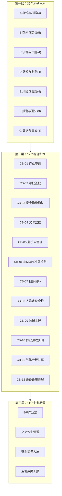
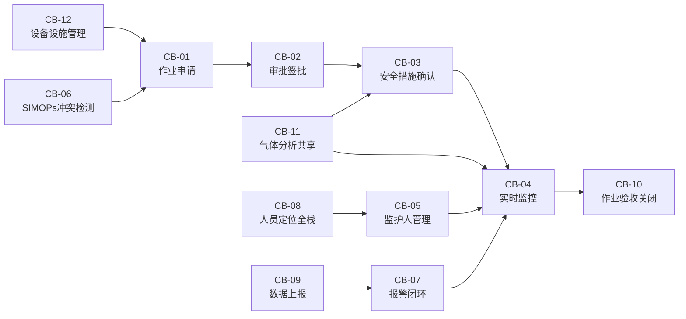
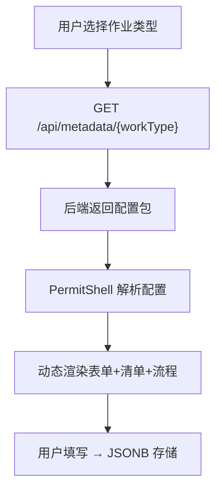

# 功能需求积木化拆解方案

> 基于 GB30871 / AQ3064.2 / AQ3064.3 三份规范，共 ~162 个子功能
> 核心发现：8种作业类型的差异不在代码层，而在配置/元数据层

---

## 1. 总体思路



三层架构的核心价值：
- 原子积木独立可测试、可替换
- 组合积木封装业务逻辑，屏蔽底层复杂度
- 业务场景通过"选配组合积木"快速搭建，8种作业共享同一套代码

---

## 2. 第一层：32 个原子积木

> 最小可复用单元，每个积木独立可测试、有明确的输入/输出接口

### A. 身份与权限域（4个）

| 编号 | 名称 | 职责 | 输入 | 输出 |
|------|------|------|------|------|
| A-01 | 人员档案 | 人员CRUD、三类身份（员工/承包商/外来人员）、照片、紧急联系人 | 人员信息 | `PersonProfile` |
| A-02 | 资质证书校验 | 证书类型管理、有效期校验、到期预警（30/15/7天） | personId + workType | `CertValidation{valid, expiry, certType}` |
| A-03 | 组织架构树 | 多层级组织维护、负责人设置、权限继承 | 组织层级数据 | `OrgTree` |
| A-04 | 角色权限引擎 | RBAC/ABAC权限模型、多租户隔离、按作业类型/级别分配 | userId + action + resource | `AuthDecision{allow/deny}` |

### B. 空间与定位域（5个）

| 编号 | 名称 | 职责 | 输入 | 输出 |
|------|------|------|------|------|
| B-01 | 区域管理 | 区域CRUD、分类（重大危险源/生产区/罐区等）、风险等级标注、边界坐标 | 区域名称/坐标/类型 | `Area{id, boundary, riskLevel}` |
| B-02 | 三维定位引擎 | 多传感器融合（UWB+BLE+IMU+GNSS）、Kalman滤波、室内外无缝切换 | 传感器原始数据流 | `Position3D{x, y, z, accuracy}` |
| B-03 | 三维围栏引擎 | 围栏CRUD、PostGIS空间判断、进出事件触发（5s触发+30s升级） | Position3D + FenceConfig | `FenceEvent{in/out, distance}` |
| B-04 | 轨迹存储与回放 | InfluxDB时序存储、轨迹查询（≤30s间隔）、路径回放、≥1年保留 | Position3D流 | 轨迹数据集 |
| B-05 | 空间距离计算 | 两点/点面/面面距离计算、R-Tree索引加速 | 两个空间对象 | `distance_m` + `overlap_type` |

### C. 流程与审批域（4个）

| 编号 | 名称 | 职责 | 输入 | 输出 |
|------|------|------|------|------|
| C-01 | 审批流程引擎 | 多级审批配置、会签/或签、条件分支、超时升级、委托签批 | workType + riskLevel + approvers | `ApprovalChain` 状态机 |
| C-02 | 电子签名服务 | CA证书集成、SM2/RSA签名、时间戳、签章可视化 | userId + document | `Signature{hash, timestamp, cert}` |
| C-03 | 签批围栏联动 | 审批人5m围栏校验、位置+签名原子绑定、防远程签批 | Position3D + signRequest | `SignResult{valid, location}` |
| C-04 | 作业票状态机 | 申请→审批→作业中→延期→作废→结票 全生命周期管理 | 状态迁移事件 | `TicketStatus` + 审计日志 |

### D. 感知与监测域（4个）

| 编号 | 名称 | 职责 | 输入 | 输出 |
|------|------|------|------|------|
| D-01 | IoT设备接入 | 设备注册/认证/状态监控、MQTT/HTTP/Modbus协议适配、防爆等级记录 | 设备数据流 | `DeviceData{id, type, value, ts}` |
| D-02 | 气体检测服务 | 多气体采集（LEL/O₂/H₂S/CO/乙醇）、阈值校验、周期复测提醒 | IoT气体数据 | `GasReading{type, value, status}` |
| D-03 | 视频AI分析 | PPE穿戴检测、火花识别、人员脱岗检测、未办票作业检测 | 视频流（RTSP/GB28181） | `AIEvent{type, confidence, snapshot}` |
| D-04 | 环境监测服务 | 温湿度、风速风向、天气条件采集与校验 | 环境传感器数据 | `EnvReading{temp, humidity, wind}` |

### E. 风险与合规域（4个）

| 编号 | 名称 | 职责 | 输入 | 输出 |
|------|------|------|------|------|
| E-01 | JSA风险库 | 风险项CRUD、LEC评估法、控制措施配置、危险有害因素字典 | 风险描述/类型 | `RiskItem{level, controls}` |
| E-02 | JSA模板引擎 | 按作业类型×位置×级别配置模板、版本管理、智能推荐 | workType + areaId | `JSATemplate{steps, risks, controls}` |
| E-03 | 安全措施检查清单 | 强制顺序确认、拍照凭证上传、地理围栏锁定（防远程打卡） | 检查项配置 | `ChecklistResult{allPassed, evidence}` |
| E-04 | 合规规则引擎 | Drools规则管理、节假日/特殊时段升级、资质校验、阈值判断 | 业务事件 | `ComplianceResult{pass/fail, reason}` |

### F. 报警与通知域（3个）

| 编号 | 名称 | 职责 | 输入 | 输出 |
|------|------|------|------|------|
| F-01 | 报警编码引擎 | AQ3064.2统一编码（类型码+子类码+等级）、去重抑制、29种报警全覆盖 | 报警触发事件 | `AlarmEvent{code, severity, ts}` |
| F-02 | 报警闭环管理 | 触发→确认→处置→验证→关闭 五态流转、超时升级、静默管理 | AlarmEvent | `AlarmLifecycle` 状态 |
| F-03 | 消息分发中心 | App推送/短信/大屏/语音播报/骨传导耳机 多通道分发 | notification对象 | 投递状态 |

### G. 数据与集成域（4个）

| 编号 | 名称 | 职责 | 输入 | 输出 |
|------|------|------|------|------|
| G-01 | 元数据表单引擎 | Schema/Layout/Instance三层分离、动态渲染、版本管理 | JSON元数据定义 | 动态表单UI + JSONB数据 |
| G-02 | 数据同步代理 | 企业端→园区端实时增量同步、断连重传、冲突解决 | 业务数据变更 | 同步状态 |
| G-03 | 统计分析引擎 | 多维度统计、趋势分析、热力图、Excel/PDF导出 | 查询条件 | 报表数据集 |
| G-04 | 文件存储服务 | MinIO对象存储、图片/视频/PDF、水印、归档（视频≥30天，其他≥1年） | 文件流 | `FileRef{url, hash}` |

---

## 3. 第二层：12 个组合积木

> 由原子积木组合而成的中间层模块，封装完整业务能力

| 编号 | 名称 | 组成的原子积木 | 职责描述 |
| ---- | ---- | -------------- | -------- |
| CB-01 | 作业申请 | G-01 + A-01 + A-02 + B-01 + E-01 + E-02 | 动态表单渲染 + 人员选择（含资质校验）+ 区域选择 + JSA风险分析自动匹配。所有8种作业的申请入口统一走这个组合 |
| CB-02 | 审批签批 | C-01 + C-02 + C-03 + A-04 | 多级审批流程 + 电子签名 + 签批围栏位置校验 + 权限验证。确保审批人在现场、有权限、签名有法律效力 |
| CB-03 | 安全措施确认 | E-03 + D-02 + G-04 + B-03 | 强制顺序检查清单 + 气体检测数据自动填入 + 现场拍照上传 + 地理围栏锁定（防远程打卡） |
| CB-04 | 实时监控 | B-02 + B-03 + D-01 + D-02 + D-03 + F-01 | 人员三维定位 + 围栏监测 + IoT数据采集 + 气体实时监测 + 视频AI + 报警触发。作业进行中的全方位感知 |
| CB-05 | 监护人管理 | A-01 + A-02 + B-02 + B-03(15m围栏) + F-01(脱岗报警) | 监护人资质校验 + 实时定位 + 在岗围栏检测 + 脱岗自动报警。跨所有作业类型复用 |
| CB-06 | SIMOPs冲突检测 | B-05 + C-04 + E-04 + F-01 | 三维空间距离计算 + 时间重叠判断 + 逻辑冲突规则匹配 + 冲突报警。交叉作业的核心检测能力 |
| CB-07 | 报警闭环 | F-01 + F-02 + F-03 + C-04 | 报警编码生成 + 五态闭环流转 + 多通道通知 + 作业票联动（自动挂起/恢复） |
| CB-08 | 人员定位全栈 | B-02 + B-03 + B-04 + A-01 | 三维融合定位 + 围栏判断 + 轨迹存储回放 + 人员身份关联。AQ3064.3的完整实现 |
| CB-09 | 数据上报 | G-02 + G-03 + F-01 | 企业→园区数据同步 + 统计报表生成 + 报警数据上报。满足AQ3064.2附录A/B的监管数据交换要求 |
| CB-10 | 作业验收关闭 | E-03 + G-04 + C-02 + C-04 | 现场清理确认 + 验收照片上传 + 验收签名 + 作业票状态关闭 |
| CB-11 | 气体分析共享 | D-02 + D-01 + G-03 | 气体检测数据采集 + IoT设备管理 + 数据共享查询。动火和受限空间作业共享同一份气体数据 |
| CB-12 | 设备设施管理 | A-01(设备版) + B-01 + D-01 + G-04 | 设备台账 + 区域关联 + IoT状态监控 + 维保记录附件。盲板台账、吊装设备等复用 |

组合积木之间的依赖关系：



---

## 4. 第三层：11 个业务场景

> 最终面向用户的业务场景，由组合积木搭建

### 4.1 八种作业票场景

| 场景 | 使用的组合积木 | 场景特有配置（元数据差异） |
| ---- | -------------- | -------------------------- |
| 动火作业 | CB-01 + CB-02 + CB-03 + CB-04 + CB-05 + CB-07 + CB-10 + CB-11 | 三级分级（特级/一级/二级）、可燃气体 < 20%LEL、每2h复测、30m隔离带 |
| 受限空间作业 | CB-01 + CB-02 + CB-03 + CB-04 + CB-05 + CB-07 + CB-10 + CB-11 | 能源隔离确认、O₂/H₂S/CO四气检测、每30min复测、应急救援人员指定、人员清点 |
| 盲板抽堵作业 | CB-01 + CB-02 + CB-03 + CB-04 + CB-05 + CB-07 + CB-10 + CB-12 | 盲板编号台账、抽/堵类型、介质信息（温度/压力）、泄压降温确认、盲板照片前后对比 |
| 高处作业 | CB-01 + CB-02 + CB-03 + CB-04 + CB-05 + CB-07 + CB-10 | 四级分级（一级2-5m / 二级5-15m / 三级15-30m / 特级>30m）、天气条件校验（风力<5级）、安全带检测 |
| 吊装作业 | CB-01 + CB-02 + CB-03 + CB-04 + CB-05 + CB-07 + CB-10 + CB-12 | 三级分级（按吨位）、吊装方案审批、起重设备检验证、吊装半径+10m警戒、超载监测 |
| 临时用电作业 | CB-01 + CB-02 + CB-03 + CB-04 + CB-05 + CB-07 + CB-10 | 用电方案、电源接入点、漏电保护器确认、电流/电压/温度监测、用电时间超时提醒 |
| 动土作业 | CB-01 + CB-02 + CB-03 + CB-04 + CB-05 + CB-07 + CB-10 | 地下管线图纸确认、管线标识、动土范围（长×宽×深）、探测设备、相关部门通知 |
| 断路作业 | CB-01 + CB-02 + CB-03 + CB-04 + CB-05 + CB-07 + CB-10 | 绕行方案、交通组织方案、警示标志（提前100m）、应急通道确认 |

### 4.2 三个平台级场景

| 场景 | 使用的组合积木 | 场景描述 |
| ---- | -------------- | -------- |
| 交叉作业管理 | CB-06 + CB-04 + CB-07 + CB-08 | SIMOPs三维冲突检测 + 协调方案 + 联合审批 + 资源冲突（监护人/设备）检测 |
| 安全监控大屏 | CB-04 + CB-08 + CB-07 + CB-09 + G-03 | 全厂作业分布地图 + 实时人员定位 + 报警信息 + 统计指标 + 风险热力图 |
| 监管数据上报 | CB-09 + F-01 + G-02 | 企业端→园区端实时增量同步 + 报警数据上报 + 统计报表（AQ3064.2附录A/B） |

---

## 4-ext. 第四层：页面架构（PermitShell + 配置驱动）

> 将后端积木映射到前端页面的桥接层。核心原则：**一套页面容器 + 配置驱动差异化**

### 4-ext.1 统一页面容器（PermitShell）

所有8种作业共用一个 PermitShell 页面外壳，内部内容由元数据配置动态渲染：

```
┌──────────────────────────────────┐
│ [←] 动火作业 #HW-20260310-001   │  ← 顶部导航
│ 🔴 特级 | 审批中 | 剩余 6h32m   │  ← 状态栏（类型+等级+状态+倒计时）
├──────────────────────────────────┤
│ ● 申请 → ● 审批 → ○ 措施 → ... │  ← 进度条（5阶段通用）
├──────────────────────────────────┤
│                                  │
│   [元数据驱动的动态内容区域]       │  ← G-01 根据 workType+stage+role 渲染
│                                  │
├──────────────────────────────────┤
│ [保存草稿]        [提交/审批/签名]│  ← 底部操作栏（按角色+状态显示）
└──────────────────────────────────┘
```

### 4-ext.2 五阶段页面序列（所有作业通用）


| 阶段 | 子页面 | 驱动的组合积木 |
|------|--------|--------------|
| 1. 申请填写 | 作业类型选择 → 基本信息 → 人员选择 → JSA风险分析 → 安全措施 → 附件上传 → 预览提交 | CB-01（G-01 + A-01 + A-02 + E-01 + E-02） |
| 2. 审批签批 | 审批详情（只读卡片）→ 现场定位验证 → 审批意见与签名 | CB-02（C-01 + C-02 + C-03 + A-04） |
| 3. 安全措施落实 | 安全措施检查清单 → 气体检测数据录入（条件性）→ 安全交底确认 | CB-03（E-03 + D-02 + G-04 + B-03） |
| 4. 作业实施 | 监护人签到激活 → 作业监护实时页 → 异常上报 → 延期申请 | CB-04 + CB-05 + CB-07 |
| 5. 完工验收 | 验收检查清单 → 验收照片上传 → 验收签名与关闭 | CB-10（E-03 + G-04 + C-02 + C-04） |

### 4-ext.3 组合积木 → 页面映射

| 组合积木 | 映射到的页面区域 | 渲染形式 |
|---------|----------------|---------|
| CB-01 作业申请 | 阶段1全部子页面 | G-01驱动表单 + 人员选择器 + JSA区块 |
| CB-02 审批签批 | 阶段2全部子页面 | 只读卡片 + C-03围栏控制审批按钮 + 签名组件 |
| CB-03 安全措施确认 | 阶段3全部子页面 | 强制顺序清单 + 气体数据 + 拍照 + 围栏锁定 |
| CB-04 实时监控 | 阶段4监护实时页 + PC大屏 | 移动端：气体数值+位置地图+报警弹窗 |
| CB-05 监护人管理 | 阶段4签到区块 + 在岗指示器 | 资质校验 + 定位 + 15m围栏 + 脱岗报警 |
| CB-06 SIMOPs冲突 | 申请提交时冲突弹窗 + PC端冲突矩阵 | 自动触发，弹出冲突作业票+重叠区域 |
| CB-07 报警闭环 | 异常上报页 + PC端报警管理 | 移动端一键报警；PC端五态流转列表 |
| CB-08 人员定位 | 监护实时页地图组件 + 大屏地图层 | 人员图标+轨迹回放+围栏事件 |
| CB-09 数据上报 | PC端监管上报页面 | 上报任务列表+数据预览+状态跟踪 |
| CB-10 作业验收 | 阶段5全部子页面 | 验收清单 + 照片 + 签名 + 状态关闭 |
| CB-11 气体分析共享 | 阶段3气体检测页 + 阶段4气体面板 | 动火/受限空间共享，一次采集多处消费 |
| CB-12 设备设施 | 申请阶段设备选择器 + PC端台账 | 盲板编号/起重设备选择器 |

### 4-ext.4 角色-阶段权限矩阵

同一张作业票，不同角色看到同一个 PermitShell，但内容和操作由"角色+状态"双维度控制：

| 角色 | 阶段1申请 | 阶段2审批 | 阶段3措施 | 阶段4作业 | 阶段5验收 |
|------|----------|----------|----------|----------|----------|
| 申请人/负责人 | ✏️ 全部可编辑 | 👁️ 只读+进度 | ✏️ 部分确认 | 👁️ 只读 | ✏️ 验收检查 |
| 审批人 | 👁️ 只读 | ✏️ 审批+签名 | — | — | — |
| 监护人 | — | — | ✏️ 检查清单 | ✏️ 主操作者 | ✏️ 验收确认 |
| 作业人 | — | — | ✏️ 交底签字 | 👁️ 状态查看 | — |
| 气体检测人 | — | — | ✏️ 气体数据 | ✏️ 连续检测 | — |
| 吊装特有角色 | — | — | ✏️ 设备检查 | ✏️ 操作记录 | — |

### 4-ext.5 通用页面 vs 差异化配置

**通用页面（8种作业100%共用，零代码分支）：**
- PermitShell 容器（状态栏+进度条+操作栏）
- 人员选择器、电子签名、审批流程页面
- 监护人管理页面（15m围栏+脱岗报警）
- 报警闭环页面（五态流转）
- 完工验收页面框架
- 消息通知中心 / 我的任务列表

**差异化通过三个配置引擎驱动（不需要代码分支）：**

| 配置引擎 | 控制的差异 | 举例 |
|---------|----------|------|
| G-01 元数据表单引擎 | 字段差异 | 动火有"动火方式"，受限空间有"能源隔离" |
| E-02 JSA模板引擎 | 风险差异 | 动火关注可燃气体，高处关注风力等级 |
| C-01 审批流程引擎 | 流程差异 | 特级动火需主管领导，二级动火基层单位即可 |

**配置驱动渲染流程：**



配置包结构：`form_schema`（字段）+ `jsa_template`（风险）+ `approval_flow`（审批）+ `checklist_items`（检查清单）+ `role_config`（角色权限）+ `constraint_rules`（约束规则）

> 详细的 G-01 配置 Schema 规范和8种作业的完整配置包定义，见独立文档：`G01-元数据表单引擎配置Schema规范.md`

---

## 5. 积木组合矩阵

### 5.1 业务场景 × 组合积木

|  | CB-01 申请 | CB-02 审批 | CB-03 安措 | CB-04 监控 | CB-05 监护 | CB-06 冲突 | CB-07 报警 | CB-08 定位 | CB-09 上报 | CB-10 验收 | CB-11 气体 | CB-12 设备 |
| ---- | :---: | :---: | :---: | :---: | :---: | :---: | :---: | :---: | :---: | :---: | :---: | :---: |
| 动火 | ✓ | ✓ | ✓ | ✓ | ✓ |  | ✓ |  |  | ✓ | ✓ |  |
| 受限空间 | ✓ | ✓ | ✓ | ✓ | ✓ |  | ✓ |  |  | ✓ | ✓ |  |
| 盲板抽堵 | ✓ | ✓ | ✓ | ✓ | ✓ |  | ✓ |  |  | ✓ |  | ✓ |
| 高处 | ✓ | ✓ | ✓ | ✓ | ✓ |  | ✓ |  |  | ✓ |  |  |
| 吊装 | ✓ | ✓ | ✓ | ✓ | ✓ |  | ✓ |  |  | ✓ |  | ✓ |
| 临时用电 | ✓ | ✓ | ✓ | ✓ | ✓ |  | ✓ |  |  | ✓ |  |  |
| 动土 | ✓ | ✓ | ✓ | ✓ | ✓ |  | ✓ |  |  | ✓ |  |  |
| 断路 | ✓ | ✓ | ✓ | ✓ | ✓ |  | ✓ |  |  | ✓ |  |  |
| 交叉作业 |  |  |  | ✓ |  | ✓ | ✓ | ✓ |  |  |  |  |
| 监控大屏 |  |  |  | ✓ |  |  | ✓ | ✓ | ✓ |  |  |  |
| 监管上报 |  |  |  |  |  |  | ✓ |  | ✓ |  |  |  |

### 5.2 复用率排名（原子积木被业务场景间接引用次数）

| 排名 | 原子积木 | 被引用场景数 | 说明 |
| ---- | -------- | :---: | ---- |
| 1 | F-01 报警编码引擎 | 11 | 所有报警的统一入口 |
| 2 | A-01 人员档案 | 11 | 全局基础数据 |
| 3 | C-04 作业票状态机 | 11 | 所有作业的生命周期 |
| 4 | B-03 三维围栏引擎 | 10 | 定位 + 监护 + 安措都依赖 |
| 5 | B-02 三维定位引擎 | 10 | 人员定位核心 |
| 6 | D-02 气体检测服务 | 10 | 气体监测 + 安措确认 |
| 7 | G-01 元数据表单引擎 | 8 | 8种作业全用 |
| 8 | E-03 安全措施检查清单 | 8 | 8种作业全用 |
| 9 | C-01 审批流程引擎 | 8 | 8种作业全用 |
| 10 | C-02 电子签名服务 | 8 | 8种作业全用 |

---

## 6. 关键设计决策

### 6.1 八种作业共享同一套代码，差异全在配置层

这是整个积木化方案最核心的决策。8种作业类型不需要8套独立代码，而是通过三个配置引擎驱动差异：

| 配置引擎 | 控制的差异 | 举例 |
| -------- | ---------- | ---- |
| G-01 元数据表单引擎 | 字段差异 | 动火有"动火方式"字段，受限空间有"能源隔离"字段 |
| E-02 JSA模板引擎 | 风险差异 | 动火关注可燃气体，高处关注风力等级 |
| C-01 审批流程引擎 | 流程差异 | 特级动火需主管领导审批，二级动火基层单位即可 |

### 6.2 气体检测数据天然共享

动火作业和受限空间作业都引用 CB-11（气体分析共享），数据一次采集、多处消费，消除数据孤岛。同一个作业区域的气体检测结果可以被多张作业票同时引用。

### 6.3 监护人管理完全统一

CB-05 被所有8种作业引用，监护人的资质校验、实时定位、在岗围栏检测、脱岗报警逻辑完全一致，不因作业类型不同而产生代码分支。

### 6.4 报警体系统一编码

29种报警（22种作业报警 + 7种定位报警）全部走 F-01 一个引擎，采用 AQ3064.2 的"类型码-子类码-等级"编码体系，避免各模块各自实现报警逻辑。

### 6.5 SIMOPs是平台级横切能力

CB-06 不属于任何单一作业类型，而是横切所有作业的交叉检测层。在作业申请时自动触发三维空间冲突检测，无需人工判断。

---

## 7. 开发优先级与实施路径

### 7.1 三批次开发计划

| 批次 | 定位 | 包含的原子积木 | 数量 |
| ---- | ---- | -------------- | :---: |
| P0 骨架层 | 所有作业的基础骨架，优先交付 | A-01, A-02, A-04, B-01, C-01, C-02, C-04, E-01, E-03, F-01, F-03, G-01 | 12 |
| P1 感知层 | 实时监控与风险管控能力 | D-01, D-02, B-02, B-03, E-02, E-04, F-02, G-04 | 8 |
| P2 高级能力 | 定位全栈、AI分析、数据上报 | B-04, B-05, C-03, D-03, D-04, G-02, G-03, A-03 | 8+ |

### 7.2 验证策略

1. 选取"动火作业"作为第一个端到端验证场景，验证 CB-01 → CB-02 → CB-03 → CB-04 → CB-05 → CB-07 → CB-10 全链路
2. 再加"受限空间"验证积木复用率（与动火共享 CB-11 气体分析）
3. 最后加"交叉作业"验证 CB-06 SIMOPs 横切能力

### 7.3 规范溯源

| 原子积木 | GB 30871 | AQ 3064.2 | AQ 3064.3 |
| -------- | :---: | :---: | :---: |
| A-01 人员档案 | ✓ | ✓ | ✓ |
| A-02 资质证书校验 | ✓ | ✓ |  |
| B-02 三维定位引擎 |  |  | ✓ |
| B-03 三维围栏引擎 |  | ✓ | ✓ |
| C-01 审批流程引擎 | ✓ | ✓ |  |
| C-04 作业票状态机 | ✓ | ✓ |  |
| D-02 气体检测服务 | ✓ | ✓ |  |
| E-01 JSA风险库 | ✓ | ✓ |  |
| E-03 安全措施检查清单 | ✓ | ✓ |  |
| F-01 报警编码引擎 |  | ✓ | ✓ |
| G-01 元数据表单引擎 |  | ✓ |  |
| G-02 数据同步代理 |  | ✓ | ✓ |
