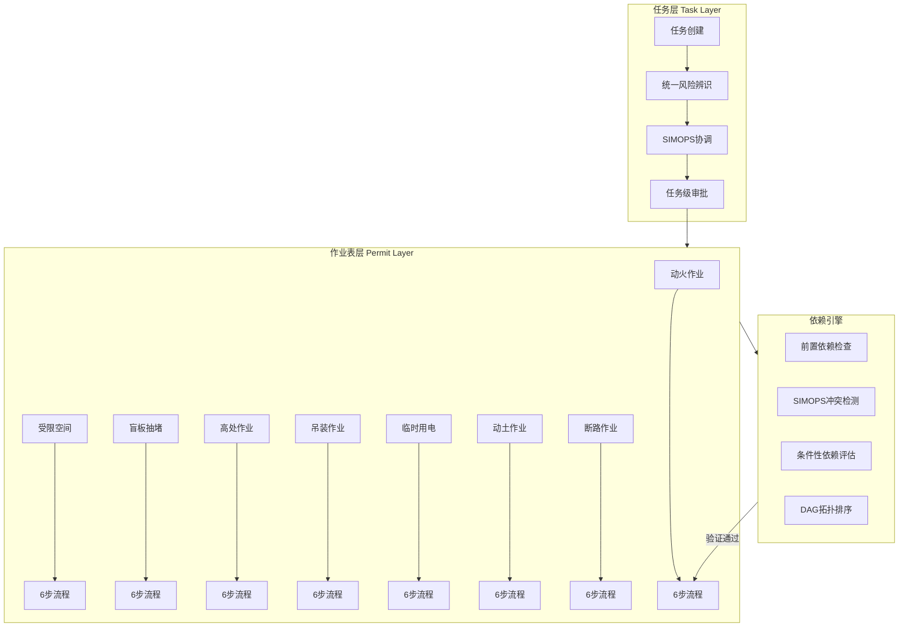

# 作业表依赖引擎详细设计方案

> **文档版本**: v1.0
> **创建日期**: 2026-03-11
> **适用标准**: GB 30871-2022, AQ 3064.2-2025

---

## 一、核心架构设计

### 1.1 任务-作业表双层架构



### 1.2 依赖关系总览

**三类依赖关系**：
1. **强制前置依赖**（Prerequisite）：必须先完成A才能开始B
2. **SIMOPS冲突依赖**（Conflict）：A和B不能同时进行或需保持距离
3. **条件性依赖**（Conditional）：根据作业级别/场所/介质触发额外要求

---

## 二、数据模型设计

### 2.1 核心实体模型

```typescript
// ========== 任务层实体 ==========
interface Task {
  taskId: string;
  taskName: string;
  taskType: 'maintenance' | 'construction' | 'emergency';
  location: GeoLocation;
  plannedStartTime: Date;
  plannedEndTime: Date;
  riskAssessment: RiskAssessment;
  permits: Permit[];
  status: 'draft' | 'approved' | 'active' | 'completed' | 'cancelled';
}

// ========== 作业表层实体 ==========
interface Permit {
  permitId: string;
  taskId: string;
  permitType: PermitType;
  permitLevel?: PermitLevel; // 动火/高处/吊装有分级
  location: GeoLocation;
  workArea: Polygon; // 作业区域（用于SIMOPS检测）
  applicant: Person;
  approver: Person;
  guardian?: Person;

  // 6步流程状态
  workflow: {
    step1_application: WorkflowStep;
    step2_measures: WorkflowStep;
    step3_analysis: WorkflowStep;
    step4_inspection: WorkflowStep;
    step5_approval: WorkflowStep;
    step6_completion: WorkflowStep;
  };

  // 依赖关系
  dependencies: PermitDependencies;

  status: 'pending' | 'approved' | 'active' | 'suspended' | 'completed';
  validFrom?: Date;
  validUntil?: Date;
}

// ========== 依赖关系实体 ==========
interface PermitDependencies {
  // 1. 强制前置依赖
  prerequisites: Array<{
    dependsOnPermitId: string;
    dependsOnPermitType: PermitType;
    requiredStatus: 'approved' | 'completed';
    reason: string; // 如："能量隔离要求"
  }>;

  // 2. SIMOPS冲突
  simopsConflicts: Array<{
    conflictWithPermitId: string;
    conflictWithPermitType: PermitType;
    conflictType: 'vertical' | 'horizontal' | 'temporal';
    minDistance?: number; // 米
    minTimeGap?: number; // 分钟
    condition?: string; // 如："涉及燃气管线时"
    severity: 'prohibit' | 'warning';
  }>;

  // 3. 条件性依赖
  conditionalRequirements: Array<{
    condition: ConditionalRule;
    requiredAction: RequiredAction;
    triggerTime: 'before_approval' | 'before_start' | 'during_work';
  }>;
}

// ========== 枚举类型 ==========
enum PermitType {
  HOT_WORK = 'hotWork',           // 动火作业
  CONFINED_SPACE = 'confinedSpace', // 受限空间
  BLIND_PLATE = 'blindPlate',      // 盲板抽堵
  WORK_AT_HEIGHT = 'workAtHeight', // 高处作业
  LIFTING = 'lifting',             // 吊装作业
  TEMP_ELECTRICITY = 'tempElectricity', // 临时用电
  EXCAVATION = 'excavation',       // 动土作业
  ROAD_BREAKING = 'roadBreaking'   // 断路作业
}

enum PermitLevel {
  // 动火作业
  HOT_WORK_SPECIAL = 'special',
  HOT_WORK_LEVEL1 = 'level1',
  HOT_WORK_LEVEL2 = 'level2',

  // 高处作业
  HEIGHT_LEVEL1 = 'height_level1', // ≥30m
  HEIGHT_LEVEL2 = 'height_level2', // 15-30m
  HEIGHT_LEVEL3 = 'height_level3', // 5-15m
  HEIGHT_LEVEL4 = 'height_level4', // 2-5m

  // 吊装作业
  LIFTING_LEVEL1 = 'lifting_level1', // ≥100t或≥40m
  LIFTING_LEVEL2 = 'lifting_level2', // 10-100t
  LIFTING_LEVEL3 = 'lifting_level3'  // <10t
}

// ========== 条件规则 ==========
interface ConditionalRule {
  ruleType: 'gas_detection' | 'special_plan' | 'guardian_config' | 'equipment_check';
  conditions: {
    permitType?: PermitType[];
    permitLevel?: PermitLevel[];
    locationType?: string[]; // 如：["密闭空间", "有限空间"]
    mediumType?: string[];   // 如：["可燃", "有毒", "窒息性"]
  };
}

interface RequiredAction {
  actionType: 'gas_detection' | 'plan_preparation' | 'guardian_assignment' | 'equipment_inspection';
  parameters: {
    // 气体检测参数
    gasTypes?: string[]; // 如：["LEL", "O2", "H2S", "CO"]
    retestInterval?: number; // 分钟
    validDuration?: number; // 分钟

    // 方案编制参数
    planReviewLevel?: string; // 如："技术负责人"

    // 监护人参数
    guardianCount?: number;
    certificationRequired?: boolean;

    // 设备检查参数
    equipmentList?: string[];
  };
}
```

### 2.2 地理位置模型（用于SIMOPS检测）

```typescript
interface GeoLocation {
  latitude: number;
  longitude: number;
  altitude?: number; // 用于垂直空间冲突检测
  floor?: string;    // 楼层信息
}

interface Polygon {
  points: GeoLocation[];
  radius?: number; // 圆形作业区域的半径（米）
}

// 地理围栏工具函数
class GeofencingUtils {
  // 计算两点之间的距离（米）
  static calculateDistance(p1: GeoLocation, p2: GeoLocation): number {
    // Haversine公式实现
  }

  // 检查点是否在多边形内
  static isPointInPolygon(point: GeoLocation, polygon: Polygon): boolean {
    // Ray casting算法实现
  }

  // 检查两个作业区域是否重叠
  static checkAreaOverlap(area1: Polygon, area2: Polygon): boolean {
    // 多边形相交检测
  }

  // 检查垂直空间冲突
  static checkVerticalConflict(
    upper: Permit,
    lower: Permit
  ): boolean {
    // 检查上方作业是否在下方作业的垂直投影范围内
  }
}
```

---

## 三、依赖检查算法

### 3.1 前置依赖检查（DAG验证）

```typescript
class PrerequisiteDependencyChecker {
  /**
   * 检查是否存在循环依赖
   * @returns 如果存在循环依赖，返回循环路径；否则返回null
   */
  static detectCyclicDependency(permits: Permit[]): string[] | null {
    const graph = this.buildDependencyGraph(permits);
    const visited = new Set<string>();
    const recStack = new Set<string>();

    for (const permitId of graph.keys()) {
      const cycle = this.dfsDetectCycle(permitId, graph, visited, recStack, []);
      if (cycle) return cycle;
    }

    return null;
  }

  /**
   * 拓扑排序，返回作业表的执行顺序
   * @returns 排序后的permitId数组，如果存在循环依赖则返回null
   */
  static topologicalSort(permits: Permit[]): string[] | null {
    const graph = this.buildDependencyGraph(permits);
    const inDegree = new Map<string, number>();
    const queue: string[] = [];
    const result: string[] = [];

    // 初始化入度
    for (const [permitId, deps] of graph.entries()) {
      if (!inDegree.has(permitId)) inDegree.set(permitId, 0);
      for (const dep of deps) {
        inDegree.set(dep, (inDegree.get(dep) || 0) + 1);
      }
    }

    // 找到所有入度为0的节点
    for (const [permitId, degree] of inDegree.entries()) {
      if (degree === 0) queue.push(permitId);
    }

    // Kahn算法
    while (queue.length > 0) {
      const current = queue.shift()!;
      result.push(current);

      for (const neighbor of graph.get(current) || []) {
        const newDegree = inDegree.get(neighbor)! - 1;
        inDegree.set(neighbor, newDegree);
        if (newDegree === 0) queue.push(neighbor);
      }
    }

    // 如果结果数量不等于节点数量，说明存在循环依赖
    return result.length === graph.size ? result : null;
  }

  /**
   * 检查特定作业表的前置依赖是否满足
   */
  static checkPrerequisites(
    permit: Permit,
    allPermits: Map<string, Permit>
  ): {
    satisfied: boolean;
    missingDeps: Array<{
      permitId: string;
      permitType: PermitType;
      currentStatus: string;
      requiredStatus: string;
      reason: string;
    }>;
  } {
    const missingDeps = [];

    for (const prereq of permit.dependencies.prerequisites) {
      const depPermit = allPermits.get(prereq.dependsOnPermitId);

      if (!depPermit) {
        missingDeps.push({
          permitId: prereq.dependsOnPermitId,
          permitType: prereq.dependsOnPermitType,
          currentStatus: 'not_found',
          requiredStatus: prereq.requiredStatus,
          reason: prereq.reason
        });
        continue;
      }

      if (depPermit.status !== prereq.requiredStatus) {
        missingDeps.push({
          permitId: prereq.dependsOnPermitId,
          permitType: prereq.dependsOnPermitType,
          currentStatus: depPermit.status,
          requiredStatus: prereq.requiredStatus,
          reason: prereq.reason
        });
      }
    }

    return {
      satisfied: missingDeps.length === 0,
      missingDeps
    };
  }

  private static buildDependencyGraph(permits: Permit[]): Map<string, string[]> {
    const graph = new Map<string, string[]>();

    for (const permit of permits) {
      if (!graph.has(permit.permitId)) {
        graph.set(permit.permitId, []);
      }

      for (const prereq of permit.dependencies.prerequisites) {
        graph.get(permit.permitId)!.push(prereq.dependsOnPermitId);
      }
    }

    return graph;
  }

  private static dfsDetectCycle(
    node: string,
    graph: Map<string, string[]>,
    visited: Set<string>,
    recStack: Set<string>,
    path: string[]
  ): string[] | null {
    visited.add(node);
    recStack.add(node);
    path.push(node);

    for (const neighbor of graph.get(node) || []) {
      if (!visited.has(neighbor)) {
        const cycle = this.dfsDetectCycle(neighbor, graph, visited, recStack, path);
        if (cycle) return cycle;
      } else if (recStack.has(neighbor)) {
        // 找到循环
        const cycleStart = path.indexOf(neighbor);
        return path.slice(cycleStart).concat(neighbor);
      }
    }

    recStack.delete(node);
    path.pop();
    return null;
  }
}
```

### 3.2 SIMOPS冲突检测

```typescript
class SimopsConflictDetector {
  /**
   * 检查新作业表与现有活动作业表的SIMOPS冲突
   */
  static checkConflicts(
    newPermit: Permit,
    activePermits: Permit[]
  ): {
    hasConflict: boolean;
    conflicts: Array<{
      conflictPermitId: string;
      conflictType: 'vertical' | 'horizontal' | 'temporal';
      severity: 'prohibit' | 'warning';
      distance?: number;
      message: string;
    }>;
  } {
    const conflicts = [];

    for (const activePermit of activePermits) {
      // 1. 检查垂直空间冲突
      const verticalConflict = this.checkVerticalConflict(newPermit, activePermit);
      if (verticalConflict) conflicts.push(verticalConflict);

      // 2. 检查水平空间冲突
      const horizontalConflict = this.checkHorizontalConflict(newPermit, activePermit);
      if (horizontalConflict) conflicts.push(horizontalConflict);

      // 3. 检查时间冲突
      const temporalConflict = this.checkTemporalConflict(newPermit, activePermit);
      if (temporalConflict) conflicts.push(temporalConflict);
    }

    return {
      hasConflict: conflicts.length > 0,
      conflicts
    };
  }

  /**
   * 检查垂直空间冲突（吊装/高处作业下方禁止其他作业）
   */
  private static checkVerticalConflict(
    permit1: Permit,
    permit2: Permit
  ): any | null {
    const upperPermit = this.getUpperPermit(permit1, permit2);
    const lowerPermit = upperPermit === permit1 ? permit2 : permit1;

    if (!upperPermit) return null;

    // 检查上方作业类型
    const prohibitedUpperTypes = [
      PermitType.LIFTING,
      PermitType.WORK_AT_HEIGHT
    ];

    if (!prohibitedUpperTypes.includes(upperPermit.permitType)) {
      return null;
    }

    // 检查下方作业是否在垂直投影范围内
    const isInProjection = GeofencingUtils.checkVerticalConflict(
      upperPermit,
      lowerPermit
    );

    if (isInProjection) {
      return {
        conflictPermitId: lowerPermit.permitId,
        conflictType: 'vertical',
        severity: 'prohibit',
        message: `${this.getPermitTypeName(upperPermit.permitType)}作业下方禁止进行${this.getPermitTypeName(lowerPermit.permitType)}作业`
      };
    }

    return null;
  }

  /**
   * 检查水平空间冲突（基于安全距离要求）
   */
  private static checkHorizontalConflict(
    permit1: Permit,
    permit2: Permit
  ): any | null {
    // 定义冲突规则矩阵
    const conflictRules = new Map<string, { minDistance: number; condition?: string }>([
      [`${PermitType.HOT_WORK}-${PermitType.CONFINED_SPACE}`, { minDistance: 15 }],
      [`${PermitType.CONFINED_SPACE}-${PermitType.HOT_WORK}`, { minDistance: 15 }],
      [`${PermitType.HOT_WORK}-${PermitType.EXCAVATION}`, { minDistance: 10, condition: '涉及燃气管线' }],
      [`${PermitType.EXCAVATION}-${PermitType.HOT_WORK}`, { minDistance: 10, condition: '涉及燃气管线' }],
      [`${PermitType.ROAD_BREAKING}-${PermitType.HOT_WORK}`, { minDistance: 0 }], // 道路封闭区域内禁止
      [`${PermitType.HOT_WORK}-${PermitType.ROAD_BREAKING}`, { minDistance: 0 }]
    ]);

    const key = `${permit1.permitType}-${permit2.permitType}`;
    const rule = conflictRules.get(key);

    if (!rule) return null;

    const distance = GeofencingUtils.calculateDistance(
      permit1.location,
      permit2.location
    );

    if (distance < rule.minDistance) {
      return {
        conflictPermitId: permit2.permitId,
        conflictType: 'horizontal',
        severity: rule.minDistance === 0 ? 'prohibit' : 'warning',
        distance,
        message: rule.minDistance === 0
          ? `${this.getPermitTypeName(permit1.permitType)}与${this.getPermitTypeName(permit2.permitType)}不能在同一区域进行`
          : `${this.getPermitTypeName(permit1.permitType)}与${this.getPermitTypeName(permit2.permitType)}距离${distance.toFixed(1)}米，小于最小安全距离${rule.minDistance}米${rule.condition ? `（${rule.condition}）` : ''}`
      };
    }

    return null;
  }

  /**
   * 检查时间冲突（某些作业需要时间间隔）
   */
  private static checkTemporalConflict(
    permit1: Permit,
    permit2: Permit
  ): any | null {
    // 示例：盲板抽堵完成后，需要等待30分钟才能进行动火作业（气体扩散）
    if (
      permit1.permitType === PermitType.BLIND_PLATE &&
      permit2.permitType === PermitType.HOT_WORK &&
      permit1.status === 'completed'
    ) {
      const completionTime = permit1.workflow.step6_completion.completedAt;
      const startTime = permit2.validFrom;

      if (completionTime && startTime) {
        const timeGap = (startTime.getTime() - completionTime.getTime()) / 60000; // 分钟

        if (timeGap < 30) {
          return {
            conflictPermitId: permit2.permitId,
            conflictType: 'temporal',
            severity: 'warning',
            message: `盲板抽堵完成后需等待30分钟才能进行动火作业，当前间隔${timeGap.toFixed(0)}分钟`
          };
        }
      }
    }

    return null;
  }

  private static getUpperPermit(p1: Permit, p2: Permit): Permit | null {
    if (!p1.location.altitude || !p2.location.altitude) return null;
    return p1.location.altitude > p2.location.altitude ? p1 : p2;
  }

  private static getPermitTypeName(type: PermitType): string {
    const names = {
      [PermitType.HOT_WORK]: '动火',
      [PermitType.CONFINED_SPACE]: '受限空间',
      [PermitType.BLIND_PLATE]: '盲板抽堵',
      [PermitType.WORK_AT_HEIGHT]: '高处',
      [PermitType.LIFTING]: '吊装',
      [PermitType.TEMP_ELECTRICITY]: '临时用电',
      [PermitType.EXCAVATION]: '动土',
      [PermitType.ROAD_BREAKING]: '断路'
    };
    return names[type] || type;
  }
}
```


### 3.3 条件性依赖评估

```typescript
class ConditionalDependencyEvaluator {
  /**
   * 评估作业表的条件性依赖，返回必须执行的动作
   */
  static evaluate(
    permit: Permit,
    context: TaskContext
  ): {
    requiredActions: Array<{
      actionType: string;
      parameters: any;
      triggerTime: string;
      reason: string;
    }>;
  } {
    const requiredActions = [];

    // 1. 气体检测要求
    const gasDetection = this.evaluateGasDetection(permit, context);
    if (gasDetection) requiredActions.push(gasDetection);

    // 2. 方案编制要求
    const planPreparation = this.evaluatePlanPreparation(permit, context);
    if (planPreparation) requiredActions.push(planPreparation);

    // 3. 监护人配置要求
    const guardianConfig = this.evaluateGuardianConfig(permit, context);
    if (guardianConfig) requiredActions.push(guardianConfig);

    // 4. 设备检查要求
    const equipmentCheck = this.evaluateEquipmentCheck(permit, context);
    if (equipmentCheck) requiredActions.push(equipmentCheck);

    return { requiredActions };
  }

  /**
   * 评估气体检测要求（基于G01配置）
   */
  private static evaluateGasDetection(
    permit: Permit,
    context: TaskContext
  ): any | null {
    const gasDetectionRules = {
      [PermitType.HOT_WORK]: {
        required: true,
        gasTypes: ['LEL', 'O2'],
        retestInterval: 120, // 2小时
        validDuration: 30
      },
      [PermitType.CONFINED_SPACE]: {
        required: true,
        gasTypes: ['O2', 'H2S', 'CO', 'LEL'],
        retestInterval: 30, // 30分钟
        validDuration: 30
      },
      [PermitType.BLIND_PLATE]: {
        required: context.mediumType?.includes('可燃') || context.mediumType?.includes('有毒'),
        gasTypes: ['LEL', ...context.mediumCharacteristicGases],
        retestInterval: 60, // 1小时
        validDuration: 30
      }
    };

    const rule = gasDetectionRules[permit.permitType];

    if (rule && rule.required) {
      return {
        actionType: 'gas_detection',
        parameters: {
          gasTypes: rule.gasTypes,
          retestInterval: rule.retestInterval,
          validDuration: rule.validDuration
        },
        triggerTime: 'before_start',
        reason: `${this.getPermitTypeName(permit.permitType)}作业必须进行气体检测`
      };
    }

    return null;
  }

  /**
   * 评估方案编制要求
   */
  private static evaluatePlanPreparation(
    permit: Permit,
    context: TaskContext
  ): any | null {
    const planRequiredTypes = [
      PermitType.CONFINED_SPACE,
      PermitType.BLIND_PLATE
    ];

    const planRequiredLevels = [
      PermitLevel.HOT_WORK_SPECIAL,
      PermitLevel.HOT_WORK_LEVEL1,
      PermitLevel.HEIGHT_LEVEL1,
      PermitLevel.LIFTING_LEVEL1
    ];

    const requiresPlan =
      planRequiredTypes.includes(permit.permitType) ||
      (permit.permitLevel && planRequiredLevels.includes(permit.permitLevel));

    if (requiresPlan) {
      return {
        actionType: 'plan_preparation',
        parameters: {
          planReviewLevel: '技术负责人'
        },
        triggerTime: 'before_approval',
        reason: `${this.getPermitTypeName(permit.permitType)}${permit.permitLevel ? `（${permit.permitLevel}）` : ''}作业必须编制专项作业方案`
      };
    }

    return null;
  }

  /**
   * 评估监护人配置要求
   */
  private static evaluateGuardianConfig(
    permit: Permit,
    context: TaskContext
  ): any | null {
    const guardianRules = {
      [PermitType.CONFINED_SPACE]: {
        minCount: 2,
        certificationRequired: true,
        certification: '受限空间监护人证'
      },
      [PermitType.HOT_WORK]: {
        minCount: 1,
        certificationRequired: false
      },
      [PermitType.LIFTING]: {
        minCount: 1,
        certificationRequired: true,
        certification: '起重作业指挥人员证'
      }
    };

    const rule = guardianRules[permit.permitType];

    if (rule) {
      return {
        actionType: 'guardian_assignment',
        parameters: {
          guardianCount: rule.minCount,
          certificationRequired: rule.certificationRequired,
          certification: rule.certification
        },
        triggerTime: 'before_approval',
        reason: `${this.getPermitTypeName(permit.permitType)}作业需要配置${rule.minCount}名${rule.certificationRequired ? '持证' : ''}监护人`
      };
    }

    return null;
  }

  /**
   * 评估设备检查要求
   */
  private static evaluateEquipmentCheck(
    permit: Permit,
    context: TaskContext
  ): any | null {
    const equipmentRules = {
      [PermitType.HOT_WORK]: ['灭火器', '防火毯', '气体检测仪'],
      [PermitType.CONFINED_SPACE]: ['气体检测仪', '通风设备', '应急救援设备', '通讯设备'],
      [PermitType.LIFTING]: ['吊具', '索具', '限位装置', '安全装置'],
      [PermitType.WORK_AT_HEIGHT]: ['安全带', '安全网', '脚手架', '防坠落装置']
    };

    const equipmentList = equipmentRules[permit.permitType];

    if (equipmentList) {
      return {
        actionType: 'equipment_inspection',
        parameters: {
          equipmentList
        },
        triggerTime: 'before_start',
        reason: `${this.getPermitTypeName(permit.permitType)}作业需要检查必备设备`
      };
    }

    return null;
  }

  private static getPermitTypeName(type: PermitType): string {
    const names = {
      [PermitType.HOT_WORK]: '动火',
      [PermitType.CONFINED_SPACE]: '受限空间',
      [PermitType.BLIND_PLATE]: '盲板抽堵',
      [PermitType.WORK_AT_HEIGHT]: '高处',
      [PermitType.LIFTING]: '吊装',
      [PermitType.TEMP_ELECTRICITY]: '临时用电',
      [PermitType.EXCAVATION]: '动土',
      [PermitType.ROAD_BREAKING]: '断路'
    };
    return names[type] || type;
  }
}

interface TaskContext {
  locationType?: string[];
  mediumType?: string[];
  mediumCharacteristicGases?: string[];
  environmentalConditions?: any;
}
```
