# 动火作业票 - 人员与工作流程

## 一、作业定义

在禁火区内进行可能产生火焰、火花和炽热表面的临时性作业。

## 二、作业分级

| 级别 | 定义 | 有效期 | 审批人 |
|------|------|--------|--------|
| **特级** | 在生产运行的易燃易爆生产装置、输送管道、储罐、容器等部位及其他特殊危险场所进行的动火作业 | ≤8小时 | 主管领导 |
| **一级** | 在易燃易爆场所进行的除特级以外的动火作业 | ≤8小时 | 安全管理部门 |
| **二级** | 在禁火区内进行的除特级、一级以外的动火作业 | ≤72小时 | 所在基层单位 |

## 三、涉及人员及职责

### 1. 作业申请人
- **职责**：提出动火作业需求，说明作业原因和内容
- **要求**：了解作业必要性和基本风险

### 2. 作业负责人
- **职责**：
  - 组织制定动火作业方案
  - 确认安全措施落实到位
  - 组织作业实施
  - 协调现场各方
- **要求**：有实践经验，熟悉动火作业风险

### 3. 作业人（动火人）
- **职责**：
  - 执行具体动火操作（焊接、切割等）
  - 遵守安全操作规程
  - 服从监护人指挥
- **要求**：持有特种作业操作证（焊工证等）

### 4. 监护人
- **职责**：
  - 检查作业票有效性
  - 核查动火人资格证书
  - 检查防护装备和消防器材
  - 全程监护动火过程
  - 监督气体检测（特级动火需连续检测）
  - 发现异常立即中止作业
  - 作业结束后检查现场
- **要求**：
  - 经培训考核合格
  - 持证上岗
  - **不得擅自离开现场**

### 5. 气体检测人
- **职责**：
  - 作业前进行气体分析
  - 特级动火时连续检测气体浓度
  - 每2小时记录1次检测数据
  - 浓度超标时立即报告
- **要求**：持有气体检测资格证

### 6. 安全交底人
- **职责**：
  - 向作业人员交底危险因素
  - 讲解安全措施和应急处置
  - 确认作业人员理解并签字
- **要求**：熟悉动火作业风险和安全措施

### 7. 审批人
- **职责**：
  - 审核作业方案和安全措施
  - 确认作业必要性和可行性
  - 签字批准作业票
- **要求**：根据作业级别由相应层级领导审批

### 8. 完工验收人
- **职责**：
  - 检查作业完成情况
  - 确认现场清理干净
  - 确认无遗留火种
  - 签字验收
- **要求**：作业负责人或指定人员

## 四、工作流程

### 阶段1：作业准备（作业前1-3天）

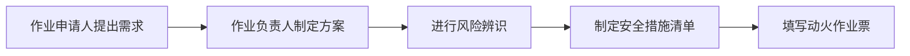

**关键步骤**：
1. **风险辨识**（作业负责人 + 安全管理人员）
   - 识别动火点周围的可燃物
   - 分析可能的点火源
   - 评估作业级别

2. **安全措施制定**（作业负责人）
   - 设备处理：倒空、隔绝、清洗、置换
   - 盲板隔离（不能用阀门代替）
   - 消防器材配备
   - 周围可燃物清理

### 阶段2：作业审批（作业前1天）

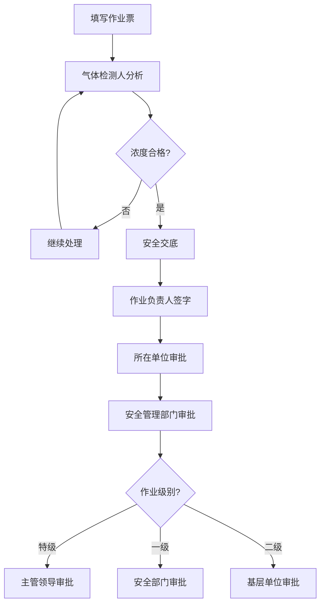

**关键步骤**：
1. **气体分析**（气体检测人）
   - 爆炸下限≥4%：浓度≤0.5%
   - 爆炸下限<4%：浓度≤0.2%
   - 氧含量：19.5%-21%

2. **安全交底**（安全交底人 → 作业人 + 监护人）
   - 讲解危险因素
   - 说明安全措施
   - 明确应急处置
   - 双方签字确认

3. **逐级审批**（根据作业级别）
   - 特级：主管领导
   - 一级：安全管理部门
   - 二级：所在基层单位

### 阶段3：作业实施（作业当天）

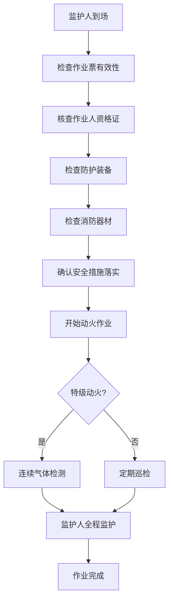

**关键步骤**：
1. **作业前检查**（监护人）
   - 作业票在有效期内
   - 动火人持证上岗
   - 防护装备齐全
   - 消防器材到位
   - 盲板已安装
   - 周围15m内无可燃液体排放
   - 周围30m内无可燃气体排放

2. **动火作业**（作业人）
   - 按操作规程进行焊接/切割
   - 服从监护人指挥
   - 发现异常立即停止

3. **全程监护**（监护人）
   - 不得离开现场
   - 监督作业人行为
   - 监测气体浓度（特级动火）
   - 观察周围环境变化
   - 异常情况立即中止作业

4. **特级动火特殊要求**：
   - 采集全过程作业影像
   - 连续检测气体浓度
   - 每2小时记录1次

### 阶段4：完工验收（作业结束后）

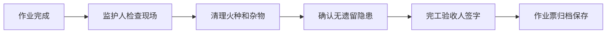

**关键步骤**：
1. **现场检查**（监护人 + 作业负责人）
   - 确认动火点已熄灭
   - 清理作业现场
   - 检查周围无火种
   - 恢复安全设施

2. **完工验收**（完工验收人）
   - 签字确认作业完成
   - 作业票归档（保存≥1年）

## 五、电子系统使用流程

### 1. 作业申请人操作流程

**系统功能** [AQ 3064.2]：
- 支持作业预约与申请提交
- 支持风险辨识与管控措施录入
- 支持承包商及作业人员信息管理
- 记录作业申请时间和作业实施时间

**详细操作步骤**：
1. 登录作业票电子系统，选择"新建作业申请" → "动火作业"
2. 填写基本信息：
   - 作业地点（具体到装置/区域）
   - 计划作业时间（开始时间、预计时长）
   - 动火作业内容描述（焊接/切割/其他）
   - 作业级别初判（特级/一级/二级）
3. 录入作业人员信息：
   - 动火人：姓名、焊工证编号、有效期、联系方式
   - 监护人：姓名、资格证书编号、联系方式
   - 气体检测人：姓名、检测资格证编号
4. 进行风险辨识（从系统风险库选择或自定义）：
   - 火灾爆炸风险
   - 中毒窒息风险
   - 高温灼烫风险
   - 触电风险
   - 其他特定风险
5. 制定管控措施（针对每项风险）：
   - 设备隔离措施（盲板位置、编号）
   - 气体检测要求
   - 消防器材配备
   - 周围环境清理范围
   - 个体防护装备
6. 上传附件：
   - 动火作业方案
   - 动火人焊工证扫描件
   - 现场平面图（标注动火点）
7. 提交申请，系统自动推送至作业负责人
8. 实时查看审批进度（待审批/已通过/已驳回）

**关键控制点**：
- 作业申请时间应提前于作业实施时间至少1天 [AQ 3064.2]
- 动火人必须持有有效焊工证，系统自动校验证书有效期
- 风险辨识必须完整，至少包含火灾爆炸风险
- 特级动火必须上传作业方案

**异常处理**：
- 若焊工证已过期，系统提示"证书已过期，请更新后重新提交"
- 若风险辨识不完整，系统阻止提交并提示"请完善风险辨识"
- 若作业时间距离申请时间不足1天，系统提示"作业时间过近，请调整"

**Mermaid流程图**：
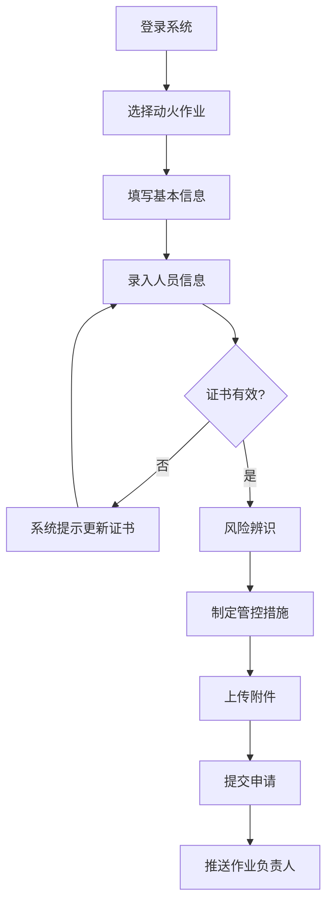

### 2. 作业负责人操作流程

**系统功能** [AQ 3064.2]：
- 接收作业申请并审核
- 组织制定作业方案
- 确认安全措施落实
- 组织安全交底

**详细操作步骤**：
1. 接收系统推送的作业申请通知（短信/APP推送）
2. 登录系统，进入"待处理作业"列表，选择对应动火作业票
3. 查看作业申请详情：
   - 作业内容、地点、时间
   - 作业人员资质信息
   - 风险辨识结果
   - 管控措施清单
4. 审核作业方案合理性，必要时要求申请人补充完善
5. 组织现场勘查，确认作业条件：
   - 设备隔离状态
   - 周围环境情况
   - 消防器材配备
6. 在系统中确认"作业方案已审核"，填写审核意见
7. 组织安全交底（线下进行），交底完成后在系统中上传：
   - 安全交底记录表（含签字）
   - 交底现场照片
8. 提交至气体检测环节，系统推送通知给气体检测人

**关键控制点** [GB 30871-2022]：
- 应组织作业现场和作业过程中的危险有害因素辨识
- 应组织制定具体安全措施与应急措施
- 应组织作业前安全交底
- 严格按规定组织和指挥生产作业活动

**异常处理**：
- 若发现风险辨识不充分，退回申请人要求补充
- 若现场条件不满足，暂缓作业并在系统中标注"待整改"
- 若安全交底未完成，系统不允许进入审批流程

**Mermaid流程图**：
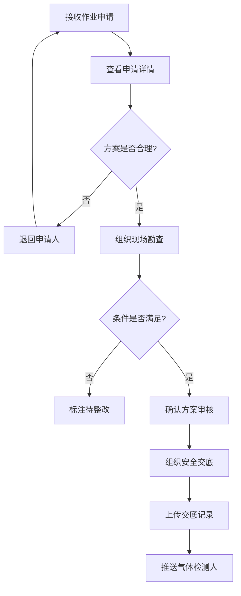

### 3. 气体检测人操作流程

**系统功能** [GB 30871-2022]：
- 支持气体检测数据实时录入和上传
- 自动判定检测结果是否符合作业条件
- 异常数据自动报警并阻止作业票审批流程
- 记录检测时间、地点、仪器信息

**详细操作步骤**：
1. 接收作业负责人的检测任务通知
2. 携带便携式气体检测仪前往作业现场
3. 按规定对作业区域进行气体检测：
   - 可燃气体浓度（%LEL）
   - 有毒气体浓度（ppm或mg/m³）
   - 氧含量（%）
4. 登录系统，进入"气体检测"模块，选择对应动火作业票
5. 录入检测数据：
   - 可燃气体浓度值
   - 有毒气体浓度值
   - 氧含量值
   - 检测时间（自动记录）
   - 检测点位（动火点周围、设备内部等）
   - 检测仪器编号及校准有效期
6. 上传检测报告照片（检测仪显示屏截图）
7. 系统自动判定检测结果：
   - 爆炸下限≥4%：可燃气体浓度≤0.5% → 合格
   - 爆炸下限<4%：可燃气体浓度≤0.2% → 合格
   - 氧含量：19.5%-21% → 合格
   - 有毒气体浓度 < 最高容许浓度 → 合格
8. 检测合格后，点击"提交检测结果"，系统解锁审批流程
9. 检测不合格时，系统自动阻止审批，通知作业负责人整改

**关键控制点** [GB 30871-2022]：
- 特级、一级动火作业应在作业前30分钟内取样分析
- 二级动火作业应在作业前1小时内取样分析
- 作业中断超过30分钟，应重新检测
- 检测数据必须真实准确，不得伪造
- 特级动火作业过程中应连续检测，每2小时记录1次

**异常处理**：
- 检测数据超标时，系统自动发送报警通知，禁止作业
- 检测仪器故障时，应更换备用仪器并在系统中备注
- 作业过程中需连续监测时，每2小时在系统中录入一次数据
- 若检测时间距离作业开始时间过长，系统提示"需重新检测"

**Mermaid流程图**：
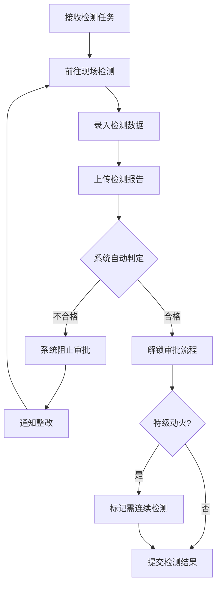

### 4. 审批人操作流程

**系统功能** [AQ 3064.2 第5.5.2条]：
- 通过人员定位信息判定审批人在作业现场时，开放审批权限
- 支持审批人现场确认风险识别和管控措施落实情况后签批
- 同步记录签批时间和位置信息
- 支持委托签批功能 [AQ 3064.2 第5.5.3条]

**详细操作步骤**：
1. 接收系统推送的待审批作业通知（短信/APP推送）
2. 登录系统，进入"待审批作业"列表，选择对应动火作业票
3. 查看作业申请详情：
   - 作业内容、地点、时间、级别
   - 风险辨识、管控措施
   - 气体检测结果
   - 安全交底记录
4. **前往作业现场**（系统通过人员定位验证审批人位置）
5. 系统自动判定审批人进入作业现场区域后，开放审批权限按钮
6. 现场核查安全措施落实情况：
   - 盲板隔离是否到位
   - 消防器材是否配备
   - 周围环境是否清理
   - 作业人员资质是否有效
7. 确认无误后点击"现场审批"
8. 填写审批意见，选择"同意"或"不同意"（不同意需说明原因）
9. 电子签名确认，系统记录审批时间、位置坐标、签批人信息
10. 审批完成后，系统自动推送至下一审批环节（特级动火）或作业负责人

**关键控制点** [GB 30871-2022]：
- 审批人应在作业现场完成审批工作（系统强制定位验证）
- 应核查安全作业票审批级别与企业管理制度中规定级别一致
- 应核查各项审批环节符合企业管理要求
- 应核查安全作业票中各项风险识别及管控措施落实情况
- 特级动火需主管领导审批，一级需安全管理部门审批，二级需基层单位审批

**委托审批功能** [AQ 3064.2 第5.5.3条]：
- 当审批人因故无法到场时，可在系统中发起委托审批
- 被委托人应得到授权且具有当前作业审批环节的审批权限
- 系统记录委托关系、委托时间、委托原因

**异常处理**：
- 若审批人未到达现场，系统不开放审批权限，提示"请前往作业现场"
- 若发现安全措施未落实，应选择"不同意"并要求整改后重新申请
- 若系统定位异常，可联系管理员手动验证位置后开放权限
- 若审批级别与作业级别不匹配，系统自动提示并阻止审批

**Mermaid流程图**：
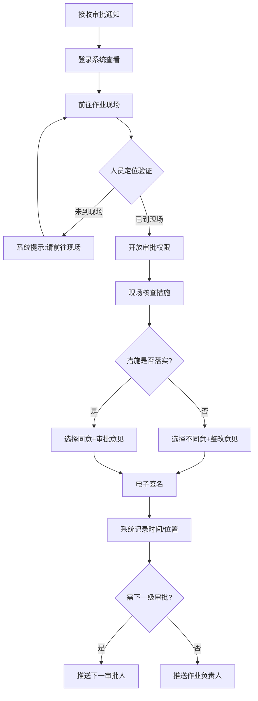

### 5. 安全交底人操作流程

**系统功能** [GB 30871-2022]：
- 支持安全交底内容模板化管理
- 记录交底时间、地点、参与人员
- 支持交底记录电子签名
- 自动生成交底记录表

**详细操作步骤**：
1. 接收作业负责人的交底任务通知
2. 登录系统，进入"安全交底"模块，选择对应动火作业票
3. 查看作业详情和风险辨识结果
4. 选择交底模板或自定义交底内容：
   - 动火作业危险因素（火灾爆炸、中毒窒息、灼烫等）
   - 安全措施和注意事项
   - 应急处置措施
   - 个体防护要求
5. 组织现场交底（线下进行），向作业人员和监护人讲解
6. 交底完成后，在系统中录入：
   - 交底时间、地点
   - 参与人员签字确认（电子签名或上传签字照片）
   - 交底现场照片
7. 生成《安全交底记录表》，系统自动归档
8. 提交交底记录，解锁后续审批流程

**关键控制点**：
- 交底内容必须包含本次作业的所有危险因素
- 所有作业人员和监护人必须参加交底并签字确认
- 交底应在作业前完成，不得事后补签
- 交底记录应真实完整，不得伪造

**异常处理**：
- 若参与人员未全部签字，系统提示"交底未完成，请确认所有人员签字"
- 若交底内容与风险辨识不匹配，系统提示"请补充交底内容"
- 若交底时间距离作业开始时间过长（>24小时），系统提示"需重新交底"

**Mermaid流程图**：
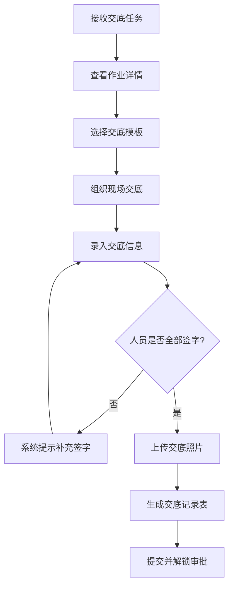

### 6. 监护人操作流程

**系统功能** [AQ 3064.2]：
- 支持监护人身份识别和权限管理
- 记录监护过程中的关键事件
- 支持异常情况实时上报
- 记录监护开始和结束时间

**详细操作步骤**：
1. 作业开始前，登录系统，进入"监护管理"模块
2. 扫描作业票二维码或输入作业票编号，调取作业信息
3. 核查作业票有效性：
   - 作业票是否在有效期内（特级/一级≤8小时，二级≤72小时）
   - 审批手续是否完备
   - 气体检测是否合格
4. 核查作业人员资格：
   - 动火人焊工证是否有效
   - 是否与作业票登记信息一致
5. 检查现场安全措施落实情况：
   - 盲板隔离是否到位
   - 消防器材是否配备（灭火器≥2具）
   - 周围15m内无可燃液体排放
   - 周围30m内无可燃气体排放
   - 个体防护装备是否齐全
6. 确认无误后，在系统中点击"开始监护"，系统记录监护开始时间
7. 作业过程中，实时监控并在系统中记录：
   - 作业人员操作情况
   - 气体浓度变化（特级动火每2小时记录）
   - 周围环境变化
   - 异常情况（如有）
8. 发现异常情况时，立即在系统中点击"中止作业"并上报：
   - 气体浓度超标
   - 作业人员违章操作
   - 设备泄漏
   - 天气突变
9. 作业完成后，检查现场无遗留火种，点击"结束监护"

**关键控制点** [GB 30871-2022]：
- 作业前检查安全作业票，核查内容相符且在有效期内
- 核查各项安全措施已得到落实
- 作业期间全程监护，不应擅自离开作业现场
- 当作业现场出现异常情况时应中止作业
- 当作业人员违章时，应及时制止

**异常处理**：
- 若作业票已过期，系统阻止开始监护，提示"作业票已过期"
- 若安全措施未落实，在系统中标注"待整改"并通知作业负责人
- 若监护人擅自离开现场，系统通过人员定位发现后自动报警
- 若发现异常情况，系统自动推送通知给作业负责人和安全管理部门

**Mermaid流程图**：
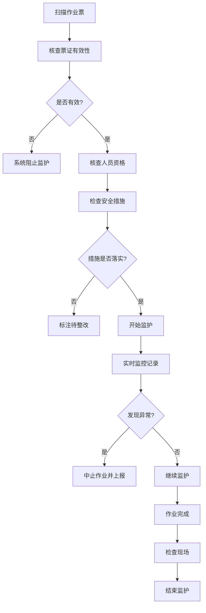

### 7. 作业人操作流程

**系统功能**：
- 支持作业人查看作业票详情
- 记录作业人安全交底确认
- 支持作业过程记录（可选）
- 记录作业开始和结束时间

**详细操作步骤**：
1. 登录系统，进入"我的作业"模块
2. 查看分配给自己的动火作业任务
3. 点击作业票，查看详细信息：
   - 作业内容、地点、时间
   - 风险辨识结果
   - 安全措施要求
   - 应急处置措施
4. 确认已参加安全交底，在系统中电子签名确认
5. 作业开始前，在系统中点击"开始作业"，记录开始时间
6. 按照操作规程进行动火作业（焊接、切割等）
7. 作业过程中，服从监护人指挥，发现异常立即停止
8. 作业完成后，在系统中点击"完成作业"，记录结束时间
9. 填写作业完成情况（可选）

**关键控制点**：
- 必须持有有效焊工证，系统已在申请阶段验证
- 必须参加安全交底并签字确认
- 必须按照操作规程进行作业
- 必须服从监护人指挥
- 发现异常情况应立即停止作业并报告

**异常处理**：
- 若未参加安全交底，系统不允许开始作业
- 若作业过程中发现异常，应立即在系统中标注"异常中止"
- 若作业时间超过作业票有效期，系统自动提示"作业票已过期"

**Mermaid流程图**：
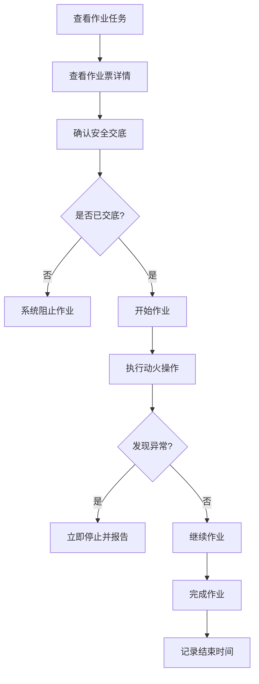

### 8. 完工验收人操作流程

**系统功能** [AQ 3064.2]：
- 支持完工验收记录
- 自动生成验收报告
- 支持验收照片上传
- 作业票自动归档

**详细操作步骤**：
1. 接收作业完成通知
2. 登录系统，进入"完工验收"模块，选择对应动火作业票
3. 前往作业现场进行验收检查：
   - 动火点是否已熄灭
   - 现场是否清理干净
   - 周围是否有遗留火种
   - 安全设施是否已恢复
4. 在系统中录入验收结果：
   - 验收时间（自动记录）
   - 验收地点
   - 验收情况描述
   - 是否合格（合格/不合格）
5. 上传验收现场照片（至少2张）
6. 若验收不合格，填写整改要求并退回作业负责人
7. 若验收合格，电子签名确认
8. 系统自动生成《动火作业完工验收报告》
9. 作业票自动归档，保存期限≥1年

**关键控制点**：
- 必须现场验收，不得远程验收
- 必须确认动火点已完全熄灭，无复燃风险
- 必须确认现场清理干净，无遗留隐患
- 验收不合格时，不得签字验收

**异常处理**：
- 若发现遗留火种，立即要求作业人员处理，处理完毕后重新验收
- 若现场未清理干净，退回作业负责人要求整改
- 若验收照片未上传，系统提示"请上传验收照片"

**Mermaid流程图**：
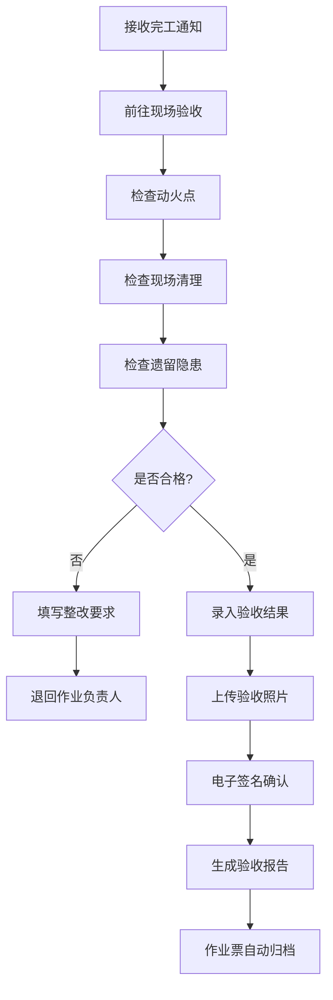

## 六、关键安全措施

### 1. 能量隔离
- **盲板隔离**：不能用水封或关闭阀门代替
- **电气隔离**：切断电源，挂牌上锁

### 2. 气体检测
- 作业前分析合格
- 特级动火连续检测
- 浓度超标立即停止

### 3. 消防准备
- 配备灭火器（≥2具）
- 准备消防水带
- 特级动火配备消防车

### 4. 周围环境
- 15m内不排放可燃液体
- 30m内不排放可燃气体
- 清理周围可燃物

### 5. 个体防护
- 佩戴防护面罩
- 穿戴防护服
- 使用绝缘手套（电焊）

## 六、异常情况处置

| 异常情况 | 处置措施 | 责任人 |
|---------|---------|--------|
| 气体浓度超标 | 立即停止作业，通风置换，重新检测 | 监护人 |
| 发现火种 | 立即扑灭，检查周围，确认安全后继续 | 监护人 |
| 作业人违章 | 立即制止，纠正后继续 | 监护人 |
| 设备泄漏 | 停止作业，处理泄漏，重新评估 | 作业负责人 |
| 天气突变 | 评估影响，必要时停止作业 | 作业负责人 |

## 七、作业票管理

- **一式三联**：
  - 第一联：监护人持有
  - 第二联：作业单位持有
  - 第三联：存档保存（≥1年）

- **有效期管理**：
  - 特级/一级：≤8小时
  - 二级：≤72小时
  - 超期重新办理

- **变更管理**：
  - 内容变更 → 重新办理
  - 范围扩大 → 重新办理
  - 地点转移 → 重新办理
