# 受限空间作业票 - 人员与工作流程

## 一、作业定义

进入或探入受限空间进行的作业。

**受限空间**是指：
- 进出口受限
- 通风不良
- 可能存在有毒有害、易燃易爆物质或缺氧
- 不适合人员长时间停留的封闭、半封闭设施及场所

**典型受限空间**：
- 反应器、塔、釜、槽、罐、炉膛、锅筒、管道
- 地下室、窨井、坑（池）、下水道
- 船舱、车厢、储藏室等

## 二、作业特点

- **有效期**：≤24小时
- **核心原则**：先通风、再检测、后作业
- **高风险**：中毒窒息事故高发

## 三、涉及人员及职责

### 1. 作业申请人
- **职责**：提出进入受限空间作业需求
- **要求**：说明作业必要性和内容

### 2. 作业负责人
- **职责**：
  - 制定受限空间作业方案
  - 组织风险辨识
  - 确认通风、检测、隔离措施落实
  - 组织作业实施
  - 协调应急救援准备
- **要求**：有受限空间作业管理经验

### 3. 作业人
- **职责**：
  - 进入受限空间执行作业
  - 正确佩戴防护装备
  - 与监护人保持联系
  - 感觉不适立即撤离
- **要求**：
  - 经专门培训
  - 身体健康（禁忌症：高血压、心脏病、幽闭恐惧症等）
  - 了解受限空间危害

### 4. 监护人
- **职责**：
  - 检查作业票有效性
  - 核查作业人员身体状况和资格
  - 检查隔绝式呼吸防护装备
  - 检查救生绳和通信设备
  - 监督通风和气体检测
  - 全程守候在受限空间外
  - 与作业人保持联系
  - 发现异常立即报警并组织撤离
  - **禁止进入受限空间施救**
- **要求**：
  - 经培训考核合格
  - 持证上岗
  - **绝对不得离开现场**
  - **绝对不得进入受限空间**

### 5. 气体检测人
- **职责**：
  - 作业前进行气体检测
  - 作业中连续或定期检测
  - 每2小时记录1次检测数据
  - 浓度异常立即报告
- **要求**：持有气体检测资格证

### 6. 安全交底人
- **职责**：
  - 交底受限空间危害因素
  - 讲解防护措施和应急处置
  - 强调"先通风、再检测、后作业"
  - 确认作业人员理解
- **要求**：熟悉受限空间作业风险

### 7. 审批人
- **职责**：
  - 审核作业方案
  - 确认安全措施充分
  - 签字批准作业票
- **要求**：安全管理部门或授权人员

### 8. 应急救援人员（待命）
- **职责**：
  - 现场待命
  - 配备应急救援装备
  - 发生事故时实施救援
  - **佩戴隔绝式呼吸器后方可进入**
- **要求**：
  - 经专业培训
  - 熟悉应急救援程序
  - 配备救援装备

## 四、工作流程

### 阶段1：作业准备（作业前1-3天）

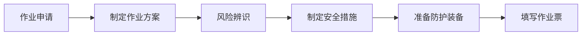

**关键步骤**：
1. **风险辨识**（作业负责人 + 安全管理人员）
   - 识别受限空间内危害因素
   - 分析可能的中毒窒息风险
   - 评估氧含量和有毒气体

2. **设备处理**（设备管理人员）
   - 倒空物料
   - 盲板隔离（不能用阀门代替）
   - 清洗置换
   - 通风

3. **装备准备**（作业负责人）
   - 隔绝式呼吸防护装备
   - 救生绳
   - 通信设备
   - 照明设备（防爆）
   - 应急救援装备

### 阶段2：作业审批（作业前1天）

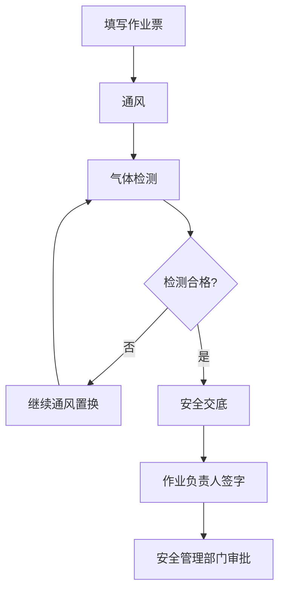

**关键步骤**：
1. **通风**（作业负责人组织）
   - 自然通风或强制通风
   - 通风时间充分

2. **气体检测**（气体检测人）
   - **氧含量**：19.5%-21%（富氧≤23.5%）
   - **可燃气体**：≤爆炸下限的10%
   - **有毒气体**：≤职业接触限值
   - 检测点：上、中、下部

3. **安全交底**（安全交底人 → 作业人 + 监护人）
   - 受限空间危害
   - 防护措施
   - 应急撤离信号
   - 禁止盲目施救

### 阶段3：作业实施（作业当天）

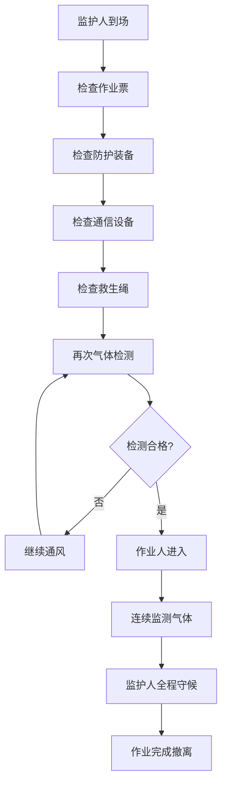

**关键步骤**：
1. **作业前检查**（监护人）
   - 作业票有效
   - 作业人身体状况良好
   - 隔绝式呼吸防护装备完好
   - 救生绳系牢
   - 通信设备正常
   - 照明设备防爆
   - 盲板已安装

2. **进入作业**（作业人）
   - 佩戴隔绝式呼吸防护装备
   - 系好救生绳
   - 携带通信设备
   - 缓慢进入
   - 与监护人保持联系

3. **全程监护**（监护人）
   - **守候在受限空间外**
   - 连续或定期检测气体（每2h记录）
   - 与作业人保持通信
   - 观察作业人状态
   - 发现异常立即组织撤离
   - **绝不进入受限空间**

4. **应急准备**（应急救援人员）
   - 现场待命
   - 配备救援装备
   - 准备隔绝式呼吸器

### 阶段4：完工验收（作业结束后）

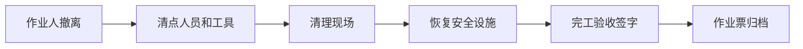

**关键步骤**：
1. **人员撤离**（监护人指挥）
   - 确认所有人员撤出
   - 清点工具和设备

2. **完工验收**（完工验收人）
   - 确认作业完成
   - 检查现场清理
   - 签字验收

## 五、电子系统使用流程

### 1. 作业申请人操作流程

**系统功能** [AQ 3064.2]：
- 支持作业预约与申请提交
- 支持风险辨识与管控措施录入
- 支持受限空间作业方案制定
- 记录作业申请时间和作业实施时间

**详细操作步骤**：
1. 登录作业票电子系统，选择"新建作业申请" → "受限空间作业"
2. 填写基本信息：
   - 受限空间位置（具体到设备编号/区域）
   - 计划作业时间（开始时间、预计时长，有效期≤24小时）
   - 受限空间类型（反应器/塔/罐/地下室/坑池等）
   - 作业内容描述（检修/清理/检测等）
3. 进行风险辨识：
   - 识别受限空间内危害因素（缺氧/有毒气体/易燃气体/粉尘等）
   - 评估中毒窒息风险等级
   - 系统自动关联历史事故案例和风险数据库
4. 制定安全措施：
   - 隔离措施（盲板位置、编号）
   - 通风方案（自然通风/强制通风、通风时长）
   - 气体检测要求（检测点位、检测频次）
   - 个体防护装备清单（隔绝式呼吸器、救生绳、通信设备等）
5. 填报作业人员信息：
   - 作业人（姓名、证书编号、体检报告有效期）
   - 监护人（资格证书、培训记录）
   - 气体检测人（检测资格证）
   - 应急救援人员（救援培训证明）
   - 系统自动校验人员资格和体检有效性
6. 上传附件：
   - 受限空间作业方案
   - 应急救援预案
   - 设备隔离示意图
7. 提交申请，系统自动流转至作业负责人审核

**关键控制点**：
- 作业申请时间应提前于作业实施时间至少1天 [AQ 3064.2]
- 受限空间作业有效期≤24小时，系统自动校验
- 作业人员必须经专门培训且体检合格，系统自动校验证书和体检报告有效期
- 必须制定应急救援预案，系统强制要求上传

**异常处理**：
- 若作业人员资格或体检不合格，系统自动拒绝提交并提示补充
- 若风险辨识不完整，系统提示补充危害因素
- 若缺少应急救援预案，系统阻止提交

**Mermaid流程图**：
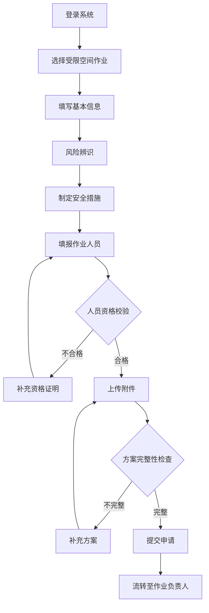

### 2. 作业负责人操作流程

**系统功能** [AQ 3064.2]：
- 支持受限空间作业方案审核与完善
- 支持风险辨识组织与确认
- 支持安全措施落实情况检查
- 支持作业实施过程协调管理
- 记录作业负责人审核时间和决策过程

**详细操作步骤**：
1. 登录系统，进入"待审核作业申请"列表，选择对应的受限空间作业申请
2. 审核作业申请内容：
   - 核查受限空间位置、类型、作业内容的准确性
   - 评估作业必要性和可行性
   - 确认作业时间安排的合理性（有效期≤24小时）
3. 组织风险辨识会议：
   - 在系统中发起风险辨识会议邀请（安全管理人员、设备管理人员、气体检测人）
   - 记录风险辨识结果（危害因素、风险等级、管控措施）
   - 系统自动生成风险辨识报告
4. 完善安全措施：
   - 确认隔离措施的充分性（盲板位置、规格、安装责任人）
   - 制定通风方案（通风方式、时长、验证标准）
   - 明确气体检测要求（检测点位、频次、合格标准）
   - 配置个体防护装备（隔绝式呼吸器、救生绳、通信设备、防爆照明）
5. 指定作业人员：
   - 选择作业人（系统自动校验资格证书、体检报告、培训记录）
   - 指定监护人（系统自动校验监护资格、持证情况）
   - 安排气体检测人（系统自动校验检测资格证）
   - 协调应急救援人员（系统自动校验救援培训证明）
6. 协调应急救援准备：
   - 确认应急救援预案的完整性
   - 检查应急救援装备的配备情况（隔绝式呼吸器、救生绳、担架等）
   - 明确应急救援人员的待命位置和联系方式
7. 提交审核意见：
   - 若方案完善，签字确认并流转至安全管理部门审批
   - 若方案不完善，退回申请人补充完善，并注明具体要求

**关键控制点**：
- 作业负责人必须有受限空间作业管理经验 [AQ 3064.2]
- 风险辨识必须覆盖所有危害因素（缺氧、有毒气体、易燃气体、粉尘、高温、淹溺等）
- 隔离措施必须采用盲板，不得用阀门代替 [GB 30871-2022]
- 应急救援预案必须包含救援程序、装备清单、人员分工
- 系统自动校验所有作业人员的资格和体检有效性

**异常处理**：
- 若风险辨识不充分，系统提示补充危害因素和管控措施
- 若作业人员资格或体检不合格，系统阻止提交并提示更换人员
- 若应急救援预案缺失或不完整，系统阻止提交并提示补充
- 若隔离措施不符合要求（如使用阀门代替盲板），系统提示整改

**Mermaid流程图**：
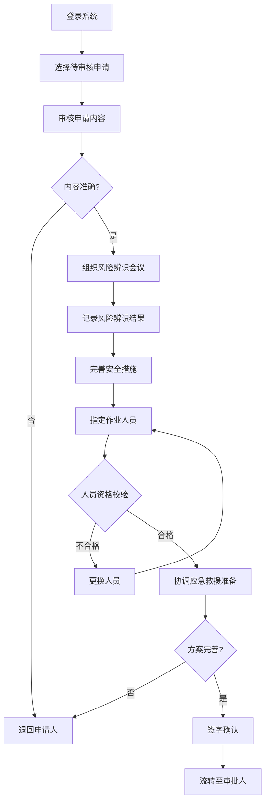

### 3. 监护人操作流程

**系统功能** [AQ 3064.2]：
- 支持作业票有效性检查
- 支持作业人员身体状况和资格核查
- 支持防护装备和通信设备检查
- 支持气体检测监督和异常报警
- 记录监护人全程守候情况和异常事件

**详细操作步骤**：
1. 登录系统，进入"待监护作业"列表，选择对应的受限空间作业
2. 作业前检查（作业当天，作业人进入前）：
   - 核查作业票有效性（审批签字完整、有效期内、内容与现场一致）
   - 核查作业人员身体状况（询问身体状况、观察精神状态、确认无禁忌症）
   - 系统自动校验作业人员资格证书和体检报告有效期
3. 检查防护装备：
   - 检查隔绝式呼吸防护装备（气瓶压力、面罩密封性、呼吸阀功能）
   - 检查救生绳（长度充足、系牢可靠、无破损）
   - 检查通信设备（电量充足、信号正常、双向通话清晰）
   - 检查照明设备（防爆认证、电量充足、亮度足够）
   - 在系统中逐项确认检查结果
4. 监督气体检测：
   - 确认气体检测人已到场并持有检测资格证
   - 监督气体检测过程（检测点位、检测顺序、检测时长）
   - 核查气体检测结果（氧含量19.5%-21%、可燃气体≤爆炸下限10%、有毒气体≤职业接触限值）
   - 在系统中记录气体检测数据
5. 确认盲板安装：
   - 核查盲板安装位置、规格、编号与作业票一致
   - 确认盲板安装牢固、密封可靠
   - 在系统中拍照上传盲板安装照片
6. 全程守候监护（作业人进入后）：
   - 守候在受限空间外，**绝对不得离开现场**
   - 通过通信设备与作业人保持联系（每15分钟通话1次）
   - 观察作业人状态（动作、声音、反应）
   - 监督气体检测人连续或定期检测（每2小时记录1次）
   - 在系统中实时记录监护情况
7. 异常情况处置：
   - 发现气体浓度异常、作业人感觉不适、通信中断等异常情况
   - 立即通过系统发出报警信号
   - 组织作业人立即撤离
   - **绝对不得进入受限空间施救**
   - 通知应急救援人员到场救援

**关键控制点**：
- 监护人必须经培训考核合格并持证上岗 [AQ 3064.2]
- 监护人**绝对不得离开现场**，**绝对不得进入受限空间** [GB 30871-2022]
- 气体检测结果必须符合标准：氧含量19.5%-21%、可燃气体≤爆炸下限10%、有毒气体≤职业接触限值
- 隔绝式呼吸防护装备必须完好有效
- 系统自动记录监护人在岗时间，离岗超过5分钟自动报警

**异常处理**：
- 若作业票无效或过期，系统阻止作业并提示重新办理
- 若作业人员身体状况不佳或资格不合格，系统阻止作业并提示更换人员
- 若防护装备不完好，系统阻止作业并提示更换装备
- 若气体检测不合格，系统阻止作业并提示继续通风置换
- 若监护人离岗，系统自动报警并通知作业负责人和安全管理部门

**Mermaid流程图**：
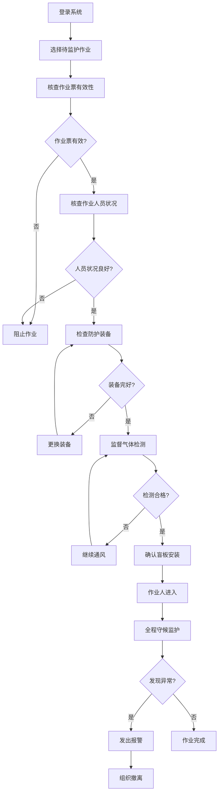

### 4. 审批人操作流程

**系统功能** [AQ 3064.2]：
- 支持作业方案审批与风险评估
- 支持安全措施充分性审查
- 支持人员定位验证与资格确认 [AQ 3064.3]
- 支持审批意见记录与流程管理
- 记录审批人审批时间和决策依据

**详细操作步骤**：
1. 登录系统,进入"待审批作业"列表,选择对应的受限空间作业申请
2. 审查作业方案完整性：
   - 核查作业必要性说明、作业内容、作业时间、作业地点
   - 核查风险辨识报告的全面性（危害因素识别、风险等级评估、管控措施）
   - 核查应急救援预案的可行性（救援程序、装备清单、人员分工、演练记录）
3. 评估安全措施充分性：
   - 评估隔离措施（盲板规格、位置、安装责任人、验收标准）
   - 评估通风方案（通风方式、时长、验证标准、应急通风措施）
   - 评估气体检测方案（检测点位、频次、合格标准、连续监测要求）
   - 评估个体防护装备配置（隔绝式呼吸器、救生绳、通信设备、防爆照明）
   - 评估应急救援准备（救援人员、救援装备、救援程序、现场待命）
4. 人员定位验证 [AQ 3064.3]：
   - 系统自动调用人员定位系统,核查作业人员当前位置
   - 确认作业人员在厂区内且未在其他作业现场
   - 核查作业人员定位设备正常工作（电量充足、信号正常）
   - 在系统中记录人员定位验证结果
5. 确认人员资格和体检：
   - 系统自动校验作业人资格证书（受限空间作业证、有效期）
   - 系统自动校验监护人资格证书（监护资格证、培训记录）
   - 系统自动校验气体检测人资格证书（气体检测资格证、校准记录）
   - 系统自动校验应急救援人员资格证书（救援培训证明、演练记录）
   - 系统自动校验所有人员体检报告有效期（无禁忌症、体检合格）
6. 审查作业票关键信息：
   - 确认作业有效期≤24小时
   - 确认作业负责人签字、安全交底记录完整
   - 确认气体检测数据符合标准（氧含量19.5%-21%、可燃气体≤爆炸下限10%、有毒气体≤职业接触限值）
   - 确认盲板安装照片清晰、位置准确
7. 作出审批决定：
   - 若方案完善、措施充分、人员合格,签字批准作业票
   - 若存在问题,退回作业负责人补充完善,并注明具体要求
   - 在系统中记录审批意见和决策依据

**关键控制点**：
- 审批人必须是安全管理部门人员或授权人员 [AQ 3064.2]
- 人员定位验证必须通过,确认作业人员在厂区内且未在其他作业现场 [AQ 3064.3]
- 所有作业人员资格证书和体检报告必须在有效期内
- 气体检测结果必须符合标准：氧含量19.5%-21%、可燃气体≤爆炸下限10%、有毒气体≤职业接触限值
- 应急救援预案必须包含救援程序、装备清单、人员分工,且救援人员必须现场待命
- 系统自动记录审批全过程,包括审批时间、审批意见、决策依据

**异常处理**：
- 若作业方案不完整或风险辨识不充分,系统阻止审批并提示补充
- 若安全措施不充分或不符合标准,系统阻止审批并提示整改
- 若人员定位验证失败,系统阻止审批并提示核查人员位置
- 若人员资格或体检不合格,系统阻止审批并提示更换人员
- 若气体检测不合格,系统阻止审批并提示继续通风置换
- 若应急救援准备不充分,系统阻止审批并提示补充救援措施

**Mermaid流程图**：
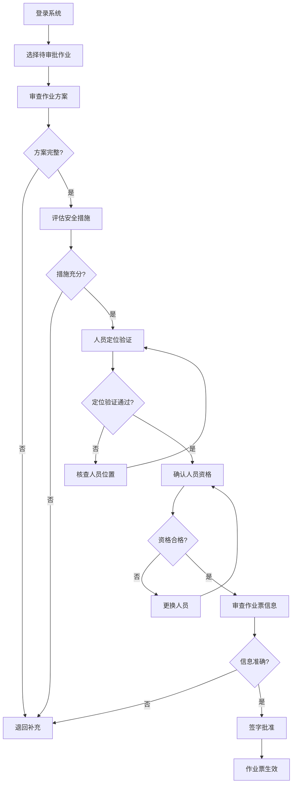

### 5. 安全交底人操作流程

**系统功能** [AQ 3064.2]：
- 支持安全交底内容制定与记录
- 支持受限空间危害因素讲解
- 支持防护措施和应急处置培训
- 支持交底确认与签字管理
- 记录安全交底时间和参与人员

**详细操作步骤**：
1. 登录系统,进入"待交底作业"列表,选择对应的受限空间作业
2. 准备安全交底内容：
   - 系统自动提取作业票中的危害因素（缺氧、有毒气体、易燃气体、粉尘、高温、淹溺等）
   - 系统自动提取作业票中的安全措施（隔离、通风、检测、防护、监护、救援）
   - 系统自动生成安全交底提纲（危害因素、防护措施、应急处置、禁止事项）
3. 组织安全交底会议：
   - 在系统中发起安全交底会议邀请（作业人、监护人、气体检测人、应急救援人员）
   - 确认所有参与人员到场并签到
   - 在系统中记录交底时间、地点、参与人员
4. 讲解受限空间危害因素：
   - 讲解受限空间定义（进出口受限、通风不良、可能存在有毒有害物质、不适合长时间停留）
   - 讲解本次作业的具体危害因素（缺氧、有毒气体种类、易燃气体浓度、粉尘危害等）
   - 讲解中毒窒息事故案例（历史事故、事故原因、事故后果、经验教训）
   - 强调"先通风、再检测、后作业"的核心原则
5. 讲解防护措施和应急处置：
   - 讲解隔离措施（盲板位置、规格、安装验收、不得用阀门代替）
   - 讲解通风措施（通风方式、时长、验证标准、连续通风要求）
   - 讲解气体检测（检测点位、频次、合格标准、连续监测）
   - 讲解个体防护（隔绝式呼吸器使用方法、救生绳系法、通信设备使用）
   - 讲解监护要求（监护人职责、全程守候、不得离开、不得进入）
   - 讲解应急撤离信号（报警信号、撤离路线、集合地点）
   - 讲解应急救援程序（报警、救援人员佩戴呼吸器、使用救生绳、禁止盲目施救）
6. 强调禁止事项：
   - **禁止未经通风和检测进入受限空间**
   - **禁止监护人离开现场或进入受限空间**
   - **禁止盲目施救**（必须佩戴隔绝式呼吸器、使用救生绳）
   - 禁止使用阀门代替盲板
   - 禁止作业中断4小时以上不重新检测
7. 确认交底效果：
   - 提问作业人员对危害因素的理解
   - 提问作业人员对防护措施的掌握
   - 提问作业人员对应急处置的了解
   - 确认所有人员理解交底内容并签字确认
   - 在系统中记录交底确认结果

**关键控制点**：
- 安全交底人必须熟悉受限空间作业风险 [AQ 3064.2]
- 安全交底必须在作业前进行,所有作业人员必须参加
- 必须强调"先通风、再检测、后作业"的核心原则 [GB 30871-2022]
- 必须强调"禁止盲目施救"的禁令
- 所有参与人员必须签字确认,系统自动记录交底时间和参与人员

**异常处理**：
- 若作业人员未参加安全交底,系统阻止作业并提示补充交底
- 若作业人员对交底内容理解不充分,系统提示重新交底
- 若作业人员未签字确认,系统阻止作业并提示补充签字

**Mermaid流程图**：
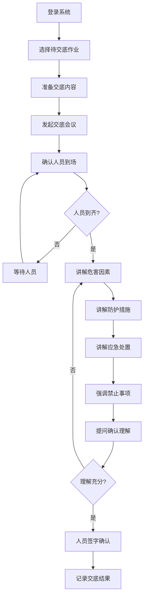

### 6. 完工验收人操作流程

**系统功能** [AQ 3064.2]：
- 支持作业完成情况检查
- 支持现场清理情况验收
- 支持人员和工具清点
- 支持完工验收签字管理
- 记录完工验收时间和验收结果

**详细操作步骤**：
1. 登录系统,进入"待验收作业"列表,选择对应的受限空间作业
2. 确认作业完成：
   - 核查作业内容是否按计划完成（检修/清理/检测等）
   - 核查作业质量是否符合要求
   - 在系统中查看作业过程记录（作业时长、气体检测数据、异常事件）
3. 清点人员和工具：
   - 确认所有作业人员已撤出受限空间
   - 清点作业人员人数与作业票一致
   - 清点工具和设备（扳手、电钻、照明灯等）
   - 确认无遗留工具或设备在受限空间内
   - 在系统中逐项确认清点结果
4. 检查现场清理：
   - 检查受限空间内是否清理干净（无杂物、无积水、无油污）
   - 检查作业产生的废弃物是否清理（废料、包装物、擦拭物等）
   - 检查临时设施是否拆除（照明灯、通风设备、通信设备等）
   - 在系统中拍照上传现场清理照片
5. 检查安全设施恢复：
   - 检查盲板是否拆除（如需恢复生产）
   - 检查安全警示标志是否撤除
   - 检查受限空间入口是否封闭或恢复原状
   - 在系统中记录安全设施恢复情况
6. 核查作业票记录：
   - 核查作业票签字是否完整（申请人、负责人、审批人、监护人、交底人）
   - 核查气体检测记录是否完整（每2小时记录1次）
   - 核查监护记录是否完整（全程守候、异常事件）
   - 核查作业时间是否在有效期内（≤24小时）
7. 签字验收：
   - 若作业完成、现场清理、人员工具清点无误,签字验收
   - 若存在问题,要求作业负责人整改后再验收
   - 在系统中记录验收意见和验收时间
   - 系统自动归档作业票（保存≥1年）

**关键控制点**：
- 完工验收人必须确认所有作业人员已撤出受限空间
- 必须清点人员和工具,确认无遗留
- 必须检查现场清理,确认无杂物
- 必须核查作业票记录完整性
- 系统自动归档作业票,保存≥1年 [AQ 3064.2]

**异常处理**：
- 若作业人员未全部撤出,系统阻止验收并提示清点人员
- 若工具或设备有遗留,系统阻止验收并提示清理
- 若现场清理不彻底,系统阻止验收并提示整改
- 若作业票记录不完整,系统阻止验收并提示补充记录

**Mermaid流程图**：
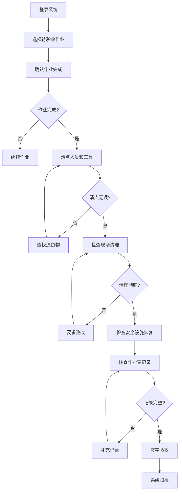

### 7. 气体检测人操作流程

**系统功能** [AQ 3064.2]：
- 支持气体检测方案制定与执行
- 支持检测数据实时记录与分析
- 支持检测结果自动判定与报警
- 支持检测设备校准与维护管理
- 记录气体检测全过程数据

**详细操作步骤**：
1. 登录系统,进入"待检测作业"列表,选择对应的受限空间作业
2. 准备检测设备：
   - 在系统中查看检测要求（检测点位、检测频次、合格标准）
   - 确认检测设备类型（氧气检测仪、可燃气体检测仪、有毒气体检测仪）
   - 检查检测设备校准状态（校准日期、有效期、校准证书）
   - 在系统中记录设备信息（设备编号、型号、校准日期）
3. 作业前气体检测：
   - 在受限空间入口处设置检测点（上部、中部、下部）
   - 按顺序进行检测（先检测氧含量、再检测可燃气体、最后检测有毒气体）
   - 在系统中实时录入检测数据（氧含量、可燃气体浓度、有毒气体浓度）
   - 系统自动判定检测结果（合格/不合格）
4. 检测结果处理：
   - 若检测合格,在系统中确认并通知监护人
   - 若检测不合格,在系统中标注不合格项并通知作业负责人
   - 建议继续通风置换并重新检测
   - 在系统中记录通风时长和重新检测时间
5. 作业中连续监测：
   - 在受限空间外设置固定检测点
   - 每2小时进行一次气体检测
   - 在系统中实时记录检测数据
   - 系统自动生成检测数据曲线图
6. 异常情况处置：
   - 发现气体浓度异常（氧含量<19.5%或>23.5%、可燃气体>爆炸下限10%、有毒气体>职业接触限值）
   - 立即通过系统发出报警信号
   - 通知监护人立即组织作业人撤离
   - 在系统中记录异常情况和处置措施
7. 检测数据归档：
   - 作业完成后,在系统中汇总所有检测数据
   - 生成气体检测报告（检测点位、检测时间、检测数据、检测结论）
   - 系统自动归档检测报告（保存≥1年）

**关键控制点**：
- 气体检测人必须持有气体检测资格证 [AQ 3064.2]
- 检测设备必须在校准有效期内,系统自动校验校准状态
- 气体检测结果必须符合标准：氧含量19.5%-21%、可燃气体≤爆炸下限10%、有毒气体≤职业接触限值 [GB 30871-2022]
- 作业中必须每2小时记录1次检测数据
- 系统自动记录检测全过程,包括检测时间、检测数据、检测人员

**异常处理**：
- 若检测设备校准过期,系统阻止检测并提示更换设备
- 若检测数据不合格,系统阻止作业并提示继续通风置换
- 若检测数据异常波动,系统自动报警并提示检查设备或现场情况
- 若检测人员未按时记录数据,系统自动提醒并记录延迟时间

**Mermaid流程图**：
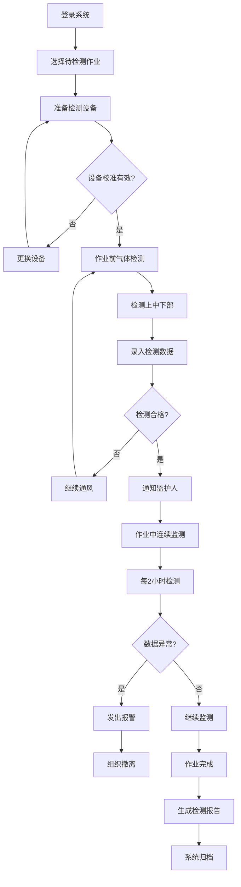

### 8. 应急救援人员操作流程

**系统功能** [AQ 3064.2]：
- 支持应急救援预案制定与演练
- 支持救援装备配备与检查
- 支持应急响应流程管理
- 支持救援过程记录与分析
- 记录应急救援人员待命情况

**详细操作步骤**：
1. 登录系统,进入"待命作业"列表,选择对应的受限空间作业
2. 确认应急救援预案：
   - 在系统中查看应急救援预案（救援程序、装备清单、人员分工）
   - 确认救援人员分工（救援组长、救援队员、医疗救护人员）
   - 确认救援装备配备情况（隔绝式呼吸器、救生绳、担架、急救箱等）
   - 在系统中记录救援人员到场时间和待命位置
3. 检查救援装备：
   - 检查隔绝式呼吸器（气瓶压力、面罩密封性、呼吸阀功能）
   - 检查救生绳（长度充足、强度可靠、无破损）
   - 检查担架（结构完整、固定可靠、便于搬运）
   - 检查急救箱（药品齐全、有效期内、急救器材完好）
   - 在系统中逐项确认检查结果
4. 现场待命：
   - 在受限空间外指定位置待命
   - 保持通信设备畅通（对讲机、手机）
   - 随时关注监护人发出的信号
   - 在系统中实时更新待命状态
5. 应急响应：
   - 接到监护人报警信号后,立即响应
   - 在系统中记录报警时间和报警原因
   - 佩戴隔绝式呼吸器,携带救生绳和急救装备
   - 进入受限空间前,在系统中记录进入时间和救援人员
6. 实施救援：
   - 使用救生绳拖拽被困人员
   - **禁止盲目进入受限空间**,必须佩戴隔绝式呼吸器
   - 将被困人员转移至安全区域
   - 立即进行现场急救（心肺复苏、人工呼吸、止血包扎等）
   - 在系统中记录救援过程和救援措施
7. 救援后处置：
   - 确认被困人员生命体征稳定
   - 联系医疗机构转运被困人员
   - 在系统中记录救援结果（救援成功/失败、伤亡情况、转运医院）
   - 配合事故调查,提供救援过程记录

**关键控制点**：
- 应急救援人员必须经专业培训并持证上岗 [AQ 3064.2]
- 救援人员必须现场待命,不得离开指定位置
- 进入受限空间救援必须佩戴隔绝式呼吸器 [GB 30871-2022]
- 禁止盲目施救,必须使用救生绳拖拽
- 系统自动记录救援全过程,包括报警时间、救援时间、救援措施、救援结果

**异常处理**：
- 若救援装备不完好,系统阻止作业并提示更换装备
- 若救援人员未到场或离开待命位置,系统自动报警并通知作业负责人
- 若救援过程中发现新的危险,系统提示暂停救援并重新评估风险
- 若救援失败,系统自动记录失败原因并启动上级应急预案

**Mermaid流程图**：
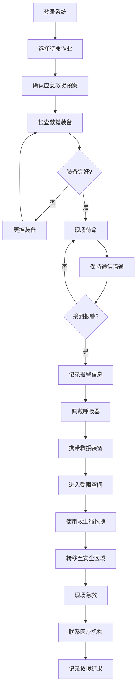

### 9. 作业人操作流程

**系统功能** [AQ 3064.2]：
- 支持作业票查看与确认
- 支持作业过程记录与管理
- 支持作业人员身体状况监测
- 支持作业异常情况报告
- 记录作业人员进出受限空间时间

**详细操作步骤**：
1. 登录系统,进入"待执行作业"列表,选择对应的受限空间作业
2. 作业前准备：
   - 在系统中查看作业票（作业内容、作业时间、安全措施、应急预案）
   - 确认安全交底内容（危害因素、防护措施、应急处置、禁止事项）
   - 在系统中签字确认已理解安全交底内容
   - 确认身体状况良好（无头晕、胸闷、呼吸困难等不适症状）
3. 佩戴防护装备：
   - 佩戴隔绝式呼吸防护装备（检查气瓶压力、面罩密封性）
   - 系好救生绳（确保系牢可靠、长度充足）
   - 携带通信设备（对讲机或手机）
   - 携带防爆照明设备
   - 在系统中逐项确认防护装备佩戴情况
4. 进入受限空间：
   - 在系统中记录进入时间
   - 缓慢进入受限空间,观察身体反应
   - 与监护人保持通信联系（每15分钟通话1次）
   - 在系统中实时更新作业状态
5. 执行作业：
   - 按照作业方案执行作业任务（检修/清理/检测等）
   - 严格遵守安全操作规程
   - 随时观察自身身体状况（头晕、胸闷、呼吸困难等）
   - 在系统中记录作业进度和异常情况
6. 异常情况处置：
   - 感觉身体不适,立即通过通信设备通知监护人
   - 在系统中发出异常报警信号
   - 立即停止作业,沿救生绳撤离受限空间
   - 撤离至安全区域后,在系统中记录异常情况和身体状况
7. 作业完成撤离：
   - 确认作业任务完成
   - 清点工具和设备,确认无遗留
   - 沿救生绳撤离受限空间
   - 在系统中记录撤离时间和作业完成情况

**关键控制点**：
- 作业人必须经专门培训且体检合格 [AQ 3064.2]
- 必须佩戴隔绝式呼吸防护装备,不得摘除 [GB 30871-2022]
- 必须系好救生绳,不得解开
- 必须与监护人保持通信联系,每15分钟通话1次
- 感觉不适必须立即撤离,不得坚持作业
- 系统自动记录作业人员进出时间和作业过程

**异常处理**：
- 若作业人员体检不合格或身体状况不佳,系统阻止作业并提示更换人员
- 若作业人员未佩戴防护装备,系统阻止进入并提示佩戴
- 若作业人员与监护人通信中断,系统自动报警并提示立即撤离
- 若作业人员在受限空间内停留时间过长,系统自动提醒监护人关注

**Mermaid流程图**：
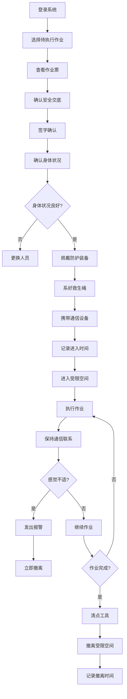

## 六、关键安全措施

### 1. 先通风、再检测、后作业
- 充分通风
- 气体检测合格
- 方可进入

### 2. 隔离措施
- 盲板隔离（不能用阀门）
- 切断电源
- 切断蒸汽

### 3. 气体检测
- 作业前检测
- 作业中连续或定期检测
- 每2小时记录1次

### 4. 个体防护
- **隔绝式呼吸防护装备**（必须）
- 救生绳
- 通信设备
- 防爆照明

### 5. 监护要求
- 监护人全程守候
- 不得离开现场
- **不得进入受限空间**

### 6. 应急准备
- 应急救援人员待命
- 配备救援装备
- 准备隔绝式呼吸器

## 六、异常情况处置

| 异常情况 | 处置措施 | 责任人 |
|---------|---------|--------|
| 气体浓度异常 | 立即撤离，通风置换，重新检测 | 监护人 |
| 作业人感觉不适 | 立即撤离，检查身体 | 监护人 |
| 通信中断 | 立即组织撤离 | 监护人 |
| 发现泄漏 | 立即撤离，处理泄漏 | 作业负责人 |
| 人员昏迷 | 报警，应急救援人员佩戴呼吸器进入救援 | 监护人 |

**严禁盲目施救**：
- 监护人不得进入受限空间
- 救援人员必须佩戴隔绝式呼吸器
- 使用救生绳拖拽

## 七、作业票管理

- **一式三联**：
  - 第一联：监护人持有
  - 第二联：作业单位持有
  - 第三联：存档保存（≥1年）

- **有效期**：≤24小时

- **变更管理**：
  - 内容变更 → 重新办理
  - 超期 → 重新办理
  - 中断4小时以上 → 重新检测

## 八、特别提醒

⚠️ **受限空间作业是高风险作业，历年事故多发！**

**三大禁令**：
1. 未经通风和检测，严禁进入
2. 监护人严禁离开现场
3. 严禁盲目施救

**救援原则**：
- 先报警，再救援
- 佩戴隔绝式呼吸器
- 使用救生绳
- 不冒险、不盲目
