# 盲板抽堵作业票 - 人员与工作流程

## 一、作业定义

在设备、管道上安装或拆卸盲板的作业。

**盲板**：用于完全隔离设备、管道的金属板。

**作业类型**：
- **抽盲板**：拆卸盲板
- **堵盲板**：安装盲板

## 二、作业特点

- **一票一板一项**：一张作业票只能进行一块盲板的一项作业（抽或堵）
- **高风险**：可能导致物料泄漏、人员伤害
- **关键作业**：设备检修前后的必要步骤

## 三、涉及人员及职责

### 1. 作业申请人
- **职责**：提出盲板抽堵需求
- **要求**：说明作业原因（检修、投用等）

### 2. 作业负责人
- **职责**：
  - 制定盲板抽堵方案
  - 确认设备已隔离
  - 确认压力已泄放
  - 组织作业实施
  - 协调各方
- **要求**：熟悉工艺流程和设备

### 3. 作业人
- **职责**：
  - 执行盲板抽堵操作
  - 正确使用工具
  - 遵守操作规程
  - 注意物料泄漏
- **要求**：
  - 经培训考核
  - 熟悉盲板规格和安装要求

### 4. 监护人
- **职责**：
  - 检查作业票有效性
  - 确认设备已隔离
  - 确认压力已泄放
  - 监督作业过程
  - 检查防护装备
  - 发现异常立即中止
- **要求**：
  - 经培训考核
  - 熟悉工艺流程

### 5. 工艺操作人员
- **职责**：
  - 配合设备隔离
  - 确认物料已倒空
  - 确认压力已泄放
  - 确认温度已降低
  - 在作业票上签字确认
- **要求**：熟悉工艺操作

### 6. 安全交底人
- **职责**：
  - 交底盲板位置和规格
  - 讲解危害因素（泄漏、烫伤等）
  - 说明安全措施
  - 明确应急处置
- **要求**：熟悉设备和工艺

### 7. 审批人
- **职责**：
  - 审核作业方案
  - 确认隔离措施
  - 签字批准
- **要求**：安全管理部门或授权人员

### 8. 完工验收人
- **职责**：
  - 确认盲板已安装/拆卸
  - 检查盲板规格和位置
  - 确认无泄漏
  - 签字验收
- **要求**：工艺或设备管理人员

## 四、电子系统使用流程

### 1. 作业申请人操作流程

**系统功能** [AQ 3064.2]：
- 支持作业预约与申请提交
- 支持风险辨识与管控措施录入
- 支持盲板抽堵作业方案制定
- 记录作业申请时间和作业实施时间

**详细操作步骤**：
1. 登录作业票电子系统，选择"新建作业申请" → "盲板抽堵作业"
2. 填写基本信息：
   - 盲板位置（具体到设备编号、管道编号、法兰位置）
   - 作业类型（抽盲板/堵盲板）
   - 计划作业时间（开始时间、预计时长）
   - 作业原因（检修/投用/隔离/其他）
3. 填写盲板规格信息：
   - 管道直径（DN值）
   - 压力等级（PN值）
   - 盲板材质（碳钢/不锈钢/其他）
   - 垫片规格和材质
   - 螺栓规格和数量
4. 进行风险辨识：
   - 识别危害因素（物料泄漏/高温烫伤/高压喷射/有毒气体/机械伤害等）
   - 评估风险等级
   - 系统自动关联历史事故案例和风险数据库
5. 制定安全措施：
   - 设备隔离措施（关闭阀门位置、盲板安装位置）
   - 压力泄放措施（泄压方式、泄压至何种状态）
   - 温度降低措施（降温方式、目标温度）
   - 个体防护装备清单（防护手套、防护眼镜、防护服、呼吸器等）
6. 填报作业人员信息：
   - 作业人（姓名、资格证书编号）
   - 监护人（资格证书、培训记录）
   - 工艺操作人员（岗位、工号）
   - 系统自动校验人员资格有效性
7. 上传附件：
   - 盲板抽堵作业方案
   - 设备隔离示意图
   - 应急处置预案
8. 提交申请，系统自动流转至作业负责人审核

**关键控制点**：
- 作业申请时间应提前于作业实施时间至少1天 [AQ 3064.2]
- 必须遵循"一票一板一项"原则，一张作业票只能进行一块盲板的一项作业（抽或堵）
- 作业人员必须经培训考核合格，系统自动校验证书有效期
- 盲板规格信息必须准确完整，系统强制要求填写所有字段
- 必须制定应急处置预案，系统强制要求上传

**异常处理**：
- 若作业人员资格不合格，系统自动拒绝提交并提示补充
- 若风险辨识不完整，系统提示补充危害因素
- 若盲板规格信息不完整，系统阻止提交
- 若缺少应急处置预案，系统阻止提交

**Mermaid流程图**：
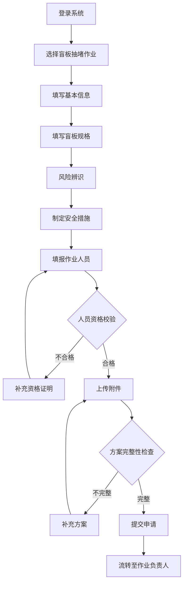

### 2. 作业负责人操作流程

**系统功能** [AQ 3064.2]：
- 支持盲板抽堵作业方案审核与完善
- 支持风险辨识组织与确认
- 支持设备隔离措施落实情况检查
- 支持作业实施过程协调管理
- 记录作业负责人审核时间和决策过程

**详细操作步骤**：
1. 登录系统，进入"待审核作业申请"列表，选择对应的盲板抽堵作业申请
2. 审核作业申请内容：
   - 核查盲板位置、规格、作业类型的准确性
   - 评估作业必要性和可行性
   - 确认作业时间安排的合理性
3. 组织风险辨识会议：
   - 在系统中发起风险辨识会议邀请（安全管理人员、设备管理人员、工艺操作人员）
   - 系统自动推送会议通知和作业申请资料
   - 在系统中记录会议时间、参会人员、讨论内容
4. 完善作业方案：
   - 根据风险辨识结果，在系统中补充或调整安全措施
   - 确认设备隔离方案（隔离点位、盲板位置、泄压方式）
   - 确认压力泄放和温度降低措施
   - 确认个体防护装备配备情况
5. 确认设备隔离措施落实：
   - 在系统中查看工艺操作人员提交的设备隔离确认单
   - 核查物料倒空、阀门关闭、压力泄放、温度降低等措施是否落实
   - 必要时现场确认设备隔离状态
6. 协调作业实施：
   - 在系统中确认作业人员、监护人、工艺操作人员到位情况
   - 协调作业时间和作业顺序
   - 确认应急救援准备情况
7. 签字确认：
   - 若作业方案完善、风险辨识充分、安全措施落实，在系统中签字确认
   - 若存在问题，要求作业申请人补充完善后再审核
   - 系统自动流转至安全交底环节

**关键控制点**：
- 作业负责人必须熟悉工艺流程和设备 [AQ 3064.2]
- 必须组织风险辨识会议，系统自动记录会议过程
- 必须确认设备已隔离、压力已泄放、温度已降低
- 必须确认盲板规格与管道规格匹配
- 系统自动记录作业负责人审核时间和决策过程

**异常处理**：
- 若作业方案不完善，系统阻止审核通过并提示补充
- 若风险辨识不充分，系统提示组织风险辨识会议
- 若设备隔离措施未落实，系统阻止审核通过并提示工艺操作人员确认
- 若盲板规格与管道规格不匹配，系统阻止审核通过并提示修改

**Mermaid流程图**：
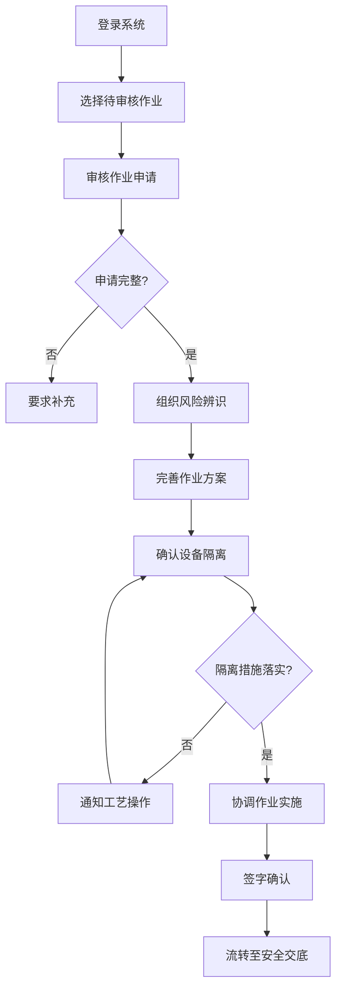

### 3. 作业人操作流程

**系统功能** [AQ 3064.2]：
- 支持作业票查看与确认
- 支持作业过程记录与管理
- 支持作业异常情况报告
- 记录作业人员作业时间和作业过程

**详细操作步骤**：
1. 登录系统，进入"待执行作业"列表，选择对应的盲板抽堵作业
2. 作业前准备：
   - 在系统中查看作业票（作业内容、盲板规格、安全措施、应急预案）
   - 确认安全交底内容（盲板位置、危害因素、防护措施、应急处置）
   - 在系统中签字确认已理解安全交底内容
   - 确认身体状况良好
3. 准备工具和材料：
   - 根据系统中的盲板规格信息，准备相应规格的盲板、垫片、螺栓
   - 准备扳手、撬棍等工具
   - 检查工具完好性
   - 在系统中记录工具和材料准备情况
4. 佩戴防护装备：
   - 佩戴防护手套、防护眼镜
   - 必要时佩戴防护服、呼吸器（有毒气体环境）
   - 在系统中逐项确认防护装备佩戴情况
5. 执行盲板抽堵操作：
   - 堵盲板：松开法兰螺栓（留2-3个）→检查法兰面→放置垫片→插入盲板→对角紧固螺栓→检查无泄漏
   - 抽盲板：松开法兰螺栓→缓慢抽出盲板→注意残留物料→紧固法兰螺栓→检查无泄漏
   - 在系统中实时记录作业进度
6. 异常情况处置：
   - 发现压力未泄放、物料泄漏、盲板规格不符等异常情况
   - 立即停止作业，通过系统发出异常报警信号
   - 通知监护人和作业负责人
   - 在系统中记录异常情况和处置措施
7. 作业完成：
   - 确认盲板已安装/拆卸到位
   - 清点工具和材料，确认无遗留
   - 清理现场
   - 在系统中记录作业完成时间和作业结果

**关键控制点**：
- 作业人必须经培训考核合格 [AQ 3064.2]
- 必须确认设备已隔离、压力已泄放、温度已降低
- 必须使用与管道规格匹配的盲板、垫片、螺栓
- 螺栓必须对角紧固，确保紧固均匀
- 作业完成后必须检查无泄漏
- 系统自动记录作业人员作业时间和作业过程

**异常处理**：
- 若作业人员资格不合格，系统阻止作业并提示更换人员
- 若发现压力未泄放，系统阻止作业并提示通知工艺操作人员泄压
- 若发现盲板规格不符，系统阻止作业并提示更换盲板
- 若发现物料泄漏，系统自动报警并提示立即停止作业

**Mermaid流程图**：
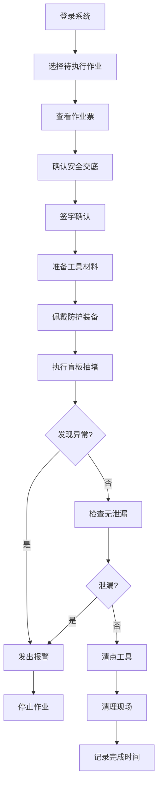

### 4. 监护人操作流程

**系统功能** [AQ 3064.2]：
- 支持作业票有效性检查
- 支持作业过程监督管理
- 支持作业异常情况报警
- 记录监护人监护时间和监护过程

**详细操作步骤**：
1. 登录系统，进入"待监护作业"列表，选择对应的盲板抽堵作业
2. 作业前检查：
   - 在系统中查看作业票，确认作业票有效（审批签字完整、在有效期内）
   - 核查作业人员身体状况和资格（查看体检报告、资格证书）
   - 确认设备已隔离（查看工艺操作人员提交的设备隔离确认单）
   - 确认压力已泄放、温度已降低
   - 在系统中逐项确认检查结果
3. 检查工具和材料：
   - 检查盲板规格与管道规格是否匹配
   - 检查垫片、螺栓规格是否正确
   - 检查工具完好性（扳手、撬棍等）
   - 在系统中记录工具和材料检查情况
4. 检查防护装备：
   - 检查作业人员是否佩戴防护手套、防护眼镜
   - 必要时检查防护服、呼吸器佩戴情况
   - 在系统中记录防护装备检查情况
5. 全程监督作业：
   - 监督作业人员操作规范（对角紧固螺栓、缓慢抽堵盲板）
   - 注意物料泄漏情况
   - 观察作业人员身体状况
   - 在系统中实时记录监护过程
6. 异常情况处置：
   - 发现作业人员操作不规范、物料泄漏、作业人员身体不适等异常情况
   - 立即通过系统发出报警信号
   - 立即中止作业，组织作业人员撤离
   - 通知作业负责人
   - 在系统中记录异常情况和处置措施
7. 作业完成确认：
   - 确认盲板已安装/拆卸到位
   - 确认无泄漏
   - 确认工具和材料已清点，无遗留
   - 在系统中签字确认监护完成

**关键控制点**：
- 监护人必须经培训考核合格 [AQ 3064.2]
- 必须确认作业票有效、设备已隔离、压力已泄放
- 必须全程监督作业，不得离开现场
- 发现异常必须立即中止作业
- 系统自动记录监护人监护时间和监护过程

**异常处理**：
- 若作业票无效，系统阻止作业并提示重新办理
- 若设备未隔离或压力未泄放，系统阻止作业并提示通知工艺操作人员
- 若作业人员操作不规范，系统提示监护人纠正
- 若发现物料泄漏，系统自动报警并提示立即中止作业

**Mermaid流程图**：
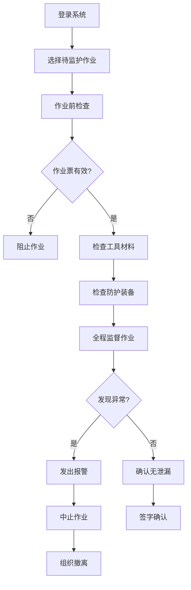

### 5. 工艺操作人员操作流程

**系统功能** [AQ 3064.2]：
- 支持设备隔离措施执行与确认
- 支持物料倒空、压力泄放、温度降低等操作记录
- 支持设备隔离状态实时监控
- 记录工艺操作人员操作时间和操作过程

**详细操作步骤**：
1. 登录系统，进入"待配合作业"列表，选择对应的盲板抽堵作业
2. 查看作业要求：
   - 在系统中查看作业票（盲板位置、作业类型、作业时间）
   - 查看设备隔离要求（需要关闭的阀门、需要泄放的压力、需要降低的温度）
   - 在系统中确认已理解作业要求
3. 执行设备隔离措施：
   - 倒空物料（将设备或管道内的物料倒空至指定位置）
   - 关闭相关阀门（按照作业票要求关闭进出口阀门）
   - 泄放压力（打开泄压阀，将压力泄放至常压）
   - 降温（采取自然降温或强制降温措施，将温度降至常温）
   - 在系统中实时记录每项操作的执行时间和执行结果
4. 确认设备隔离状态：
   - 确认物料已倒空（检查液位计、流量计等）
   - 确认压力已泄放（检查压力表读数为常压）
   - 确认温度已降低（检查温度计读数为常温）
   - 确认阀门已关闭（现场确认阀门关闭到位）
   - 在系统中逐项确认设备隔离状态
5. 提交设备隔离确认单：
   - 在系统中填写设备隔离确认单
   - 记录物料倒空情况、压力泄放情况、温度降低情况、阀门关闭情况
   - 上传现场照片（压力表照片、温度计照片、阀门关闭照片）
   - 在系统中签字确认设备隔离完成
6. 作业过程监控：
   - 在作业过程中，通过系统实时监控设备状态
   - 关注压力、温度等参数变化
   - 发现异常及时通知作业负责人
7. 作业完成后恢复：
   - 作业完成后，根据作业票要求恢复设备状态
   - 拆除盲板后，按照工艺要求恢复阀门开启状态
   - 在系统中记录设备恢复情况

**关键控制点**：
- 工艺操作人员必须熟悉工艺操作 [AQ 3064.2]
- 必须确认物料已倒空、压力已泄放、温度已降低
- 必须在系统中签字确认设备隔离完成
- 作业过程中必须实时监控设备状态
- 系统自动记录工艺操作人员操作时间和操作过程

**异常处理**：
- 若物料无法倒空，系统提示通知作业负责人调整方案
- 若压力无法泄放，系统阻止作业并提示检查泄压阀
- 若温度无法降低，系统阻止作业并提示采取强制降温措施
- 若阀门无法关闭，系统阻止作业并提示检查阀门状态

**Mermaid流程图**：
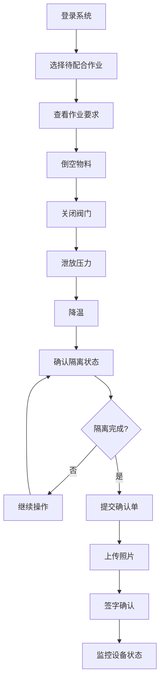

### 6. 安全交底人操作流程

**系统功能** [AQ 3064.2]：
- 支持安全交底内容制定与记录
- 支持盲板位置和规格讲解
- 支持危害因素和防护措施培训
- 支持交底确认与签字管理
- 记录安全交底时间和参与人员

**详细操作步骤**：
1. 登录系统，进入"待交底作业"列表，选择对应的盲板抽堵作业
2. 准备安全交底内容：
   - 系统自动提取作业票中的盲板位置、规格、作业类型
   - 系统自动提取作业票中的危害因素（物料泄漏、高温烫伤、高压喷射、有毒气体等）
   - 系统自动提取作业票中的安全措施（设备隔离、压力泄放、温度降低、个体防护等）
   - 系统自动生成安全交底提纲
3. 组织安全交底会议：
   - 在系统中发起安全交底会议邀请（作业人、监护人、工艺操作人员）
   - 确认所有参与人员到场并签到
   - 在系统中记录交底时间、地点、参与人员
4. 讲解盲板位置和规格：
   - 讲解盲板具体位置（设备编号、管道编号、法兰位置）
   - 讲解盲板规格（管道直径、压力等级、盲板材质、垫片规格、螺栓规格）
   - 讲解作业类型（抽盲板或堵盲板）
   - 强调"一票一板一项"原则
5. 讲解危害因素和防护措施：
   - 讲解可能的危害因素（物料泄漏、高温烫伤、高压喷射、有毒气体、机械伤害）
   - 讲解设备隔离措施（物料倒空、阀门关闭、压力泄放、温度降低）
   - 讲解个体防护措施（防护手套、防护眼镜、防护服、呼吸器）
   - 讲解操作规范（对角紧固螺栓、缓慢抽堵盲板、检查无泄漏）
6. 讲解应急处置：
   - 讲解物料泄漏应急处置（立即停止作业、采取堵漏措施、通知应急救援）
   - 讲解人员受伤应急处置（立即救治、报告事故）
   - 讲解应急撤离路线和集合地点
7. 确认交底效果：
   - 提问作业人员对盲板位置和规格的理解
   - 提问作业人员对危害因素和防护措施的掌握
   - 提问作业人员对应急处置的了解
   - 确认所有人员理解交底内容并签字确认
   - 在系统中记录交底确认结果

**关键控制点**：
- 安全交底人必须熟悉设备和工艺 [AQ 3064.2]
- 安全交底必须在作业前进行，所有作业人员必须参加
- 必须强调"一票一板一项"原则
- 必须强调设备隔离、压力泄放、温度降低的重要性
- 所有参与人员必须签字确认，系统自动记录交底时间和参与人员

**异常处理**：
- 若作业人员未参加安全交底，系统阻止作业并提示补充交底
- 若作业人员对交底内容理解不充分，系统提示重新交底
- 若作业人员未签字确认，系统阻止作业并提示补充签字

**Mermaid流程图**：
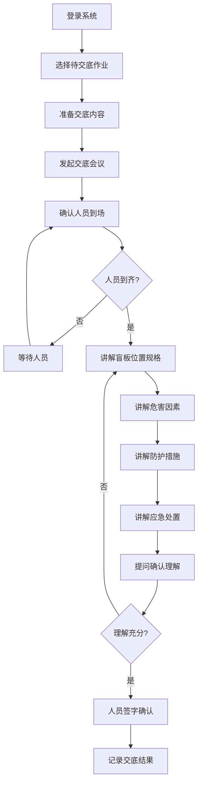

### 7. 审批人操作流程

**系统功能** [AQ 3064.2]：
- 支持作业方案审批与风险评估
- 支持安全措施充分性审查
- 支持审批意见记录与流程管理
- 记录审批人审批时间和决策依据

**详细操作步骤**：
1. 登录系统，进入"待审批作业"列表，选择对应的盲板抽堵作业申请
2. 审查作业方案完整性：
   - 核查作业必要性说明、盲板位置、规格、作业类型、作业时间
   - 核查风险辨识报告的全面性（危害因素识别、风险等级评估、管控措施）
   - 核查应急处置预案的可行性（应急处置程序、应急器材清单、人员分工）
3. 评估安全措施充分性：
   - 评估设备隔离措施（物料倒空、阀门关闭、压力泄放、温度降低）
   - 评估盲板规格与管道规格的匹配性
   - 评估个体防护装备配置（防护手套、防护眼镜、防护服、呼吸器）
   - 评估应急救援准备（应急器材、堵漏材料）
4. 确认工艺操作人员签字：
   - 在系统中查看工艺操作人员提交的设备隔离确认单
   - 确认物料已倒空、压力已泄放、温度已降低
   - 确认工艺操作人员已签字确认
5. 确认人员资格：
   - 系统自动校验作业人资格证书（盲板抽堵作业证、有效期）
   - 系统自动校验监护人资格证书（监护资格证、培训记录）
   - 系统自动校验工艺操作人员岗位资格
6. 审查作业票关键信息：
   - 确认作业负责人签字、安全交底记录完整
   - 确认盲板规格信息准确（管道直径、压力等级、盲板材质、垫片规格、螺栓规格）
   - 确认设备隔离措施落实（查看工艺操作人员提交的设备隔离确认单和现场照片）
7. 作出审批决定：
   - 若方案完善、措施充分、人员合格、设备已隔离，签字批准作业票
   - 若存在问题，退回作业负责人补充完善，并注明具体要求
   - 在系统中记录审批意见和决策依据

**关键控制点**：
- 审批人必须是安全管理部门人员或授权人员 [AQ 3064.2]
- 所有作业人员资格证书必须在有效期内
- 必须确认设备已隔离、压力已泄放、温度已降低
- 必须确认盲板规格与管道规格匹配
- 必须确认工艺操作人员已签字确认设备隔离完成
- 系统自动记录审批全过程，包括审批时间、审批意见、决策依据

**异常处理**：
- 若作业方案不完整或风险辨识不充分，系统阻止审批并提示补充
- 若安全措施不充分或不符合标准，系统阻止审批并提示整改
- 若人员资格不合格，系统阻止审批并提示更换人员
- 若设备未隔离或压力未泄放，系统阻止审批并提示通知工艺操作人员
- 若盲板规格与管道规格不匹配，系统阻止审批并提示修改

**Mermaid流程图**：
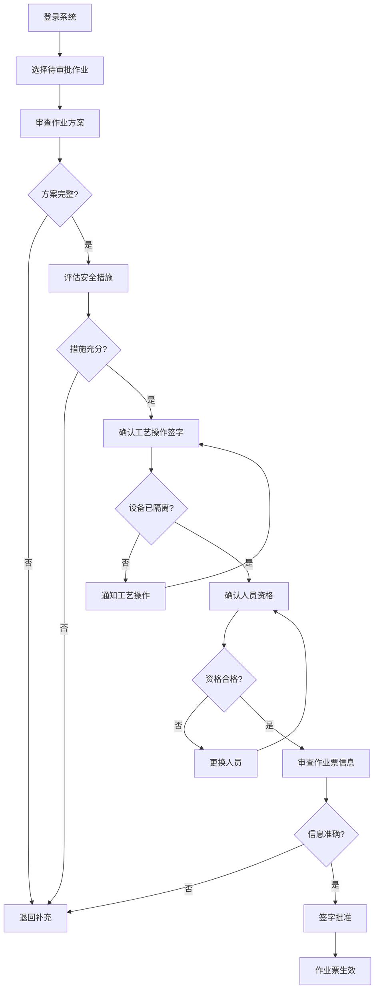

### 8. 完工验收人操作流程

**系统功能** [AQ 3064.2]：
- 支持作业完成情况检查
- 支持盲板安装/拆卸质量验收
- 支持现场清理情况验收
- 支持完工验收签字管理
- 记录完工验收时间和验收结果

**详细操作步骤**：
1. 登录系统，进入"待验收作业"列表，选择对应的盲板抽堵作业
2. 确认作业完成：
   - 核查作业内容是否按计划完成（堵盲板或抽盲板）
   - 核查作业质量是否符合要求
   - 在系统中查看作业过程记录（作业时长、异常事件）
3. 检查盲板安装/拆卸质量：
   - 堵盲板：检查盲板规格与管道规格是否匹配、盲板位置是否正确、螺栓是否对角紧固、垫片是否完好
   - 抽盲板：检查盲板是否完全拆除、法兰螺栓是否紧固、是否有残留物料
   - 在系统中拍照上传盲板安装/拆卸照片
4. 检查无泄漏：
   - 堵盲板：检查盲板周围是否有物料泄漏
   - 抽盲板：检查法兰连接处是否有物料泄漏
   - 必要时进行压力测试或泄漏检测
   - 在系统中记录泄漏检查结果
5. 清点工具和材料：
   - 确认所有工具已清点，无遗留
   - 确认盲板、垫片、螺栓等材料已清点
   - 在系统中逐项确认清点结果
6. 检查现场清理：
   - 检查作业现场是否清理干净（无杂物、无油污）
   - 检查作业产生的废弃物是否清理（废垫片、废螺栓等）
   - 在系统中拍照上传现场清理照片
7. 核查作业票记录：
   - 核查作业票签字是否完整（申请人、负责人、审批人、监护人、交底人、工艺操作人员）
   - 核查作业时间是否在有效期内
8. 签字验收：
   - 若作业完成、质量合格、无泄漏、现场清理、工具材料清点无误，签字验收
   - 若存在问题，要求作业负责人整改后再验收
   - 在系统中记录验收意见和验收时间
   - 系统自动归档作业票（保存≥1年）

**关键控制点**：
- 完工验收人必须是工艺或设备管理人员 [AQ 3064.2]
- 必须确认盲板已安装/拆卸到位
- 必须检查盲板规格和位置正确
- 必须确认无泄漏
- 必须清点工具和材料，确认无遗留
- 必须检查现场清理，确认无杂物
- 必须核查作业票记录完整性
- 系统自动归档作业票，保存≥1年

**异常处理**：
- 若盲板未安装/拆卸到位，系统阻止验收并提示继续作业
- 若盲板规格或位置不正确，系统阻止验收并提示整改
- 若发现泄漏，系统阻止验收并提示处理泄漏
- 若工具或材料有遗留，系统阻止验收并提示清理
- 若现场清理不彻底，系统阻止验收并提示整改
- 若作业票记录不完整，系统阻止验收并提示补充记录

**Mermaid流程图**：
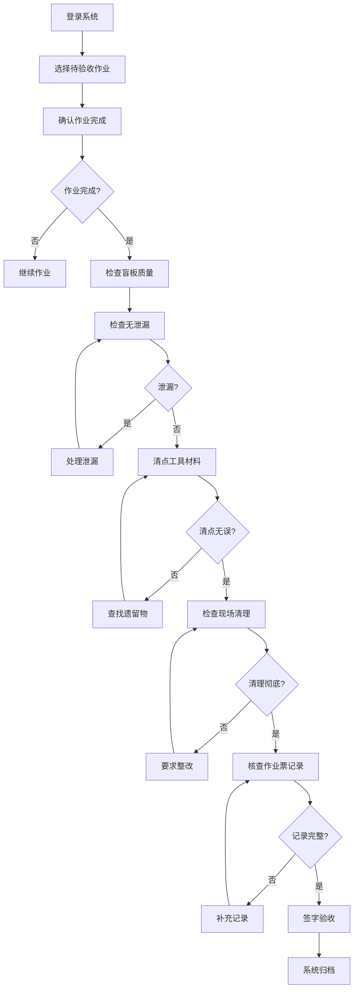

## 五、工作流程

### 阶段1：作业准备（作业前1-2天）

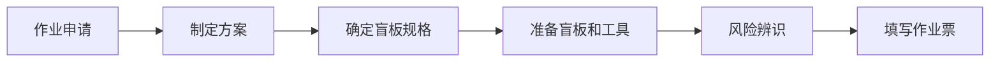

**关键步骤**：
1. **确定盲板规格**（作业负责人 + 设备管理人员）
   - 管道直径
   - 压力等级
   - 材质要求
   - 垫片规格

2. **准备工具**（作业负责人）
   - 扳手、撬棍
   - 盲板、螺栓、垫片
   - 防护装备
   - 应急器材

3. **风险辨识**（作业负责人 + 安全管理人员）
   - 物料泄漏风险
   - 高温烫伤风险
   - 高压喷射风险
   - 有毒气体风险

### 阶段2：设备隔离（作业前）

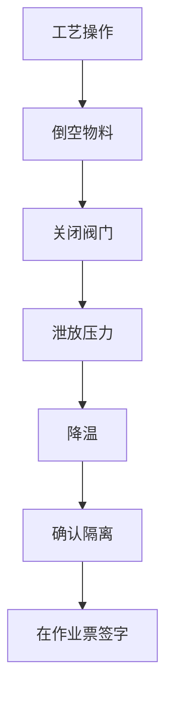

**关键步骤**：
1. **设备处理**（工艺操作人员）
   - 倒空物料
   - 关闭相关阀门
   - 泄放压力至常压
   - 降温至常温
   - 通风置换（必要时）

2. **确认隔离**（工艺操作人员 + 作业负责人）
   - 确认物料已倒空
   - 确认压力已泄放
   - 确认温度已降低
   - 在作业票上签字

### 阶段3：作业审批（作业前）

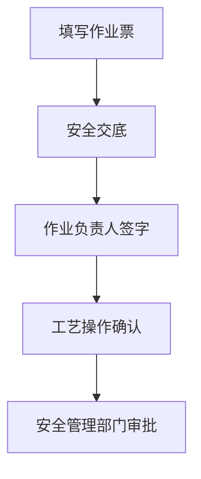

**关键步骤**：
1. **安全交底**（安全交底人 → 作业人 + 监护人）
   - 盲板位置和规格
   - 可能的危害
   - 防护措施
   - 应急处置

2. **审批签字**（审批人）
   - 确认隔离措施
   - 确认安全措施
   - 签字批准

### 阶段4：作业实施

#### 4.1 堵盲板作业

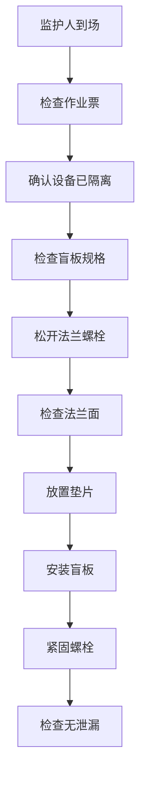

**关键步骤**：
1. **作业前检查**（监护人）
   - 作业票有效
   - 设备已隔离
   - 压力已泄放
   - 盲板规格正确

2. **堵盲板**（作业人）
   - 松开法兰螺栓（留2-3个）
   - 检查法兰面清洁
   - 放置垫片
   - 插入盲板
   - 紧固螺栓（对角紧固）
   - 检查无泄漏

3. **全程监护**（监护人）
   - 监督操作规范
   - 注意物料泄漏
   - 发现异常立即中止

#### 4.2 抽盲板作业

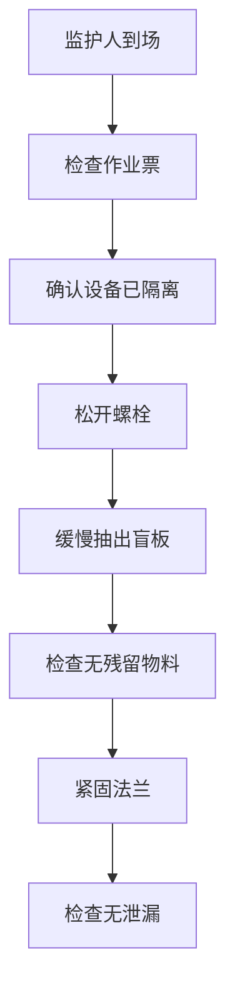

**关键步骤**：
1. **作业前检查**（监护人）
   - 作业票有效
   - 设备已隔离
   - 压力已泄放

2. **抽盲板**（作业人）
   - 松开法兰螺栓
   - 缓慢抽出盲板
   - 注意残留物料
   - 紧固法兰螺栓
   - 检查无泄漏

3. **全程监护**（监护人）
   - 监督操作规范
   - 注意物料泄漏
   - 发现异常立即中止

### 阶段5：完工验收

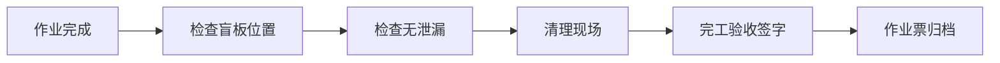

**关键步骤**：
1. **验收检查**（完工验收人）
   - 确认盲板已安装/拆卸
   - 检查盲板规格和位置
   - 检查螺栓紧固
   - 确认无泄漏

2. **完工验收**（完工验收人）
   - 签字确认
   - 作业票归档

## 五、关键安全措施

### 1. 设备隔离
- 倒空物料
- 关闭阀门
- 泄放压力
- 降温

### 2. 确认隔离
- 工艺操作人员签字确认
- 作业负责人现场确认

### 3. 盲板管理
- 规格正确
- 材质合格
- 垫片完好

### 4. 操作规范
- 对角紧固螺栓
- 缓慢抽堵
- 注意泄漏

### 5. 个体防护
- 防护手套
- 防护眼镜
- 防护服（必要时）
- 呼吸器（有毒气体）

### 6. 应急准备
- 配备应急器材
- 准备堵漏材料

## 六、异常情况处置

| 异常情况 | 处置措施 | 责任人 |
|---------|---------|--------|
| 发现压力未泄放 | 停止作业，泄放压力 | 监护人 |
| 物料泄漏 | 立即停止，采取堵漏措施 | 作业负责人 |
| 盲板规格不符 | 停止作业，更换盲板 | 作业负责人 |
| 螺栓断裂 | 停止作业，更换螺栓 | 作业负责人 |
| 人员受伤 | 立即救治，报告事故 | 监护人 |

## 七、作业票管理

- **一式三联**：
  - 第一联：监护人持有
  - 第二联：作业单位持有
  - 第三联：存档保存（≥1年）

- **一票一板一项**：
  - 一张作业票只能进行一块盲板的一项作业
  - 抽堵不同盲板需分别办理

- **变更管理**：
  - 盲板位置变更 → 重新办理
  - 盲板规格变更 → 重新办理

## 八、特别提醒

⚠️ **盲板抽堵作业风险高，必须严格执行隔离确认！**

**三大要点**：
1. 确认设备已隔离
2. 确认压力已泄放
3. 确认温度已降低

**盲板管理**：
- 建立盲板台账
- 标识盲板位置
- 定期检查盲板状态
