# 高处作业票 - 人员与工作流程

## 一、作业定义

在距坠落基准面 ≥2m 的高处进行的作业。

## 二、作业分级

| 级别 | 高度范围 | 有效期 | 审批人 |
|------|---------|--------|--------|
| **I级** | 2m ≤ h < 5m | ≤7天 | 所在基层单位 |
| **II级** | 5m ≤ h < 15m | ≤7天 | 安全管理部门 |
| **III级** | 15m ≤ h < 30m | ≤7天 | 安全管理部门 |
| **IV级** | h ≥ 30m | ≤7天 | 主管厂长或总工程师 |

## 三、涉及人员及职责

### 1. 作业申请人
- **职责**：提出高处作业需求
- **要求**：说明作业内容和位置

### 2. 作业负责人
- **职责**：
  - 制定高处作业方案
  - 确认安全措施落实
  - 检查作业平台和防护设施
  - 组织作业实施
- **要求**：有高处作业管理经验

### 3. 作业人
- **职责**：
  - 执行高处作业
  - 正确佩戴安全带和安全绳
  - 遵守操作规程
  - 不得向下抛掷物品
- **要求**：
  - 持有高处作业操作证
  - 身体健康（无高血压、心脏病、恐高症等）
  - 经专门培训

### 4. 监护人
- **职责**：
  - 检查作业票有效性
  - 核查作业人资格证书
  - 检查安全带和安全绳
  - 检查作业平台和防护设施
  - 监督作业过程
  - 监督地面警戒
  - 发现异常立即中止
- **要求**：
  - 经培训考核
  - 熟悉高处作业风险

### 5. 地面警戒人员
- **职责**：
  - 设置警戒区域
  - 设置警示标志
  - 禁止无关人员进入
  - 监督地面安全
- **要求**：经培训

### 6. 安全交底人
- **职责**：
  - 交底高处作业危害
  - 讲解防坠落措施
  - 说明应急处置
- **要求**：熟悉高处作业风险

### 7. 审批人
- **职责**：
  - 审核作业方案
  - 确认安全措施
  - 签字批准
- **要求**：根据作业级别由相应层级审批

### 8. 完工验收人
- **职责**：
  - 确认作业完成
  - 检查工具清点
  - 检查防护设施恢复
  - 签字验收
- **要求**：作业负责人或指定人员

## 四、电子系统使用流程

### 1. 作业申请人操作流程

**系统功能** [AQ 3064.2]：
- 支持作业预约与申请提交
- 支持风险辨识与管控措施录入
- 支持高处作业方案制定
- 记录作业申请时间和作业实施时间

**详细操作步骤**：
1. 登录作业票电子系统，选择"新建作业申请" → "高处作业"
2. 填写基本信息：
   - 作业位置（具体到设备编号、区域、高度）
   - 作业高度（精确到米，系统自动判定作业级别：I级/II级/III级/IV级）
   - 计划作业时间（开始时间、预计时长，有效期≤7天）
   - 作业内容描述（检修/安装/拆除/清洁等）
3. 进行风险辨识：
   - 识别危害因素（坠落/物体打击/触电/恶劣天气等）
   - 评估风险等级
   - 系统自动关联历史事故案例和风险数据库
4. 制定安全措施：
   - 防坠落措施（安全带型号、安全绳规格、挂点位置）
   - 作业平台方案（脚手架/吊篮/升降平台/梯子等）
   - 地面警戒方案（警戒区域范围、警示标志设置）
   - 个体防护装备清单（安全带、安全绳、安全帽、防滑鞋等）
5. 填报作业人员信息：
   - 作业人（姓名、高处作业操作证编号、体检报告有效期）
   - 监护人（资格证书、培训记录）
   - 地面警戒人员（姓名、培训记录）
   - 系统自动校验人员资格和体检有效性
6. 上传附件：
   - 高处作业方案
   - 应急救援预案
   - 作业平台搭设方案（如需要）
7. 提交申请，系统根据作业级别自动流转至相应审批人

**关键控制点**：
- 作业申请时间应提前于作业实施时间至少1天 [AQ 3064.2]
- 高处作业有效期≤7天，系统自动校验
- 作业人员必须持有高处作业操作证且体检合格，系统自动校验证书和体检报告有效期
- 系统根据作业高度自动判定作业级别（I级: 2-5m, II级: 5-15m, III级: 15-30m, IV级: ≥30m）
- 必须制定应急救援预案，系统强制要求上传

**异常处理**：
- 若作业人员资格或体检不合格，系统自动拒绝提交并提示补充
- 若风险辨识不完整，系统提示补充危害因素
- 若缺少应急救援预案，系统阻止提交
- 若作业高度≥30m但未配备通信工具，系统提示补充

**Mermaid流程图**：
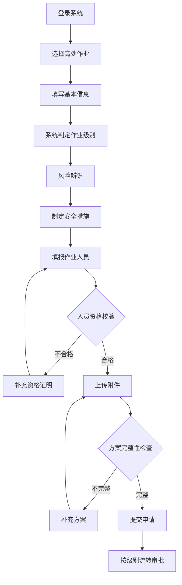

### 2. 作业负责人操作流程

**系统功能** [AQ 3064.2]：
- 支持高处作业方案审核与完善
- 支持风险辨识组织与确认
- 支持安全措施落实情况检查
- 支持作业实施过程协调管理
- 记录作业负责人审核时间和决策过程

**详细操作步骤**：
1. 登录系统，进入"待审核作业申请"列表，选择对应的高处作业申请
2. 审核作业申请内容：
   - 核查作业位置、高度、作业级别的准确性
   - 评估作业必要性和可行性
   - 确认作业时间安排的合理性（有效期≤7天）
3. 组织风险辨识会议：
   - 在系统中发起风险辨识会议邀请（安全管理人员、设备管理人员、作业人员）
   - 系统自动推送会议通知和作业申请资料
   - 在系统中记录会议时间、参会人员、讨论内容
4. 完善作业方案：
   - 根据风险辨识结果，在系统中补充或调整安全措施
   - 确认作业平台搭设方案（稳固性、护栏设置、防滑措施）
   - 确认防坠落措施（安全带挂点、安全绳规格、高挂低用原则）
   - 确认地面警戒方案（警戒区域、警示标志、专人监护）
5. 检查天气条件：
   - 在系统中查看天气预报（风力、降雨、雷电预警）
   - 确认作业期间天气条件符合要求（风力<5级、无雨雪、无雷电）
   - 必要时调整作业时间
6. 协调作业实施：
   - 在系统中确认作业人员、监护人、地面警戒人员到位情况
   - 协调作业时间和作业顺序
   - 确认应急救援准备情况
7. 签字确认：
   - 若作业方案完善、风险辨识充分、安全措施落实，在系统中签字确认
   - 若存在问题，要求作业申请人补充完善后再审核
   - 系统自动流转至安全交底环节

**关键控制点**：
- 作业负责人必须有高处作业管理经验 [AQ 3064.2]
- 必须组织风险辨识会议，系统自动记录会议过程
- 必须确认作业平台稳固、防护设施齐全
- 必须确认天气条件适宜（风力<5级、无雨雪、无雷电）
- 系统自动记录作业负责人审核时间和决策过程

**异常处理**：
- 若作业方案不完善，系统阻止审核通过并提示补充
- 若风险辨识不充分，系统提示组织风险辨识会议
- 若天气条件不适宜，系统阻止审核通过并提示调整作业时间
- 若作业平台方案不符合要求，系统阻止审核通过并提示修改

**Mermaid流程图**：
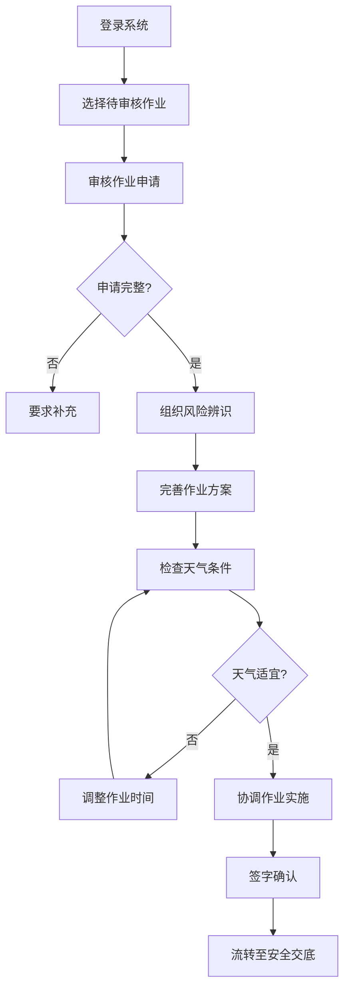

### 3. 作业人操作流程

**系统功能** [AQ 3064.2]：
- 支持作业票查看与确认
- 支持作业过程记录与管理
- 支持作业异常情况报告
- 记录作业人员作业时间和作业过程

**详细操作步骤**：
1. 登录系统，进入"待执行作业"列表，选择对应的高处作业
2. 作业前准备：
   - 在系统中查看作业票（作业内容、作业高度、安全措施、应急预案）
   - 确认安全交底内容（坠落风险、防护措施、应急处置）
   - 在系统中签字确认已理解安全交底内容
   - 确认身体状况良好（无高血压、心脏病、恐高症等）
3. 佩戴防护装备：
   - 佩戴安全带（检查带体、带扣、缓冲器完好性）
   - 系好安全绳（确保高挂低用、挂点牢固）
   - 佩戴安全帽（系好帽带）
   - 穿防滑鞋
   - 在系统中逐项确认防护装备佩戴情况
4. 检查作业平台：
   - 检查作业平台稳固性（脚手架、吊篮、升降平台等）
   - 检查护栏设置（高度、牢固性）
   - 检查防滑措施（防滑板、防滑垫）
   - 在系统中记录平台检查结果
5. 执行高处作业：
   - 缓慢登高，保持三点接触
   - 安全绳高挂低用，随时调整挂点
   - 工具系挂牢固，使用工具袋
   - 不得向下抛掷物品
   - 在系统中实时记录作业进度
6. 异常情况处置：
   - 发现安全带损坏、作业平台晃动、天气突变等异常情况
   - 立即停止作业，通过系统发出异常报警信号
   - 通知监护人和作业负责人
   - 安全撤离至地面
   - 在系统中记录异常情况和处置措施
7. 作业完成：
   - 清点工具，确认无遗留
   - 安全撤离至地面
   - 清理现场
   - 在系统中记录作业完成时间和作业结果

**关键控制点**：
- 作业人必须持有高处作业操作证且体检合格 [AQ 3064.2]
- 必须正确佩戴安全带，安全绳高挂低用
- 工具必须系挂牢固，不得向下抛掷
- 发现异常必须立即停止作业并撤离
- 系统自动记录作业人员作业时间和作业过程

**异常处理**：
- 若作业人员资格或体检不合格，系统阻止作业并提示更换人员
- 若作业人员未佩戴防护装备，系统阻止作业并提示佩戴
- 若发现安全带损坏，系统阻止作业并提示更换
- 若天气突变（风力≥5级、雨雪、雷电），系统自动报警并提示立即撤离

**Mermaid流程图**：
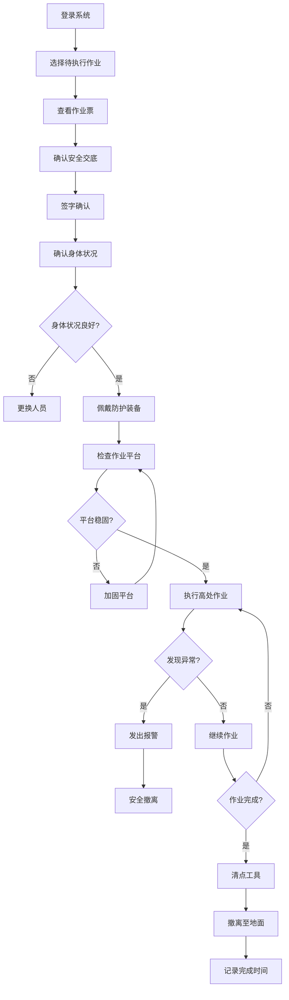

### 4. 监护人操作流程

**系统功能** [AQ 3064.2]：
- 支持作业票有效性检查
- 支持作业人员资格与防护装备检查
- 支持作业过程监督与记录
- 支持异常情况报警与处置
- 记录监护人监护时间和监护过程

**详细操作步骤**：
1. 登录系统，进入"待监护作业"列表，选择对应的高处作业
2. 作业前检查：
   - 在系统中查看作业票（作业内容、作业高度、作业级别、有效期）
   - 核查作业票有效性（审批签字完整、在有效期内）
   - 核查作业人资格证书（高处作业操作证、有效期、体检报告）
   - 在系统中记录检查结果
3. 检查防护装备：
   - 检查安全带（带体、带扣、缓冲器完好性）
   - 检查安全绳（规格、长度、挂点牢固性）
   - 检查安全帽（帽体完好、帽带系牢）
   - 检查防滑鞋
   - 在系统中逐项确认检查结果
4. 检查作业平台和防护设施：
   - 检查作业平台稳固性（脚手架、吊篮、升降平台等）
   - 检查护栏设置（高度≥1.2m、牢固性）
   - 检查防滑措施（防滑板、防滑垫）
   - 检查安全网设置（如需要）
   - 在系统中记录检查结果
5. 监督地面警戒：
   - 确认地面警戒人员到位
   - 确认警戒区域设置（范围充足、标志明显）
   - 确认警示标志设置（"高处作业、禁止入内"等）
   - 在系统中记录警戒设置情况
6. 全程监督作业：
   - 观察作业人作业状态（动作规范、防护装备使用正确）
   - 观察作业平台状态（稳固性、晃动情况）
   - 观察天气变化（风力、降雨、雷电）
   - 发现异常立即通过系统发出报警信号并组织撤离
   - 在系统中实时记录监督情况
7. 异常情况处置：
   - 发现安全带损坏、作业平台晃动、天气突变、作业人不适等异常
   - 立即通过系统发出报警信号
   - 立即中止作业，组织作业人安全撤离
   - 通知作业负责人
   - 在系统中记录异常情况和处置措施

**关键控制点**：
- 监护人必须经培训考核合格 [AQ 3064.2]
- 必须检查作业票有效性和作业人资格
- 必须检查安全带、安全绳、作业平台完好性
- 必须全程监督作业过程，不得离开现场
- 发现异常必须立即中止作业并组织撤离
- 系统自动记录监护人监护时间和监护过程

**异常处理**：
- 若作业票无效或作业人资格不合格，系统阻止作业并提示整改
- 若防护装备不完好，系统阻止作业并提示更换
- 若作业平台不稳固，系统阻止作业并提示加固
- 若天气条件不适宜（风力≥5级、雨雪、雷电），系统自动报警并提示立即中止作业
- 若地面警戒未设置，系统阻止作业并提示设置警戒

**Mermaid流程图**：
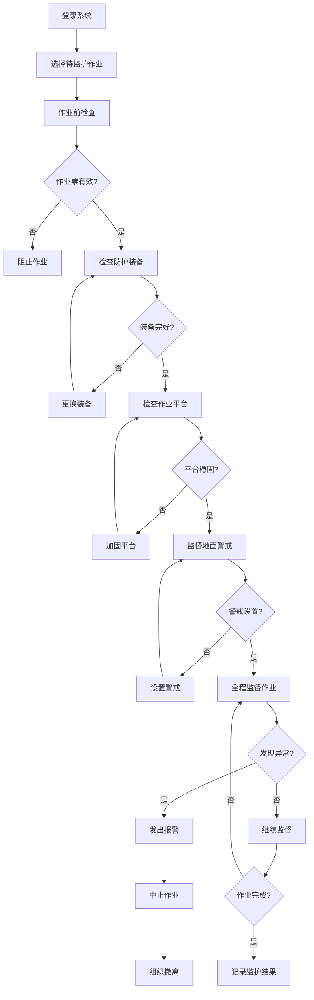

### 5. 地面警戒人员操作流程

**系统功能** [AQ 3064.2]：
- 支持警戒区域设置与管理
- 支持警示标志配置与记录
- 支持地面安全监督与报警
- 记录地面警戒人员值守时间和监督过程

**详细操作步骤**：
1. 登录系统，进入"待警戒作业"列表，选择对应的高处作业
2. 确认警戒任务：
   - 在系统中查看作业票（作业位置、作业高度、作业内容、作业时间）
   - 确认警戒区域范围（根据作业高度和作业内容确定警戒半径）
   - 确认警示标志类型和数量（"高处作业、禁止入内"、"注意落物"等）
   - 在系统中记录警戒任务接收时间
3. 设置警戒区域：
   - 根据作业高度确定警戒范围（一般为作业点周围5-10米）
   - 使用警戒带、警戒锥等设置物理隔离
   - 确保警戒区域覆盖所有可能的坠落物影响范围
   - 在系统中拍照上传警戒区域设置照片
4. 设置警示标志：
   - 在警戒区域入口处设置警示标志牌
   - 确保警示标志清晰可见、内容准确
   - 必要时设置声光报警装置
   - 在系统中记录警示标志设置位置和数量
5. 执行地面警戒：
   - 在警戒区域入口处值守
   - 禁止无关人员进入警戒区域
   - 观察高处作业情况，注意是否有物品坠落风险
   - 发现有人试图进入警戒区域，立即劝阻并记录
   - 在系统中实时记录警戒情况
6. 异常情况处置：
   - 发现物品坠落，立即通过系统发出报警信号
   - 检查地面是否有人员受伤
   - 通知监护人和作业负责人
   - 在系统中记录异常情况和处置措施
7. 警戒结束：
   - 确认高处作业已完成，作业人员已撤离
   - 撤除警戒设施（警戒带、警戒锥、警示标志等）
   - 清理现场
   - 在系统中记录警戒结束时间

**关键控制点**：
- 地面警戒人员必须经培训合格 [AQ 3064.2]
- 警戒区域范围必须覆盖所有可能的坠落物影响范围
- 警示标志必须清晰可见、内容准确
- 必须全程值守，不得擅自离开岗位
- 发现物品坠落必须立即报警
- 系统自动记录地面警戒人员值守时间和监督过程

**异常处理**：
- 若警戒区域设置不符合要求，系统阻止作业并提示重新设置
- 若警示标志不清晰或缺失，系统阻止作业并提示补充
- 若发现物品坠落，系统自动报警并提示检查地面人员安全
- 若地面警戒人员擅自离岗，系统自动报警并通知作业负责人

**Mermaid流程图**：
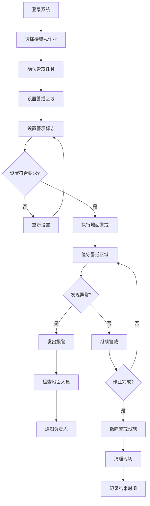

### 6. 安全交底人操作流程

**系统功能** [AQ 3064.2]：
- 支持安全交底内容制定与管理
- 支持交底会议组织与记录
- 支持交底效果确认与评估
- 记录安全交底时间和参与人员

**详细操作步骤**：
1. 登录系统，进入"待交底作业"列表，选择对应的高处作业
2. 准备交底内容：
   - 在系统中查看作业票（作业位置、作业高度、作业级别、作业内容、安全措施）
   - 查看风险辨识报告（危害因素、风险等级、管控措施）
   - 准备交底材料（PPT、视频、案例等）
   - 在系统中记录交底准备情况
3. 发起交底会议：
   - 在系统中发起安全交底会议邀请
   - 邀请所有作业人员、监护人、地面警戒人员参加
   - 系统自动推送会议通知和交底材料
   - 在系统中记录会议时间和地点
4. 确认人员到场：
   - 在系统中逐一确认参会人员签到
   - 确认所有作业相关人员均已到场
   - 若有人员缺席，推迟交底或通知补充人员
   - 在系统中记录实际参会人员名单
5. 讲解作业内容和危害因素：
   - 讲解作业位置、作业高度、作业级别、作业内容
   - 讲解可能的危害因素（坠落、物体打击、触电、恶劣天气等）
   - 讲解历史事故案例和教训
   - 强调高处作业的高风险性
6. 讲解安全措施和应急处置：
   - 讲解防坠落措施（安全带佩戴方法、安全绳高挂低用原则、挂点选择）
   - 讲解作业平台安全要求（稳固性、护栏高度、防滑措施）
   - 讲解地面警戒要求（警戒区域、警示标志、禁止入内）
   - 讲解个体防护装备使用方法（安全带、安全绳、安全帽、防滑鞋）
   - 讲解天气限制（风力<5级、无雨雪、无雷电）
   - 讲解应急处置（坠落事故、物体打击、天气突变等）
7. 确认交底效果：
   - 提问作业人员对危害因素的理解
   - 提问作业人员对防护措施的掌握
   - 提问作业人员对应急处置的了解
   - 确认所有人员理解交底内容并签字确认
   - 在系统中记录交底确认结果

**关键控制点**：
- 安全交底人必须熟悉高处作业风险 [AQ 3064.2]
- 安全交底必须在作业前进行，所有作业人员必须参加
- 必须讲解危害因素、防护措施、应急处置
- 必须强调安全带佩戴、安全绳高挂低用、天气限制
- 所有参与人员必须签字确认，系统自动记录交底时间和参与人员

**异常处理**：
- 若作业人员未参加安全交底，系统阻止作业并提示补充交底
- 若作业人员对交底内容理解不充分，系统提示重新交底
- 若作业人员未签字确认，系统阻止作业并提示补充签字

**Mermaid流程图**：
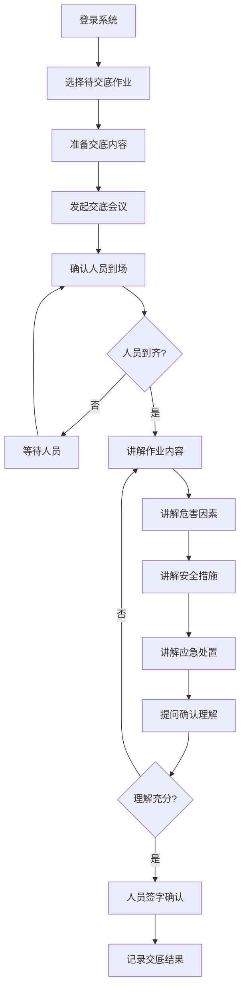

### 7. 审批人操作流程

**系统功能** [AQ 3064.2]：
- 支持作业方案审批与风险评估
- 支持安全措施充分性审查
- 支持审批意见记录与流程管理
- 记录审批人审批时间和决策依据

**详细操作步骤**：
1. 登录系统，进入"待审批作业"列表，选择对应的高处作业申请
2. 审查作业方案完整性：
   - 核查作业必要性说明、作业位置、作业高度、作业级别、作业时间
   - 核查风险辨识报告的全面性（危害因素识别、风险等级评估、管控措施）
   - 核查应急救援预案的可行性（应急处置程序、应急器材清单、人员分工）
3. 评估安全措施充分性：
   - 评估防坠落措施（安全带型号、安全绳规格、挂点位置、高挂低用原则）
   - 评估作业平台方案（稳固性、护栏设置、防滑措施、承重能力）
   - 评估地面警戒方案（警戒区域范围、警示标志设置、专人监护）
   - 评估个体防护装备配置（安全带、安全绳、安全帽、防滑鞋）
   - 评估天气条件限制（风力<5级、无雨雪、无雷电）
4. 确认作业级别与审批权限：
   - 系统自动根据作业高度判定作业级别（I级: 2-5m, II级: 5-15m, III级: 15-30m, IV级: ≥30m）
   - 确认当前审批人是否具有相应级别的审批权限
   - I级：所在基层单位审批；II/III级：安全管理部门审批；IV级：主管厂长或总工程师审批
   - 若审批权限不足，系统自动流转至上级审批人
5. 确认人员资格：
   - 系统自动校验作业人资格证书（高处作业操作证、有效期、体检报告）
   - 系统自动校验监护人资格证书（监护资格证、培训记录）
   - 系统自动校验地面警戒人员培训记录
6. 审查作业票关键信息：
   - 确认作业负责人签字、安全交底记录完整
   - 确认作业平台搭设方案符合要求（如需要）
   - 确认天气预报适宜作业（风力<5级、无雨雪、无雷电）
   - 确认应急救援准备情况（应急救援人员、应急器材）
7. 作出审批决定：
   - 若方案完善、措施充分、人员合格、审批权限匹配，签字批准作业票
   - 若存在问题，退回作业负责人补充完善，并注明具体要求
   - 若审批权限不足，流转至上级审批人
   - 在系统中记录审批意见和决策依据

**关键控制点**：
- 审批人必须根据作业级别由相应层级审批 [AQ 3064.2]
- I级：所在基层单位；II/III级：安全管理部门；IV级：主管厂长或总工程师
- 所有作业人员资格证书必须在有效期内
- 必须确认作业平台稳固、防护设施齐全
- 必须确认天气条件适宜（风力<5级、无雨雪、无雷电）
- 系统自动记录审批全过程，包括审批时间、审批意见、决策依据

**异常处理**：
- 若作业方案不完整或风险辨识不充分，系统阻止审批并提示补充
- 若安全措施不充分或不符合标准，系统阻止审批并提示整改
- 若人员资格不合格，系统阻止审批并提示更换人员
- 若天气条件不适宜，系统阻止审批并提示调整作业时间
- 若审批权限不足，系统自动流转至上级审批人

**Mermaid流程图**：
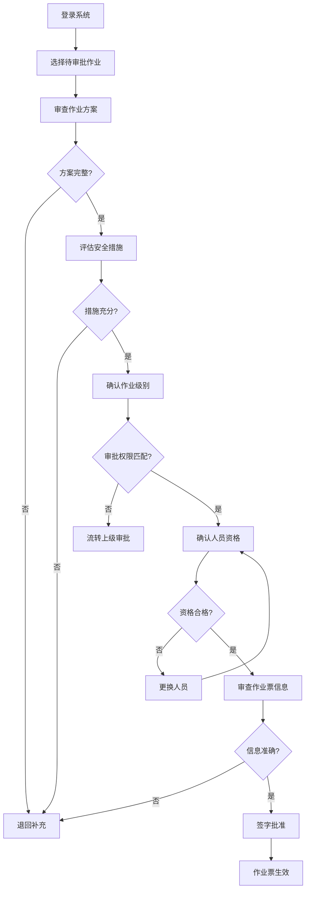

### 8. 完工验收人操作流程

**系统功能** [AQ 3064.2]：
- 支持作业完成情况检查
- 支持现场清理情况验收
- 支持工具和防护设施清点
- 支持完工验收签字管理
- 记录完工验收时间和验收结果

**详细操作步骤**：
1. 登录系统，进入"待验收作业"列表，选择对应的高处作业
2. 确认作业完成：
   - 核查作业内容是否按计划完成（检修/安装/拆除/清洁等）
   - 核查作业质量是否符合要求
   - 在系统中查看作业过程记录（作业时长、异常事件）
3. 清点工具和设备：
   - 确认所有工具已清点，无遗留在高处
   - 清点工具数量与作业前登记一致
   - 检查工具完好性
   - 在系统中逐项确认清点结果
4. 检查防护设施恢复：
   - 检查作业平台是否拆除（如为临时搭设）
   - 检查安全网是否拆除（如为临时设置）
   - 检查警戒区域是否撤除
   - 检查警示标志是否撤除
   - 在系统中记录防护设施恢复情况
5. 检查现场清理：
   - 检查高处作业区域是否清理干净（无杂物、无遗留物）
   - 检查地面警戒区域是否清理干净
   - 检查作业产生的废弃物是否清理
   - 在系统中拍照上传现场清理照片
6. 核查作业票记录：
   - 核查作业票签字是否完整（申请人、负责人、审批人、监护人、交底人、地面警戒人员）
   - 核查作业时间是否在有效期内（≤7天）
   - 核查作业过程记录是否完整
7. 签字验收：
   - 若作业完成、质量合格、工具清点无误、现场清理彻底，签字验收
   - 若存在问题，要求作业负责人整改后再验收
   - 在系统中记录验收意见和验收时间
   - 系统自动归档作业票（保存≥1年）

**关键控制点**：
- 完工验收人必须是作业负责人或指定人员 [AQ 3064.2]
- 必须确认作业完成且质量合格
- 必须清点工具，确认无遗留在高处
- 必须检查防护设施恢复，确认警戒撤除
- 必须检查现场清理，确认无杂物
- 必须核查作业票记录完整性
- 系统自动归档作业票，保存≥1年

**异常处理**：
- 若作业未完成或质量不合格，系统阻止验收并提示继续作业
- 若工具有遗留，系统阻止验收并提示清理
- 若防护设施未恢复，系统阻止验收并提示整改
- 若现场清理不彻底，系统阻止验收并提示整改
- 若作业票记录不完整，系统阻止验收并提示补充记录

**Mermaid流程图**：
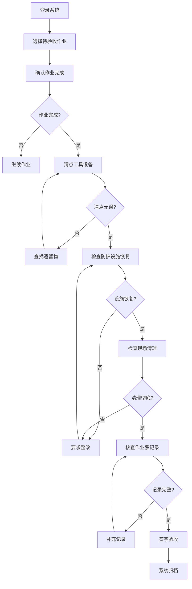

## 五、工作流程

### 阶段1：作业准备

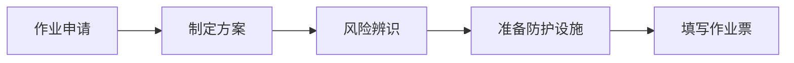

**关键步骤**：
1. **风险辨识**
   - 坠落风险
   - 物体打击风险
   - 触电风险
   - 恶劣天气影响

2. **防护设施准备**
   - 安全带、安全绳
   - 作业平台或脚手架
   - 安全网
   - 警示标志

### 阶段2：作业审批

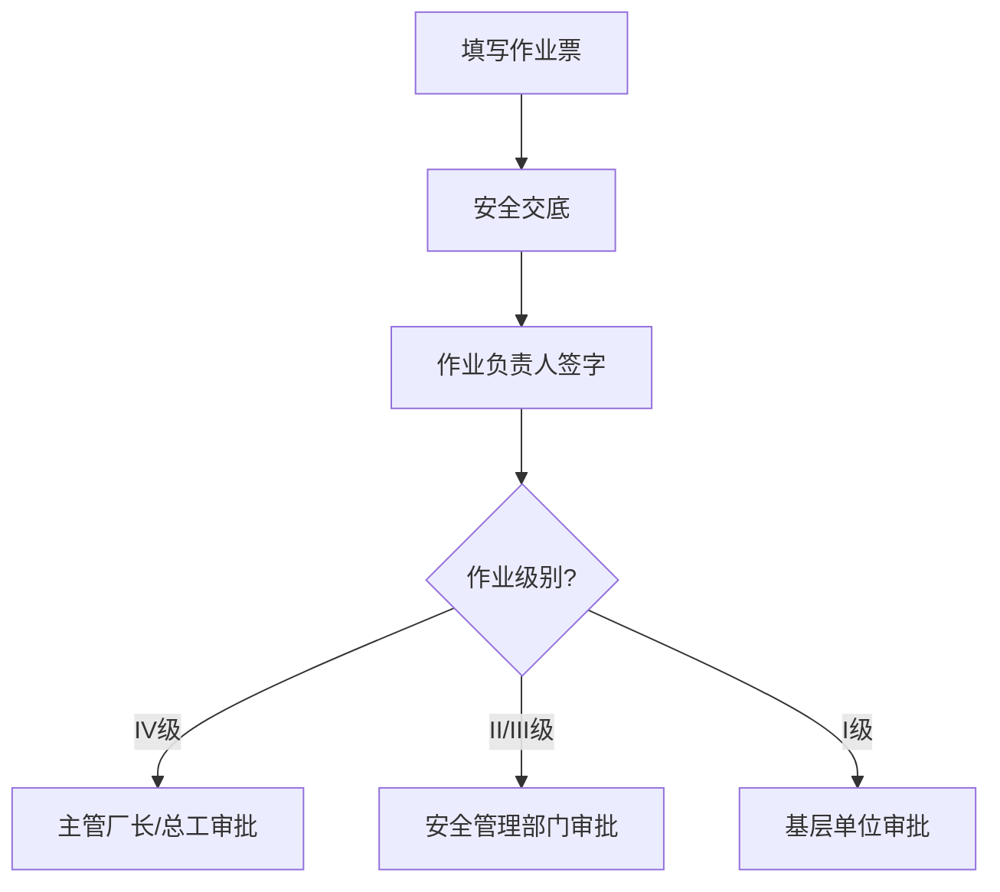

### 阶段3：作业实施

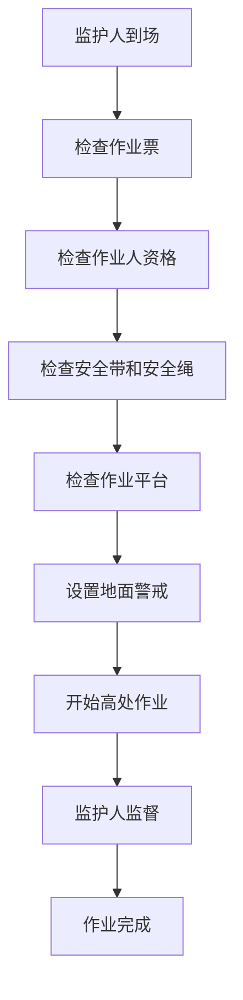

**关键步骤**：
1. **作业前检查**
   - 安全带完好
   - 安全绳牢固
   - 作业平台稳固
   - 防护设施齐全
   - 天气条件适宜

2. **地面警戒**
   - 设置警戒区域
   - 设置警示标志
   - 禁止无关人员进入

3. **高处作业**
   - 正确佩戴安全带
   - 安全绳高挂低用
   - 不得向下抛物
   - 工具系挂牢固

### 阶段4：完工验收

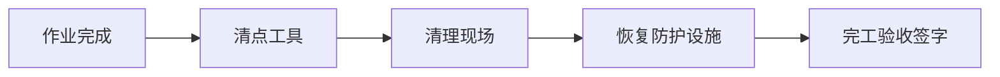

## 五、关键安全措施

### 1. 个体防护
- 正确佩戴安全带
- 安全绳高挂低用
- 佩戴安全帽

### 2. 作业平台
- 平台稳固
- 设置护栏
- 铺设防滑板

### 3. 地面警戒
- 设置警戒区域
- 设置警示标志
- 专人监护

### 4. 工具管理
- 工具系挂牢固
- 不得向下抛掷
- 使用工具袋

### 5. 天气限制
- 五级风以上禁止露天作业
- 雨雪天气禁止作业
- 雷电天气禁止作业

### 6. 特殊要求（30m以上）
- 配备通信工具
- 增加监护人员

## 六、异常情况处置

| 异常情况 | 处置措施 | 责任人 |
|---------|---------|--------|
| 安全带损坏 | 停止作业，更换安全带 | 监护人 |
| 作业平台晃动 | 停止作业，加固平台 | 作业负责人 |
| 天气突变 | 立即停止作业，撤离人员 | 作业负责人 |
| 工具坠落 | 检查地面人员，加强警戒 | 监护人 |
| 作业人不适 | 立即停止作业，安全撤离 | 监护人 |

## 七、作业票管理

- **有效期**：≤7天
- **一式三联**
- **变更管理**：内容变更或超期重新办理
