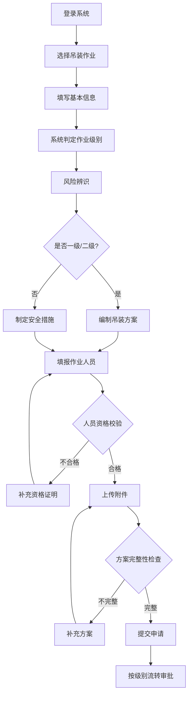
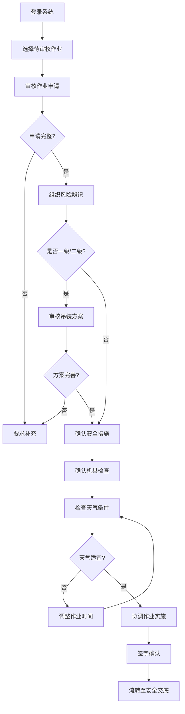
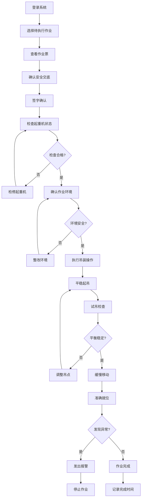
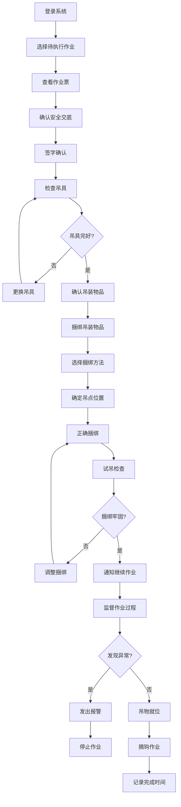
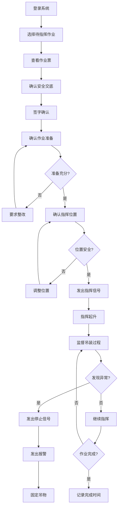
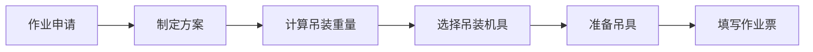
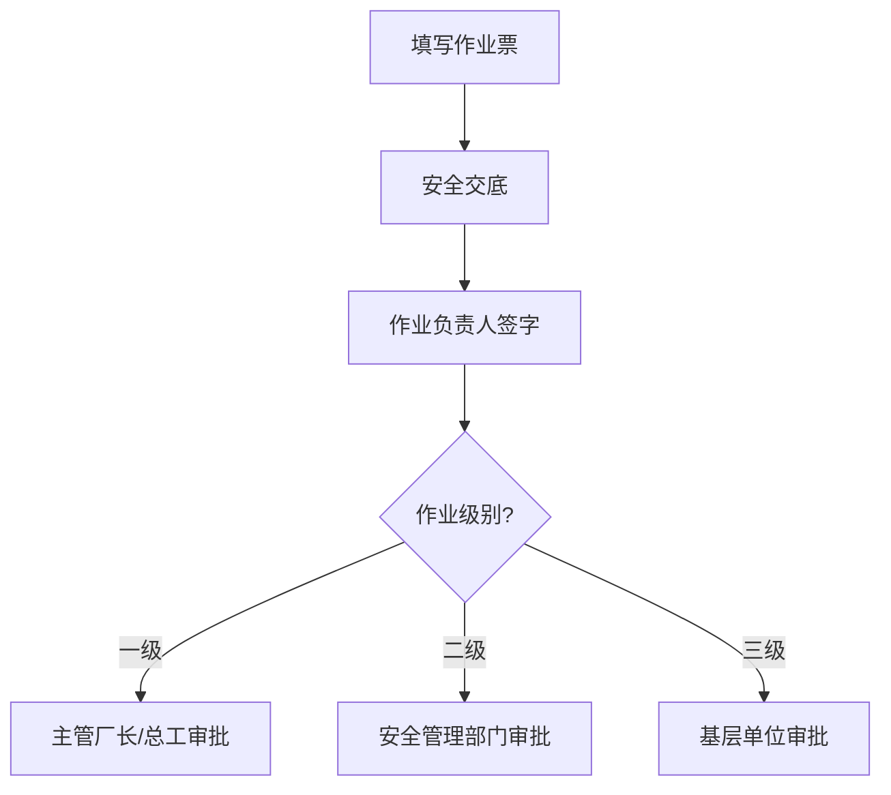
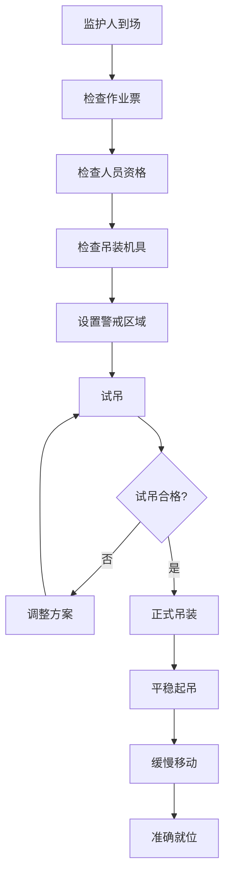
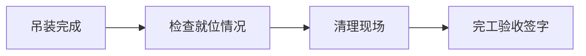

# 吊装作业票 - 人员与工作流程

## 一、作业定义

利用各种吊装机具将设备、工件、器具、材料等吊起，使其发生位置变化的作业。

## 二、作业分级

| 级别 | 吊装重量 | 审批人 | 特殊要求 |
|------|---------|--------|---------|
| **一级** | >100吨 | 主管厂长或总工程师 | 编制吊装方案 |
| **二级** | 40-100吨 | 安全管理部门 | 编制吊装方案 |
| **三级** | <40吨 | 所在基层单位 | - |

## 三、涉及人员及职责

### 1. 作业申请人
- **职责**：提出吊装作业需求
- **要求**：说明吊装物品和重量

### 2. 作业负责人
- **职责**：
  - 制定吊装方案（一、二级）
  - 组织技术交底
  - 确认吊装机具合格
  - 组织试吊
  - 指挥吊装作业
- **要求**：有吊装作业管理经验

### 3. 起重机司机
- **职责**：
  - 操作起重机
  - 执行指挥信号
  - 检查机具状态
  - 平稳起吊和就位
- **要求**：
  - 持有起重机操作证
  - 经专门培训
  - 身体健康

### 4. 司索工（挂钩工）
- **职责**：
  - 捆绑吊装物品
  - 挂钩和摘钩
  - 检查吊具
  - 指挥吊装
- **要求**：
  - 持有司索工操作证
  - 熟悉捆绑方法

### 5. 信号指挥人员
- **职责**：
  - 统一指挥吊装
  - 发出标准信号
  - 监督吊装过程
  - 确认安全距离
- **要求**：
  - 持有指挥证
  - 熟悉指挥信号

### 6. 监护人
- **职责**：
  - 检查作业票有效性
  - 核查作业人员资格
  - 检查吊装机具
  - 监督警戒区域
  - 监督作业过程
- **要求**：经培训考核

### 7. 地面警戒人员
- **职责**：
  - 设置警戒区域
  - 禁止无关人员进入
  - 监督地面安全
- **要求**：经培训

### 8. 安全交底人
- **职责**：
  - 交底吊装方案
  - 讲解危害因素
  - 说明安全措施
- **要求**：熟悉吊装作业风险

### 9. 审批人
- **职责**：
  - 审核吊装方案
  - 确认安全措施
  - 签字批准
- **要求**：根据作业级别由相应层级审批

### 10. 完工验收人
- **职责**：
  - 确认吊装完成
  - 检查设备就位
  - 签字验收
- **要求**：作业负责人或指定人员

## 四、电子系统使用流程

### 1. 作业申请人操作流程

**系统功能** [AQ 3064.2]：
- 支持作业预约与申请提交
- 支持风险辨识与管控措施录入
- 支持吊装作业方案制定
- 记录作业申请时间和作业实施时间

**详细操作步骤**：
1. 登录作业票电子系统，选择"新建作业申请" → "吊装作业"
2. 填写基本信息：
   - 吊装物品名称、重量、尺寸（长×宽×高）
   - 吊装位置（起吊点、落点、移动路径）
   - 计划作业时间（开始时间、预计时长）
   - 系统根据吊装重量自动判定作业级别（一级: >100吨, 二级: 40-100吨, 三级: <40吨）
3. 进行风险辨识：
   - 识别危害因素（吊物坠落/吊具断裂/碰撞/倾覆/触电/人员伤害等）
   - 评估风险等级
   - 系统自动关联历史事故案例和风险数据库
4. 制定吊装方案（一级、二级作业必须）：
   - 吊装机具选择（起重机型号、额定起重量、工作半径）
   - 吊点位置和数量（重心计算、受力分析）
   - 吊装路径规划（障碍物识别、安全距离）
   - 安全措施（地面承载力、稳定性措施、警戒区域）
5. 填报作业人员信息：
   - 起重机司机（姓名、操作证编号、有效期）
   - 司索工（姓名、操作证编号、有效期）
   - 信号指挥人员（姓名、指挥证编号、有效期）
   - 监护人（资格证书、培训记录）
   - 系统自动校验人员资格有效性
6. 上传附件：
   - 吊装作业方案（一级、二级必须）
   - 应急救援预案
   - 吊装示意图
7. 提交申请，系统根据作业级别自动流转至相应审批人

**关键控制点**：
- 作业申请时间应提前于作业实施时间至少1天 [AQ 3064.2]
- 系统根据吊装重量自动判定作业级别（一级: >100吨, 二级: 40-100吨, 三级: <40吨）
- 一级、二级作业必须编制吊装方案，系统强制要求上传
- 作业人员必须持有相应操作证，系统自动校验证书有效期
- 必须制定应急救援预案，系统强制要求上传

**异常处理**：
- 若作业人员资格不合格，系统自动拒绝提交并提示补充
- 若风险辨识不完整，系统提示补充危害因素
- 若一级、二级作业缺少吊装方案，系统阻止提交
- 若缺少应急救援预案，系统阻止提交

**Mermaid流程图**：

### 2. 作业负责人操作流程

**系统功能** [AQ 3064.2]：
- 支持吊装作业方案审核与完善
- 支持风险辨识组织与确认
- 支持安全措施落实情况检查
- 支持作业实施过程协调管理
- 记录作业负责人审核时间和决策过程

**详细操作步骤**：
1. 登录系统，进入"待审核作业申请"列表，选择对应的吊装作业申请
2. 审核作业申请内容：
   - 核查吊装物品重量、尺寸、作业级别的准确性
   - 评估作业必要性和可行性
   - 确认作业时间安排的合理性
3. 组织风险辨识会议：
   - 在系统中发起风险辨识会议邀请（安全管理人员、设备管理人员、起重机司机、司索工）
   - 系统自动推送会议通知和作业申请资料
   - 在系统中记录会议时间、参会人员、讨论内容
4. 审核或完善吊装方案（一级、二级）：
   - 核查吊装机具选择的合理性（额定起重量、工作半径、稳定性）
   - 核查吊点位置和数量的准确性（重心计算、受力分析）
   - 核查吊装路径规划的安全性（障碍物、安全距离、地面承载力）
   - 必要时在系统中补充或调整方案
5. 确认安全措施落实：
   - 确认吊装机具检查完成（起重机、吊具、钢丝绳、吊钩等）
   - 确认地面承载力满足要求
   - 确认警戒区域设置方案
   - 确认天气条件适宜（风力<5级、无雨雪）
6. 协调作业实施：
   - 在系统中确认起重机司机、司索工、信号指挥人员、监护人到位情况
   - 协调作业时间和作业顺序
   - 确认应急救援准备情况
7. 签字确认：
   - 若方案完善、风险辨识充分、安全措施落实，在系统中签字确认
   - 若存在问题，要求作业申请人补充完善后再审核
   - 系统自动流转至安全交底环节

**关键控制点**：
- 作业负责人必须有吊装作业管理经验 [AQ 3064.2]
- 必须组织风险辨识会议，系统自动记录会议过程
- 一级、二级作业必须审核吊装方案的完整性和可行性
- 必须确认吊装机具检查完成、地面承载力满足要求
- 必须确认天气条件适宜（风力<5级、无雨雪）
- 系统自动记录作业负责人审核时间和决策过程

**异常处理**：
- 若吊装方案不完善（一级、二级），系统阻止审核通过并提示补充
- 若风险辨识不充分，系统提示组织风险辨识会议
- 若吊装机具未检查或不合格，系统阻止审核通过并提示检查
- 若天气条件不适宜（风力≥5级、雨雪），系统阻止审核通过并提示调整作业时间

**Mermaid流程图**：

### 3. 起重机司机操作流程

**系统功能** [AQ 3064.2]：
- 支持作业票查看与确认
- 支持起重机状态检查记录
- 支持作业过程操作记录
- 支持作业异常情况报告
- 记录起重机司机操作时间和操作过程

**详细操作步骤**：
1. 登录系统，进入"待执行作业"列表，选择对应的吊装作业
2. 作业前准备：
   - 在系统中查看作业票（吊装物品、重量、吊装路径、安全措施、应急预案）
   - 确认安全交底内容（吊装方案、危害因素、操作要求、应急处置）
   - 在系统中签字确认已理解安全交底内容
   - 确认身体状况良好、持证上岗
3. 检查起重机状态：
   - 检查起重机机械部分（制动器、限位器、钢丝绳、吊钩、滑轮等）
   - 检查起重机电气部分（控制系统、安全装置、照明信号等）
   - 检查起重机液压部分（油压、油位、管路等）
   - 进行空载试运行（起升、回转、变幅、行走等动作）
   - 在系统中逐项确认检查结果
4. 确认作业环境：
   - 确认地面承载力满足要求
   - 确认作业半径内无障碍物
   - 确认警戒区域已设置
   - 确认信号指挥人员到位
   - 在系统中记录环境确认情况
5. 执行吊装操作：
   - 严格按照信号指挥人员的指挥信号操作
   - 平稳起吊（先离地10-20cm试吊，确认平衡后再起升）
   - 缓慢移动（保持吊物稳定，避免摆动）
   - 准确就位（按照指挥信号精确定位）
   - 在系统中实时记录操作过程
6. 两台起重机协同作业（如需要）：
   - 与另一台起重机司机保持通信联系
   - 严格按照统一指挥信号同步操作
   - 确保各承受载荷≤80%额定能力
   - 在系统中记录协同作业情况
7. 异常情况处置：
   - 发现起重机故障、吊物倾斜、天气突变等异常情况
   - 立即停止作业，通过系统发出异常报警信号
   - 通知信号指挥人员和作业负责人
   - 在系统中记录异常情况和处置措施
8. 作业完成：
   - 确认吊物已安全就位
   - 将起重机恢复至安全状态
   - 在系统中记录作业完成时间和作业结果

**关键控制点**：
- 起重机司机必须持有起重机操作证且在有效期内 [AQ 3064.2]
- 必须进行作业前起重机状态检查，系统自动记录检查结果
- 必须严格按照信号指挥人员的指挥信号操作
- 两台起重机协同作业时，各承受载荷≤80%额定能力
- 发现异常必须立即停止作业并报警
- 系统自动记录起重机司机操作时间和操作过程

**异常处理**：
- 若起重机司机资格不合格或证书过期，系统阻止作业并提示更换人员
- 若起重机状态检查不合格，系统阻止作业并提示检修
- 若未按照指挥信号操作，系统提示纠正
- 若发现起重机故障或吊物异常，系统自动报警并提示立即停止作业
- 若天气条件突变（风力≥5级、雨雪），系统自动报警并提示立即停止作业

**Mermaid流程图**：

### 4. 司索工操作流程

**系统功能** [AQ 3064.2]：
- 支持作业票查看与确认
- 支持吊具检查记录
- 支持捆绑作业记录
- 支持作业异常情况报告
- 记录司索工操作时间和操作过程

**详细操作步骤**：
1. 登录系统，进入"待执行作业"列表，选择对应的吊装作业
2. 作业前准备：
   - 在系统中查看作业票（吊装物品、重量、吊点位置、安全措施、应急预案）
   - 确认安全交底内容（捆绑方法、吊点选择、危害因素、应急处置）
   - 在系统中签字确认已理解安全交底内容
   - 确认身体状况良好、持证上岗
3. 检查吊具：
   - 检查钢丝绳（无断丝、无锈蚀、无扭结、无压扁）
   - 检查吊钩（无裂纹、无变形、安全舌完好）
   - 检查卸扣（无裂纹、无变形、螺栓完好）
   - 检查吊带（无破损、无老化、标识清晰）
   - 在系统中逐项确认检查结果
4. 确认吊装物品：
   - 确认吊装物品重量、尺寸与作业票一致
   - 确认吊装物品重心位置
   - 确认吊装物品表面状况（无油污、无尖锐边角）
   - 在系统中记录物品确认情况
5. 捆绑吊装物品：
   - 根据吊装方案选择合适的捆绑方法（兜绳法、卡扣法、吊耳法等）
   - 确定吊点位置和数量（对称、平衡、牢固）
   - 正确捆绑钢丝绳或吊带（受力均匀、无扭曲、无滑移）
   - 安装吊钩和卸扣（连接牢固、方向正确）
   - 在系统中记录捆绑方法和吊点位置
6. 试吊检查：
   - 指挥起重机司机缓慢起吊至离地10-20cm
   - 检查捆绑是否牢固、吊物是否平衡
   - 检查吊具是否受力均匀、无异常
   - 确认无问题后，通过系统通知信号指挥人员继续作业
   - 在系统中记录试吊检查结果
7. 作业过程监督：
   - 观察吊物状态（平衡、稳定、无摆动）
   - 观察吊具状态（受力均匀、无异常）
   - 发现异常立即通过系统发出报警信号并通知信号指挥人员
   - 在系统中实时记录监督情况
8. 摘钩作业：
   - 确认吊物已安全就位、稳固可靠
   - 缓慢松弛钢丝绳或吊带
   - 摘除吊钩和卸扣
   - 收回钢丝绳或吊带
   - 在系统中记录摘钩完成时间

**关键控制点**：
- 司索工必须持有司索工操作证且在有效期内 [AQ 3064.2]
- 必须进行作业前吊具检查，系统自动记录检查结果
- 必须根据吊装方案正确选择捆绑方法和吊点位置
- 必须进行试吊检查，确认捆绑牢固、吊物平衡
- 作业过程中必须持续监督吊物和吊具状态
- 系统自动记录司索工操作时间和操作过程

**异常处理**：
- 若司索工资格不合格或证书过期，系统阻止作业并提示更换人员
- 若吊具检查不合格，系统阻止作业并提示更换吊具
- 若捆绑方法不正确或吊点位置不合理，系统提示纠正
- 若试吊检查发现捆绑不牢或吊物不平衡，系统阻止继续作业并提示调整
- 若作业过程中发现吊物倾斜或吊具异常，系统自动报警并提示立即停止作业

**Mermaid流程图**：

### 5. 信号指挥人员操作流程

**系统功能** [AQ 3064.2]：
- 支持作业票查看与确认
- 支持指挥信号标准化管理
- 支持作业过程指挥记录
- 支持作业异常情况报警
- 记录信号指挥人员指挥时间和指挥过程

**详细操作步骤**：
1. 登录系统，进入"待指挥作业"列表，选择对应的吊装作业
2. 作业前准备：
   - 在系统中查看作业票（吊装物品、重量、吊装路径、安全措施、应急预案）
   - 确认安全交底内容（吊装方案、指挥信号、危害因素、应急处置）
   - 在系统中签字确认已理解安全交底内容
   - 确认身体状况良好、持证上岗
3. 确认作业准备情况：
   - 确认起重机司机到位且完成设备检查
   - 确认司索工到位且完成吊具检查和捆绑
   - 确认监护人到位且完成作业前检查
   - 确认警戒区域已设置、无关人员已撤离
   - 在系统中逐项确认准备情况
4. 确认指挥位置：
   - 选择视野开阔、能清楚观察吊装全过程的位置
   - 确保与起重机司机、司索工保持良好通信
   - 确认自身处于安全位置（不在吊物下方、不在吊装路径上）
   - 在系统中记录指挥位置
5. 发出指挥信号：
   - 使用标准手势信号或对讲机指挥
   - 指挥起重机司机进行起升、回转、变幅、行走等动作
   - 确保指挥信号清晰、准确、及时
   - 在系统中实时记录指挥信号和操作过程
6. 监督吊装过程：
   - 观察吊物状态（平衡、稳定、无摆动、无碰撞）
   - 观察起重机状态（平稳、无异常声响、无倾斜）
   - 观察吊装路径（无障碍物、无人员、安全距离充足）
   - 观察天气变化（风力、降雨）
   - 在系统中实时记录监督情况
7. 异常情况处置：
   - 发现吊物倾斜、起重机故障、人员进入警戒区、天气突变等异常情况
   - 立即发出停止信号，通过系统发出异常报警
   - 指挥起重机司机将吊物降至安全位置或固定
   - 通知作业负责人和监护人
   - 在系统中记录异常情况和处置措施

**关键控制点**：
- 信号指挥人员必须持有指挥证且在有效期内 [AQ 3064.2]
- 必须使用标准手势信号或对讲机指挥，确保指挥信号清晰准确
- 必须选择视野开阔、安全的指挥位置
- 必须全程监督吊装过程，观察吊物、起重机、路径、天气等
- 发现异常必须立即发出停止信号并报警
- 系统自动记录信号指挥人员指挥时间和指挥过程

**异常处理**：
- 若信号指挥人员资格不合格或证书过期，系统阻止作业并提示更换人员
- 若作业准备不充分（人员未到位、检查未完成、警戒未设置），系统阻止作业并提示整改
- 若指挥位置不安全或视野不良，系统提示调整位置
- 若发现吊物倾斜、起重机故障、人员进入警戒区等异常，系统自动报警并提示立即停止作业
- 若天气条件突变（风力≥5级、雨雪），系统自动报警并提示立即停止作业

**Mermaid流程图**：

## 五、工作流程

### 阶段1：作业准备

**关键步骤**：
1. **吊装方案**（一、二级必须）
   - 吊装物品重量和尺寸
   - 吊装机具选择
   - 吊点位置
   - 吊装路径
   - 安全措施

2. **机具准备**
   - 起重机检查
   - 吊具检查（钢丝绳、吊钩、卸扣等）
   - 锚点检查

### 阶段2：作业审批

### 阶段3：作业实施

**关键步骤**：
1. **作业前检查**
   - 起重机完好
   - 吊具完好
   - 锚点牢固
   - 警戒区域设置

2. **试吊**
   - 离地10-20cm
   - 检查机具和锚点
   - 检查捆绑牢固
   - 确认平衡

3. **正式吊装**
   - 统一指挥
   - 平稳起吊
   - 缓慢移动
   - 准确就位

4. **特殊要求**
   - 两台起重机吊运同一物体时保持同步
   - 各承受≤80%额定能力

### 阶段4：完工验收

## 五、关键安全措施

### 1. 机具检查
- 起重机完好
- 吊具完好
- 钢丝绳无断丝
- 吊钩无裂纹

### 2. 试吊
- 离地10-20cm
- 检查机具和锚点
- 确认平衡

### 3. 统一指挥
- 信号指挥人员统一指挥
- 使用标准信号
- 司机执行信号

### 4. 警戒区域
- 设置警戒区域
- 禁止无关人员进入
- 禁止在吊物下方停留

### 5. 个体防护
- 佩戴安全帽
- 穿防砸鞋

### 6. 天气限制
- 五级风以上禁止作业
- 雨雪天气禁止作业

## 六、异常情况处置

| 异常情况 | 处置措施 | 责任人 |
|---------|---------|--------|
| 吊具损坏 | 停止作业，更换吊具 | 作业负责人 |
| 起重机故障 | 停止作业，检修设备 | 作业负责人 |
| 吊物倾斜 | 停止作业，调整捆绑 | 信号指挥人员 |
| 天气突变 | 停止作业，固定吊物 | 作业负责人 |
| 人员进入警戒区 | 停止作业，清理人员 | 监护人 |

## 七、作业票管理

- **一式三联**
- **变更管理**：内容变更或超期重新办理
