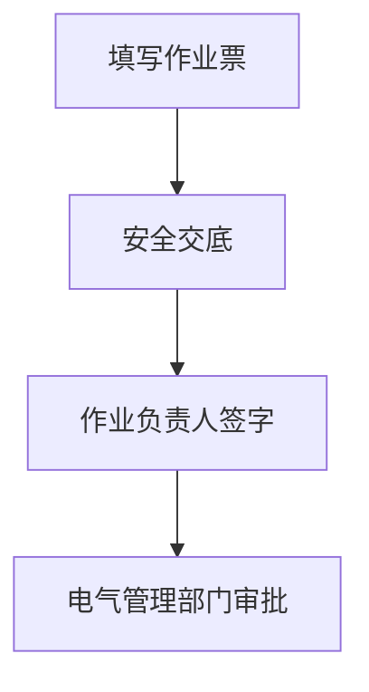
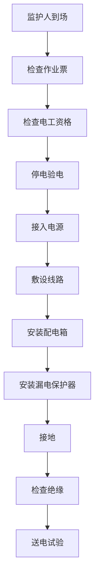

# 临时用电作业票 - 人员与工作流程

## 一、作业定义

在正式运行的电源上所接的非永久性用电作业。

**时间限制**：
- 一般情况：≤15天
- 特殊情况：≤30天（需说明理由）

## 二、涉及人员及职责

### 1. 作业申请人
- **职责**：提出临时用电需求
- **要求**：说明用电设备和功率

### 2. 作业负责人
- **职责**：
  - 制定临时用电方案
  - 确认电源接入点
  - 确认线路敷设方案
  - 组织作业实施
- **要求**：熟悉电气安全

### 3. 电工
- **职责**：
  - 接入电源
  - 敷设临时线路
  - 安装配电箱
  - 检查接地
  - 拆除临时线路
- **要求**：
  - 持有电工操作证
  - 熟悉电气安全规程

### 4. 监护人
- **职责**：
  - 检查作业票有效性
  - 核查电工资格证
  - 检查防护装备
  - 监督作业过程
  - 监督安全距离
- **要求**：经培训考核

### 5. 用电单位负责人
- **职责**：
  - 确认用电需求
  - 监督安全用电
  - 作业结束后及时拆除
- **要求**：了解电气安全

### 6. 安全交底人
- **职责**：
  - 交底触电危害
  - 讲解安全措施
  - 说明应急处置
- **要求**：熟悉电气安全

### 7. 审批人
- **职责**：
  - 审核用电方案
  - 确认安全措施
  - 签字批准
- **要求**：电气管理部门或授权人员

### 8. 完工验收人
- **职责**：
  - 确认临时线路已拆除
  - 检查现场恢复
  - 签字验收
- **要求**：电气管理人员

## 三、工作流程

### 阶段1：作业准备

**关键步骤**：
1. **用电方案**
   - 用电设备功率
   - 电源接入点
   - 线路敷设路径
   - 配电箱位置
   - 接地方案

2. **材料准备**
   - 电缆线
   - 配电箱
   - 漏电保护器
   - 接地装置

### 阶段2：作业审批

### 阶段3：作业实施

**关键步骤**：
1. **停电验电**
   - 停电
   - 验电
   - 挂接地线

2. **接入电源**
   - 正确接线
   - 紧固接头
   - 绝缘包扎

3. **敷设线路**
   - 架空或埋地
   - 避开通道
   - 固定牢固

4. **安装配电箱**
   - 位置合理
   - 安装漏电保护器
   - 标识清晰

5. **接地**
   - 接地可靠
   - 接地电阻合格

6. **送电试验**
   - 检查绝缘
   - 试送电
   - 确认正常

### 阶段4：使用期间

**关键步骤**：
- 定期检查线路
- 禁止超负荷用电
- 禁止私拉乱接
- 超期前及时拆除

### 阶段5：完工验收

## 四、关键安全措施

### 1. 电源接入
- 由持证电工操作
- 停电验电
- 正确接线

### 2. 线路敷设
- 架空高度≥2.5m
- 埋地深度≥0.7m
- 避开通道和易损区域

### 3. 漏电保护
- 安装漏电保护器
- 动作电流≤30mA
- 动作时间≤0.1s

### 4. 接地
- 接地可靠
- 接地电阻≤4Ω

### 5. 配电箱
- 防雨防尘
- 标识清晰
- 上锁管理

### 6. 个体防护
- 绝缘手套
- 绝缘鞋
- 绝缘工具

## 五、异常情况处置

| 异常情况 | 处置措施 | 责任人 |
|---------|---------|--------|
| 线路破损 | 停电，修复或更换 | 电工 |
| 漏电保护器跳闸 | 查明原因，排除故障 | 电工 |
| 超负荷 | 停电，调整负荷 | 用电单位 |
| 触电事故 | 立即切断电源，抢救伤员 | 监护人 |

## 六、作业票管理

- **时间限制**：一般≤15天，特殊≤30天
- **一式三联**
- **超期管理**：超期前拆除或重新办理
