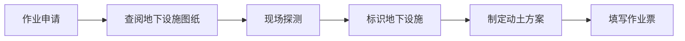
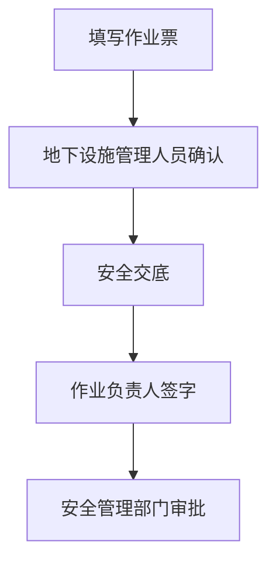
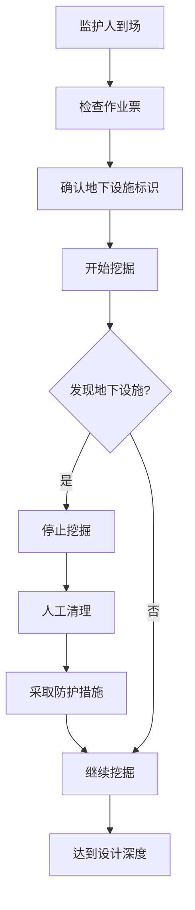
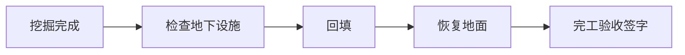

# 动土作业票 - 人员与工作流程

## 一、作业定义

在地面进行挖土、打桩、钻探、坑探等可能对地下隐蔽设施造成影响的作业。

**深度要求**：挖掘深度 ≥0.5m

## 二、涉及人员及职责

### 1. 作业申请人
- **职责**：提出动土作业需求
- **要求**：说明动土位置和深度

### 2. 作业负责人
- **职责**：
  - 制定动土方案
  - 组织地下设施探测
  - 确认安全措施落实
  - 组织作业实施
- **要求**：熟悉地下设施分布

### 3. 作业人
- **职责**：
  - 执行挖掘作业
  - 遵守操作规程
  - 发现地下设施立即停止
- **要求**：经培训，熟悉地下设施识别

### 4. 监护人
- **职责**：
  - 检查作业票有效性
  - 监督探测工作
  - 监督作业过程
  - 发现地下设施立即中止
- **要求**：经培训考核

### 5. 地下设施管理人员
- **职责**：
  - 提供地下设施图纸
  - 现场指认地下设施位置
  - 确认安全距离
  - 在作业票上签字
- **要求**：熟悉地下设施分布

### 6. 探测人员
- **职责**：
  - 使用探测仪器探测地下设施
  - 标识地下设施位置
  - 提供探测报告
- **要求**：持有探测资格证

### 7. 安全交底人
- **职责**：
  - 交底地下设施位置
  - 讲解危害因素
  - 说明安全措施
- **要求**：熟悉地下设施风险

### 8. 审批人
- **职责**：
  - 审核动土方案
  - 确认探测完成
  - 签字批准
- **要求**：安全管理部门或授权人员

### 9. 完工验收人
- **职责**：
  - 确认动土完成
  - 检查回填情况
  - 检查地下设施完好
  - 签字验收
- **要求**：作业负责人或指定人员

## 三、工作流程

### 阶段1：作业准备

**关键步骤**：
1. **查阅图纸**
   - 查阅地下管线图
   - 查阅电缆走向图
   - 查阅其他地下设施图

2. **现场探测**
   - 使用探测仪器
   - 探测地下设施位置
   - 标识地下设施

3. **制定方案**
   - 确定挖掘范围
   - 确定安全距离
   - 制定防护措施

### 阶段2：作业审批

### 阶段3：作业实施

**关键步骤**：
1. **作业前检查**
   - 地下设施已标识
   - 安全距离明确
   - 防护措施到位

2. **挖掘作业**
   - 按标识位置挖掘
   - 保持安全距离
   - 发现地下设施立即停止

3. **发现地下设施**
   - 停止机械挖掘
   - 改用人工清理
   - 采取防护措施
   - 通知设施管理人员

### 阶段4：完工验收

## 四、关键安全措施

### 1. 探测标识
- 探测地下设施
- 标识位置
- 明确安全距离

### 2. 安全距离
- 电缆：≥0.5m
- 燃气管道：≥1m
- 其他管线：按规定

### 3. 挖掘方法
- 远离地下设施用机械
- 接近地下设施用人工
- 禁止野蛮施工

### 4. 防护措施
- 发现地下设施采取防护
- 悬空管线加支撑
- 裸露电缆加绝缘

### 5. 警戒标识
- 设置警戒区域
- 设置警示标志

## 五、异常情况处置

| 异常情况 | 处置措施 | 责任人 |
|---------|---------|--------|
| 发现未知地下设施 | 停止作业，查明情况 | 作业负责人 |
| 损坏地下设施 | 停止作业，报告事故，抢修 | 作业负责人 |
| 燃气泄漏 | 停止作业，疏散人员，报警 | 监护人 |
| 电缆破损 | 停止作业，断电，报告 | 监护人 |

## 六、作业票管理

- **一式三联**
- **变更管理**：位置或深度变更重新办理
