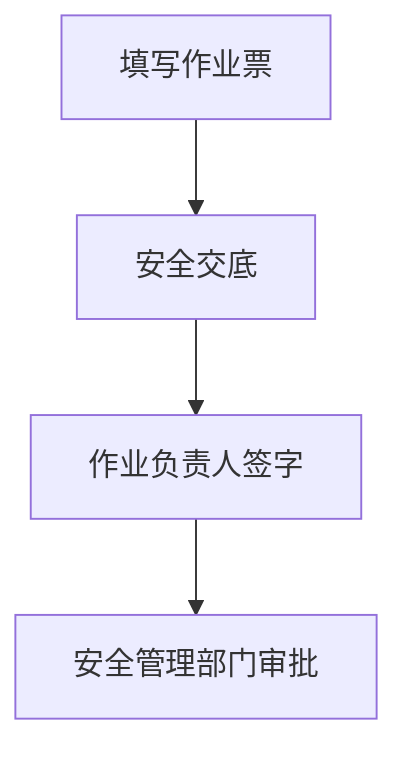
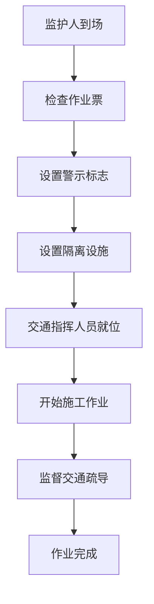

# 断路作业票 - 人员与工作流程

## 一、作业定义

在生产区域内交通主、支路上进行的各种施工作业，可能导致道路临时中断或影响交通的作业。

**典型作业**：
- 道路维修
- 管线敷设
- 设备吊装占道
- 其他影响交通的施工

## 二、涉及人员及职责

### 1. 作业申请人
- **职责**：提出断路作业需求
- **要求**：说明作业内容和时间

### 2. 作业负责人
- **职责**：
  - 制定断路作业方案
  - 制定交通疏导方案
  - 组织作业实施
  - 协调交通管理
- **要求**：有施工管理经验

### 3. 作业人
- **职责**：
  - 执行施工作业
  - 遵守交通安全规定
  - 服从交通指挥
- **要求**：经培训，了解交通安全

### 4. 监护人
- **职责**：
  - 检查作业票有效性
  - 监督警示标志设置
  - 监督作业过程
  - 监督交通疏导
- **要求**：经培训考核

### 5. 交通指挥人员
- **职责**：
  - 设置警示标志
  - 设置隔离设施
  - 指挥车辆绕行
  - 维持交通秩序
- **要求**：
  - 经培训
  - 穿反光背心
  - 使用指挥旗

### 6. 安全交底人
- **职责**：
  - 交底交通安全要求
  - 讲解疏导方案
  - 说明应急处置
- **要求**：熟悉交通安全管理

### 7. 审批人
- **职责**：
  - 审核断路方案
  - 确认交通疏导措施
  - 签字批准
- **要求**：安全管理部门或授权人员

### 8. 完工验收人
- **职责**：
  - 确认施工完成
  - 检查道路恢复
  - 检查警示标志撤除
  - 签字验收
- **要求**：作业负责人或指定人员

## 三、工作流程

### 阶段1：作业准备

**关键步骤**：
1. **断路方案**
   - 断路位置和范围
   - 断路时间
   - 作业内容

2. **交通疏导方案**
   - 绕行路线
   - 警示标志设置
   - 隔离设施布置
   - 交通指挥安排

3. **设施准备**
   - 警示标志
   - 隔离栏
   - 反光锥
   - 指挥旗

### 阶段2：作业审批

### 阶段3：作业实施

**关键步骤**：
1. **设置警示标志**
   - 作业区前方50-100m设置
   - 标志清晰醒目
   - 夜间设置警示灯

2. **设置隔离设施**
   - 隔离作业区域
   - 引导车辆绕行
   - 确保安全距离

3. **交通指挥**
   - 指挥人员就位
   - 穿反光背心
   - 使用指挥旗
   - 指挥车辆绕行

4. **施工作业**
   - 在隔离区域内施工
   - 不得超出作业范围
   - 服从交通指挥

### 阶段4：完工验收

## 四、关键安全措施

### 1. 警示标志
- 提前50-100m设置
- 标志清晰醒目
- 夜间设置警示灯

### 2. 隔离设施
- 隔离作业区域
- 引导车辆绕行
- 确保安全距离

### 3. 交通指挥
- 专人指挥
- 穿反光背心
- 使用指挥旗

### 4. 作业时间
- 避开交通高峰
- 夜间作业加强照明

### 5. 应急通道
- 保留应急车辆通道
- 确保消防车辆通行

## 五、异常情况处置

| 异常情况 | 处置措施 | 责任人 |
|---------|---------|--------|
| 交通拥堵 | 加强疏导，必要时暂停施工 | 交通指挥人员 |
| 车辆闯入作业区 | 立即停止作业，疏散人员 | 监护人 |
| 应急车辆通行 | 立即让行，暂停施工 | 交通指挥人员 |
| 恶劣天气 | 加强警示，必要时停止作业 | 作业负责人 |

## 六、作业票管理

- **一式三联**
- **时间管理**：按计划时间完成，超时重新办理
- **变更管理**：位置或时间变更重新办理

## 七、特别提醒

⚠️ **断路作业影响交通，必须做好疏导工作！**

**三大要点**：
1. 提前设置警示标志
2. 专人指挥交通
3. 及时恢复道路
