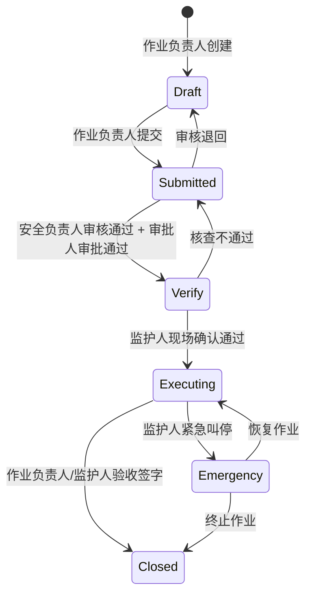

# 八大作业票系统 - 角色视角总览与权限矩阵

> **文档版本**: v1.0 | **创建日期**: 2026-03-11
> **适用范围**: 动火、受限空间、高处、吊装、临时用电、动土、断路、盲板抽堵

---

## 1. 六类角色总览

| # | 角色 | 一句话定位 | 核心动作 | 典型终端 |
|---|------|----------|---------|---------|
| 1 | **作业负责人(申请人)** | 票据发起者与全程协调者 | 创建票据、填写信息、提交审批 | 手机/PC |
| 2 | **作业人** | 持证上岗的一线执行者 | 确认措施、签到签退、执行作业 | 手机/PDA |
| 3 | **监护人** | 全程在场的安全守门人 | 现场核查、实时监护、紧急叫停 | 手机(常驻) |
| 4 | **安全负责人(审核人)** | 数据驱动的风险把关者 | 审核数据、验证合规、初审签字 | PC/手机 |
| 5 | **审批人(终审人)** | 到场确认的最终决策者 | 现场审批、终审签字、风险决策 | 手机(现场) |
| 6 | **系统管理员** | 平台配置与运维管理者 | 模板配置、流程设计、数据分析 | PC(后台) |

---

## 2. 角色与作业票状态权限矩阵



| 角色 | Draft | Submitted | Verify | Executing | Closed |
|------|-------|-----------|--------|-----------|--------|
| **作业负责人** | ✅ 创建/编辑 | ✅ 查看/撤回 | ✅ 查看/补充 | ✅ 查看 | ✅ 查看/验收 |
| **作业人** | ❌ 不可见 | ✅ 查看 | ✅ 确认措施 | ✅ 签到/签退 | ✅ 查看 |
| **监护人** | ❌ 不可见 | ✅ 查看 | ✅ 现场核查 | ✅ 实时监护/叫停 | ✅ 查看/验收 |
| **安全负责人** | ❌ 不可见 | ✅ 审核 | ✅ 数据验证 | ✅ 查看 | ✅ 查看 |
| **审批人** | ❌ 不可见 | ✅ 审批 | ✅ 现场审批 | ✅ 查看 | ✅ 查看 |
| **系统管理员** | ✅ 全部 | ✅ 全部 | ✅ 全部 | ✅ 全部 | ✅ 全部 |

---

## 3. 角色与数据字段权限矩阵

| 数据类型 | 作业负责人 | 作业人 | 监护人 | 安全负责人 | 审批人 | 系统管理员 |
|---------|----------|-------|-------|-----------|-------|----------|
| **基础信息** | 读写 | 只读 | 只读 | 只读 | 只读 | 读写 |
| **人员信息** | 读写 | 只读 | 只读 | 只读 | 只读 | 读写 |
| **安全措施清单** | 读写 | 确认(勾选) | 核查(勾选+拍照) | 审核(通过/退回) | 只读 | 读写 |
| **JSA风险分析** | 读写 | 只读 | 只读 | 审核 | 只读 | 读写 |
| **气体检测记录** | 只读 | 只读 | 录入 | 审核 | 只读 | 读写 |
| **现场照片** | 上传 | 查看 | 上传 | 查看 | 查看 | 读写 |
| **审批意见** | 只读 | 只读 | 只读 | 录入 | 录入 | 读写 |
| **监护日志** | 只读 | 只读 | 自动录入 | 只读 | 只读 | 读写 |
| **电子签名** | 本人签 | 本人签 | 本人签 | 本人签 | 本人签 | 查看 |

---

## 4. 八大作业差异化角色配置

不同作业类型对角色的要求有差异，以下为关键差异点：

| 作业类型 | 特殊角色要求 | 额外人员 | 持证要求 |
|---------|------------|---------|---------|
| **动火** | 监护人需持动火监护证 | 分析人员(气体检测) | 动火人+监护人均需持证 |
| **受限空间** | 监护人禁止进入受限空间 | 应急救援人员(≥2人) | 作业人+监护人+救援人员均需持证 |
| **高处** | 监护人需在地面监护 | — | 作业人需持高处作业证 |
| **吊装** | 需指挥人员(持证) | 起重机操作员+挂钩工 | 司机+指挥+挂钩工均需持证 |
| **临时用电** | 电工必须持证 | — | 电工需持有效电工证 |
| **动土** | 需通知相关管线部门 | 管线探测人员 | — |
| **断路** | 需交通引导人员 | 交通管理部门审批 | — |
| **盲板抽堵** | 需记录盲板编号台账 | — | — |

---

## 5. 文件索引

| 文件 | 内容 |
|------|------|
| [01-作业负责人.md](./01-作业负责人.md) | 申请人视角：创建、填写、提交、协调 |
| [02-作业人.md](./02-作业人.md) | 执行者视角：确认、签到、作业、签退 |
| [03-监护人.md](./03-监护人.md) | 监护者视角：核查、监护、叫停、验收 |
| [04-安全负责人.md](./04-安全负责人.md) | 审核者视角：数据验证、合规审核、初审 |
| [05-审批人.md](./05-审批人.md) | 决策者视角：风险评估、现场审批、终审 |
| [06-系统管理员.md](./06-系统管理员.md) | 管理者视角：模板配置、流程设计、数据分析 |

---

## 6. 元数据权限控制模型(技术参考)

角色权限通过元数据 JSON 定义，在渲染引擎层面控制字段的可见性和可编辑性：

```json
{
  "field_key": "gas_detection_records",
  "permissions": {
    "applicant":  { "visible": true,  "editable": false },
    "worker":     { "visible": true,  "editable": false },
    "supervisor": { "visible": true,  "editable": true  },
    "reviewer":   { "visible": true,  "editable": false, "can_approve": true },
    "approver":   { "visible": true,  "editable": false },
    "admin":      { "visible": true,  "editable": true  }
  },
  "state_override": {
    "Draft":     { "supervisor": { "visible": false } },
    "Verify":    { "supervisor": { "editable": true } },
    "Executing": { "supervisor": { "editable": true } },
    "Closed":    { "ALL": { "editable": false } }
  }
}
```

核心设计原则：
- **角色 × 状态 = 实际权限**：字段的最终权限由角色基础权限和当前状态叠加决定
- **状态覆盖优先**：`state_override` 中的配置优先于 `permissions` 中的基础配置
- **Closed 状态一刀切**：所有角色在 Closed 状态下均为只读
